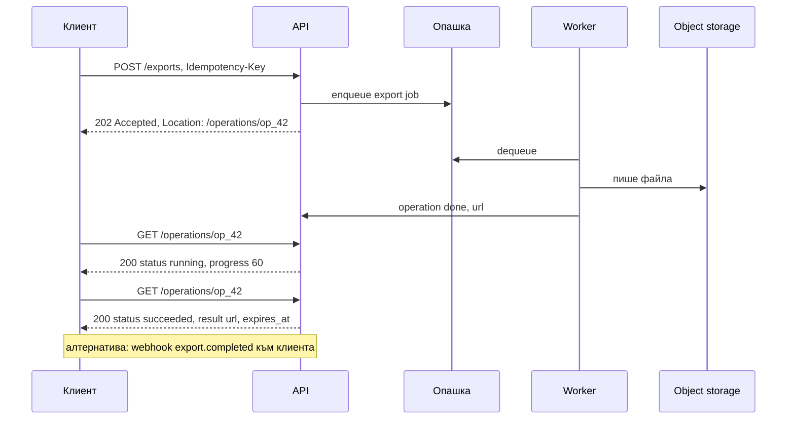
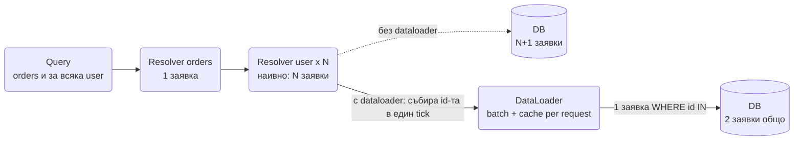
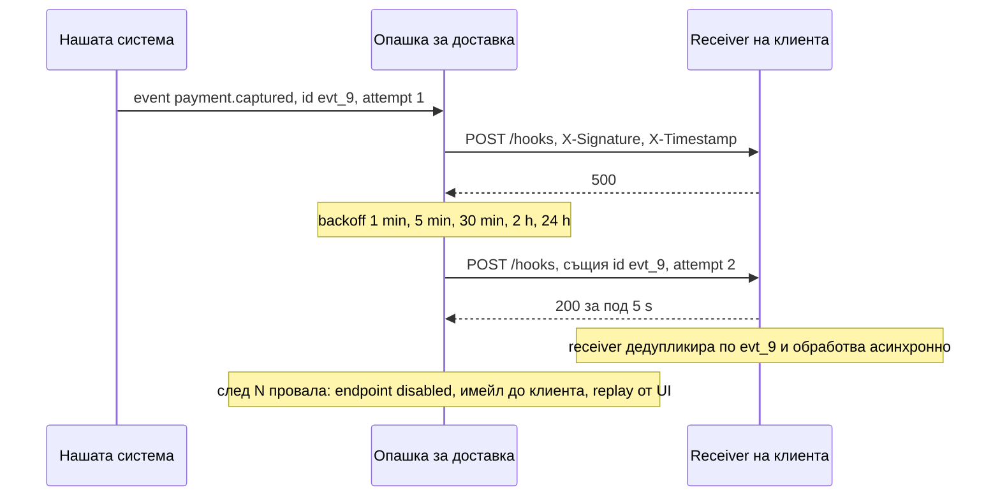

# API дизайн (REST, gRPC, GraphQL, WebSocket/SSE, версии, грешки, идемпотентност, webhooks, договори)

API-то е договорът, който преживява всички вътрешни пренаписвания. Интервюиращият пита за него,
защото показва дали мислиш за клиента, който не контролираш: мобилно приложение с версия от преди
година, партньор, който ретрайва на сляпо, браузър зад корпоративен proxy. Кутийките в диаграмата се
сменят лесно; един публикуван endpoint се сменя с години.

Слушат за четири неща: знаеш ли какво обещава всеки HTTP метод и статус код, как правиш операция
безопасна за повторение, как променяш API без да счупиш никого, и кога REST е грешният инструмент.

## Кой стил за какво

| | REST / JSON | gRPC | GraphQL | WebSocket | SSE | Webhooks |
| --- | --- | --- | --- | --- | --- | --- |
| Посока | Клиент пита | Клиент пита, потоци в двете посоки | Клиент пита | Двупосочна | Сървър към клиент | Сървър вика клиента |
| Договор | OpenAPI, по избор | Protobuf, задължителен | Schema, задължителна | Свой envelope | Text events | Документиран payload + подпис |
| Типизация | Слаба без tooling | Силна, генериран код | Силна | Своя | Своя | Слаба |
| Streaming | Не (chunked е заобикаляне) | Да, unary/server/client/bidi | Subscriptions през WS | Да | Да, еднопосочно | Не |
| Браузър | Да | Само през gRPC-web proxy | Да | Да | Да | Не е за браузър |
| Кеширане | HTTP кеш, CDN | Няма | Трудно (POST, различни заявки) | Няма | Няма | Няма |
| Латентност | HTTP/1.1 или 2 | HTTP/2, компактно | Един round trip за много данни | Минимална след connect | Ниска | Секунди, at-least-once |
| Кога | Публични и CRUD API-та | Вътрешни сървиси, streaming | Много клиенти с различни нужди, агрегация | Чат, игри, локации | Feed от събития към браузър | Известяване на партньори |

## REST, направен добре

### Ресурси и методи

Ресурсите са съществителни (`/orders/123`, `/orders/123/items`), действията са HTTP методи. Когато
действието не е CRUD (`/orders/123/cancel`), приемливо е под-ресурс или POST към действие, стига да е
документирано и еднакво навсякъде. Консистентността печели повече точки от пуризма.

| Метод | Идемпотентен | Безопасен | Типична употреба | Типичен успех |
| --- | --- | --- | --- | --- |
| GET | Да | Да | Четене | 200 |
| PUT | Да | Не | Пълна замяна на ресурс с известен адрес | 200 или 204 |
| DELETE | Да | Не | Изтриване (второ изтриване връща 204 или 404, но не променя нищо) | 204 |
| PATCH | Обикновено не | Не | Частична промяна (JSON Merge Patch или JSON Patch) | 200 |
| POST | Не | Не | Създаване, действия, всичко останало | 201 със `Location`, или 202 |

Идемпотентност означава, че повторението не променя резултата, не че отговорът е същият. PUT на
същото тяло два пъти оставя ресурса еднакъв. POST два пъти създава два ресурса, освен ако не го
направим идемпотентен нарочно (виж по-долу).

### Статус кодове, които казват на клиента какво да прави

| Код | Значение за клиента | Пример |
| --- | --- | --- |
| 200 / 201 / 204 | Успех; 201 носи `Location` на новия ресурс; 204 няма тяло | Създаден залог, изтрит линк |
| 202 Accepted | Приех, ще го свърша по-късно, следи операцията | Експорт, транскодиране |
| 400 Bad Request | Заявката е синтактично грешна, не ретрайвай без промяна | Невалиден JSON |
| 401 Unauthorized | Няма или невалидна автентикация, обнови токена | Изтекъл JWT |
| 403 Forbidden | Знам кой си, но не може | Чужд ресурс |
| 404 Not Found | Няма такъв ресурс (или не искаме да кажем, че има) | Грешен id |
| 409 Conflict | Състоянието не позволява операцията, прочети и опитай пак | Мястото вече е заето, дублиран alias |
| 412 Precondition Failed | `If-Match` не съвпада, някой промени ресурса преди теб | Optimistic concurrency |
| 422 Unprocessable Content | Синтактично валидно, семантично грешно | Отрицателна сума |
| 429 Too Many Requests | Спри и чакай `Retry-After` | Rate limit |
| 500 | Наша грешка, ретрай с backoff може да помогне | Неочаквано изключение |
| 502 / 503 / 504 | Зависимост е долу, претоварени сме, таймаут; ретрай с backoff и jitter | Load shedding, паднал upstream |

Разликата, която интервюиращият търси: 4xx казва "смени заявката", 5xx казва "опитай пак по-късно".
Клиент, който ретрайва 400, харчи квота; клиент, който не ретрайва 503, губи заявки.

### Формат на грешките: RFC 9457 Problem Details

Един формат за всички грешки, машинно четим тип, човешко съобщение и trace id за поддръжката.

```ts
interface ProblemDetails {
  type: string;        // URI, който идентифицира вида грешка, стабилен между версии
  title: string;
  status: number;
  detail?: string;
  instance?: string;   // пътят или id на конкретната заявка
  traceId?: string;
  errors?: { field: string; message: string }[];
}

export function problem(status: number, type: string, title: string, extra: Partial<ProblemDetails> = {}): ProblemDetails {
  return { type: `https://api.example.com/problems/${type}`, title, status, ...extra };
}

const body = problem(422, 'validation', 'Заявката не минава валидация', {
  detail: 'amount трябва да е положително цяло число в минорни единици',
  instance: '/bets',
  traceId: '4bf92f3577b34da6a3ce929d0e0e4736',
  errors: [{ field: 'amount', message: 'must be > 0' }],
});

console.log(JSON.stringify(body, null, 2));
console.log('content-type:', 'application/problem+json');
```

`type` е стабилният идентификатор, по който клиентският код взима решение. `title` и `detail` са за
хора и могат да се сменят без да е breaking change. Никога не се връща stack trace, никога не се
различава "грешна парола" от "няма такъв потребител" при login.

### Пагинация, филтриране, полета

- **Cursor вместо offset.** `?cursor=eyJpZCI6MTIzfQ&limit=50` връща `next_cursor`. Offset сканира и
  изхвърля редове, дава дубликати при вмъкване и е O(n) при дълбоки страници. Курсорът е непрозрачен
  за клиента (base64 от последния ключ), за да може да сменим реализацията. Защо, с числа: в
  [News Feed](News_Feed_Timeline.md).
- **Филтри и сортиране** като query параметри с фиксирана граматика (`?status=paid&sort=-created_at`),
  с явно документиран списък от полета, по които може да се сортира (всяко от тях има индекс).
- **Sparse fields** (`?fields=id,status`) само ако мобилният трафик го оправдава; иначе е сложност
  без полза. Ако нуждата от различни форми на отговора е голяма, това е сигнал за GraphQL или BFF.

### Версиониране

| Подход | Пример | Плюс | Минус |
| --- | --- | --- | --- |
| В пътя | `/v1/orders` | Очевидно, кешира се, лесно се маршрутизира | Клонира цялото API при всяка версия |
| В заглавие | `Accept: application/vnd.api+json;version=2` | Чист URL | Невидимо, трудно за дебъгване и кеш |
| Без версия, само additive промени | Добавяш полета, никога не махаш и не сменяш значение | Един код, без миграции на клиенти | Изисква дисциплина и tolerant reader |
| Дата на версия | `Stripe-Version: 2024-06-20` | Фина ротация, стари клиенти замразени на дата | Скъпа инфраструктура за трансформации |

Практиката: `/v1` в пътя като предпазен клапан, който почти никога не става `/v2`, плюс строги
правила за additive промени. `Deprecation` и `Sunset` заглавия обявяват края на живота месеци напред.

### Optimistic concurrency с ETag

Сървърът връща `ETag: "v17"` при GET; клиентът праща `If-Match: "v17"` при PUT/PATCH; при
несъвпадение отговорът е 412 и клиентът презарежда и решава сам. Това е HTTP формата на условния
`UPDATE ... WHERE version = 17` от [Hotel Reservation](Hotel_Reservation_Airbnb.md) и на `base_version`
в [File Sync](File_Sync_Dropbox_Google_Drive.md). Без него две редакции тихо се презаписват.

### Идемпотентен POST

POST създава ресурс и повторението му при изгубен отговор създава втори. Решението е клиентски
генериран `Idempotency-Key` (UUID) в заглавие: сървърът пази ключа и отговора (Redis `SET NX EX`), при
повторение връща **същия** отговор, включително същия `201` и същото тяло. Ключът е свързан с
потребителя и с хеш на тялото, така че същият ключ с друго тяло дава 422. Пълната реализация с
in-progress състояние е в [Node.js архитектурни патерни](Design_Patterns_Node_Architecture.md), а
защо е задължително при пари, в [Payment System](Payment_System_Stripe_Wallet.md).

### Дълги операции



Заявка, която трае повече от няколко секунди, не се държи отворена: HTTP таймаутите на балансьори и
proxy-та (30-60 s) ще я убият. Вместо това 202 с адрес на **операция**, която клиентът чете
(polling с `Retry-After`) или получава webhook. Операцията е ресурс с състояние (`pending`, `running`,
`succeeded`, `failed`), прогрес и резултат. Същият модел е транскодирането в
[Video Platform](Video_platform_like_Udemy.md).

### Bulk операции и частичен провал

`POST /items:batch` със 100 елемента, от които 3 са невалидни: или всичко или нищо (една транзакция,
400 с списък грешки), или per-item резултат (207 Multi-Status или 200 с масив `{ id, status, error }`).
Първото е за атомарни промени, второто за импорти. Лимит на размера на партидата и документиран
отговор при частичен успех, иначе клиентите ретрайват целия batch и дублират успешните.

### Заглавия за лимити, време и пари

- `X-RateLimit-Limit`, `X-RateLimit-Remaining`, `X-RateLimit-Reset` и `Retry-After` при 429, така че
  клиентът да приложи backpressure без да гадае (виж [Rate Limiter](Distributed_Web_Crawler.md)).
- Време винаги в ISO 8601 с UTC (`2026-09-30T12:00:00Z`); локалната зона е грижа на клиента.
  Изключение са календарни дати без зона (check-in дата в хотел).
- Пари като цяло число в минорни единици плюс код на валута (`{ "amount": 1999, "currency": "EUR" }`),
  никога float.
- HATEOAS (линкове към следващите действия в отговора) е красива идея, която почти никой клиент не
  ползва. Практичната част от нея: `Location` при 201, `next_cursor` при списъци, линк към операцията
  при 202.

## gRPC

- **Protobuf договор:** полетата имат номера, не имена, по мрежата. Правилата за съвместимост:
  никога не сменяй номер или тип на съществуващо поле, махнатите номера се резервират, новите полета
  са optional с default. Така стар клиент и нов сървър се разбират без версии.
- **Четири вида извиквания:** unary (като REST), server streaming (сървърът праща поток, например
  цени), client streaming (качване на телеметрия), bidirectional (чат). Потоците са върху HTTP/2
  мултиплексирани по една връзка, което носи проблема с балансирането по връзка (виж
  [Мрежа и балансиране](Networking_Load_Balancing.md)).
- **Deadlines:** клиентът задава краен срок, който се разпространява по веригата с всяко извикване.
  Това е timeout budget, вграден в протокола: сървър, който получи изтекъл deadline, не започва работа.
- **Статус кодове:** `INVALID_ARGUMENT`, `NOT_FOUND`, `ALREADY_EXISTS`, `RESOURCE_EXHAUSTED`,
  `UNAVAILABLE`, `DEADLINE_EXCEEDED`. Клиентът ретрайва само `UNAVAILABLE` и понякога
  `DEADLINE_EXCEEDED` при идемпотентни методи.
- **Браузър:** gRPC-web през proxy (Envoy), без client streaming. Затова публичните API-та остават REST,
  а gRPC е между сървисите.
- **Кога gRPC печели:** вътрешни извиквания с много малки съобщения, строга типизация, генериран код в
  няколко езика, streaming. **Кога губи:** публично API, браузъри, дебъгване с curl, кеширане на CDN.
  Алтернативата за вътрешна комуникация е message bus с request/reply, както в
  [Online Trading Game](Online_Trading_Game.md), който маха и нуждата от адреси.

## GraphQL



- **Схема и resolvers:** клиентът описва точно кои полета иска и получава ги в един round trip.
  Всяко поле има resolver; наивните resolvers за списъци дават **N+1** заявки към базата. Решението е
  **DataLoader**: събира всички `user_id` от един tick на event loop-а и прави една `WHERE id IN (...)`
  заявка, с кеш в рамката на заявката.
- **Защита:** лимит на дълбочина и на изчислена сложност на заявката, таймаут, persisted queries
  (клиентът праща hash на предварително одобрена заявка), иначе всеки може да поиска целия граф.
- **Кеширане** е трудно: всичко е POST към един endpoint с различно тяло. Persisted queries през GET и
  нормализиран кеш на клиента (Apollo) са заобикалянията.
- **Federation:** една обща схема, сглобена от няколко сървиса, всеки собственик на своя част. Работи,
  но gateway-ът става сложен и бавен компонент.
- **Кога пасва:** много различни клиенти (web, iOS, Android, партньори) с различни нужди от едни и същи
  данни, екрани, които агрегират 5-6 ресурса. **Кога боли:** просто CRUD, write-heavy API (мутациите
  са по-слабо стандартизирани), нужда от HTTP кеш, екип без опит с resolver производителност.

## Реалновременни API-та

| | WebSocket | SSE | Long polling |
| --- | --- | --- | --- |
| Посока | Двупосочна | Сървър към клиент | Сървър към клиент, заявка по заявка |
| Протокол | Upgrade от HTTP, свой framing | Обикновен HTTP, `text/event-stream` | Обикновен HTTP |
| Proxy и балансьори | Изискват поддръжка на Upgrade и дълги idle | Минава навсякъде, HTTP/2 маха лимита от 6 връзки | Минава навсякъде |
| Reconnect | Ръчно, с backoff и jitter | Вграден в браузъра, `Last-Event-ID` | Естествен |
| Кога | Чат, игри, локации, всичко, където клиентът праща често | Feed, известия, прогрес, цени към браузър | Fallback зад строги proxy-та |

**Envelope за WebSocket съобщения:** `{ type, id, v, ts, payload }`. `type` за маршрутизиране,
`id` за дедупликация и ACK, `v` за версия на схемата на payload-а, така че стар клиент да може да
игнорира непознати типове. Двата модела при прекъсване: replay по `seq_id` (всяко съобщение има
стойност, [Chat](Chat_system_WhatsApp_Slack%20_Messenger.md)) или resync от snapshot (важи само
текущото състояние, [Online Trading Game](Online_Trading_Game.md)). Изборът се прави при дизайна на
API-то, не после.

## Webhooks

Webhook е API, което ти викаш при клиента, и всички проблеми на разпределените системи се обръщат
към теб: неговият сървър е бавен, пада, отговаря с 500, а ти трябва да гарантираш доставка.



- **At-least-once с retry и backoff** по разписание от минути до дни; receiver-ът трябва да отговори
  2xx бързо (под 5-10 s) и да обработи асинхронно, иначе нашият таймаут го брои за провал.
- **Подпис:** HMAC-SHA256 върху `timestamp.body` със споделен секрет, изпратен в заглавие заедно с
  timestamp-а. Receiver-ът отхвърля стари timestamp-и (5 минути), което спира replay на прихванат
  webhook, и сравнява подписа с константно време.
- **Идемпотентност на receiver-а** по `event.id`: доставяме два пъти по дизайн, той трябва да
  преживее това. Същият принцип като idempotent consumer в [патерните](System_Design.md).
- **Ред не се гарантира:** `captured` може да пристигне преди `authorized`. Payload-ът носи пълното
  текущо състояние или receiver-ът прави GET към нашето API, за да прочете истината (thin payload).
- **Типове и версии на събитията:** `payment.captured` с `api_version` в payload-а; нови полета са
  additive, нов тип събитие не чупи никого, защото непознатите типове се игнорират.
- **Управление:** endpoint-ите са ресурс (`POST /webhook_endpoints` с URL, типове, секрет), ротация на
  секрета с период на припокриване, автоматично изключване след дни провали, лог на доставките и
  ръчен replay от UI. Виж как [Payment System](Payment_System_Stripe_Wallet.md) консумира такива
  webhooks от PSP.

```ts
import { createHmac, timingSafeEqual } from 'node:crypto';

const TOLERANCE_MS = 5 * 60 * 1000;

export function sign(secret: string, body: string, timestampMs: number): string {
  const mac = createHmac('sha256', secret).update(`${timestampMs}.${body}`).digest('hex');
  return `t=${timestampMs},v1=${mac}`;
}

export function verify(secret: string, body: string, header: string, nowMs: number): { ok: boolean; reason?: string } {
  const parts = Object.fromEntries(header.split(',').map((kv) => kv.split('=') as [string, string]));
  const ts = Number(parts.t);
  if (!Number.isFinite(ts) || Math.abs(nowMs - ts) > TOLERANCE_MS) return { ok: false, reason: 'stale timestamp' };
  const expected = createHmac('sha256', secret).update(`${ts}.${body}`).digest('hex');
  const given = parts.v1 ?? '';
  // Дължините трябва да са равни преди timingSafeEqual, иначе хвърля и издава разлика в дължината.
  if (given.length !== expected.length) return { ok: false, reason: 'bad signature' };
  const ok = timingSafeEqual(Buffer.from(given, 'hex'), Buffer.from(expected, 'hex'));
  return ok ? { ok: true } : { ok: false, reason: 'bad signature' };
}

const secret = 'whsec_test';
const body = JSON.stringify({ id: 'evt_9', type: 'payment.captured', data: { amount: 1999, currency: 'EUR' } });
const now = Date.now();
const header = sign(secret, body, now);

console.log(verify(secret, body, header, now));
console.log(verify(secret, body.replace('1999', '1'), header, now));
console.log(verify(secret, body, header, now + 6 * 60 * 1000));
```

## Договори и еволюция

- **OpenAPI като източник на истината** или генериран от кода (Zod схеми към OpenAPI): второто е
  по-честно, защото договорът не може да изостане от реализацията. Първото пасва, когато няколко екипа
  трябва да се съгласят преди да има код.
- **Правила за обратна съвместимост:** добавяй само optional полета; никога не махай поле, не сменяй
  тип или значение, не прави optional задължително; enum получава нови стойности, затова клиентът
  трябва да има default за непознати (tolerant reader); не сменяй формат на id.
- **Consumer-driven contract tests (Pact):** всеки клиент описва какво очаква от API-то, и този договор
  се пуска в CI на доставчика. Хваща счупване преди deploy, без интеграционна среда с всички сървиси.
- **Deprecation policy:** обявена дата, `Deprecation` и `Sunset` заглавия, метрика кой още вика старото,
  и период (месеци) преди изключване. API без такава политика не може да се почисти никога.
- **Чеклист за breaking change:** махнато или преименувано поле, сменен тип, ново задължително поле в
  заявка, сменен статус код, сменен формат на грешка, по-строг rate limit, сменено значение при същото
  име. Всяко от тях е нова версия или е забранено.

## Какво прави API Gateway и какво не

Терминиране на TLS, автентикация и издаване на контекст (кой е потребителят), rate limiting и quota,
маршрутизиране и версии, request/response трансформации на ниво заглавия, наблюдаемост. **Не прави:**
бизнес логика, агрегация на данни от няколко сървиса (това е BFF), достъп до бази. Gateway с бизнес
логика става монолит, който всички екипи трябва да деплойват заедно (виж BFF в
[патерните](System_Design.md)).

## Сигурност в дизайна на API

- Автентикация на всяка заявка, авторизация на ниво ресурс (IDOR: `GET /orders/124` с чужд id трябва
  да е 404 или 403, никога данни). Детайли в [Auth & Sessions](Auth_Session_OAuth_SSO.md).
- Scopes за токени (`orders:read`), така че компрометиран ключ за четене не може да пише.
- Валидация на входа със схема (Zod) преди каквато и да е логика, лимит на размера на тялото, лимит
  на дълбочината на JSON, отхвърляне на непознати полета при чувствителни операции.
- CORS с явен списък от origin-и, никога `*` с credentials.
- Нищо чувствително в URL (логове, referer, история на браузъра): токени и ключове само в заглавия.
- Еднакви отговори и време при login независимо дали потребителят съществува.

## Ключови въпроси за интервюто

### PUT, PATCH или POST?

PUT замества целия ресурс на известен адрес и е идемпотентен. PATCH променя част и обикновено не е
идемпотентен (инкрементиране), освен ако не е с абсолютни стойности. POST създава или изпълнява
действие и по подразбиране не е идемпотентен; правим го такъв с `Idempotency-Key`.

### Как правиш POST идемпотентен?

Клиентът праща UUID в `Idempotency-Key`; сървърът пази ключа с резултата (Redis `SET NX EX` или
`UNIQUE` колона) и при повторение връща запазения отговор. Ключът се обвързва с потребителя и с хеш на
тялото; докато първата заявка е в ход, повторението получава 409 и ретрайва след малко.

### Как версионираш?

`/v1` в пътя като предпазен клапан плюс строго additive промени, така че `/v2` да не стане нужен.
`Deprecation`/`Sunset` заглавия и метрика кой вика старото. Версия в заглавие е чиста, но невидима и не
се кешира; версия по дата е за платформи с размера на Stripe.

### 404 или 403 за ресурс, който съществува, но не е твой?

404, ако съществуването на ресурса е информация (чужди поръчки, частни документи), защото 403
потвърждава, че id-то е валидно и позволява enumeration. 403, ако ресурсът е публично известен и
искаш клиентът да разбере, че му трябват права.

### Защо cursor пагинация?

Offset сканира и изхвърля предишните редове (O(n) на страница), дава дубликати и пропуски при
вмъкване и е безполезен при безкрайни feed-ове. Курсорът е `WHERE key < last LIMIT n`, ползва индекса
и е стабилен при промени. Непрозрачен е, за да можеш да смениш ключа отдолу.

### REST или gRPC между вътрешни сървиси?

gRPC при много малки типизирани извиквания, няколко езика и streaming; REST/JSON при малък брой
сървиси и нужда от curl и лесно дебъгване. Трето решение е message bus с request/reply, който маха
адресите и регистрите. Каквото и да избереш, deadlines и retries само за идемпотентни методи.

### Как проектираш дълъг експорт?

`POST /exports` връща 202 и `Location: /operations/{id}`; worker пише файла в object storage; клиентът
чете операцията с `Retry-After` или получава webhook; резултатът е signed URL с изтичане. Заявката е с
`Idempotency-Key`, за да не тръгнат два експорта при retry.

### Как receiver на webhook остава коректен при дубликати и разбъркан ред?

Проверява подпис и timestamp, отговаря 200 веднага, слага събитието в опашка, дедупликира по
`event.id` с TTL, и не разчита на реда: или payload-ът носи пълното състояние, или receiver-ът чете
текущото от API-то. Идемпотентната обработка е задължителна, защото ще доставяме два пъти.
