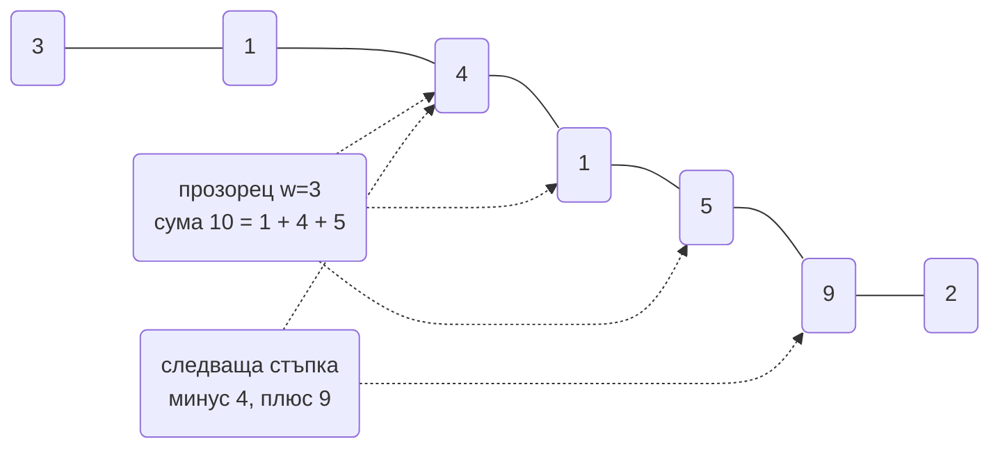
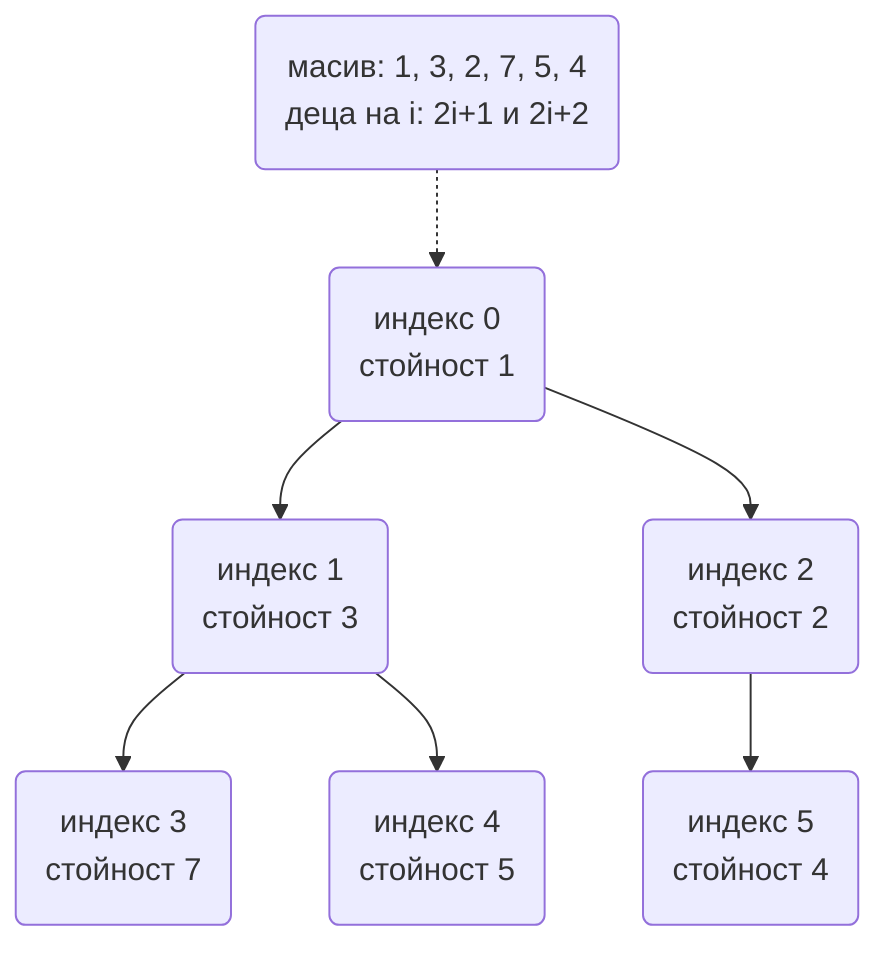

# Алгоритми за интервю: основни техники (Big-O, binary search, two pointers, sliding window, heap, top-K, интервали, сортиране)

Алгоритмичната част на backend интервюто не проверява дали помниш LeetCode. Проверява дали, когато
имаш 10 милиона реда в паметта или 50 000 заявки в секунда, ще посегнеш към структурата, която
държи латентността под контрол, и дали можеш да обясниш **защо**. Интервюиращият слуша три неща:
дали казваш сложността на глас преди да пишеш, дали виждаш наивното решение и защо е бавно, и дали
хващаш ръбовите случаи сам (празен вход, дубликати, граници на прозореца).

Всеки алгоритъм долу е формулиран като ситуация от backend, защото точно така се появява в
system design частта на същото интервю: top-K е autocomplete, интервалите са резервации, heap-ът е
сливането на резултати от шардове. Кодът е TypeScript, изпълним директно с `node file.ts` на Node 24.

| Алгоритъм / техника | Когато човек се сеща за него | Сложност | Къде се среща в тази папка |
| --- | --- | --- | --- |
| Binary search | Сортирани данни или монотонен отговор "минималното X, за което условието е вярно" | O(log n) | [Search Engine](Search_Engine_Inverted_Index.md) posting lists, [Autocomplete](Search_Autocomplete_Typeahead.md) |
| Two pointers | Два сортирани потока или двойка елементи с условие | O(n) | Сливане на резултати от реплики в [KV Store](Distributed_Key_Value_Store.md) |
| Sliding window | "За всеки прозорец от K" или "най-дълъг подмасив с условие" | O(n) | [Rate Limiter](Distributed_Web_Crawler.md), [Ad Click](Ad_Click_Aggregation.md) прозорци |
| Prefix sums | Много заявки "сума в интервал" върху непроменящи се данни | O(1) на заявка след O(n) | Броячи по минута в [Metrics](Metrics_Monitoring_Alerting.md) |
| Hash map counting | Честоти, групиране, "първи уникален" | O(n) | Дедупликация в [Notification System](Notification_system.md) |
| Heap | "Най-малкото / най-голямото в момента" при постоянни вмъквания | O(log n) на операция | [Job Scheduler](Distributed_Job_Scheduler.md), [Stock Exchange](Stock_Exchange_Matching_Engine.md) |
| Top-K | Класация, най-чести заявки, горещи ключове | O(n log K) | [Autocomplete](Search_Autocomplete_Typeahead.md), [Online Trading Game](Online_Trading_Game.md) класации |
| Merge K sorted | Резултати от K шарда, всеки подреден | O(N log K) | [Search Engine](Search_Engine_Inverted_Index.md) scatter-gather, [Message Queue](Distributed_Message_Queue_Kafka.md) |
| Интервали | Резервации, заетост, календари | O(n log n) | [Hotel Reservation](Hotel_Reservation_Airbnb.md), [Ticketmaster](Ticketmaster.md) |
| Сортиране | Винаги, но въпросът е кое и защо | O(n log n) | Compaction в [KV Store](Distributed_Key_Value_Store.md) |

## Big-O: какво струват операциите в JavaScript

Първото, което интервюиращият иска да чуе, е оценка. Не точна, а по порядък. Таблицата е за V8.

| Операция | Сложност | Защо |
| --- | --- | --- |
| `arr.push`, `arr.pop` | O(1) амортизирано | Работа в края на непрекъснат буфер |
| `arr.shift`, `arr.unshift` | O(n) | Всички елементи се местят. Опашка през `shift` в цикъл е O(n²) |
| `arr.splice(i, 1)` | O(n) | Същото местене |
| `arr.indexOf`, `arr.includes` | O(n) | Линейно търсене. За членство ползвай `Set` |
| `Map.get/set/has`, `Set.has` | O(1) средно | Хеш таблица. Пази реда на вмъкване, което LRU кешът използва |
| `str += x` в цикъл | O(n) амортизирано в V8 | V8 ползва "cons strings", но `arr.join` е по-предвидимо |
| `arr.sort(cmp)` | O(n log n) | TimSort, стабилен. Без comparator сортира като низове |
| `Object.keys(obj)` | O(n) | Обхожда всички ключове; в горещ цикъл е скъпо |
| Рекурсия | O(дълбочина) стек | Node пада около 10 000-15 000 нива по подразбиране |

Правило за оценка: **около 10^8 прости операции са около една секунда** в V8. Значи O(n²) при
n = 10^5 е 10^10 операции, тоест минута и повече, и е грешният отговор. O(n log n) при 10^6 е
около 2 × 10^7 и е незабележимо. Тази сметка е същата като back-of-the-envelope при system design и
трябва да се произнесе на глас.

## Binary search

### Задачата

Имаш 10 милиона `created_at` стойности на събития, сортирани във масив в паметта. Трябва да
отговориш на "колко събития има преди момент T" за хиляди заявки в секунда. Втора задача, по-важна
за интервю: имаш списък със задачи с продължителности и трябва да намериш **минималния брой
worker-и**, с които всички приключват за T секунди, ако всеки worker взима задачи последователно.

### Идеята

Линейното търсене е O(n) на заявка, тоест 10^7 операции по хиляда пъти в секунда, което не става.
При сортиран масив всяко сравнение отрязва половината пространство, затова O(log n), около 23
стъпки за 10 милиона. Втората задача не е върху масив, а върху **пространството на отговорите**: ако
K worker-а стигат, стигат и K+1. Условието е монотонно, значи търсим първото K, за което проверката
минава. Проверката е линейна симулация. Това е binary search on the answer и е техниката, която
отличава кандидатите: разпознаваш монотонността и превръщаш оптимизационна задача в log(диапазон)
проверки.

### TypeScript

```ts
// Първи индекс, на който arr[i] >= target. Връща arr.length, ако няма такъв.
export function lowerBound(arr: number[], target: number): number {
  let lo = 0;
  let hi = arr.length;
  while (lo < hi) {
    const mid = lo + ((hi - lo) >> 1);
    if (arr[mid] < target) lo = mid + 1;
    else hi = mid;
  }
  return lo;
}

// Минимален брой worker-и, така че всички задачи (в дадения ред) да минат за <= limit време.
export function minWorkers(durations: number[], limit: number): number {
  const fits = (workers: number): boolean => {
    let used = 1;
    let load = 0;
    for (const d of durations) {
      if (d > limit) return false;
      if (load + d > limit) { used++; load = d; } else load += d;
    }
    return used <= workers;
  };
  let lo = 1;
  let hi = durations.length;
  while (lo < hi) {
    const mid = lo + ((hi - lo) >> 1);
    if (fits(mid)) hi = mid; else lo = mid + 1;
  }
  return fits(lo) ? lo : -1;
}

const ts = [1, 3, 3, 5, 8, 13, 21];
console.log(lowerBound(ts, 5), lowerBound(ts, 4), lowerBound(ts, 100)); // 3 3 7
console.log(minWorkers([7, 2, 5, 10, 8], 15)); // 3
```

### Сложност и клопки

- Време O(log n), памет O(1). Binary search on the answer е O(n log R), където R е диапазонът.
- `lo + ((hi - lo) >> 1)` вместо `(lo + hi) / 2`: в JS няма overflow до 2^53, но `/ 2` дава
  дробно число и `arr[2.5]` е `undefined`. Шифтът е и цяло число, и навик от другите езици.
- Полуотворен интервал `[lo, hi)` с `while (lo < hi)` няма безкраен цикъл и връща естествено
  "няма такъв" като `arr.length`. Смесването на `<=` и `hi = mid` е най-честият бъг.
- `lowerBound` срещу `upperBound` (първи `> target`): разликата между двата е броят на равните
  елементи, което решава "колко записа са точно на T".

### Варианти, които питат

- Търсене в ротиран сортиран масив (намери къде е "чупката", после нормален search).
- Квадратен корен или k-ти корен с точност до epsilon: същият search върху реални числа.
- "Минималната скорост, с която да изядеш N банана за H часа": монотонна проверка.
- Първата версия с бъг между 1 и N при `isBad(v)`: класическият пример за търсене по предикат.

## Two pointers

### Задачата

Два KV възела връщат сортирани по ключ списъци с версии и координаторът трябва да ги слее в един
подреден списък, за да сравни версиите (виж [read repair](Distributed_Key_Value_Store.md)). Втора
задача: в сортиран масив от цени намери двойка, чиято сума е точно X.

### Идеята

Сливането на два сортирани масива не се нуждае от повторно сортиране (O((n+m) log(n+m))), а от
две "глави", които се движат напред: взимаш по-малкия елемент и местиш неговия указател. Всеки
указател минава веднъж, значи O(n+m). При двойка със сума X в сортиран масив започваш от двата
края: ако сумата е малка, левият расте, ако е голяма, десният намалява. Никога не е нужно да се
връщаш, защото всяка стъпка изключва цял ред от кандидати.

### TypeScript

```ts
export function mergeSorted<T>(a: T[], b: T[], key: (x: T) => number): T[] {
  const out: T[] = [];
  let i = 0;
  let j = 0;
  while (i < a.length && j < b.length) {
    if (key(a[i]) <= key(b[j])) out.push(a[i++]);
    else out.push(b[j++]);
  }
  while (i < a.length) out.push(a[i++]);
  while (j < b.length) out.push(b[j++]);
  return out;
}

export function pairWithSum(sorted: number[], target: number): [number, number] | null {
  let l = 0;
  let r = sorted.length - 1;
  while (l < r) {
    const s = sorted[l] + sorted[r];
    if (s === target) return [sorted[l], sorted[r]];
    if (s < target) l++; else r--;
  }
  return null;
}

export function dedupeSorted(sorted: number[]): number[] {
  if (sorted.length === 0) return [];
  const out = [sorted[0]];
  for (let i = 1; i < sorted.length; i++) {
    if (sorted[i] !== out[out.length - 1]) out.push(sorted[i]);
  }
  return out;
}

console.log(mergeSorted([1, 4, 9], [2, 3, 10, 11], (x) => x)); // [1,2,3,4,9,10,11]
console.log(pairWithSum([1, 2, 4, 7, 11, 15], 15)); // [4, 11]
console.log(dedupeSorted([1, 1, 2, 3, 3, 3, 7])); // [1,2,3,7]
```

### Сложност и клопки

- O(n + m) време, O(n + m) допълнителна памет за сливането (или O(1), ако пишеш в предварително
  заделен буфер).
- `<=` при равни ключове запазва елементите от първия списък отпред, тоест сливането е стабилно.
  При read repair това е редът "реплика A преди реплика B", който после решава конфликта.
- Двойката със сума работи **само** върху сортиран масив. При несортиран правилният отговор е
  хеш таблица за O(n), не сортиране + two pointers, което е O(n log n).
- Не "опресняваш" дължината в цикъла: `while (i < a.length)` върху масив, който променяш, е бъг.

### Варианти, които питат

- Тройка със сума нула: сортиране плюс two pointers за всяко фиксирано първо число, O(n²).
- Container with most water: двата края, местиш по-ниската страна.
- Премахване на елемент на място и връщане на новата дължина.
- Сливане на K списъка: two pointers не скалира, отговорът е heap (по-долу).

## Sliding window

### Задачата

Rate limiter трябва да каже дали клиент е направил повече от 100 заявки в последните 60 секунди при
поток от timestamps. Втора задача: най-дълъг подниз с най-много K различни символа, което е същото
като "най-дългият период, в който потребителят е ползвал най-много K устройства".

### Идеята

Наивното е за всеки край на прозореца да преброиш назад, тоест O(n × w). Прозорецът обаче се
движи само напред: когато десният край влиза, левият излиза. Ако състоянието на прозореца се
поддържа инкрементално (сума, брояч на честоти, брой различни), всяко влизане и излизане е O(1) и
целият масив минава за O(n). При **фиксиран** прозорец се вади елементът на `i - w`. При
**променлив** прозорец десният винаги расте, а левият се свива само докато условието е нарушено;
всеки индекс влиза веднъж и излиза веднъж.



### TypeScript

```ts
export function maxWindowSum(values: number[], w: number): number {
  if (w > values.length) return NaN;
  let sum = 0;
  for (let i = 0; i < w; i++) sum += values[i];
  let best = sum;
  for (let i = w; i < values.length; i++) {
    sum += values[i] - values[i - w];
    if (sum > best) best = sum;
  }
  return best;
}

export function longestWithAtMostKDistinct(s: string, k: number): number {
  const freq = new Map<string, number>();
  let left = 0;
  let best = 0;
  for (let right = 0; right < s.length; right++) {
    freq.set(s[right], (freq.get(s[right]) ?? 0) + 1);
    while (freq.size > k) {
      const c = s[left++];
      const n = freq.get(c)! - 1;
      if (n === 0) freq.delete(c); else freq.set(c, n);
    }
    best = Math.max(best, right - left + 1);
  }
  return best;
}

// Sliding window log: позволена ли е заявка в момент now при лимит limit за windowMs.
export function allowRequest(log: number[], now: number, limit: number, windowMs: number): boolean {
  while (log.length > 0 && log[0] <= now - windowMs) log.shift();
  if (log.length >= limit) return false;
  log.push(now);
  return true;
}

console.log(maxWindowSum([3, 1, 4, 1, 5, 9, 2], 3)); // 16
console.log(longestWithAtMostKDistinct('eceba', 2)); // 3
const log: number[] = [];
console.log([0, 100, 200, 61000].map((t) => allowRequest(log, t, 3, 60000))); // [true,true,true,true]
```

### Сложност и клопки

- O(n) време. Памет O(1) за фиксиран прозорец с числова агрегация, O(K) за честотната карта.
- `log.shift()` е O(n). За реален rate limiter логът се пази в Redis sorted set или се ползва
  sliding window **counter** с два брояча, точно както е описано в [Rate Limiter](Distributed_Web_Crawler.md).
  На интервю кажи и двете: логът е точен, броячът е константна памет.
- При променлив прозорец условието се проверява **след** добавянето на десния елемент и левият се
  свива с `while`, не с `if`. Един елемент може да изкара няколко наведнъж.
- Прозорец по време, не по брой елементи: границата е `<= now - windowMs` (включително), иначе
  заявка точно на границата се брои два пъти.

### Варианти, които питат

- Минимален подмасив със сума поне S (свиване докато сумата е достатъчна).
- Максимум в прозорец с монотонна deque за O(n) вместо heap за O(n log w).
- Анаграми на P в S: прозорец с фиксирана дължина и сравнение на честоти.
- Tumbling срещу sliding прозорци при stream processing (виж [Ad Click](Ad_Click_Aggregation.md)).

## Prefix sums

### Задачата

Имаш броя кликове за всяка минута на деня (1 440 стойности) и dashboard, който за всяко
преместване на плъзгача пита "колко кликове между минута A и минута B". Хиляди такива заявки.

### Идеята

Всяка заявка е сума на интервал. Наивно е O(B - A). Ако веднъж изчислиш `prefix[i] = сума на
първите i елемента`, то сумата в `[A, B)` е `prefix[B] - prefix[A]` за O(1). Същият трик работи
за броене на елементи с дадено свойство (prefix брояч) и за 2D матрици. Слабото място: данните
трябва да са неизменяеми; при чести обновявания се ползва Fenwick tree или segment tree за
O(log n) и за двете операции.

### TypeScript

```ts
export function buildPrefix(values: number[]): number[] {
  const prefix = new Array<number>(values.length + 1).fill(0);
  for (let i = 0; i < values.length; i++) prefix[i + 1] = prefix[i] + values[i];
  return prefix;
}

// Сума в полуотворен интервал [from, to).
export function rangeSum(prefix: number[], from: number, to: number): number {
  return prefix[to] - prefix[from];
}

// Колко подмасива имат сума точно k: prefix + хеш карта на срещнатите суми.
export function countSubarraysWithSum(values: number[], k: number): number {
  const seen = new Map<number, number>([[0, 1]]);
  let running = 0;
  let count = 0;
  for (const v of values) {
    running += v;
    count += seen.get(running - k) ?? 0;
    seen.set(running, (seen.get(running) ?? 0) + 1);
  }
  return count;
}

const clicksPerMinute = [5, 0, 12, 7, 3, 9];
const p = buildPrefix(clicksPerMinute);
console.log(rangeSum(p, 2, 5)); // 22
console.log(countSubarraysWithSum([1, 1, 1], 2)); // 2
```

### Сложност и клопки

- O(n) предварително, O(1) на заявка, O(n) памет.
- Масивът с префикси е с един елемент по-дълъг, `prefix[0] = 0`. Това прави интервалите
  полуотворени и маха специалния случай за `from = 0`.
- Сума над 2^53 губи точност в JS. При пари или големи броячи ползвай `BigInt` или пази в минорни
  единици и следи порядъка.
- При стрийм от данни (прозорецът се движи, идват нови минути) prefix sums не помага; там е
  sliding window или Fenwick tree.

### Варианти, които питат

- 2D prefix sums за суми в правоъгълник от матрица.
- Най-дълъг подмасив с равен брой нули и единици (нулите като -1, търсиш повторен prefix).
- Product of array except self (prefix и suffix произведения).
- Diff array: интервални добавяния за O(1), после един prefix pass.

## Hash map: броене и групиране

### Задачата

От 10 милиона търсения намери първото, което се среща само веднъж. Второ: групирай думи, които са
анаграми една на друга (същото като групиране на еднакви документи по каноничен ключ).

### Идеята

Хеш таблицата дава O(1) достъп по ключ, така че всяка задача "колко пъти", "групирай по", "виждал
ли съм" става O(n). Ключът трябва да е **каноничен**: за анаграми това е сортираната дума или
вектор от 26 броя; за URL-и е нормализираната форма (виж [Crawler](Distributed_Web_Crawler.md)).
За "първи уникален" `Map` в JS пази реда на вмъкване, така че второ обхождане на картата, а не на
масива, дава първия ключ с брой 1.

### TypeScript

```ts
export function firstUnique(items: string[]): string | null {
  const counts = new Map<string, number>();
  for (const it of items) counts.set(it, (counts.get(it) ?? 0) + 1);
  for (const [k, c] of counts) if (c === 1) return k;
  return null;
}

export function groupAnagrams(words: string[]): string[][] {
  const groups = new Map<string, string[]>();
  for (const w of words) {
    const key = [...w].sort().join('');
    const g = groups.get(key);
    if (g) g.push(w); else groups.set(key, [w]);
  }
  return [...groups.values()];
}

export function topFrequency(items: string[], k: number): Array<[string, number]> {
  const counts = new Map<string, number>();
  for (const it of items) counts.set(it, (counts.get(it) ?? 0) + 1);
  return [...counts.entries()].sort((a, b) => b[1] - a[1] || a[0].localeCompare(b[0])).slice(0, k);
}

console.log(firstUnique(['a', 'b', 'a', 'c', 'b'])); // c
console.log(groupAnagrams(['eat', 'tea', 'tan', 'ate', 'nat', 'bat']));
console.log(topFrequency(['x', 'y', 'x', 'z', 'x', 'y'], 2)); // [['x',3],['y',2]]
```

### Сложност и клопки

- O(n) за броене; `groupAnagrams` е O(n × L log L) заради сортирането на всяка дума.
- `topFrequency` със сортиране е O(u log u) при u уникални; за много големи u вземи heap (по-долу).
- Ключовете на `Map` могат да са обекти по референция, не по стойност. `map.set([1,2], x)` и
  `map.get([1,2])` не се срещат. Сериализирай ключа или ползвай примитив.
- `Object` като карта: ключовете стават низове, `__proto__` е капан, и няма гарантиран ред за
  числови ключове. За броене винаги `Map`.
- Tie-break в сортирането на резултати трябва да е детерминистичен, иначе два worker-а дават
  различен top-K за едни и същи данни.

### Варианти, които питат

- Two sum в несортиран масив с една карта в един pass.
- Най-дълга последователност от поредни числа с `Set` за O(n).
- Дедупликация по няколко полета (композитен ключ през `JSON.stringify` на подреден масив).
- Броене на уникални при 1 милиард ключа: HyperLogLog (виж [System_Design](System_Design.md)).

## Heap (приоритетна опашка)

### Задачата

Планировчик има милион задачи с различни `next_run_at` и на всеки тик трябва да вземе **най-
ранната**. Или matching engine трябва да знае най-добрата цена в order book при постоянни нови
поръчки. JavaScript няма вградена приоритетна опашка, така че се пише на ръка, и това се очаква.

### Идеята

Сортиран масив дава най-малкото за O(1), но вмъкването е O(n). Несортиран дава вмъкване O(1), но
минимум O(n). Двоичният heap е компромисът: пълно двоично дърво, пазено в масив, при което
родителят винаги е по-малък от децата си. Минимумът е `heap[0]`. Вмъкване: добавяш в края и
"изплуваш" нагоре. Изваждане: местиш последния на върха и "потъваш" надолу. И двете са O(log n),
защото височината е log n. Индексната аритметика замества указателите: децата на `i` са
`2i + 1` и `2i + 2`, родителят е `(i - 1) >> 1`.



### TypeScript

```ts
export class BinaryHeap<T> {
  private items: T[] = [];
  private less: (a: T, b: T) => boolean;

  constructor(less: (a: T, b: T) => boolean) {
    this.less = less;
  }

  get size(): number { return this.items.length; }
  peek(): T | undefined { return this.items[0]; }

  push(value: T): void {
    const a = this.items;
    a.push(value);
    let i = a.length - 1;
    while (i > 0) {
      const parent = (i - 1) >> 1;
      if (!this.less(a[i], a[parent])) break;
      [a[i], a[parent]] = [a[parent], a[i]];
      i = parent;
    }
  }

  pop(): T | undefined {
    const a = this.items;
    if (a.length === 0) return undefined;
    const top = a[0];
    const last = a.pop()!;
    if (a.length > 0) {
      a[0] = last;
      let i = 0;
      for (;;) {
        const l = 2 * i + 1;
        const r = l + 1;
        let m = i;
        if (l < a.length && this.less(a[l], a[m])) m = l;
        if (r < a.length && this.less(a[r], a[m])) m = r;
        if (m === i) break;
        [a[i], a[m]] = [a[m], a[i]];
        i = m;
      }
    }
    return top;
  }
}

type Job = { id: string; runAt: number };
const due = new BinaryHeap<Job>((a, b) => a.runAt < b.runAt);
for (const j of [{ id: 'c', runAt: 30 }, { id: 'a', runAt: 10 }, { id: 'b', runAt: 20 }]) due.push(j);
console.log(due.pop()?.id, due.pop()?.id, due.pop()?.id, due.size); // a b c 0
```

### Сложност и клопки

- `push`/`pop` O(log n), `peek` O(1), построяване от n елемента O(n) с heapify отдолу нагоре
  (не O(n log n) с n push-а, което е често объркване).
- Heap-ът **не** е сортиран масив. Обхождането му по индекс не дава подреден ред. Ако трябва
  подредба, вадиш всичко, което е heap sort за O(n log n).
- Комparатор през `less`, не през числа, за да може да сравняваш по няколко полета (цена, после
  време, както в order book). Равните елементи нямат гарантиран ред, затова при изискване за FIFO
  при равен приоритет се добавя пореден номер като tie-break.
- Промяна на приоритета на елемент вътре в heap-а е O(n) за намиране; ако трябва често (Dijkstra с
  decrease-key), се ползва lazy deletion: пушваш нов запис и игнорираш остарелия при pop.

### Варианти, които питат

- K-тото най-голямо число в стрийм: min-heap с размер K.
- Median в стрийм: два heap-а (max за долната половина, min за горната).
- Task scheduler с cooldown: heap по честота плюс опашка на изчакващите.
- Heapify за O(n) и защо сумата на височините е линейна.

## Top-K

### Задачата

Autocomplete иска топ 10 най-често търсени заявки от поток от 100 милиона търсения, като паметта
за резултата трябва да е малка. Класацията в [Online Trading Game](Online_Trading_Game.md) иска
топ 100 играча от 10 000 при обновяване на всяка половин секунда.

### Идеята

Пълно сортиране на u уникални елемента е O(u log u) и заделя памет за всички. Достатъчно е да
държиш **min-heap с размер K**: за всеки елемент, ако е по-голям от най-малкия в heap-а, го
заменяш. Heap-ът винаги съдържа K-те най-големи дотук, а най-малкият от тях е на върха и се вади за
O(1). Общо O(u log K) и памет O(K), тоест за K = 10 почти безплатно. Алтернативата quickselect
дава средно O(u), но модифицира масива, не е стриймова и има лош worst case, така че се споменава
като вариант, не като избор по подразбиране.

### TypeScript

```ts
class MinHeap<T> {
  items: T[] = [];
  less: (a: T, b: T) => boolean;
  constructor(less: (a: T, b: T) => boolean) { this.less = less; }
  push(v: T): void {
    const a = this.items; a.push(v);
    for (let i = a.length - 1; i > 0;) {
      const p = (i - 1) >> 1;
      if (!this.less(a[i], a[p])) break;
      [a[i], a[p]] = [a[p], a[i]]; i = p;
    }
  }
  pop(): T | undefined {
    const a = this.items; if (!a.length) return undefined;
    const top = a[0]; const last = a.pop()!;
    if (a.length) {
      a[0] = last;
      for (let i = 0;;) {
        const l = 2 * i + 1, r = l + 1; let m = i;
        if (l < a.length && this.less(a[l], a[m])) m = l;
        if (r < a.length && this.less(a[r], a[m])) m = r;
        if (m === i) break;
        [a[i], a[m]] = [a[m], a[i]]; i = m;
      }
    }
    return top;
  }
}

export function topK(counts: Map<string, number>, k: number): Array<[string, number]> {
  const heap = new MinHeap<[string, number]>((a, b) => a[1] < b[1] || (a[1] === b[1] && a[0] > b[0]));
  for (const entry of counts) {
    heap.push(entry);
    if (heap.items.length > k) heap.pop();
  }
  const out: Array<[string, number]> = [];
  while (heap.items.length) out.push(heap.pop()!);
  return out.reverse();
}

const counts = new Map([['system design', 40], ['spotify', 25], ['samsung', 25], ['sydney', 9], ['symptoms', 30]]);
console.log(topK(counts, 3)); // [['system design',40],['symptoms',30],['samsung',25]]
```

### Сложност и клопки

- O(u log K) време, O(K) памет. При K близо до u сортирането е по-просто и не по-бавно.
- Tie-break-ът в `less` е задължителен: без него два елемента с еднаква честота се подреждат по
  случайност и класацията "трепти" между обновявания.
- За стрийм без възможност да пазиш всички броячи (100 милиона уникални заявки) top-K става
  приблизителен: Count-Min Sketch за броенията плюс heap за кандидатите. Кажи го, ако питат за
  памет.
- Разпределен top-K: всеки шард дава своя топ K, координаторът слива K × shards кандидати. Това е
  точно, само ако броенията на един ключ са в един шард (партиция по ключ), иначе е приближение.

### Варианти, които питат

- K най-близки точки до началото (heap по разстояние).
- Top-K за последните 5 минути (комбинация със sliding window по време).
- K-ти най-голям елемент без heap: quickselect и защо средният случай е O(n).
- Топ-K на всеки възел в trie за autocomplete (виж [Autocomplete](Search_Autocomplete_Typeahead.md)).

## Merge K sorted lists

### Задачата

Търсачката пита 100 шарда, всеки връща подредени по score 50 резултата, и координаторът трябва да
върне общите топ 50. Или: сливане на K лог файла, всеки подреден по време, в един поток.

### Идеята

Two pointers за K списъка става K указателя и на всяка стъпка избираш минималния измежду K, което
е O(K) на елемент. С heap от K "глави" изборът е O(log K): вадиш най-малкия, пушваш следващия от
същия списък. Общо O(N log K) за N елемента, а паметта е O(K), защото четеш списъците лениво.
Точно затова координаторът може да слива резултати от 100 шарда без да зареди всичко в паметта, а
compaction в LSM база слива SSTable-и по същия начин (виж [KV Store](Distributed_Key_Value_Store.md)).

### TypeScript

```ts
type Head = { value: number; list: number; index: number };

function siftUp(a: Head[], i: number): void {
  while (i > 0) {
    const p = (i - 1) >> 1;
    if (a[i].value >= a[p].value) break;
    [a[i], a[p]] = [a[p], a[i]]; i = p;
  }
}
function siftDown(a: Head[], i: number): void {
  for (;;) {
    const l = 2 * i + 1, r = l + 1; let m = i;
    if (l < a.length && a[l].value < a[m].value) m = l;
    if (r < a.length && a[r].value < a[m].value) m = r;
    if (m === i) break;
    [a[i], a[m]] = [a[m], a[i]]; i = m;
  }
}

export function mergeKSorted(lists: number[][], limit = Infinity): number[] {
  const heap: Head[] = [];
  lists.forEach((l, i) => { if (l.length) { heap.push({ value: l[0], list: i, index: 0 }); siftUp(heap, heap.length - 1); } });
  const out: number[] = [];
  while (heap.length && out.length < limit) {
    const top = heap[0];
    out.push(top.value);
    const next = top.index + 1;
    if (next < lists[top.list].length) {
      heap[0] = { value: lists[top.list][next], list: top.list, index: next };
    } else {
      heap[0] = heap[heap.length - 1]; heap.pop();
      if (!heap.length) break;
    }
    siftDown(heap, 0);
  }
  return out;
}

console.log(mergeKSorted([[1, 4, 7], [2, 5, 8], [0, 9, 10]])); // [0,1,2,4,5,7,8,9,10]
console.log(mergeKSorted([[1, 4, 7], [2, 5, 8], [0, 9, 10]], 4)); // [0,1,2,4]
```

### Сложност и клопки

- O(N log K) време, O(K) памет плюс изхода. С `limit` спираш рано, което е ключово при "топ 50
  от 100 × 50 кандидата": четеш само 50 log 100 стъпки.
- Замяна на върха на място плюс `siftDown` вместо `pop` + `push` спестява половината операции.
- При сливане по няколко ключа (score, после doc_id) компараторът трябва да е пълен, иначе редът
  между шардове не е детерминистичен и пагинацията повтаря резултати.
- При стрийм от K източника с различна скорост heap-ът "чака" най-бавния източник (watermark
  проблемът от [Ad Click](Ad_Click_Aggregation.md)).

### Варианти, които питат

- Най-малък диапазон, който включва поне по един елемент от всеки от K списъка.
- Smallest K pairs от два сортирани масива.
- Външно сортиране на файл, по-голям от RAM: сортирай парчета, после merge K.
- Сливане на K итератора / async generator-а лениво.

## Интервали

### Задачата

Хотел пази резервации като `[checkIn, checkOut)`. Трябва да проверяваш дали нова резервация се
пресича с някоя съществуваща и да сливаш припокриващи се периоди на недостъпност. Втора класика:
минимален брой зали за срещи, дадени интервали.

### Идеята

Почти всяка задача с интервали започва със **сортиране по начало**. След това припокриващите се
интервали са съседи: ако следващият започва преди края на текущия, сливаш, като вземаш по-късния
край. За "колко зали" минаваш интервалите по начало и държиш min-heap с краищата на заетите зали;
ако най-ранният край е преди началото на текущата среща, залата се освобождава. Максималният размер
на heap-а е отговорът. Проверката за пресичане на два полуотворени интервала е едно неравенство:
`a.start < b.end && b.start < a.end`. Полуотвореността прави checkout в 11:00 и checkin в 11:00
непресичащи се, което е точно семантиката на [Hotel Reservation](Hotel_Reservation_Airbnb.md).

### TypeScript

```ts
export type Interval = { start: number; end: number };

export const overlaps = (a: Interval, b: Interval): boolean => a.start < b.end && b.start < a.end;

export function mergeIntervals(intervals: Interval[]): Interval[] {
  const sorted = [...intervals].sort((a, b) => a.start - b.start);
  const out: Interval[] = [];
  for (const cur of sorted) {
    const last = out[out.length - 1];
    if (last && cur.start <= last.end) last.end = Math.max(last.end, cur.end);
    else out.push({ ...cur });
  }
  return out;
}

// Минимален брой зали: краищата на заетите зали в min-heap (тук: сортиран масив за краткост).
export function minRooms(meetings: Interval[]): number {
  const starts = meetings.map((m) => m.start).sort((a, b) => a - b);
  const ends = meetings.map((m) => m.end).sort((a, b) => a - b);
  let rooms = 0;
  let best = 0;
  let e = 0;
  for (const s of starts) {
    if (s < ends[e]) rooms++; else e++;
    best = Math.max(best, rooms);
  }
  return best;
}

console.log(overlaps({ start: 10, end: 12 }, { start: 12, end: 14 })); // false
console.log(mergeIntervals([{ start: 1, end: 3 }, { start: 2, end: 6 }, { start: 8, end: 10 }, { start: 9, end: 12 }]));
console.log(minRooms([{ start: 0, end: 30 }, { start: 5, end: 10 }, { start: 15, end: 20 }])); // 2
```

### Сложност и клопки

- O(n log n) заради сортирането, после O(n). `minRooms` с два сортирани масива е същата идея като
  heap-а, но без heap: "start преди най-ранния end" означава нова зала.
- Сливането ползва `<=` ако допиращите се интервали се броят за един (`[1,3]` и `[3,5]`), и `<`
  ако не. Уточни го с интервюиращия, това е част от отговора.
- Сортиране на копие, не на входа: `sort` е на място и мутира аргумента на извикващия.
- В базата проверката за пресичане е същото неравенство върху индекс по `(room_id, start)`; за
  конкурентни резервации неравенството не стига и трябва лок или условен UPDATE (виж
  [Hotel Reservation](Hotel_Reservation_Airbnb.md)).

### Варианти, които питат

- Insert interval в сортиран списък без пълно повторно сливане.
- Свободни слотове между интервали (complement).
- Максимално припокриване в даден момент (sweep line: +1 при start, -1 при end, сортирани събития).
- Интервали с приоритет: премахване на покрити интервали.

## Сортиране: кое, кога и защо

### Задачата

Интервюиращият рядко иска да напишеш quicksort. Иска да знаеш какво прави `Array.prototype.sort`,
кога е грешно да го извикаш и какво правиш, когато данните не се събират в паметта.

### Идеята

- **`arr.sort()` без comparator сортира като низове**: `[10, 9, 1].sort()` дава `[1, 10, 9]`.
  Винаги comparator за числа, и той трябва да връща число, не boolean.
- V8 ползва **TimSort**: стабилен, O(n log n), почти линеен за вече подредени данни. Стабилността
  означава, че сортиране по второ поле след сортиране по първо запазва първото подреждане.
- **Counting / radix sort** са O(n + k) за цели числа в малък диапазон (възрасти, статус кодове,
  минути от деня). Побеждават O(n log n), когато k е малко.
- **Външно сортиране**: данните не се събират в RAM, сортираш парчета, пишеш ги, сливаш с heap
  (merge K). Това е и compaction на SSTable-и в LSM базите.
- **Частично сортиране**: за топ-K не сортираш всичко (виж top-K).

### TypeScript

```ts
type Order = { id: string; price: number; ts: number };

// Стабилно сортиране по две полета: цена намаляващо, при равна цена по време нарастващо.
export function sortBook(orders: Order[]): Order[] {
  return [...orders].sort((a, b) => b.price - a.price || a.ts - b.ts);
}

// Counting sort за стойности в малък известен диапазон, напр. HTTP статус кодове.
export function countingSort(values: number[], maxValue: number): number[] {
  const counts = new Array<number>(maxValue + 1).fill(0);
  for (const v of values) counts[v]++;
  const out: number[] = [];
  for (let v = 0; v <= maxValue; v++) for (let c = 0; c < counts[v]; c++) out.push(v);
  return out;
}

console.log([10, 9, 1].sort()); // ['1','10','9'] като низове: [1, 10, 9]
console.log([10, 9, 1].sort((a, b) => a - b)); // [1, 9, 10]
console.log(sortBook([{ id: 'a', price: 100, ts: 2 }, { id: 'b', price: 101, ts: 3 }, { id: 'c', price: 100, ts: 1 }]).map((o) => o.id)); // b c a
console.log(countingSort([503, 200, 404, 200, 200, 301], 600).join(',')); // 200,200,200,301,404,503
```

### Сложност и клопки

- Comparator, който връща `a > b` (boolean), работи "случайно" в някои енджини и се чупи в други.
  Връщай `a - b` за числа и `localeCompare` за низове (или `<`/`>` с изрично -1/0/1).
- `a - b` с `NaN` или `undefined` разваля подредбата тихо. Филтрирай или нормализирай преди сорт.
- Сортирането е на място. Ако входът е споделено състояние (кеширан отговор), сортирай копие.
- За 10^7 обекта сортирането с comparator е секунди в Node. Ако е горещ път, сортирай индекси или
  типизиран масив от ключове (`Float64Array.prototype.sort` е числово и много по-бързо).

### Варианти, които питат

- Sort colors / Dutch national flag за три стойности на място за O(n).
- Сортиране на почти подреден масив (k-sorted) с heap за O(n log k).
- Сливане на два сортирани масива на място отзад напред.
- Кога quicksort е O(n²) и защо библиотеките ползват introsort или TimSort.

## Въпроси за интервюто

### Когато binary search е грешен избор?

Когато данните не са сортирани и ще търсиш веднъж: сортирането е O(n log n), по-скъпо от едно
линейно търсене. И когато структурата се променя често: поддържането на сортиран масив е O(n) на
вмъкване, там е мястото на балансирано дърво или skip list (или на индекс в базата).

### Защо JavaScript няма heap и какво правиш?

Няма в стандартната библиотека, за разлика от Python `heapq` или Java `PriorityQueue`. На интервю
се очаква да напишеш двоичен heap за 30 реда с comparator; в продукция се взима пакет или се ползва
Redis sorted set, когато приоритетната опашка трябва да е споделена между процеси.

### Стабилно ли е `Array.prototype.sort`?

Да, от ES2019 спецификацията изисква стабилност и V8 ползва TimSort. Преди това за масиви над 10
елемента V8 ползваше нестабилен quicksort. Стабилността е причината двустепенно сортиране да работи.

### Кога хеш таблица е по-лоша от сортиране?

Когато ти трябва подредба или диапазонни заявки. Когато паметта е критична: `Map` с 10 милиона
записа е стотици MB, докато сортиран `Float64Array` е 80 MB. И когато ключовете са обекти, които не
могат да се сериализират евтино.

### Как обясняваш амортизирана сложност?

`push` е O(1) амортизирано: понякога буферът се удвоява и копира за O(n), но това се случва на
всеки n операции, така че средно на операция е константа. Същото за преоразмеряване на хеш таблица.
Важно е да добавиш: амортизирано не значи гарантирано, при латентност p99 единичната скъпа операция
се вижда.

### Рекурсия или итерация в Node?

Итерация с явен стек, когато дълбочината може да надхвърли около 10 000 (дълбоко дърво, DFS в голям
граф, обхождане на JSON с непознат размер). Node няма tail call optimization. Рекурсия остава там,
където дълбочината е ограничена по конструкция: балансирано дърво, divide and conquer с log n нива.

### Как избираш между O(n log n) и O(n) с повече памет?

Кажи числата: при n = 10^6 разликата е 20 пъти, при n = 1000 е незабележима и по-простият код
печели. Паметта има значение при много паралелни заявки (1 000 заявки × 100 MB временна памет).
Интервюиращият иска да види, че решението зависи от контекста, не от рефлекса към най-ниската
сложност.

### Какво казваш, когато не знаеш оптималното решение?

Наивното решение с правилна сложност, произнесена на глас, после къде е излишната работа
("преброявам едно и също многократно") и коя структура я маха. Работещо O(n²) с ясен план за
подобрение е по-добро от мълчание в търсене на O(n).
