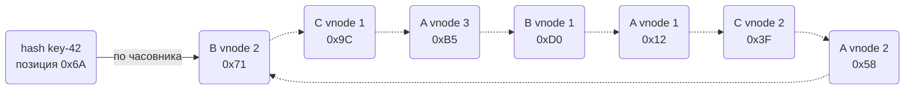
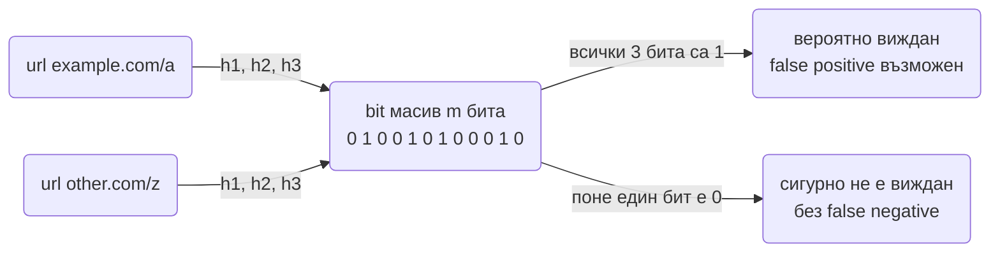
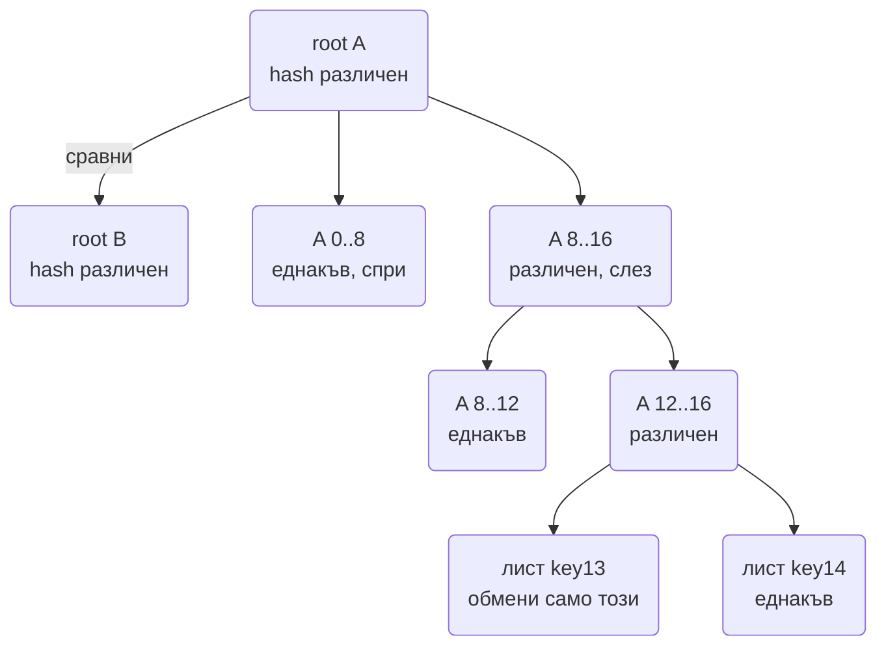

# Алгоритми от разпределените системи в код (consistent hashing, Bloom filter, Count-Min sketch, HyperLogLog, reservoir sampling, Snowflake ID, geohash, Merkle tree, vector clocks, backoff)

Системите в тази папка се позовават на десетина алгоритми, които интервюиращият очаква да можеш да
напишеш на дъска за 10-15 минути: не библиотеката, а механизма. Въпросът "как работи consistent
hashing" рядко е самоцел. Той проверява дали разбираш защо `hash % N` е грешен избор, какво се случва
при добавяне на възел и как виртуалните възли изравняват натоварването. Същото е с Bloom filter:
искат да чуят "false positive, никога false negative", формулата за размера и цената на грешката.

Всеки алгоритъм долу е даден с задачата, която решава, идеята зад него, TypeScript код, който се
изпълнява директно с `node file.ts` на Node 24 (без build стъпка), сложността, клопките и вариантите,
които следват като допълнителен въпрос. Кодът е нарочно без външни зависимости и без микрооптимизации,
за да се чете като обяснение.

| Алгоритъм | Проблемът, който решава | Сложност / памет | Къде се среща в тази папка |
| --- | --- | --- | --- |
| Consistent hashing + vnodes | Кой възел държи ключа, така че смяна на N да размести малко данни | O(log V) lookup, V vnodes | [KV Store](Distributed_Key_Value_Store.md), [Distributed Cache](Distributed_Cache_Redis.md), [Crawler](Distributed_Web_Crawler.md) |
| Rendezvous hashing | Същото, без пръстен и без сортиран масив | O(N) на lookup | [Distributed Cache](Distributed_Cache_Redis.md) |
| Bloom filter | Виждан ли е елемент, в много малко памет | O(k), ~10 бита на елемент при 1% | [Crawler](Distributed_Web_Crawler.md), [URL Shortener](URL_Shortener.md), [KV Store](Distributed_Key_Value_Store.md) |
| Count-Min sketch | Приблизителна честота и heavy hitters в поток | O(d) на операция, w × d брояча | [Ad Click](Ad_Click_Aggregation.md), [Distributed Cache](Distributed_Cache_Redis.md) (горещи ключове) |
| HyperLogLog | Брой уникални в поток | O(1), 2^p байта (12 KB при p = 14) | [URL Shortener](URL_Shortener.md), [Metrics](Metrics_Monitoring_Alerting.md) |
| Reservoir sampling | Равномерна извадка от поток с неизвестна дължина | O(1) на елемент, k елемента памет | [Metrics](Metrics_Monitoring_Alerting.md) (tracing sampling), [Ad Click](Ad_Click_Aggregation.md) |
| Snowflake ID | Уникални, сортируеми по време ID без координация | O(1), 64 бита | [URL Shortener](URL_Shortener.md), [Chat](Chat_system_WhatsApp_Slack%20_Messenger.md) |
| Geohash | Двумерна близост като едномерен префикс | O(precision) | [Geo](Geo_Proximity_Uber_Yelp.md) |
| Merkle tree | Кои диапазони се различават между две реплики | O(n) build, O(log n × разлики) сравнение | [KV Store](Distributed_Key_Value_Store.md), [Object Storage](Object_Storage_S3.md) |
| Vector clocks | Кой запис е по-нов и кои са конкурентни | O(N възли) на сравнение | [KV Store](Distributed_Key_Value_Store.md), [Collaborative Editing](Collaborative_Editing_Google_Docs.md) |
| Backoff с jitter | Retry без синхронизирани вълни | O(1) | [Notification System](Notification_system.md), [Chat](Chat_system_WhatsApp_Slack%20_Messenger.md), [Online Trading Game](Online_Trading_Game.md) |
| Token bucket | Лимит с позволени пикове | O(1), два числа на ключ | [Rate Limiter](Distributed_Web_Crawler.md), [Node.js архитектурни патерни](Design_Patterns_Node_Architecture.md) |

## Consistent hashing с виртуални възли

### Задачата

Имаш N кеш възела и трябва да решиш кой държи всеки ключ. Наивното `hash(key) % N` работи, докато
N не се промени: при добавяне на пети възел към четири, около 80% от ключовете сменят собственика си и
кешът се изпразва наведнъж (cache avalanche към базата).

### Идеята

Възлите и ключовете се хешират в едно и също пространство, подредено в пръстен. Ключът отива на
първия възел по посока на часовниковата стрелка. При добавяне на възел се преместват само ключовете
между новия възел и предшественика му, тоест около `1/N` от всички.

Един хеш на възел дава неравномерни дъги. Затова всеки физически възел получава V виртуални позиции
(vnodes): при V = 150 стандартното отклонение на натоварването пада под 10%, а при отпадане на възел
неговите ключове се разпръскват между всички останали, не върху един съсед.



### TypeScript

```ts
import { createHash } from 'node:crypto';

const hash32 = (s: string): number => createHash('md5').update(s).digest().readUInt32BE(0);

class HashRing {
  private ring: { h: number; node: string }[] = [];
  private vnodes: number;
  constructor(vnodes = 150) { this.vnodes = vnodes; }
  add(node: string) {
    for (let i = 0; i < this.vnodes; i++) this.ring.push({ h: hash32(`${node}#${i}`), node });
    this.ring.sort((a, b) => a.h - b.h);
  }
  remove(node: string) { this.ring = this.ring.filter((e) => e.node !== node); }
  get(key: string): string {
    const h = hash32(key);
    let lo = 0, hi = this.ring.length;
    while (lo < hi) { const mid = (lo + hi) >>> 1; if (this.ring[mid].h < h) lo = mid + 1; else hi = mid; }
    return this.ring[lo % this.ring.length].node;   // wrap-around: след последната позиция идва първата
  }
}

function rendezvous(key: string, nodes: string[]): string {
  let best = nodes[0], bestScore = -1;
  for (const n of nodes) { const s = hash32(`${key}|${n}`); if (s > bestScore) { bestScore = s; best = n; } }
  return best;
}

const ring = new HashRing(150);
['A', 'B', 'C'].forEach((n) => ring.add(n));
const keys = Array.from({ length: 10000 }, (_, i) => `key-${i}`);
const before = new Map(keys.map((k) => [k, ring.get(k)]));
ring.add('D');
const moved = keys.filter((k) => before.get(k) !== ring.get(k)).length;
console.log(`moved ${moved} of ${keys.length} keys (${(100 * moved / keys.length).toFixed(1)}%), expected ~25%`);
console.log('rendezvous key-42 ->', rendezvous('key-42', ['A', 'B', 'C']));
```

### Сложност и клопки

- Lookup е O(log V) с двоично търсене в сортиран масив от V = N × vnodes позиции. Добавяне на възел
  е O(V log V) заради сортирането, което е рядко събитие.
- Хешът трябва да е равномерен, не криптографски силен. MD5 е достатъчен и бърз; в продукция се
  ползва MurmurHash3 или xxHash, защото са с порядък по-бързи от криптографските.
- Репликация: стойността се пази на следващите R **различни физически** възела по пръстена, като се
  прескачат vnodes на същата машина. Ако се вземат просто следващите R позиции, две реплики могат да
  се окажат на един сървър.
- Хетерогенен хардуер: по-мощна машина получава пропорционално повече vnodes.

### Варианти, които питат

- **Rendezvous (highest random weight) hashing:** за всеки ключ се изчислява score за всеки възел и
  печели най-високият. Няма пръстен, няма сортиран масив, преместват се точно ключовете на отпадналия
  възел. Цената е O(N) на lookup, така че е за десетки възли, не хиляди.
- **Jump consistent hash (Google):** O(log N) без памет за пръстен, но възлите са само номера и не
  може да се маха произволен възел, само последният.
- **Bounded loads:** ограничаваш всеки възел до `(1 + ε) × средно` натоварване и препълненият ключ
  отива на следващия възел. Решава горещите ключове върху пръстена.

## Bloom filter

### Задачата

Crawler-ът е видял 10 милиарда URL-а и за всеки нов линк трябва да отговори "виждан ли е". Hash set
с 10 милиарда низа е стотици гигабайти. Заявка към базата за всеки линк е милиарди четения.

### Идеята

Bit масив с m бита и k хеш функции. При добавяне се вдигат k бита; при проверка се гледат същите k
бита. Ако някой е 0, елементът **сигурно** не е виждан. Ако всички са 1, елементът **вероятно** е
виждан, с вероятност за грешка p, която сам избираш:

- `m = -n × ln(p) / (ln 2)^2` бита за n елемента и вероятност p.
- `k = (m / n) × ln 2` хеш функции.
- При p = 1%: около 9.6 бита на елемент и k = 7. За 10 милиарда URL-а това са 96 Gbit ≈ **12 GB**.

Не са нужни k независими хеш функции: две (h1, h2) стигат, а останалите се извеждат като
`h1 + i × h2` (двойно хеширане на Kirsch и Mitzenmacher), без измеримо влошаване на грешката.



### TypeScript

```ts
import { createHash } from 'node:crypto';

class BloomFilter {
  private bits: Uint8Array;
  private m: number;
  private k: number;
  constructor(n: number, p: number) {
    this.m = Math.ceil(-(n * Math.log(p)) / Math.LN2 ** 2);
    this.k = Math.max(1, Math.round((this.m / n) * Math.LN2));
    this.bits = new Uint8Array(Math.ceil(this.m / 8));
  }
  private positions(item: string): number[] {
    const d = createHash('sha256').update(item).digest();
    const h1 = d.readUInt32BE(0), h2 = d.readUInt32BE(4);
    return Array.from({ length: this.k }, (_, i) => ((h1 + i * h2) >>> 0) % this.m);
  }
  add(item: string) { for (const p of this.positions(item)) this.bits[p >> 3] |= 1 << (p & 7); }
  mightContain(item: string): boolean {
    return this.positions(item).every((p) => (this.bits[p >> 3] & (1 << (p & 7))) !== 0);
  }
  get sizeBytes() { return this.bits.length; }
  get hashes() { return this.k; }
}

const bf = new BloomFilter(100_000, 0.01);
for (let i = 0; i < 100_000; i++) bf.add(`https://example.com/page/${i}`);
let falsePositives = 0;
for (let i = 0; i < 100_000; i++) if (bf.mightContain(`https://other.com/${i}`)) falsePositives++;
console.log(`m=${bf.sizeBytes} B (${(bf.sizeBytes * 8 / 100_000).toFixed(1)} бита/елемент), k=${bf.hashes}`);
console.log(`false positives: ${(falsePositives / 1000).toFixed(2)}% при цел 1%`);
console.log('виждан:', bf.mightContain('https://example.com/page/7'), 'невиждан:', bf.mightContain('https://example.com/page/999999'));
```

### Сложност и клопки

- O(k) за добавяне и проверка, независимо от n. Паметта е фиксирана при създаване: филтър, оразмерен
  за 100 милиона, който получи 1 милиард елемента, ще има почти всички битове вдигнати и ще казва
  "да" за всичко.
- **Няма изтриване.** Не можеш да свалиш бит, защото не знаеш кой друг елемент го ползва.
- Цената на false positive зависи от системата: за crawler значи пропусната страница (приемливо), за
  compliance сканиране не е, така че там "да" от филтъра се потвърждава в базата.
- Филтърът се пази и на диск (snapshot), иначе рестарт го празни и всичко изглежда "невиждано".

### Варианти, които питат

- **Counting Bloom filter:** брояч от 4 бита вместо бит, което позволява изтриване с цената на 4x
  памет.
- **Scalable Bloom filter:** серия от филтри с растящ размер и намаляваща p; новите елементи отиват в
  последния, проверката минава през всички.
- **Cuckoo filter:** позволява изтриване и често е по-компактен при p под 3%.
- **Bloom filter на SSTable** в LSM базите: филтър на файл, за да не се отваря файл, който сигурно
  няма ключа (виж [KV Store](Distributed_Key_Value_Store.md)).

## Count-Min sketch

### Задачата

Милиард кликове на ден и въпросът "колко кликове има реклама X" или "кои са топ 100 реклами" в
реално време. Hash map с брояч на реклама е милиони записи и расте с броя различни ключове, което при
`user_id` или IP е неограничено.

### Идеята

Таблица с d реда и w колони от броячи. Всеки ред има своя хеш функция; при събитие се увеличава по
един брояч на ред. Оценката е **минимумът** от d броячите на елемента: колизиите само надценяват,
никога не подценяват, а минимумът избира реда с най-малко колизии. За грешка ε с вероятност 1 - δ:
`w = e / ε`, `d = ln(1 / δ)`. При ε = 0.1% и δ = 1%: w = 2719, d = 5, около 54 KB, независимо от броя
уникални ключове.

### TypeScript

```ts
import { createHash } from 'node:crypto';

class CountMinSketch {
  private table: Uint32Array;
  private width: number;
  private depth: number;
  constructor(epsilon = 0.001, delta = 0.01) {
    this.width = Math.ceil(Math.E / epsilon);
    this.depth = Math.ceil(Math.log(1 / delta));
    this.table = new Uint32Array(this.width * this.depth);
  }
  private idx(item: string, row: number): number {
    const d = createHash('md5').update(`${row}:${item}`).digest();
    return row * this.width + (d.readUInt32BE(0) % this.width);
  }
  add(item: string, count = 1) {
    for (let r = 0; r < this.depth; r++) this.table[this.idx(item, r)] += count;
  }
  estimate(item: string): number {
    let min = Infinity;
    for (let r = 0; r < this.depth; r++) min = Math.min(min, this.table[this.idx(item, r)]);
    return min;
  }
  get memoryBytes() { return this.table.byteLength; }
}

const cms = new CountMinSketch(0.001, 0.01);
for (let i = 0; i < 50_000; i++) cms.add(`ad-${i % 500}`);
for (let i = 0; i < 10_000; i++) cms.add('ad-hot');
console.log('памет:', cms.memoryBytes, 'B за неограничен брой ключове');
console.log('ad-hot ≈', cms.estimate('ad-hot'), '(реално 10000)');
console.log('ad-7 ≈', cms.estimate('ad-7'), '(реално 100)');
console.log('ad-none ≈', cms.estimate('ad-none'), '(реално 0, грешката е само нагоре)');
```

### Сложност и клопки

- O(d) на операция, памет w × d × 4 байта. Грешката е абсолютна: ε × (общ брой събития), така че при
  1 милиард събития и ε = 0.1% всяка оценка може да е с до 1 милион нагоре. За heavy hitters това е
  приемливо, за точно таксуване не е (виж двата пътя в [Ad Click](Ad_Click_Aggregation.md)).
- Sketch-овете се **сливат** с поелементно събиране на таблиците, ако са с еднакви размери и хеш
  функции. Затова стават за разпределена агрегация: всеки worker има свой sketch, координаторът ги
  събира.
- Броячът е Uint32: при над 4 милиарда събития в една клетка препълва. Float64Array или BigInt при
  нужда.

### Варианти, които питат

- **Top-K (heavy hitters):** sketch плюс min-heap с K елемента. При всяко събитие се оценява
  честотата и ако е над минимума в heap-а, елементът влиза. Паметта е K записа, не всички ключове.
- **Count-Mean-Min:** вади средния шум от реда, за по-точна оценка на редките елементи.
- **Space-Saving / Misra-Gries:** детерминистичен top-K с K броячи, без sketch.

## HyperLogLog

### Задачата

Колко уникални посетители има линк с 100 милиона клика. Set от 100 милиона `user_id` е гигабайти на
линк. `COUNT(DISTINCT)` в базата е пълно сканиране.

### Идеята

Хешираш всеки елемент и гледаш колко водещи нули има хешът. Ако сред уникалните елементи максимумът
на водещите нули е r, вероятно си видял около 2^r уникални стойности (шансът за r водещи нули е
1/2^r). Един такъв максимум е много шумен, затова първите p бита на хеша избират един от m = 2^p
регистри, всеки регистър пази своя максимум, а оценката е хармонична средна на 2^регистър по всички
m. Стандартната грешка е `1.04 / sqrt(m)`: при p = 14 това е 0.81% в **12 KB** памет, за произволен
брой уникални.

### TypeScript

```ts
import { createHash } from 'node:crypto';

class HyperLogLog {
  private p: number;
  private m: number;
  private registers: Uint8Array;
  constructor(p = 14) { this.p = p; this.m = 1 << p; this.registers = new Uint8Array(this.m); }
  add(item: string) {
    const x = createHash('sha1').update(item).digest().readUInt32BE(0);
    const idx = x >>> (32 - this.p);
    const rest = (x << this.p) >>> 0;
    const rank = rest === 0 ? 32 - this.p + 1 : Math.clz32(rest) + 1;
    if (rank > this.registers[idx]) this.registers[idx] = rank;
  }
  count(): number {
    const alpha = 0.7213 / (1 + 1.079 / this.m);
    let sum = 0, zeros = 0;
    for (const r of this.registers) { sum += 2 ** -r; if (r === 0) zeros++; }
    let estimate = (alpha * this.m * this.m) / sum;
    if (estimate <= 2.5 * this.m && zeros > 0) estimate = this.m * Math.log(this.m / zeros);  // linear counting за малки n
    return Math.round(estimate);
  }
  merge(other: HyperLogLog) {
    for (let i = 0; i < this.m; i++) this.registers[i] = Math.max(this.registers[i], other.registers[i]);
  }
  get memoryBytes() { return this.registers.byteLength; }
}

const hll = new HyperLogLog(14);
const real = 200_000;
for (let i = 0; i < real; i++) hll.add(`user-${i}`);
for (let i = 0; i < real; i++) hll.add(`user-${i % 1000}`);   // повторения не променят оценката
const est = hll.count();
console.log(`оценка ${est}, реално ${real}, грешка ${(100 * Math.abs(est - real) / real).toFixed(2)}%`);
console.log(`теоретична грешка ${(104 / Math.sqrt(1 << 14)).toFixed(2)}%, памет ${hll.memoryBytes} B`);
```

### Сложност и клопки

- O(1) на добавяне, памет 2^p байта. Регистрите се сливат с поелементен максимум, затова HLL на
  всеки шард се обединяват без загуба: това е причината Redis `PFMERGE` да е точен.
- Оценката е приблизителна и **детерминистична** за едни и същи данни. Нова уникална стойност може да
  не промени числото, което е нормално.
- За малки множества суровата формула надценява, затова стандартът включва linear counting под
  2.5m; за над 2^32 елемента има корекция за колизии на 32-битов хеш (или се ползва 64-битов хеш,
  както прави HyperLogLog++).
- Не може да се брои "уникални в последните 5 минути" от един HLL: пази се HLL на минута и се
  сливат нужните.

### Варианти, които питат

- **HyperLogLog++ (Google):** 64-битов хеш, sparse представяне за малки множества, емпирични
  корекции. Това е в Redis и BigQuery.
- **Разлика между Bloom filter, HLL и Count-Min:** Bloom отговаря "виждан ли е X", HLL отговаря
  "колко различни", CMS отговаря "колко пъти X". Трите се бъркат на интервю.
- **MinHash:** сходство между множества (Jaccard) с k минимални хешове; ползва се за near-duplicate
  на документи наред със SimHash от [Crawler](Distributed_Web_Crawler.md).

## Reservoir sampling

### Задачата

Tracing системата вижда 1 милион span-а в секунда и може да пази 1000 в секунда. Нужна е **равномерна**
извадка, без да се знае предварително колко елемента ще минат и без да се пазят всички.

### Идеята

Първите k елемента се вземат. За i-тия елемент (i > k) се хвърля случайно число j в [0, i); ако
j < k, елементът замества позиция j. Индукцията показва, че след i елемента всеки е в извадката с
вероятност точно k/i.

### TypeScript

```ts
function reservoirSample<T>(stream: Iterable<T>, k: number, rand = Math.random): T[] {
  const sample: T[] = [];
  let seen = 0;
  for (const item of stream) {
    seen++;
    if (sample.length < k) { sample.push(item); continue; }
    const j = Math.floor(rand() * seen);
    if (j < k) sample[j] = item;
  }
  return sample;
}

function* traces(n: number) {
  for (let i = 0; i < n; i++) yield { traceId: i, latencyMs: (i * 7919) % 500 };
}

const hits = new Array(10).fill(0);
for (let run = 0; run < 20_000; run++) for (const t of reservoirSample(traces(10), 3)) hits[t.traceId]++;
console.log('всеки от 10 елемента е избран ~6000 пъти (20000 × 3 / 10):');
console.log(hits.join(' '));
```

### Сложност и клопки

- O(1) на елемент, k елемента памет, един проход. Работи и върху безкраен поток.
- `Math.random` не е криптографски случаен и в стари реализации има слаба равномерност; за одит
  се ползва `crypto.randomInt`.
- Извадката е равномерна, а не "интересна": бавните заявки (p99) са малка част и рядко попадат. Затова
  tracing системите комбинират равномерно семплиране с **tail-based sampling** (пази се всичко за
  бавните или грешните trace-ове, виж [Metrics](Metrics_Monitoring_Alerting.md)).

### Варианти, които питат

- **Weighted reservoir (A-Res):** ключ `rand^(1/w)` на елемент, пази се топ k по ключ.
- **Разпределено:** всеки worker прави извадка с k елемента и брой видени; сливането избира от
  обединението пропорционално на видените.
- **Algorithm L:** пропуска елементи на групи и прави O(k log(n/k)) случайни числа вместо O(n).

## Snowflake ID

### Задачата

Милиони записи в секунда от много сървъри трябва да получат уникални ID, които се сортират по време
(за да е ефективен B-tree индексът и за keyset пагинация), без централен брояч и без UUID от 128 бита.

### Идеята

64-битово число: 1 бит знак, 41 бита милисекунди от собствена епоха (69 години), 10 бита worker id
(1024 генератора), 12 бита последователност в милисекундата (4096 ID/ms на worker). Уникалността
следва от това, че всеки worker пише само в своето пространство; сортируемостта, от timestamp-а в
най-старшите битове.

### TypeScript

```ts
class Snowflake {
  static EPOCH = 1_700_000_000_000n;
  private workerId: bigint;
  private sequence = 0n;
  private lastMs = -1n;
  private now: () => bigint;
  constructor(workerId: number, now: () => bigint = () => BigInt(Date.now())) {
    if (workerId < 0 || workerId > 1023) throw new Error('workerId must fit in 10 bits');
    this.workerId = BigInt(workerId);
    this.now = now;
  }
  next(): bigint {
    let ms = this.now();
    if (ms < this.lastMs) throw new Error(`clock moved backwards by ${this.lastMs - ms} ms`);
    if (ms === this.lastMs) {
      this.sequence = (this.sequence + 1n) & 0xfffn;
      if (this.sequence === 0n) while (ms <= this.lastMs) ms = this.now();   // 4096 в тази ms са изчерпани
    } else {
      this.sequence = 0n;
    }
    this.lastMs = ms;
    return ((ms - Snowflake.EPOCH) << 22n) | (this.workerId << 12n) | this.sequence;
  }
  static parse(id: bigint) {
    return {
      ms: Number((id >> 22n) + Snowflake.EPOCH),
      workerId: Number((id >> 12n) & 0x3ffn),
      sequence: Number(id & 0xfffn),
    };
  }
}

const gen = new Snowflake(7);
const a = gen.next(), b = gen.next();
console.log(a.toString(), b.toString(), 'монотонни:', b > a);
console.log(Snowflake.parse(b), 'бита:', b.toString(2).length);
```

### Сложност и клопки

- O(1), без мрежа. Точно затова е за предпочитане пред auto-increment, който е точка на сериализация.
- **Часовникът тръгва назад** (NTP корекция, миграция на VM): кодът горе отказва да генерира. Реални
  реализации чакат до няколко милисекунди или ползват логическа стъпка, но никога не издават ID от
  миналото, защото може да съвпадне с вече издаден.
- **Worker id трябва да е уникален** между процесите: от конфигурация, от Zookeeper/etcd lease или
  от последните битове на IP-то в частна мрежа. Два процеса с еднакъв worker id дават дубликати.
- ID-то е `bigint`: JavaScript `Number` е точен до 2^53 и Snowflake не се събира. В JSON се пренася
  като низ (виж [JavaScript и Node.js въпроси](Algorithms_JavaScript_Runtime.md)).
- Timestamp-ът изтича информация (кога е създаден записът, приблизително колко записи има). При
  публични ключове това е причината [URL Shortener](URL_Shortener.md) да разбърква ID-то преди Base62.

### Варианти, които питат

- **ULID / UUIDv7:** 128 бита с timestamp в началото, случайни останалите. Сортируеми, без worker id
  координация, но двойно по-големи.
- **Range-based:** всеки сървър взима диапазон от 1 милион от централен брояч и издава локално.
  Просто, но ID-тата не са сортируеми по време между сървърите.
- **Base62 кодиране** на 64-битово ID за къси URL-и.

## Geohash

### Задачата

"Кои шофьори са в радиус 2 km" върху милиони движещи се точки. B-tree индексира едно измерение, а
`lat BETWEEN AND lng BETWEEN` ползва само единия индекс и филтрира останалото в паметта.

### Идеята

Светът се дели на две по дължина, после по ширина, после отново по дължина: всяко деление добавя един
бит (1 ако точката е в горната половина). Битовете се преплитат (дължина, ширина, дължина, ...) и
всеки 5 бита стават един base32 символ. Резултатът е низ, при който **общ префикс означава обща
клетка**: `sx8df` е квадрат около 5 km, `sx8dfr` около 1.2 km. Търсенето по префикс е обикновен
низов индекс.

Граничният проблем: две точки на метър една от друга през ръба на клетка нямат общ префикс. Затова
търсенето винаги пита клетката и 8-те ѝ съседи.

### TypeScript

```ts
const BASE32 = '0123456789bcdefghjkmnpqrstuvwxyz';

function geohashEncode(lat: number, lng: number, precision = 7): string {
  const latR = [-90, 90], lngR = [-180, 180];
  let hash = '', bit = 0, ch = 0, even = true;
  while (hash.length < precision) {
    const r = even ? lngR : latR;
    const v = even ? lng : lat;
    const mid = (r[0] + r[1]) / 2;
    if (v >= mid) { ch = (ch << 1) | 1; r[0] = mid; } else { ch = ch << 1; r[1] = mid; }
    even = !even;
    if (++bit === 5) { hash += BASE32[ch]; bit = 0; ch = 0; }
  }
  return hash;
}

function geohashDecode(hash: string) {
  const latR = [-90, 90], lngR = [-180, 180];
  let even = true;
  for (const c of hash) {
    const cd = BASE32.indexOf(c);
    for (let mask = 16; mask > 0; mask >>= 1) {
      const r = even ? lngR : latR;
      const mid = (r[0] + r[1]) / 2;
      if (cd & mask) r[0] = mid; else r[1] = mid;
      even = !even;
    }
  }
  return { lat: (latR[0] + latR[1]) / 2, lng: (lngR[0] + lngR[1]) / 2, latErr: (latR[1] - latR[0]) / 2, lngErr: (lngR[1] - lngR[0]) / 2 };
}

function neighbors(hash: string): string[] {
  const { lat, lng, latErr, lngErr } = geohashDecode(hash);
  const out: string[] = [];
  for (const dy of [-1, 0, 1]) for (const dx of [-1, 0, 1]) {
    if (dx || dy) out.push(geohashEncode(lat + dy * 2 * latErr, lng + dx * 2 * lngErr, hash.length));
  }
  return out;
}

const sofia = geohashEncode(42.6977, 23.3219, 6);
console.log(sofia, geohashDecode(sofia));
console.log('съседи:', neighbors(sofia).join(' '));
console.log('общ префикс с НДК:', geohashEncode(42.6846, 23.3189, 6));
```

### Сложност и клопки

- O(precision) за кодиране, O(1) памет. Точност на 6 символа: клетка около 1.2 km × 0.6 km; на 7:
  150 m × 150 m; на 8: 38 m × 19 m.
- Клетките **не са квадрати** и стават по-тесни към полюсите, защото делят градуси, не метри.
  Разстоянието по права линия се смята с haversine, не по разликата в хеша.
- За "радиус r" се избира точност, при която клетката е поне r, после кандидатите от 9-те клетки се
  филтрират по реално разстояние.
- Redis `GEOADD/GEOSEARCH` прави точно това отвътре: 52-битов geohash като score в sorted set (виж
  [Geo](Geo_Proximity_Uber_Yelp.md)).

### Варианти, които питат

- **Quadtree:** същото деление, но адаптивно (клетка се дели само когато има над N точки), в памет.
- **S2 (Google) и H3 (Uber):** клетки върху сфера с равно разстояние до съседите; H3 шестоъгълниците
  решават, че при квадрати диагоналният съсед е по-далеч.
- **Z-order / Morton код:** преплитането на битове е точно това, geohash е Morton код с base32.

## Merkle tree

### Задачата

Две реплики с по 100 милиона ключа трябва да разберат кои ключове се различават, без да си пращат
100 милиона хеша. Read repair оправя само четените ключове; рядко четените остават разминати завинаги.

### Идеята

Хеш на всеки ключ (или на диапазон от ключове) е лист. Всеки вътрешен възел е хеш на децата си.
Двете реплики сравняват корените: ако съвпадат, всичко е еднакво. Ако не, слизат само в поддървото с
различен хеш. Различие в d листа струва O(d × log n) хешове за обмен вместо O(n).



### TypeScript

```ts
import { createHash } from 'node:crypto';

const sha = (s: string) => createHash('sha256').update(s).digest('hex');
type MerkleNode = { hash: string; lo: number; hi: number; left?: MerkleNode; right?: MerkleNode };

function buildMerkle(leaves: string[]): MerkleNode {
  const build = (lo: number, hi: number): MerkleNode => {
    if (hi - lo === 1) return { hash: sha(leaves[lo]), lo, hi };
    const mid = lo + Math.ceil((hi - lo) / 2);
    const left = build(lo, mid), right = build(mid, hi);
    return { hash: sha(left.hash + right.hash), lo, hi, left, right };
  };
  return build(0, leaves.length);
}

function diff(a: MerkleNode, b: MerkleNode, out: [number, number][] = []): [number, number][] {
  if (a.hash === b.hash) return out;
  if (!a.left || !b.left || !a.right || !b.right) { out.push([a.lo, a.hi]); return out; }
  diff(a.left, b.left, out);
  diff(a.right, b.right, out);
  return out;
}

const replicaA = Array.from({ length: 16 }, (_, i) => `key${i}=v1`);
const replicaB = [...replicaA];
replicaB[5] = 'key5=v2';
replicaB[13] = 'key13=v9';
const ranges = diff(buildMerkle(replicaA), buildMerkle(replicaB));
console.log('различни диапазони от листа:', JSON.stringify(ranges), '-> обменят се 2 от 16 ключа');
console.log('еднакви дървета:', diff(buildMerkle(replicaA), buildMerkle([...replicaA])).length === 0);
```

### Сложност и клопки

- Изграждане O(n) хешове, сравнение O(разлики × log n) мрежови обиколки (или един обмен на ниво).
- Двете реплики трябва да делят **същите граници на диапазоните**, иначе дърветата не са сравними.
  Cassandra строи дърво за token range при `nodetool repair`, а не пази постоянно.
- Листът е хеш на диапазон от ключове, не на всеки ключ: при 100 милиона ключа и 2^15 листа всеки
  лист покрива около 3000 ключа и се обменят диапазони, не единични записи.
- Build-ът е скъп (четене на всички данни), затова анти-ентропията е периодична, а не на всеки запис.

### Варианти, които питат

- **Git и блокчейни:** същата структура, доказателство за включване на елемент е път от лист до
  корен, O(log n) хешове.
- **Merkle-Patricia trie** (Ethereum): дърво по ключове с path compression.
- **Rsync / File Sync:** сравнение на блокове по хеш е плоският вариант на същата идея (виж
  [File Sync](File_Sync_Dropbox_Google_Drive.md)).

## Vector clocks

### Задачата

Два клиента пишат в една количка на две реплики по време на мрежово разделяне. При сливане системата
трябва да различи "тази версия е по-нова от онази" от "двете са конкурентни и някой трябва да ги
слее". Timestamp не стига: часовниците не са синхронни и Last-Write-Wins тихо изхвърля единия запис.

### Идеята

Всяка стойност носи брояч за всеки възел, който я е променял. Възелът увеличава своя брояч при запис.
При получаване на версия се взима поелементен максимум. Версия A е **преди** B, ако всички броячи на
A са ≤ тези на B и поне един е строго по-малък. Ако A има по-голям брояч в едно и по-малък в друго,
версиите са **конкурентни**.

### TypeScript

```ts
type VectorClock = Record<string, number>;
type Order = 'before' | 'after' | 'equal' | 'concurrent';

function tick(vc: VectorClock, node: string): VectorClock {
  return { ...vc, [node]: (vc[node] ?? 0) + 1 };
}
function merge(a: VectorClock, b: VectorClock): VectorClock {
  const out: VectorClock = { ...a };
  for (const [n, v] of Object.entries(b)) out[n] = Math.max(out[n] ?? 0, v);
  return out;
}
function compare(a: VectorClock, b: VectorClock): Order {
  let less = false, greater = false;
  for (const n of new Set([...Object.keys(a), ...Object.keys(b)])) {
    const x = a[n] ?? 0, y = b[n] ?? 0;
    if (x < y) less = true;
    if (x > y) greater = true;
  }
  if (less && greater) return 'concurrent';
  if (less) return 'before';
  if (greater) return 'after';
  return 'equal';
}

const cart = tick({}, 'A');                    // A добавя артикул
const onB = tick(merge({}, cart), 'B');        // B получава версията и добавя втори
const onA = tick(cart, 'A');                   // A добавя трети, без да е видял B
console.log('cart vs onB:', compare(cart, onB), '| onA vs onB:', compare(onA, onB));
const resolved = tick(merge(onA, onB), 'A');   // клиентът слива двете кошници и записва
console.log(JSON.stringify(resolved), compare(resolved, onA), compare(resolved, onB));
```

### Сложност и клопки

- O(брой възли) на сравнение и толкова памет на стойност. При много клиенти като писачи векторът
  расте неограничено (sibling explosion); Riak го подрязва, Dynamo ползва coordinator id вместо
  client id.
- Векторът казва **дали** има конфликт, не **как** се решава. Сливането е бизнес логика (обединение
  на количката) или се връща на клиента.
- Cassandra съзнателно избра LWW с timestamp вместо вектори: по-просто, но зависи от синхронни
  часовници. Виж таблицата в [KV Store](Distributed_Key_Value_Store.md).

### Варианти, които питат

- **Lamport timestamp:** едно число: при събитие `t = t + 1`, при получаване `t = max(t, получено) + 1`.
  Дава подредба, съвместима с причинността, но не открива конкурентност (две несвързани събития пак
  получават различни числа). Стига за total order на лог, не за откриване на конфликти.
- **Dotted version vectors:** решават проблема с растежа при много клиенти.
- **Hybrid Logical Clocks:** физически timestamp плюс логически брояч; ползват се в CockroachDB.

## Exponential backoff с jitter

### Задачата

Доставчикът на SMS падна за 30 секунди. 10 000 worker-а са получили грешка в една и съща секунда и
всички ретрайват след точно 1 s, после точно 2 s. Всяка вълна удря възстановяващата се услуга
едновременно и я събаря пак (thundering herd).

### Идеята

Паузата расте експоненциално (1, 2, 4, 8 s, до таван), но се **разпръсква случайно**:

- **Full jitter:** `sleep = random(0, min(cap, base × 2^attempt))`. Най-равномерно разпределение.
- **Equal jitter:** `sleep = half + random(0, half)`. Гарантира минимална пауза, но концентрира
  клиентите в горната половина на прозореца.
- **Decorrelated jitter:** `sleep = min(cap, random(base, prev × 3))`. Зависи от предишната пауза, не от
  номера на опита; работи добре без да се брои опитът.

Симулацията на AWS показва, че full jitter дава най-малко общо заявки до успех при еднакъв брой
клиенти, защото разпръсква най-добре.

### TypeScript

```ts
function fullJitter(attempt: number, base = 100, cap = 30_000, rand = Math.random): number {
  return Math.floor(rand() * Math.min(cap, base * 2 ** attempt));
}
function equalJitter(attempt: number, base = 100, cap = 30_000, rand = Math.random): number {
  const half = Math.min(cap, base * 2 ** attempt) / 2;
  return Math.floor(half + rand() * half);
}
function decorrelatedJitter(prev: number, base = 100, cap = 30_000, rand = Math.random): number {
  return Math.floor(Math.min(cap, base + rand() * (prev * 3 - base)));
}

// 1000 клиента, паднали едновременно: колко попадат в един и същ 100 ms слот при третия опит
function busiestSlot(fn: (attempt: number) => number, clients = 1000, attempt = 3): number {
  const slots = new Map<number, number>();
  for (let i = 0; i < clients; i++) {
    const slot = Math.floor(fn(attempt) / 100);
    slots.set(slot, (slots.get(slot) ?? 0) + 1);
  }
  return Math.max(...slots.values());
}

console.log('без jitter: всички 1000 в един слот');
console.log('equal jitter, най-пълен 100 ms слот:', busiestSlot(equalJitter));
console.log('full jitter,  най-пълен 100 ms слот:', busiestSlot(fullJitter));
let prev = 100;
console.log('decorrelated поредица:', [1, 2, 3, 4, 5].map(() => (prev = decorrelatedJitter(prev))).join(' -> '));
```

### Сложност и клопки

- Backoff **без таван** стига до минути и клиентът изглежда замръзнал; таванът е 20-60 s за фонови
  задачи и няколко секунди за потребителски заявки.
- Retry само на преходни грешки (5xx, таймаут, 429 с `Retry-After`). Retry на 400 или на невалиден
  номер само изгаря квота.
- Общият брой опити е ограничен; след това съобщението отива в DLQ (виж
  [Notification System](Notification_system.md)).
- Retry трябва да е **идемпотентен**: същият idempotency key при всеки опит, иначе backoff-ът просто
  разпръсква дубликатите във времето.
- Retry storm нагоре по веригата: ако всяко ниво ретрайва 3 пъти, три нива дават 27 заявки от една.
  Retry се прави на едно място, обикновено най-близко до зависимостта, и с retry budget (не повече от
  10% от трафика да са повторни опити).

### Варианти, които питат

- **Reconnect на WebSocket** след рестарт на сървър: същата формула, иначе всички клиенти се връщат
  в една и съща милисекунда (виж [Chat](Chat_system_WhatsApp_Slack%20_Messenger.md)).
- **Circuit breaker** вместо безкраен retry: след N провала спираш да опитваш за определено време.
  Реализацията е в [Node.js архитектурни патерни](Design_Patterns_Node_Architecture.md).
- **Timeout budget:** всеки retry трябва да се вмести в оставащия бюджет на извикващия, иначе
  ретрайваш заявка, чийто отговор никой вече не чака.

## Token bucket

### Задачата

Лимит от 100 заявки в секунда на клиент, който позволява кратки пикове (мобилно приложение, което
изпраща 20 заявки при отваряне), но не и постоянно превишаване.

### Идеята

Кофа с капацитет C токена, която се пълни с r токена в секунда. Заявка взима токен; ако няма, се
отказва. Не трябва таймер, който да добавя токени: при всяка заявка се изчислява колко токени са
натрупани от последното посещение (lazy refill). Състоянието е две числа на ключ: токени и време.

### TypeScript

```ts
class TokenBucket {
  private tokens: number;
  private last: number;
  private capacity: number;
  private refillPerMs: number;
  private now: () => number;
  constructor(capacity: number, refillPerSec: number, now: () => number = () => performance.now()) {
    this.capacity = capacity;
    this.tokens = capacity;
    this.refillPerMs = refillPerSec / 1000;
    this.now = now;
    this.last = now();
  }
  tryRemove(n = 1): boolean {
    const t = this.now();
    this.tokens = Math.min(this.capacity, this.tokens + (t - this.last) * this.refillPerMs);
    this.last = t;
    if (this.tokens < n) return false;
    this.tokens -= n;
    return true;
  }
}

let clock = 0;
const bucket = new TokenBucket(5, 10, () => clock);   // 5 в пик, 10 в секунда устойчиво
const burst = Array.from({ length: 8 }, () => bucket.tryRemove());
clock += 300;                                         // 300 ms -> 3 нови токена
const later = Array.from({ length: 4 }, () => bucket.tryRemove());
console.log('пик от 8 заявки:  ', burst.map((ok) => (ok ? 'ok ' : '429')).join(' '));
console.log('след 300 ms, 4 заявки:', later.map((ok) => (ok ? 'ok ' : '429')).join(' '));
```

### Сложност и клопки

- O(1) на заявка, две числа памет на ключ. Затова е стандартът в API gateway-и.
- В разпределена среда двете числа стоят в Redis и проверката с обновяването трябва да е **атомарна**
  (Lua скрипт), иначе две инстанции четат едни и същи токени и пускат двойно. Версията с Lua е в
  [Node.js архитектурни патерни](Design_Patterns_Node_Architecture.md).
- Часовникът се подава отвън (`now`), за да е тестваем без реално чакане. Същата техника важи за
  всичко с време.
- Float токените се натрупват с грешка при много малки интервали; за строги лимити се работи в
  цели микротокени.

### Варианти, които питат

- **Leaky bucket:** изглажда изхода до постоянен дебит, без пикове. Подходящо за politeness към чужд
  сървър в [Crawler](Distributed_Web_Crawler.md).
- **Sliding window counter:** два брояча (текущ и предишен прозорец) с интерполация; почти точен,
  константна памет. Сравнителната таблица на алгоритмите за лимити е в [Rate Limiter](Distributed_Web_Crawler.md).
- **GCRA (generic cell rate algorithm):** token bucket, изразен само с едно време ("следващата
  позволена заявка"), което пести памет и е популярно в Redis реализации.

## Въпроси за интервюто

### Защо `hash % N` е грешен и колко ключа се местят при consistent hashing?

При смяна на N почти всички ключове сменят възела си, защото остатъкът зависи от N. При consistent
hashing се местят около K/N ключа: само тези между новия възел и предшественика му по пръстена.
Виртуалните възли правят това "около" истина и изравняват натоварването до няколко процента.

### Bloom filter казва "да". Какво знаеш със сигурност?

Нищо със сигурност. "Да" означава "вероятно", с вероятност за грешка p, избрана при оразмеряване.
"Не" е сигурно. Затова филтърът е **преден** филтър: спестява 99% от заявките към базата, а
останалият 1% се проверява там, ако грешката е неприемлива за системата.

### Как броиш уникални посетители на 1 милиард събития в 12 KB?

HyperLogLog с p = 14: хешираш, първите 14 бита избират регистър, регистърът пази максималния брой
водещи нули в остатъка, оценката е хармонична средна. Грешка 0.8%. Регистрите се сливат с максимум,
така че всеки шард брои сам и координаторът обединява без загуба.

### Каква е разликата между Bloom filter, HyperLogLog и Count-Min sketch?

Три различни въпроса към поток от данни: "виждан ли е X" (Bloom, грешка само в посока "да"), "колко
различни има" (HLL, грешка около 1%), "колко пъти се среща X" (CMS, грешка само нагоре). Всички са
с фиксирана памет и се сливат, затова стават за разпределени системи.

### Как гарантираш уникални ID без централен сървър и защо не UUID?

Snowflake: timestamp в старшите битове, worker id в средата, sequence в края. Уникалността идва от
уникалния worker id, сортируемостта от timestamp-а. UUIDv4 е уникален, но случаен: разпръснат в
B-tree индекса (лоша локалност) и 128 бита. UUIDv7 е компромисът: timestamp плюс случайни битове.

### Защо търсенето по geohash пита 9 клетки, а не една?

Защото две точки на метър една от друга през граница на клетка нямат общ префикс. Клетката плюс 8-те
съседи покриват всички точки на разстояние до размера на клетката, после кандидатите се филтрират по
реално разстояние.

### Vector clock показва "concurrent". Кой печели?

Никой автоматично. Векторът само открива, че двата записа не са причинно свързани. Решението е
бизнес логика: обединение (количка), избор от потребителя (файл с conflicted copy), или CRDT
структура, при която сливането е дефинирано по конструкция. LWW по timestamp е избор да не се
открива конфликтът, а да се изхвърли единият запис.

### Защо full jitter е по-добър от equal jitter?

Equal jitter гарантира минимална пауза, но събира всички клиенти в горната половина на прозореца,
тоест в два пъти по-тесен интервал. Full jitter разпръсква по целия прозорец и при еднакъв брой
клиенти дава по-малко колизии и по-малко общо заявки до успех. Цената е, че някой клиент може да
ретрайва почти веднага, което при нормален таван е безвредно.
