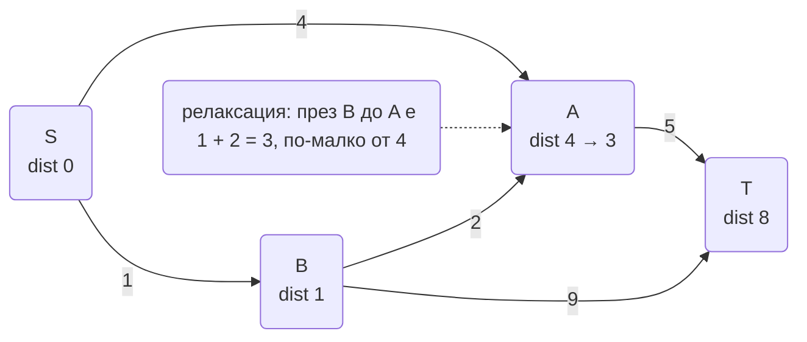
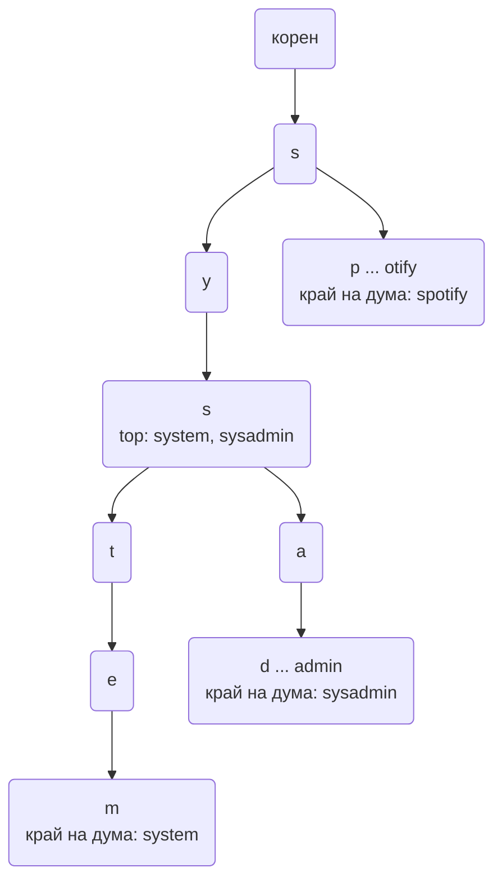
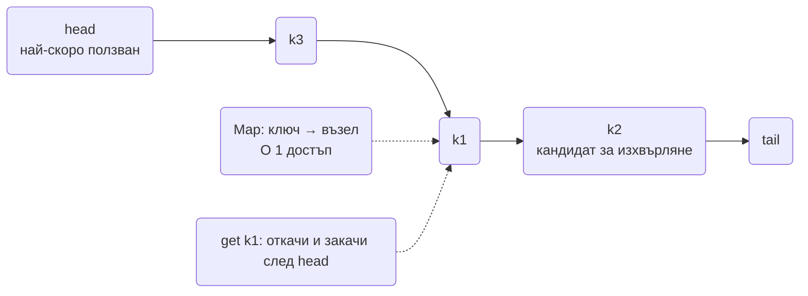

# Алгоритми за интервю: графи, дървета и низове (BFS/DFS, topological sort, Dijkstra, union-find, trie, LRU/LFU кеш, edit distance)

Графите и дърветата са там, където backend интервюто спира да е "напиши функция" и става "моделирай
проблема": зависимости между задачи, социален граф, пътна мрежа, префиксен индекс, кеш с изхвърляне.
Интервюиращият слуша дали разпознаваш, че задачата е граф (и какъв: насочен, тегловен, ацикличен),
дали избираш обхождането по това, което търсиш (най-къс път срещу пълно покритие), и дали знаеш
как структурата се държи при милиони върхове в Node (дълбочина на рекурсията, памет на `Map`).

Всичко долу е TypeScript, изпълним с `node file.ts` на Node 24. Heap-ът от
[основните техники](Algorithms_Core_Patterns.md) се използва в Dijkstra и е включен в съкратен вид.

| Алгоритъм / техника | Когато човек се сеща за него | Сложност | Къде се среща в тази папка |
| --- | --- | --- | --- |
| BFS | Най-къс път по брой стъпки, обхождане по нива, "на колко ръкостискания" | O(V + E) | Социален граф в [News Feed](News_Feed_Timeline.md) |
| DFS | Пълно покритие, цикли, компоненти, backtracking | O(V + E) | Обхождане на файлово дърво в [File Sync](File_Sync_Dropbox_Google_Drive.md) |
| Topological sort | Зависимости, ред на изпълнение, детекция на цикъл в DAG | O(V + E) | DAG-ове в [Job Scheduler](Distributed_Job_Scheduler.md) |
| Dijkstra | Най-къс път с тегла, ETA | O((V + E) log V) | Routing в [Geo](Geo_Proximity_Uber_Yelp.md) |
| Union-Find | Групиране по еквивалентност, свързани компоненти в поток | почти O(1) на операция | Дубликати в [Crawler](Distributed_Web_Crawler.md) |
| Trie | Префикси, автодовършване, маршрутизация по път | O(L) на операция | [Autocomplete](Search_Autocomplete_Typeahead.md) |
| LRU / LFU кеш | Ограничена памет, изхвърляне на най-малко полезното | O(1) на операция | Eviction в [Distributed Cache](Distributed_Cache_Redis.md) |
| Edit distance | Правописни грешки, fuzzy match, diff | O(n × m) | Spelling в [Autocomplete](Search_Autocomplete_Typeahead.md) |
| Rolling hash | Търсене на подниз, граници по съдържание | O(n + m) | Chunking в [File Sync](File_Sync_Dropbox_Google_Drive.md) |
| Обхождане на дърво | JSON структури, йерархии, права | O(n) | ACL на папки в [File Sync](File_Sync_Dropbox_Google_Drive.md) |

## Представяне на граф и BFS

### Задачата

Социална мрежа с 300 милиона потребители трябва да покаже "на колко стъпки от теб е този човек"
(degrees of separation) за двама потребители. Втора класика: най-къс път в лабиринт или в мрежа от
сървъри без тегла.

### Идеята

Графът се пази като **списък на съседи**: `Map<възел, съседи[]>`. Матрица V × V има смисъл само
при плътни графове с малко върхове, защото за 300M потребители е 9 × 10^16 клетки. BFS обхожда по
нива с опашка: първо всички на разстояние 1, после 2, и така. Първото достигане на целта е по
най-краткия път, защото нивата се обработват в ред. Ключът е `visited` да се маркира при **влизане
в опашката**, не при излизане, иначе един връх влиза многократно и паметта експлодира. За реален
социален граф се прави bidirectional BFS от двата края: две вълни с радиус 3 са много по-малки от
една с радиус 6.

### TypeScript

```ts
export type Graph = Map<string, string[]>;

export function buildGraph(edges: Array<[string, string]>, directed = false): Graph {
  const g: Graph = new Map();
  const add = (a: string, b: string) => {
    if (!g.has(a)) g.set(a, []);
    if (!g.has(b)) g.set(b, []);
    g.get(a)!.push(b);
  };
  for (const [a, b] of edges) { add(a, b); if (!directed) add(b, a); }
  return g;
}

// Най-къс път по брой ребра; връща върховете по пътя или null.
export function bfsPath(g: Graph, from: string, to: string): string[] | null {
  const parent = new Map<string, string | null>([[from, null]]);
  const queue: string[] = [from];
  let head = 0;
  while (head < queue.length) {
    const cur = queue[head++];
    if (cur === to) {
      const path: string[] = [];
      for (let v: string | null = cur; v !== null; v = parent.get(v)!) path.push(v);
      return path.reverse();
    }
    for (const nx of g.get(cur) ?? []) {
      if (!parent.has(nx)) { parent.set(nx, cur); queue.push(nx); }
    }
  }
  return null;
}

const social = buildGraph([['ana', 'boris'], ['boris', 'vera'], ['vera', 'georgi'], ['ana', 'dara'], ['dara', 'georgi']]);
console.log(bfsPath(social, 'ana', 'georgi')); // ['ana','dara','georgi'] или през boris/vera, но с дължина 3
console.log(bfsPath(social, 'ana', 'nobody')); // null
```

### Сложност и клопки

- O(V + E) време и памет. `parent` служи и за `visited`, и за възстановяване на пътя.
- Опашка с индекс `head` вместо `queue.shift()`: `shift` е O(n) и прави BFS O(V²) при голям граф.
- При няколко най-къси пътя BFS връща един от тях в зависимост от реда на съседите. Ако редът
  трябва да е детерминистичен, сортирай съседите при построяване.
- За 300M върха графът не е в паметта на един процес; BFS става поредица от заявки "дай съседите
  на този batch" към графовата база, а дълбочината се ограничава до 3-4.

### Варианти, които питат

- Брой острови в матрица (BFS/DFS по клетки, 4 посоки).
- Word ladder: върхове са думите, ребро при една сменена буква.
- Multi-source BFS: всички източници влизат в опашката на ниво 0 (най-близък ресторант до всяка клетка).
- Bidirectional BFS и защо намалява работата експоненциално.

## DFS: итеративно, цикли и компоненти

### Задачата

Проверка дали в граф от зависимости между микросървиси има цикъл (A вика B, B вика C, C вика A), и
броене на свързаните компоненти в граф от акаунти, свързани по общ телефон или карта.

### Идеята

DFS отива на дълбочина по един път, преди да опита следващия. Рекурсивната версия е три реда, но в
Node стекът свършва около 10 000 нива, така че за реален граф се пише **итеративно с явен стек**.
За цикъл в насочен граф не стига `visited`: трябват три цвята, бял (не видян), сив (в текущия път),
черен (завършен). Ребро към сив връх е цикъл. Ребро към черен е просто кръстосано ребро. За
компоненти в ненасочен граф пускаш DFS от всеки непосетен връх и броиш стартовете.

### TypeScript

```ts
type G = Map<string, string[]>;

export function hasCycleDirected(g: G): boolean {
  const state = new Map<string, 0 | 1 | 2>();
  for (const start of g.keys()) {
    if (state.get(start)) continue;
    const stack: Array<[string, number]> = [[start, 0]];
    state.set(start, 1);
    while (stack.length) {
      const frame = stack[stack.length - 1];
      const [node, i] = frame;
      const nbrs = g.get(node) ?? [];
      if (i < nbrs.length) {
        frame[1] = i + 1;
        const nx = nbrs[i];
        const s = state.get(nx) ?? 0;
        if (s === 1) return true;
        if (s === 0) { state.set(nx, 1); stack.push([nx, 0]); }
      } else {
        state.set(node, 2);
        stack.pop();
      }
    }
  }
  return false;
}

export function countComponents(g: G): number {
  const seen = new Set<string>();
  let count = 0;
  for (const start of g.keys()) {
    if (seen.has(start)) continue;
    count++;
    const stack = [start];
    seen.add(start);
    while (stack.length) {
      const cur = stack.pop()!;
      for (const nx of g.get(cur) ?? []) if (!seen.has(nx)) { seen.add(nx); stack.push(nx); }
    }
  }
  return count;
}

const deps: G = new Map([['api', ['auth', 'db']], ['auth', ['db']], ['db', []]]);
console.log(hasCycleDirected(deps)); // false
deps.get('db')!.push('api');
console.log(hasCycleDirected(deps)); // true
const accounts: G = new Map([['a', ['b']], ['b', ['a']], ['c', []], ['d', ['e']], ['e', ['d']]]);
console.log(countComponents(accounts)); // 3
```

### Сложност и клопки

- O(V + E). Итеративният DFS с "frame" (връх + индекс на следващия съсед) възпроизвежда точния ред
  на рекурсивния, включително момента на почерняване, което е нужно за topological sort по
  finishing time.
- Простата итеративна версия със `stack.push(...nbrs)` е достатъчна за достижимост и компоненти, но
  не и за детекция на цикъл в насочен граф, защото не знае кога възел е "завършен".
- В ненасочен граф "цикъл" се открива с DFS, като се игнорира реброто към родителя; трите цвята са
  за насочен граф.
- Граф с милиони върхове: `Map<string, string[]>` е тежка; при числови ID компактният вариант е CSR
  (два типизирани масива: offsets и neighbors).

### Варианти, които питат

- Всички пътища от A до B (backtracking).
- Клониране на граф.
- Оцветяване на граф с два цвята (bipartite) с BFS/DFS.
- Namespace/файлово дърво: DFS с натрупан път за "пълния път на всеки файл".

## Topological sort (Kahn)

### Задачата

Планировчик изпълнява pipeline от задачи с зависимости (извлечи → трансформирай → зареди → изпрати
отчет, като няколко трансформации зависят от едно извличане). Трябва ред на изпълнение, който
уважава зависимостите, и ясна грешка, ако някой е направил цикъл в конфигурацията.

### Идеята

Алгоритъмът на Kahn: преброй входящите ребра на всеки връх. Всички с 0 могат да тръгнат сега и
влизат в опашка. Вадиш връх, "изпълняваш" го, намаляваш входящите на съседите му; който падне на 0,
влиза в опашката. Ако накрая подредените върхове са по-малко от всички, останалите са в цикъл. Бонус:
върховете, които са в опашката едновременно, могат да се изпълняват **паралелно**, тоест същият
алгоритъм дава и нивата на паралелизъм на DAG-а, което е точно каквото прави Airflow.

### TypeScript

```ts
export function topoLevels(deps: Map<string, string[]>): string[][] {
  const indeg = new Map<string, number>();
  const children = new Map<string, string[]>();
  for (const [task, requires] of deps) {
    if (!indeg.has(task)) indeg.set(task, 0);
    for (const r of requires) {
      if (!indeg.has(r)) indeg.set(r, 0);
      indeg.set(task, indeg.get(task)! + 1);
      if (!children.has(r)) children.set(r, []);
      children.get(r)!.push(task);
    }
  }
  const levels: string[][] = [];
  let ready = [...indeg].filter(([, d]) => d === 0).map(([t]) => t).sort();
  let done = 0;
  while (ready.length) {
    levels.push(ready);
    done += ready.length;
    const next: string[] = [];
    for (const t of ready) {
      for (const c of children.get(t) ?? []) {
        const d = indeg.get(c)! - 1;
        indeg.set(c, d);
        if (d === 0) next.push(c);
      }
    }
    ready = next.sort();
  }
  if (done !== indeg.size) throw new Error('cycle detected among: ' + [...indeg].filter(([, d]) => d > 0).map(([t]) => t).join(', '));
  return levels;
}

const pipeline = new Map<string, string[]>([
  ['extract', []],
  ['transform_a', ['extract']],
  ['transform_b', ['extract']],
  ['load', ['transform_a', 'transform_b']],
  ['report', ['load']],
]);
console.log(topoLevels(pipeline)); // [['extract'],['transform_a','transform_b'],['load'],['report']]
```

### Сложност и клопки

- O(V + E) плюс сортиране на нивата за детерминизъм.
- Kahn дава директно нивата за паралелно изпълнение. DFS с finishing time дава един валиден ред,
  но не и нивата.
- Цикъл се разпознава по брой, не по exception по време на обхождане. Съобщението за грешка трябва
  да казва кои задачи са в цикъла, защото това е конфигурационна грешка на потребител.
- Върхове, споменати само като зависимост (без собствен запис), трябва да се добавят с indeg 0,
  иначе се губят.

### Варианти, които питат

- Course schedule: може ли да се вземат всички курсове (има ли цикъл).
- Alien dictionary: извеждане на подредба на букви от сортирани думи.
- Минимално време за завършване на DAG с продължителности (най-дълъг път в DAG).
- Инкрементално преизчисление при промяна на един възел (downstream на възела).

## Dijkstra

### Задачата

ETA на шофьор до пътник по пътна мрежа, в която ребрата са пътни отсечки с време за преминаване.
BFS не работи, защото пътищата имат различни тегла: 3 къси задръстени улици могат да са по-бавни от
1 дълъг булевард.

### Идеята

Dijkstra е BFS, в който опашката е приоритетна по натрупано разстояние. Вадиш най-близкия
неокончателен връх, релаксираш ребрата му (ако през него стигаш по-евтино до съсед, обновяваш).
Работи само за **неотрицателни тегла**, защото разчита, че изваденият връх вече има окончателно
разстояние. В JS няма decrease-key в heap-а, така че се ползва lazy deletion: пушваш нов запис при
всяко подобрение и при pop игнорираш записи, чието разстояние е по-голямо от известното. A* е
Dijkstra с евристика (разстояние по права линия до целта), която насочва търсенето и е стандартът за
пътни мрежи.



### TypeScript

```ts
type Edge = { to: string; w: number };
type WGraph = Map<string, Edge[]>;
type Entry = { node: string; dist: number };

class MinHeap {
  a: Entry[] = [];
  push(e: Entry): void {
    const a = this.a; a.push(e);
    for (let i = a.length - 1; i > 0;) { const p = (i - 1) >> 1; if (a[i].dist >= a[p].dist) break; [a[i], a[p]] = [a[p], a[i]]; i = p; }
  }
  pop(): Entry | undefined {
    const a = this.a; if (!a.length) return undefined;
    const top = a[0]; const last = a.pop()!;
    if (a.length) {
      a[0] = last;
      for (let i = 0;;) {
        const l = 2 * i + 1, r = l + 1; let m = i;
        if (l < a.length && a[l].dist < a[m].dist) m = l;
        if (r < a.length && a[r].dist < a[m].dist) m = r;
        if (m === i) break;
        [a[i], a[m]] = [a[m], a[i]]; i = m;
      }
    }
    return top;
  }
}

export function dijkstra(g: WGraph, source: string): Map<string, number> {
  const dist = new Map<string, number>([[source, 0]]);
  const heap = new MinHeap();
  heap.push({ node: source, dist: 0 });
  while (heap.a.length) {
    const cur = heap.pop()!;
    if (cur.dist > (dist.get(cur.node) ?? Infinity)) continue; // остарял запис
    for (const { to, w } of g.get(cur.node) ?? []) {
      const nd = cur.dist + w;
      if (nd < (dist.get(to) ?? Infinity)) { dist.set(to, nd); heap.push({ node: to, dist: nd }); }
    }
  }
  return dist;
}

const roads: WGraph = new Map([
  ['S', [{ to: 'A', w: 4 }, { to: 'B', w: 1 }]],
  ['B', [{ to: 'A', w: 2 }, { to: 'T', w: 9 }]],
  ['A', [{ to: 'T', w: 5 }]],
  ['T', []],
]);
console.log([...dijkstra(roads, 'S')]); // [['S',0],['A',3],['B',1],['T',8]]
```

### Сложност и клопки

- O((V + E) log V) с двоичен heap. Lazy deletion може да сложи до E записа в heap-а, което е
  приемливо.
- Отрицателни тегла: Bellman-Ford O(V × E) или SPFA. Кажи го, ако питат "какво ако има бонус
  отсечка".
- За карта на град с милиони ребра пълен Dijkstra от нулата е бавен за всяка заявка: реалните
  системи ползват A*, contraction hierarchies или предварително изчислени разстояния между "хъбове".
- Пътят, не само разстоянието: пази `prev` при релаксация и го възстанови от целта назад.

### Варианти, които питат

- Network delay time (максимумът от разстоянията от източника).
- Cheapest flights within K stops (Bellman-Ford с K итерации, защото ограничението по брой стъпки
  чупи Dijkstra).
- Path with minimum effort (Dijkstra, при който "теглото" е максимум по пътя).
- Защо BFS е Dijkstra с единични тегла и защо 0-1 BFS с deque работи за тегла 0 и 1.

## Union-Find (Disjoint Set Union)

### Задачата

Crawler-ът намира двойки почти еднакви страници (SimHash с малко Hamming разстояние) и трябва да
групира всички страници в клъстери от дубликати, докато двойките пристигат в поток. Или: акаунти,
свързани по общ имейл или устройство, трябва да се обединят в един "истински потребител".

### Идеята

Union-Find поддържа множества, които се сливат. Всеки елемент сочи родител; коренът представлява
множеството. `find` следва указателите до корена и по пътя **сплесква** пътеката (path compression),
така че следващото търсене е почти O(1). `union` закача по-малкото дърво под по-голямото (union by
rank/size). Двете оптимизации заедно дават амортизирано почти константно време (обратната функция на
Акерман). За разлика от DFS за компоненти, union-find работи **инкрементално**: не трябва да имаш
целия граф предварително.

### TypeScript

```ts
export class UnionFind {
  private parent = new Map<string, string>();
  private size = new Map<string, number>();

  find(x: string): string {
    if (!this.parent.has(x)) { this.parent.set(x, x); this.size.set(x, 1); return x; }
    let root = x;
    while (this.parent.get(root) !== root) root = this.parent.get(root)!;
    // path compression: всички по пътя сочат директно към корена
    let cur = x;
    while (cur !== root) { const nx = this.parent.get(cur)!; this.parent.set(cur, root); cur = nx; }
    return root;
  }

  union(a: string, b: string): boolean {
    let ra = this.find(a);
    let rb = this.find(b);
    if (ra === rb) return false;
    if (this.size.get(ra)! < this.size.get(rb)!) [ra, rb] = [rb, ra];
    this.parent.set(rb, ra);
    this.size.set(ra, this.size.get(ra)! + this.size.get(rb)!);
    return true;
  }

  groups(): string[][] {
    const byRoot = new Map<string, string[]>();
    for (const x of this.parent.keys()) {
      const r = this.find(x);
      if (!byRoot.has(r)) byRoot.set(r, []);
      byRoot.get(r)!.push(x);
    }
    return [...byRoot.values()];
  }
}

const uf = new UnionFind();
for (const [a, b] of [['p1', 'p2'], ['p2', 'p3'], ['p7', 'p8'], ['p3', 'p1']]) uf.union(a, b);
uf.find('p9');
console.log(uf.groups().map((g) => g.sort())); // [['p1','p2','p3'],['p7','p8'],['p9']]
console.log(uf.find('p3') === uf.find('p1'), uf.find('p3') === uf.find('p7')); // true false
```

### Сложност и клопки

- Амортизирано O(α(n)) на операция, практически константа. Памет O(n).
- Без path compression дървото може да дегенерира в списък и `find` става O(n).
- `union` връщащо `false` при вече свързани е удобно за Kruskal (минимално покриващо дърво) и за
  детекция на цикъл в ненасочен граф: ребро между вече свързани върхове е цикъл.
- Union-find не поддържа **разделяне**. Ако връзките могат да изчезват (акаунт е бил грешно свързан),
  трябва пълно преизграждане или offline алгоритъм.

### Варианти, които питат

- Брой провинции / приятелски кръгове.
- Accounts merge (имейли като елементи, акаунтите като union-и).
- Redundant connection: първото ребро, което затваря цикъл.
- Kruskal MST: сортирай ребрата, union ако не са свързани.

## Trie

### Задачата

Autocomplete: при всяко натискане на клавиш върни думите с този префикс. Втора употреба: рутер по
URL пътеки или IP префикси (longest prefix match).

### Идеята

Trie е дърво, в което всеки възел е символ, а пътят от корена е префикс. Търсенето на префикс е
O(L) за дължина на префикса, независимо от броя думи. Изброяването на всички думи под възел е DFS
от него. За реален autocomplete под всеки възел се пази **готов top-K**, така че отговорът е O(L)
без DFS (виж [Autocomplete](Search_Autocomplete_Typeahead.md)). Цената е памет: всеки възел е обект
с `Map` от деца, което за милиони думи е гигабайти; компромисите са компресиран trie (radix tree)
или сортиран масив + binary search за префикс (O(log n) вместо O(L), но много по-компактен).



### TypeScript

```ts
class TrieNode {
  children = new Map<string, TrieNode>();
  terminal = false;
  weight = 0;
}

export class Trie {
  private root = new TrieNode();

  insert(word: string, weight = 1): void {
    let node = this.root;
    for (const ch of word) {
      let next = node.children.get(ch);
      if (!next) { next = new TrieNode(); node.children.set(ch, next); }
      node = next;
    }
    node.terminal = true;
    node.weight = weight;
  }

  has(word: string): boolean {
    const n = this.walk(word);
    return n !== null && n.terminal;
  }

  // Всички думи с този префикс, подредени по тежест, най-много limit.
  suggest(prefix: string, limit = 5): string[] {
    const start = this.walk(prefix);
    if (!start) return [];
    const found: Array<[string, number]> = [];
    const stack: Array<[TrieNode, string]> = [[start, prefix]];
    while (stack.length) {
      const [node, acc] = stack.pop()!;
      if (node.terminal) found.push([acc, node.weight]);
      for (const [ch, child] of node.children) stack.push([child, acc + ch]);
    }
    return found.sort((a, b) => b[1] - a[1] || a[0].localeCompare(b[0])).slice(0, limit).map(([w]) => w);
  }

  private walk(s: string): TrieNode | null {
    let node = this.root;
    for (const ch of s) {
      const next = node.children.get(ch);
      if (!next) return null;
      node = next;
    }
    return node;
  }
}

const trie = new Trie();
for (const [w, c] of [['system design', 40], ['sysadmin', 12], ['spotify', 25], ['symptoms', 30]] as Array<[string, number]>) trie.insert(w, c);
console.log(trie.suggest('sy', 2)); // ['system design','symptoms']
console.log(trie.has('spot'), trie.has('spotify')); // false true
```

### Сложност и клопки

- `insert`/`has`/`walk` са O(L). `suggest` с DFS е O(размер на поддървото), затова в продукция
  top-K се пресмята предварително на всеки възел.
- `for (const ch of word)` итерира по code points, така че емоджи и кирилица не се чупят; `word[i]`
  би разделило сурогатни двойки.
- Нормализация преди вмъкване (lowercase, диакритика), иначе "System" и "system" са две пътеки.
- Памет: `Map` на възел е десетки байтове overhead. За латиница често се ползва масив с 26 слота,
  за Unicode остава `Map`; radix tree слива веригите с едно дете.

### Варианти, които питат

- Longest prefix match за IP маршрутизация (binary trie по битове).
- Word search II: trie + DFS по матрица от букви.
- Replace words с най-краткия корен от речник.
- Trie срещу hash set за "съществува ли думата": set е O(L) също, но trie дава и префиксите.

## LRU и LFU кеш

### Задачата

Кеш с капацитет N записа в паметта на процеса: при пълен кеш се маха най-отдавна неползваният (LRU)
или най-рядко ползваният (LFU). И `get`, и `set` трябва да са O(1). Това е най-често задаваната
задача за backend роли, защото е това, което Redis прави с `maxmemory-policy`.

### Идеята

LRU в JavaScript има "евтин" отговор: `Map` пази реда на вмъкване, така че при достъп изтриваш и
слагаш отново ключа (той отива в края), а най-старият е `map.keys().next()`. И двете са O(1). Пълният
отговор, който показва, че знаеш механизма: хеш карта от ключ към възел в **двусвързан списък**;
достъп мести възела в началото за O(1), изхвърляне маха опашката. LFU е по-труден: пазиш честота на
всеки ключ и за всяка честота отделен LRU списък; при изхвърляне взимаш списъка на минималната
честота. Минималната честота се поддържа с един брояч, защото при увеличение на честота на ключ
новата минимална честота е или същата, или старата + 1.



### TypeScript

```ts
// Вариант 1: Map с ред на вмъкване.
export class LruMap<K, V> {
  private map = new Map<K, V>();
  constructor(private_capacity: number) { this.capacity = private_capacity; }
  capacity: number;
  get(key: K): V | undefined {
    if (!this.map.has(key)) return undefined;
    const v = this.map.get(key)!;
    this.map.delete(key); this.map.set(key, v);
    return v;
  }
  set(key: K, value: V): void {
    if (this.map.has(key)) this.map.delete(key);
    else if (this.map.size >= this.capacity) this.map.delete(this.map.keys().next().value!);
    this.map.set(key, value);
  }
}

// Вариант 2: двусвързан списък + Map, механизмът зад Redis LRU и всеки учебник.
type Node<K, V> = { key: K; value: V; prev: Node<K, V> | null; next: Node<K, V> | null };
export class LruList<K, V> {
  private map = new Map<K, Node<K, V>>();
  private head: Node<K, V> | null = null;
  private tail: Node<K, V> | null = null;
  capacity: number;
  constructor(capacity: number) { this.capacity = capacity; }
  private unlink(n: Node<K, V>): void {
    if (n.prev) n.prev.next = n.next; else this.head = n.next;
    if (n.next) n.next.prev = n.prev; else this.tail = n.prev;
    n.prev = n.next = null;
  }
  private pushFront(n: Node<K, V>): void {
    n.next = this.head; if (this.head) this.head.prev = n;
    this.head = n; if (!this.tail) this.tail = n;
  }
  get(key: K): V | undefined {
    const n = this.map.get(key);
    if (!n) return undefined;
    this.unlink(n); this.pushFront(n);
    return n.value;
  }
  set(key: K, value: V): void {
    const existing = this.map.get(key);
    if (existing) { existing.value = value; this.unlink(existing); this.pushFront(existing); return; }
    if (this.map.size >= this.capacity && this.tail) { this.map.delete(this.tail.key); this.unlink(this.tail); }
    const n: Node<K, V> = { key, value, prev: null, next: null };
    this.pushFront(n); this.map.set(key, n);
  }
}

const lru = new LruList<string, number>(2);
lru.set('a', 1); lru.set('b', 2); lru.get('a'); lru.set('c', 3);
console.log(lru.get('a'), lru.get('b'), lru.get('c')); // 1 undefined 3
const lm = new LruMap<string, number>(2);
lm.set('a', 1); lm.set('b', 2); lm.get('a'); lm.set('c', 3);
console.log(lm.get('a'), lm.get('b'), lm.get('c')); // 1 undefined 3
```

### Сложност и клопки

- O(1) за `get` и `set` в двата варианта. Памет O(capacity) плюс overhead на възел (списъкът е
  около 2 указателя повече на запис).
- `Map` вариантът е валиден и бърз в V8, но ако кажеш само него, интервюиращият ще попита "а без
  Map с подредба?". Затова знай и списъка.
- `set` на съществуващ ключ трябва да го **опреснява**, иначе презаписан ключ се изхвърля като стар.
- Redis не прави точен LRU, а семплира 5 ключа и маха най-стария от тях (approximated LRU), защото
  точният списък струва памет на всеки ключ. Кажи го при връзката с
  [Distributed Cache](Distributed_Cache_Redis.md).
- LFU: при равна честота се маха най-старият в този frequency bucket; нов ключ влиза с честота 1 и
  `minFreq = 1`.

### Варианти, които питат

- LFU cache с O(1) (честотни bucket-и, всеки е LRU списък).
- LRU с TTL (проверка при `get` и лениво изтриване, плюс периодичен reaper).
- Thread-safe LRU в многонишков език и защо в Node не е нужно (една нишка), но е нужно при
  `worker_threads` със споделена памет.
- Кеш с размер по байтове вместо по брой (сумирай размера на стойностите).

## Edit distance (Levenshtein)

### Задачата

Autocomplete получава "sytem" и трябва да предложи "system". Или дедупликация на адреси/имена с
правописни разлики. Колко операции (вмъкване, изтриване, замяна) делят два низа?

### Идеята

Класическо динамично програмиране: `dp[i][j]` е разстоянието между първите i символа на A и
първите j на B. Ако последните символи съвпадат, `dp[i][j] = dp[i-1][j-1]`; иначе 1 + минимумът от
трите операции. Таблицата е n × m, но всеки ред зависи само от предишния, така че паметта е O(min(n,m))
с два реда. За търсене на "най-близките думи в речник" пълно сравнение с всяка дума е твърде бавно;
там се ползва BK-tree или ограничение "най-много 2 грешки" с ранно прекъсване.

### TypeScript

```ts
export function editDistance(a: string, b: string): number {
  if (a.length < b.length) [a, b] = [b, a];
  let prev = Array.from({ length: b.length + 1 }, (_, j) => j);
  let cur = new Array<number>(b.length + 1).fill(0);
  for (let i = 1; i <= a.length; i++) {
    cur[0] = i;
    for (let j = 1; j <= b.length; j++) {
      const sub = prev[j - 1] + (a[i - 1] === b[j - 1] ? 0 : 1);
      cur[j] = Math.min(sub, prev[j] + 1, cur[j - 1] + 1);
    }
    [prev, cur] = [cur, prev];
  }
  return prev[b.length];
}

export function closest(query: string, dictionary: string[], maxDistance = 2): string[] {
  return dictionary
    .map((w) => [w, editDistance(query, w)] as [string, number])
    .filter(([, d]) => d <= maxDistance)
    .sort((x, y) => x[1] - y[1] || x[0].localeCompare(y[0]))
    .map(([w]) => w);
}

console.log(editDistance('kitten', 'sitting')); // 3
console.log(editDistance('sytem', 'system')); // 1
console.log(closest('sytem', ['system', 'stem', 'symptom', 'item', 'systems'])); // ['stem','system','item','systems']
```

### Сложност и клопки

- O(n × m) време, O(min(n, m)) памет с два реда.
- Ранно прекъсване: ако разликата в дължините е над лимита, разстоянието е поне толкова, не смятай.
- Damerau-Levenshtein брои и размяна на съседни символи като една операция, което е по-близко до
  реалните правописни грешки ("teh").
- За речник от милиони думи: BK-tree (дърво по метрика) или предварително генерирани "изтривания"
  (SymSpell) вместо линейно сравнение.

### Варианти, които питат

- Longest common subsequence (същата DP таблица с друга рекуренция) и diff между два файла.
- One edit distance за O(n) без таблица.
- Възстановяване на самите операции (пази посоката на минимума).
- Fuzzy search с n-грами като бърз преден филтър преди edit distance.

## Rolling hash (Rabin-Karp)

### Задачата

Намери всички срещания на подниз в голям текст без да сравняваш символ по символ на всяка позиция.
По-важно за backend: определи границите на блокове по съдържание при файлова синхронизация, така че
вмъкване в началото на файла да не измести всички блокове (виж
[File Sync](File_Sync_Dropbox_Google_Drive.md)).

### Идеята

Хешът на прозорец с дължина m се обновява за O(1), когато прозорецът се плъзне с един символ:
изваждаш приноса на излизащия символ, умножаваш по базата, добавяш новия. Така сравняваш хешове за
O(1) на позиция и правиш пълно сравнение само при съвпадение (за да изключиш колизии). При
content-defined chunking същият rolling hash се смята върху прозорец от байтове и границата е
там, където `hash mod 2^k === 0`, което зависи само от локалното съдържание, не от позицията.

### TypeScript

```ts
const BASE = 257n;
const MOD = 1_000_000_007n;

export function rabinKarp(text: string, pattern: string): number[] {
  const m = pattern.length;
  if (m === 0 || m > text.length) return [];
  const code = (s: string, i: number) => BigInt(s.charCodeAt(i));
  let power = 1n;
  for (let i = 1; i < m; i++) power = (power * BASE) % MOD;
  let hp = 0n;
  let ht = 0n;
  for (let i = 0; i < m; i++) {
    hp = (hp * BASE + code(pattern, i)) % MOD;
    ht = (ht * BASE + code(text, i)) % MOD;
  }
  const hits: number[] = [];
  for (let i = 0; ; i++) {
    if (ht === hp && text.startsWith(pattern, i)) hits.push(i);
    if (i + m >= text.length) break;
    ht = ((ht - code(text, i) * power) % MOD + MOD) % MOD;
    ht = (ht * BASE + code(text, i + m)) % MOD;
  }
  return hits;
}

// Content-defined chunk boundaries: граница, когато rolling hash на прозореца завършва на k нули.
export function chunkBoundaries(bytes: Uint8Array, windowSize = 4, maskBits = 3): number[] {
  const mask = (1 << maskBits) - 1;
  const bounds: number[] = [];
  let h = 0;
  for (let i = 0; i < bytes.length; i++) {
    h = (h * 31 + bytes[i]) >>> 0;
    if (i >= windowSize) h = (h - bytes[i - windowSize] * (31 ** windowSize)) >>> 0;
    if (i >= windowSize - 1 && (h & mask) === 0) bounds.push(i + 1);
  }
  return bounds;
}

console.log(rabinKarp('abracadabra', 'abra')); // [0, 7]
console.log(chunkBoundaries(new TextEncoder().encode('the quick brown fox jumps over the lazy dog')).length > 0); // true
```

### Сложност и клопки

- Средно O(n + m), най-лошо O(n × m) при много колизии; голям прост модул го прави практически
  невъзможно.
- В JS числата губят точност над 2^53, затова хешът е с `BigInt` или с 32-битова аритметика през
  `>>> 0`. `BigInt` е бавен в горещ цикъл; за продукция е 32-битов hash (или Buffer + native код).
- Изваждането по модул трябва да остане неотрицателно: `((x % MOD) + MOD) % MOD`.
- При chunking `31 ** windowSize` е константа, при реален Rabin fingerprint се ползва полином над
  GF(2) и таблици; принципът е същият.

### Варианти, които питат

- Повтарящи се ДНК последователности с дължина 10 (хеш на всеки прозорец в `Set`).
- Longest duplicate substring: binary search по дължина + rolling hash.
- KMP като детерминистична алтернатива с префиксна функция за O(n + m) гарантирано.
- Min/max chunk size при content-defined chunking и защо е нужен (без min всеки байт може да е граница).

## Дървета: обхождане, BST, сериализация, LCA

### Задачата

API връща йерархия от категории като вложен JSON; трябва обхождане по нива за UI, проверка, че
дърво от ID-та е валидно двоично търсещо дърво, и сериализация/десериализация, която пази формата.
Плюс класиката: най-близък общ предшественик на два възела (например най-близката обща папка за две
файла при проверка на права).

### Идеята

Три рекурсивни обхождания (pre/in/post-order) и едно по нива (BFS). In-order на BST дава сортиран
ред, така че валидността се проверява с обхождане и сравнение със предишния елемент, или рекурсивно
с граници (min, max) за всеки възел. Сериализация с pre-order и маркер за `null` е обратима без
двусмислие. LCA в двоично дърво: рекурсивно, ако двата възела са в различни поддървета, текущият е
отговорът; в BST е по-просто, следваш стойностите. За дълбоки дървета в Node обхождането е
итеративно с явен стек.

### TypeScript

```ts
export type TreeNode = { val: number; left: TreeNode | null; right: TreeNode | null };

const node = (val: number, left: TreeNode | null = null, right: TreeNode | null = null): TreeNode => ({ val, left, right });

export function levelOrder(root: TreeNode | null): number[][] {
  const out: number[][] = [];
  let level = root ? [root] : [];
  while (level.length) {
    out.push(level.map((n) => n.val));
    level = level.flatMap((n) => [n.left, n.right].filter((c): c is TreeNode => c !== null));
  }
  return out;
}

export function isValidBst(root: TreeNode | null, min = -Infinity, max = Infinity): boolean {
  if (!root) return true;
  if (root.val <= min || root.val >= max) return false;
  return isValidBst(root.left, min, root.val) && isValidBst(root.right, root.val, max);
}

export function serialize(root: TreeNode | null): string {
  const parts: string[] = [];
  const walk = (n: TreeNode | null): void => { if (!n) { parts.push('#'); return; } parts.push(String(n.val)); walk(n.left); walk(n.right); };
  walk(root);
  return parts.join(',');
}

export function deserialize(s: string): TreeNode | null {
  const parts = s.split(',');
  let i = 0;
  const build = (): TreeNode | null => {
    const p = parts[i++];
    if (p === '#') return null;
    return node(Number(p), build(), build());
  };
  return build();
}

export function lca(root: TreeNode | null, a: number, b: number): TreeNode | null {
  if (!root || root.val === a || root.val === b) return root;
  const l = lca(root.left, a, b);
  const r = lca(root.right, a, b);
  return l && r ? root : l ?? r;
}

const bst = node(8, node(3, node(1), node(6)), node(10, null, node(14)));
console.log(levelOrder(bst)); // [[8],[3,10],[1,6,14]]
console.log(isValidBst(bst), isValidBst(node(5, node(7), null))); // true false
console.log(serialize(deserialize(serialize(bst))) === serialize(bst)); // true
console.log(lca(bst, 1, 6)?.val, lca(bst, 6, 14)?.val); // 3 8
```

### Сложност и клопки

- Всички са O(n) време. Рекурсивните версии са O(h) стек, което при изродено дърво (списък) е
  O(n) и в Node пада при около 10^4 възела; итеративният вариант с явен стек решава това.
- BST валидност само с `left.val < val < right.val` за всеки възел е **грешна**: трябва глобалните
  граници (правнук отляво може да е по-голям от дядото).
- Дубликати в BST: реши предварително дали са позволени и от коя страна отиват.
- Сериализацията с `#` за null е еднозначна; сериализация само на стойностите (без null) не е.

### Варианти, които питат

- Максимална дълбочина, диаметър, балансирано ли е дървото (post-order с височини).
- Zigzag level order, right side view (BFS с ниво).
- K-тият най-малък в BST (in-order с брояч).
- Възстановяване на дърво от pre-order и in-order.

## Въпроси за интервюто

### Как избираш между BFS и DFS?

BFS за най-къс път по брой стъпки и за "обхождане по близост" (нива, най-близкия от нещо). DFS за
пълно покритие, компоненти, цикли, backtracking и за дървовидни структури, където паметта на
опашката при BFS би била широчината на дървото. При еднакъв резултат избери това, чиято памет е
по-малка за формата на графа: BFS пази ниво, DFS пази път.

### Рекурсия или итерация в Node за графи?

Итерация с явен стек, винаги когато дълбочината не е ограничена по конструкция. Node пада около
10 000-15 000 рекурсивни нива, а граф с 100 000 върха във верига е реален (списък с зависимости,
дълга редица от коментари). `--stack-size` е кръпка, не решение.

### Защо Dijkstra не работи с отрицателни тегла?

Защото маркира връх като окончателен в момента на изваждане, разчитайки, че никой по-дълъг път не
може да стане по-кратък. Отрицателно ребро нарушава това. Bellman-Ford релаксира всички ребра V-1
пъти и хваща и отрицателни цикли.

### Topological sort или просто DFS?

Kahn (BFS с indegree) дава нивата за паралелно изпълнение и ясно разпознава цикъл по брой обработени
върхове. DFS с обратен finishing order дава един валиден ред и е по-кратък за писане. За планировчик
Kahn е по-полезен, защото "какво може да тръгне сега" е точно опашката с indegree 0.

### Union-Find или DFS за компоненти?

DFS, когато имаш целия граф и го обхождаш веднъж. Union-Find, когато ребрата пристигат в поток или
задаваш "свързани ли са" много пъти между добавяния. Union-Find не може да маха ребра.

### LRU с `Map` е ли "истински" отговор?

Да, за JavaScript е идиоматичен и O(1). Но интервюиращият проверява дали знаеш механизма, който
работи във всеки език и в Redis: двусвързан списък плюс хеш карта. Кажи първо `Map`, после покажи
списъка, после спомени approximated LRU в Redis.

### Кога trie е по-лош избор от сортиран масив?

При голям речник и рядка промяна: сортиран масив от думи с binary search за префикс е O(log n) на
търсене и в пъти по-компактен, а изброяването на префикс е обхождане на съседни елементи. Trie печели,
когато ти трябват честа вмъкване, top-K на възел или префикси по битове (IP маршрутизация).

### Как обясняваш edit distance за 30 секунди?

Таблица, в която клетка (i, j) е разстоянието между първите i и j символа; идва от три съседни
клетки плюс една операция, или диагонално без цена при равни символи. Две редици стигат вместо
цяла таблица. За речник не сравняваш с всичко, а филтрираш по дължина и n-грами или ползваш BK-tree.
