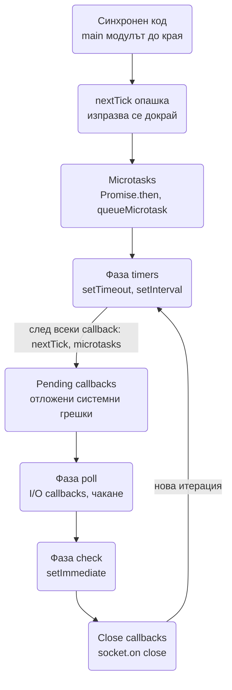
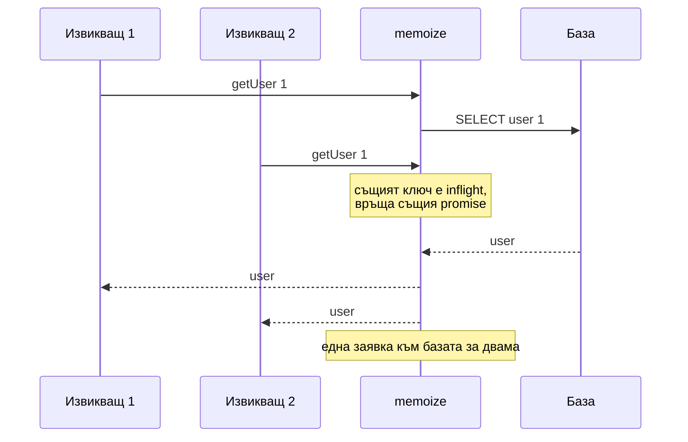

# JavaScript и Node.js алгоритмични въпроси (event loop, debounce/throttle, promise pool, retry, memoize, EventEmitter, Promise.all отвътре, generators, deep clone)

Тези задачи се дават на Node.js интервю за senior позиция не за да провалят кандидата с trivia, а за
да видят дали разбира **как работи средата**, в която пише всеки ден: кога се изпълнява един
callback, защо `Promise.all` над 10 000 заявки е самопричинен DDoS, защо `0.1 + 0.2` не е `0.3` и
какво се случва с `this`, когато метод се подаде като callback. Всяка от тях има директно съответствие
в системите от тази папка: debounce е клиентската страна на [Autocomplete](Search_Autocomplete_Typeahead.md),
single-flight е защитата от cache stampede в [Distributed Cache](Distributed_Cache_Redis.md), promise
pool е bulkhead в код.

Кодът е TypeScript, който се изпълнява директно с `node file.ts` на Node 24 (type stripping, без
build). Примерите с време са направени така, че да печатат стабилен резултат.

| Алгоритъм | Проблемът, който решава | Сложност / памет | Къде се среща в тази папка |
| --- | --- | --- | --- |
| Event loop подредба | Кога се изпълнява callback: nextTick, microtask, timer, I/O, immediate | - | Всеки Node сървис; [Node.js архитектурни патерни](Design_Patterns_Node_Architecture.md) |
| Debounce / throttle | Много събития, малко реални действия | O(1), един таймер | [Autocomplete](Search_Autocomplete_Typeahead.md), [Online Trading Game](Online_Trading_Game.md) (coalescing на фреймове) |
| Promise pool | Ограничена паралелност над списък от задачи | O(limit) едновременни | Bulkhead в [Node.js архитектурни патерни](Design_Patterns_Node_Architecture.md), [Notification System](Notification_system.md) |
| Retry + AbortSignal | Повторни опити само за преходни грешки, с таймаут | O(attempts) | [Notification System](Notification_system.md), [Payment](Payment_System_Stripe_Wallet.md) |
| Memoize + single-flight | Дедупликация на едновременни еднакви извиквания | O(ключове) памет | [Distributed Cache](Distributed_Cache_Redis.md), [URL Shortener](URL_Shortener.md) (stampede) |
| Promise комбинатори отвътре | Какво реално прави `Promise.all`, `race`, `any`, `allSettled` | O(n) | Scatter-gather в [Search Engine](Search_Engine_Inverted_Index.md), [Geo](Geo_Proximity_Uber_Yelp.md) |
| Типизиран EventEmitter | Domain events в процеса, `once` като promise | O(слушатели) | Observer в [Behavioral патерни](Design_Patterns_Behavioral.md), [Chat](Chat_system_WhatsApp_Slack%20_Messenger.md) |
| Async generators | Пагинация и streaming без да се събира всичко в паметта | O(1) на елемент | Streams в [Node.js архитектурни патерни](Design_Patterns_Node_Architecture.md), [Message Queue](Distributed_Message_Queue_Kafka.md) |
| Deep clone / deep equal | Копие и сравнение на вложени структури с цикли | O(n) | Snapshots в [Online Trading Game](Online_Trading_Game.md), тестове |
| `this` и closures | Загубен контекст в callback | - | Всеки клас с callback-и |
| Sort компаратор | Числа и локали се сортират грешно по подразбиране | O(n log n), стабилен | Класации в [Online Trading Game](Online_Trading_Game.md), [News Feed](News_Feed_Timeline.md) |
| BigInt и пари | Number е точен до 2^53, float не е за пари | - | [Payment](Payment_System_Stripe_Wallet.md), Snowflake ID в [Алгоритми](Algorithms_Distributed_Systems.md) |

## Event loop: в какъв ред се изпълнява

### Задачата

Класическият въпрос "какво ще отпечата това" със смес от синхронен код, `process.nextTick`,
`Promise.then`, `setTimeout(fn, 0)`, `setImmediate` и I/O callback. Отговорът проверява дали знаеш
фазите на libuv и двете опашки, които Node изпразва между тях. Има и уловка, която малцина знаят:
отговорът за `nextTick` срещу `Promise.then` в main модула е различен за CommonJS и за ESM.

### Идеята

Една итерация на event loop минава през фази: **timers** (изтекли `setTimeout`/`setInterval`),
**pending callbacks**, **poll** (I/O callbacks, тук процесът чака, ако няма нищо друго), **check**
(`setImmediate`), **close callbacks**. След **всеки** callback Node изпразва първо опашката на
`process.nextTick`, после microtask опашката (`Promise.then`, `queueMicrotask`), докато и двете не
се изпразнят. Затова nextTick и промисите винаги са преди всеки timer, а вътре в callback nextTick е
преди промисите.

Изключението е **top-level кодът на ESM модул**: той самият се изпълнява по време на microtask
checkpoint (модулната евалуация е promise), така че вече заредените microtasks вървят преди Node да
стигне до nextTick опашката. В CommonJS main модулът е обикновен макротаск и nextTick е първи.
Примерът долу е ESM (`import`), затова печата `Promise.then` преди `nextTick` в main, а вътре в I/O
callback-а редът е "нормалният".



### TypeScript

```ts
import { readFile } from 'node:fs';

const order: string[] = [];
order.push('1 синхронен код');
setTimeout(() => {
  order.push('5 setTimeout 0, фаза timers');
  readFile(import.meta.filename, onRead);          // I/O тръгва оттук, за да е редът стабилен
}, 0);
function onRead() {
  order.push('6 I/O callback, фаза poll');
  setTimeout(() => order.push('10 setTimeout от I/O, следваща итерация'), 0);
  setImmediate(() => order.push('9 setImmediate от I/O, фаза check в същата итерация'));
  Promise.resolve().then(() => order.push('8 Promise.then в I/O, след nextTick'));
  process.nextTick(() => order.push('7 nextTick в I/O, преди microtasks и преди да се напусне callback-ът'));
  setTimeout(() => console.log(order.join('\n')), 20);
}
Promise.resolve().then(() => order.push('3 Promise.then: в ESM main минава преди nextTick'));
process.nextTick(() => order.push('4 nextTick: в CommonJS main би бил преди Promise.then'));
order.push('2 край на синхронния код');
```

### Сложност и клопки

- `setTimeout(fn, 0)` и `setImmediate` в main модула са в **недефиниран** ред: зависи дали е минала
  1 ms до влизане във фазата timers. Вътре в I/O callback редът е винаги immediate преди timeout,
  защото check фазата идва преди следващите timers. Затова примерът сравнява двете само в I/O, а
  четенето на файла тръгва от timer callback, иначе на бърз диск то може да завърши преди 1 ms и да
  изпревари timer-а.
- `process.nextTick` в цикъл **гладува** I/O: опашката се изпразва докрай преди loop-ът да продължи,
  така че рекурсивен nextTick никога не пуска poll фазата. За "изпълни след текущия callback, но не
  блокирай I/O" се ползва `setImmediate`.
- `await` е `Promise.then`: всичко след `await` е microtask, не се изпълнява веднага дори промисът да
  е resolved.
- Проверката е лесна: същият код като `.cjs` печата nextTick преди then в main; като `.mjs` или `.ts`
  с `import` печата обратното. Вътре в timer или I/O callback редът е винаги nextTick, then, и в двата
  формата. Ако интервюиращият пита "кое е първо", верният отговор започва с "зависи къде сме".
- Дълга синхронна работа (JSON.parse на 50 MB, сортиране на милион елемента) блокира всички фази.
  Метриката е event loop lag (`perf_hooks.monitorEventLoopDelay`), а решението е worker thread или
  разбиване на партиди с `setImmediate` между тях.

### Варианти, които питат

- "Защо `setTimeout(fn, 1)` и `setTimeout(fn, 0)` са едно и също?" Node закръгля под 1 ms до 1 ms.
- "Как да изпълниш CPU-тежка задача без да блокираш?" `worker_threads`, или отделен процес; не
  `setTimeout`, който само отлага блокирането.
- "Какво прави `await null` в цикъл?" Отстъпва на microtask опашката, но **не** на I/O; за да
  пуснеш I/O, чакаш `setImmediate` през promise.

## Debounce и throttle

### Задачата

Autocomplete праща заявка на всеки клавиш: 20 заявки за една дума. Ценови feed идва на 250 ms, а
екранът се обновява при всеки фрейм. Трябват две различни ограничения: "изпълни само след като
потокът спре" (debounce) и "изпълни най-много веднъж на интервал, но никога не губи последната
стойност" (throttle).

### Идеята

Debounce нулира таймер при всяко събитие и изпълнява функцията чак когато мине пауза без събития;
опция `leading` изпълнява веднага при първото и после мълчи. Throttle изпълнява веднага и после
пропуска, но пази **последния** аргумент и го изпълнява в края на интервала, иначе последният кадър
(текущата цена, финалната позиция на скрола) се губи.

### TypeScript

```ts
import { setTimeout as sleep } from 'node:timers/promises';

function debounce<A extends unknown[]>(fn: (...args: A) => void, ms: number, opts: { leading?: boolean } = {}) {
  let timer: ReturnType<typeof setTimeout> | undefined;
  let pending: A | undefined;
  return (...args: A) => {
    if (opts.leading && !timer) fn(...args); else pending = args;
    clearTimeout(timer);
    timer = setTimeout(() => {
      timer = undefined;
      if (pending) { fn(...pending); pending = undefined; }
    }, ms);
  };
}

function throttle<A extends unknown[]>(fn: (...args: A) => void, ms: number) {
  let last = -Infinity;
  let trailing: A | undefined;
  let timer: ReturnType<typeof setTimeout> | undefined;
  return (...args: A) => {
    const now = Date.now();
    if (now - last >= ms) { last = now; fn(...args); return; }
    trailing = args;                          // последната стойност не бива да се загуби
    timer ??= setTimeout(() => {
      timer = undefined;
      last = Date.now();
      if (trailing) { fn(...trailing); trailing = undefined; }
    }, ms - (now - last));
  };
}

const searched: string[] = [];
const search = debounce((q: string) => searched.push(`search(${q})`), 50);
for (const q of ['s', 'sy', 'sys']) { search(q); await sleep(10); }
await sleep(80);

const painted: number[] = [];
const paint = throttle((price: number) => painted.push(price), 50);
for (let price = 100; price < 110; price++) { paint(price); await sleep(10); }
await sleep(80);
console.log('debounce: 3 клавиша ->', searched);
console.log('throttle: 10 цени ->', painted, '(първата, по една на 50 ms и последната)');
```

### Сложност и клопки

- O(1) памет и един таймер на инстанция. Инстанцията трябва да е **една** за източника: debounce,
  създаден вътре в handler-а, е нов таймер при всяко събитие и не прави нищо.
- Debounce на сървъра губи заявки по дизайн; за писане в база това е грешно, там се ползва
  батчинг с флъш по време или размер.
- Throttle без trailing извикване е причината за "цената на екрана изостава от реалната" и за
  "скролът спира на грешна позиция".
- `Date.now()` подскача при NTP корекция; за интервали на сървър е по-безопасно `performance.now()`.

### Варианти, които питат

- "Разликата между debounce и throttle с една фраза": debounce чака тишина, throttle гарантира
  максимална честота.
- "Coalescing на съобщения към бавен клиент": throttle по ключ (по един последен фрейм на канал),
  точно това е `coalescible` фрейм в [Online Trading Game](Online_Trading_Game.md).
- "Как се тества?" С инжектиран часовник или fake timers, никога с реално `sleep` в unit тест.

## Promise pool: ограничена паралелност

### Задачата

Трябва да се обработят 10 000 URL-а. `Promise.all(urls.map(fetch))` стартира 10 000 връзки за една
милисекунда: изчерпва файлови дескриптори, удря rate limit-а на отсрещната страна и събаря собствения
event loop с 10 000 едновременни отговора.

### Идеята

N worker-а теглят от общ индекс. Индексът се взима **синхронно** (`next++`), преди първия `await`,
затова няма race между worker-ите, макар да няма локове. Резултатите се записват по индекс, за да се
запази редът на входа.

### TypeScript

```ts
import { setTimeout as sleep } from 'node:timers/promises';

async function mapWithConcurrency<T, R>(items: T[], limit: number, fn: (item: T, index: number) => Promise<R>): Promise<R[]> {
  const results = new Array<R>(items.length);
  let next = 0;
  const worker = async () => {
    while (next < items.length) {
      const i = next++;                       // синхронно, преди await: worker-ите не се състезават за индекс
      results[i] = await fn(items[i], i);
    }
  };
  await Promise.all(Array.from({ length: Math.min(limit, items.length) }, worker));
  return results;
}

let inFlight = 0, peak = 0;
const squares = await mapWithConcurrency([...Array(12).keys()], 3, async (n) => {
  peak = Math.max(peak, ++inFlight);
  await sleep(5 + (n % 3) * 5);               // различна продължителност, редът на резултата е пак по вход
  inFlight--;
  return n * n;
});
console.log(squares.join(','), '| пикова паралелност:', peak);
```

### Сложност и клопки

- Паметта за резултати е O(n), паралелността O(limit). При много големи входове се комбинира с
  async generator, за да не се държи и входът в паметта.
- Една грешка отхвърля целия `Promise.all` и спира новите задачи, но **не** отменя вече стартиралите.
  За "продължи и събери грешките" резултатът е `{ ok, value } | { ok: false, error }` на елемент.
- Лимитът е bulkhead за една зависимост: отделен pool за базата, отделен за външния API. Един общ
  лимит позволява на бавната зависимост да заеме всички слотове.

### Варианти, които питат

- "Реализирай `p-limit`": същият алгоритъм като функция, която обвива произволен `fn` и държи
  опашка от чакащи.
- "Как ограничаваш по заявки в секунда, не по паралелност?" Token bucket пред pool-а; двете са
  различни ограничения (виж [Алгоритми](Algorithms_Distributed_Systems.md)).
- "Как спираш всичко при първа грешка?" `AbortController`, подаден на всяка задача, `abort()` в
  catch.

## Retry с backoff и AbortSignal

### Задачата

Извикване към нестабилен доставчик: повтори до 4 пъти при 503 или таймаут, никога при 400, с
експоненциална пауза и с общ таймаут, който извикващият може да прекрати.

### Идеята

Всеки опит получава собствен `AbortSignal`, съставен от външния сигнал и таймаут за опита
(`AbortSignal.any`). Ретрайват се само грешки, класифицирани като преходни. Паузата между опитите е
full jitter и също се прекъсва от външния сигнал.

### TypeScript

```ts
import { setTimeout as sleep } from 'node:timers/promises';

class RetriableError extends Error {}

type RetryOptions = { attempts?: number; base?: number; cap?: number; timeoutMs?: number; signal?: AbortSignal };

async function retry<T>(fn: (signal: AbortSignal) => Promise<T>, opts: RetryOptions = {}): Promise<T> {
  const { attempts = 4, base = 50, cap = 2000, timeoutMs = 500, signal } = opts;
  let lastError: unknown;
  for (let i = 0; i < attempts; i++) {
    signal?.throwIfAborted();
    const perTry = signal ? AbortSignal.any([signal, AbortSignal.timeout(timeoutMs)]) : AbortSignal.timeout(timeoutMs);
    try {
      return await fn(perTry);
    } catch (err) {
      lastError = err;
      const retriable = err instanceof RetriableError || (err as Error)?.name === 'TimeoutError';
      if (!retriable || i === attempts - 1) throw err;
      await sleep(Math.random() * Math.min(cap, base * 2 ** i), undefined, { signal });
    }
  }
  throw lastError;
}

let calls = 0;
const ok = await retry(async () => { calls++; if (calls < 3) throw new RetriableError('503'); return 'ok'; });
console.log(ok, 'след', calls, 'опита');

calls = 0;
try { await retry(async () => { calls++; throw new Error('400 bad request'); }); }
catch (e) { console.log('без retry за', (e as Error).message, '| опити:', calls); }

const ctrl = new AbortController();
setTimeout(() => ctrl.abort(new Error('caller gave up')), 30);
try { await retry(async () => { throw new RetriableError('503'); }, { base: 100, signal: ctrl.signal }); }
catch (e) { console.log('прекъснато от извикващия:', (e as Error).message); }
```

### Сложност и клопки

- Функцията трябва да **уважава** сигнала: `fetch(url, { signal })`, `pg` query с timeout. Иначе
  сигналът само хвърля от наша страна, а заявката продължава да заема връзка.
- Retry без идемпотентност дублира ефекта (двоен SMS, двойно плащане). Idempotency key се подава
  при всеки опит.
- Общият бюджет на времето е това, което извикващият чака, не сумата от опитите. Retry, който
  надхвърля бюджета, работи за никого.

### Варианти, които питат

- "Кога спираш да ретрайваш изобщо?" Circuit breaker след N провала, реализиран в
  [Node.js архитектурни патерни](Design_Patterns_Node_Architecture.md).
- "Как уважаваш `Retry-After`?" Заглавието има предимство пред формулата за backoff.
- "Разликата между `AbortSignal.timeout` и `setTimeout` с reject?" Първото прекъсва и самата
  операция, второто само спира да чака.

## Memoize с TTL и single-flight

### Задачата

100 едновременни заявки за един и същ потребител при cache miss пращат 100 еднакви заявки към
базата (cache stampede). Освен това кешираният отговор трябва да остарява.

### Идеята

Две карти: една за готови стойности с време на изтичане и една за **чакащи промиси**. Вторият
извикващ със същия ключ получава същия pending promise вместо да стартира втора заявка. При
завършване стойността влиза в кеша, pending записът се маха, включително при грешка, за да може
следващият опит да мине.



### TypeScript

```ts
import { setTimeout as sleep } from 'node:timers/promises';

type MemoOptions<A extends unknown[]> = { ttlMs: number; key?: (...args: A) => string };

function memoizeAsync<A extends unknown[], R>(fn: (...args: A) => Promise<R>, opts: MemoOptions<A>) {
  const keyOf = opts.key ?? ((...args: A) => JSON.stringify(args));
  const cache = new Map<string, { value: R; expires: number }>();
  const inflight = new Map<string, Promise<R>>();
  return async (...args: A): Promise<R> => {
    const k = keyOf(...args);
    const hit = cache.get(k);
    if (hit && hit.expires > Date.now()) return hit.value;
    const pending = inflight.get(k);
    if (pending) return pending;
    const p = fn(...args)
      .then((value) => { cache.set(k, { value, expires: Date.now() + opts.ttlMs }); return value; })
      .finally(() => inflight.delete(k));      // и при грешка, иначе ключът остава заключен завинаги
    inflight.set(k, p);
    return p;
  };
}

let dbCalls = 0;
const getUser = memoizeAsync(async (id: number) => { dbCalls++; await sleep(20); return { id, name: `user-${id}` }; }, { ttlMs: 100 });
const [a, b, c] = await Promise.all([getUser(1), getUser(1), getUser(2)]);
console.log('същият обект за двамата:', a === b, '|', c.name, '| заявки към базата:', dbCalls);
await sleep(120);
await getUser(1);
console.log('след TTL, заявки към базата:', dbCalls);
```

### Сложност и клопки

- O(брой ключове) памет без горна граница: за дълготраен процес трябва LRU (Map с изтриване на
  най-стария при размер над N) или външен кеш.
- Ключ чрез `JSON.stringify(args)` зависи от реда на полетата в обекти и не работи за функции или
  `bigint`. За сложни аргументи ключът се подава явно.
- Single-flight в един процес не спира stampede между 50 инстанции. За това е lock в Redis
  (`SET NX`) с кратък TTL, описан в [Distributed Cache](Distributed_Cache_Redis.md).
- Изтеклият запис може да се сервира още веднъж докато се опреснява (stale-while-revalidate),
  което маха и латентността на miss-а.

### Варианти, които питат

- "Memoize за синхронна рекурсивна функция (fibonacci)": Map по аргумент, същата идея без промиси.
- "Как инвалидираш?" `cache.delete(key)` при събитие за промяна, или версия в ключа.
- "Какво става, ако fn хвърли?" Без `finally` ключът остава в `inflight` и всички следващи
  извиквания получават старата грешка.

## Promise.all, allSettled, race и any отвътре

### Задачата

"Напиши `Promise.all`" проверява дали разбираш, че промисите не се изпълняват от `all`, а вече
работят; `all` само събира резултатите по индекс и решава кога е готово.

### Идеята

Брояч на оставащите, масив за резултатите по индекс, един `reject` при първа грешка. `allSettled` е
`all` върху промиси, които никога не се отхвърлят. `race` закача resolve и reject на всеки, първият
печели. `any` е обратното на `all`: първият успех решава, всички грешки водят до `AggregateError`.
`Promise.resolve(p)` нормализира не-промиси и thenable-и.

### TypeScript

```ts
import { setTimeout as sleep } from 'node:timers/promises';

function all<T>(promises: Iterable<T | PromiseLike<T>>): Promise<T[]> {
  return new Promise((resolve, reject) => {
    const arr = [...promises];
    const out = new Array<T>(arr.length);
    let left = arr.length;
    if (left === 0) return resolve(out);
    arr.forEach((p, i) => Promise.resolve(p).then((v) => { out[i] = v; if (--left === 0) resolve(out); }, reject));
  });
}

type Settled<T> = { status: 'fulfilled'; value: T } | { status: 'rejected'; reason: unknown };
function allSettled<T>(promises: Iterable<T | PromiseLike<T>>): Promise<Settled<T>[]> {
  return all([...promises].map((p) => Promise.resolve(p).then(
    (value): Settled<T> => ({ status: 'fulfilled', value }),
    (reason): Settled<T> => ({ status: 'rejected', reason }),
  )));
}

function race<T>(promises: Iterable<T | PromiseLike<T>>): Promise<T> {
  return new Promise((resolve, reject) => { for (const p of promises) Promise.resolve(p).then(resolve, reject); });
}

function any<T>(promises: Iterable<T | PromiseLike<T>>): Promise<T> {
  return new Promise((resolve, reject) => {
    const arr = [...promises];
    const errors: unknown[] = [];
    let left = arr.length;
    if (left === 0) return reject(new AggregateError([], 'All promises were rejected'));
    arr.forEach((p, i) => Promise.resolve(p).then(resolve, (e) => { errors[i] = e; if (--left === 0) reject(new AggregateError(errors, 'All promises were rejected')); }));
  });
}

const after = (ms: number, v: string) => sleep(ms).then(() => v);
console.log('all:', await all([after(30, 'a'), after(10, 'b'), 'c']));
console.log('allSettled:', JSON.stringify(await allSettled([after(5, 'ok'), Promise.reject(new Error('boom'))]), (_, v) => (v instanceof Error ? v.message : v)));
console.log('race:', await race([after(30, 'slow'), after(10, 'fast')]));
console.log('any:', await any([Promise.reject(new Error('x')), after(10, 'first success')]));
```

### Сложност и клопки

- `race` с празен масив е promise, който никога не се урежда. `all` с празен масив е веднага
  готов. Това е реалното поведение на вградените.
- `race` за таймаут не отменя губещия промис; той продължава да работи. Затова таймаутът се прави с
  `AbortSignal`, който спира и операцията.
- `Promise.all` при първа грешка връща веднага, но останалите продължават и техните грешки стават
  unhandled, ако не са закачени. Node с `--unhandled-rejections=strict` (по подразбиране от v15) ще
  събори процеса.
- Резултатът на `all` е по реда на входа, не по реда на завършване. Точно това очаква scatter-gather
  в [Search Engine](Search_Engine_Inverted_Index.md).

### Варианти, които питат

- "Реализирай `Promise.allSettled` без `all`": брояч и масив, всяко закача и двата handler-а.
- "Каква е разликата между `return await p` и `return p` в async функция?" В try/catch първото хваща
  грешката, второто не.
- "Какво е thenable?" Обект с `.then`, който `Promise.resolve` разгръща; затова се ползва
  `Promise.resolve(p)` вместо да се приема, че p е Promise.

## Типизиран EventEmitter и `once` като promise

### Задачата

Модулите в един процес се уведомяват за събития (залог приет, поръчка платена). Трябва типова
безопасност на имената и аргументите, отписване без течове и възможност да се изчака събитие с
`await`.

### Идеята

Обвивка около `node:events` с generic карта "събитие -> аргументи". `on` връща функция за отписване.
`once` от `node:events` връща promise с масива аргументи и приема `AbortSignal` за таймаут. Събитието
`error` без слушател хвърля синхронно и събаря процеса, това е най-честият production инцидент с
EventEmitter.

### TypeScript

```ts
import { EventEmitter, once } from 'node:events';

type OrderEvents = { placed: [orderId: string, amount: number]; failed: [error: Error] };

class TypedEmitter<E extends Record<string, unknown[]>> {
  private inner = new EventEmitter();
  on<K extends keyof E & string>(event: K, listener: (...args: E[K]) => void): () => void {
    const l = listener as (...args: unknown[]) => void;
    this.inner.on(event, l);
    return () => this.inner.off(event, l);
  }
  emit<K extends keyof E & string>(event: K, ...args: E[K]): boolean { return this.inner.emit(event, ...args); }
  waitFor<K extends keyof E & string>(event: K, signal?: AbortSignal): Promise<E[K]> {
    return once(this.inner, event, { signal }) as Promise<E[K]>;
  }
}

const orders = new TypedEmitter<OrderEvents>();
const off = orders.on('placed', (id, amount) => console.log('слушател:', id, amount));
const waiting = orders.waitFor('placed');
orders.emit('placed', 'ord-1', 4200);
console.log('await once:', await waiting);
off();
console.log('има слушатели след off:', orders.emit('placed', 'ord-2', 1));

const raw = new EventEmitter();
try { raw.emit('error', new Error('error без слушател хвърля и събаря процеса')); }
catch (e) { console.log('хванато:', (e as Error).message); }
```

### Сложност и клопки

- O(брой слушатели) на emit, синхронно и в реда на регистрация. Слушател, който хвърля, спира
  останалите и грешката излиза от `emit`.
- Emit е **синхронен**: ако слушателят е бавен, той блокира публикуващия. За фонова работа
  слушателят пуска promise и не го чака, а грешките му се обработват вътре.
- `MaxListenersExceededWarning` при над 10 слушателя обикновено е теч: `on` в handler без `off`.
- In-process събитие не е message bus: губи се при рестарт, не стига до друг процес. За това е
  Outbox към Kafka или NATS (виж [Behavioral патерни](Design_Patterns_Behavioral.md)).

### Варианти, които питат

- "Реализирай EventEmitter от нулата": Map от име към Set от слушатели, `once` като обвивка, която се
  отписва след първото извикване.
- "Разликата между EventEmitter и Observable (RxJS)?" Observable е lazy и композируем поток с
  оператори; EventEmitter е push без backpressure и без завършване.
- "Как чакаш събитие с таймаут?" `once(emitter, 'x', { signal: AbortSignal.timeout(ms) })`.

## Async generators: пагинация и streaming

### Задачата

API с cursor пагинация трябва да се обходи "до първия резултат, който отговаря", без да се теглят
всички страници и без потребителят на функцията да знае за курсори.

### Идеята

`async function*` дава елементи един по един и тегли следваща страница чак когато консуматорът
поиска. `for await ... break` вика `return()` на генератора, което изпълнява `finally` и позволява
да се затвори връзка или курсор. Това е pull модел: консуматорът контролира темпото, което е
backpressure по конструкция.

### TypeScript

```ts
type Page<T> = { items: T[]; nextCursor: string | null };

const api = {
  calls: 0,
  async list(cursor: string | null, limit: number): Promise<Page<number>> {
    this.calls++;
    const start = cursor ? Number(cursor) : 0;
    const items = Array.from({ length: limit }, (_, i) => start + i).filter((n) => n < 23);
    return { items, nextCursor: start + limit < 23 ? String(start + limit) : null };
  },
};

async function* paginate<T>(fetchPage: (cursor: string | null) => Promise<Page<T>>): AsyncGenerator<T, void, undefined> {
  let cursor: string | null = null;
  try {
    do {
      const page = await fetchPage(cursor);
      for (const item of page.items) yield item;
      cursor = page.nextCursor;
    } while (cursor);
  } finally {
    console.log('генераторът е затворен, изтеглени страници:', api.calls);
  }
}

const seen: number[] = [];
for await (const n of paginate((c) => api.list(c, 5))) {
  seen.push(n);
  if (n === 11) break;                        // break вика return(), finally се изпълнява
}
console.log('видени:', seen.join(','), '| страници:', api.calls, 'от общо 5');
```

### Сложност и клопки

- O(1) памет на елемент независимо от общия брой; страниците се теглят лениво.
- `yield` вътре в `Promise.all` или в callback не работи: генераторът трябва да е линеен. За
  паралелно теглене на страници се прави prefetch на следващата, докато се раздава текущата.
- Генератор, който не е затворен (без `break`, но и без изчерпване), държи ресурсите си. `finally` е
  мястото за затваряне на курсора към базата.
- `for await` върху Node stream работи директно (`Readable` е async iterable), което свързва това с
  `pipeline` и backpressure в [Node.js архитектурни патерни](Design_Patterns_Node_Architecture.md).

### Варианти, които питат

- "Разликата между Iterator и Generator?" Генераторът е синтаксис, който произвежда итератор с
  `next/return/throw` наготово.
- "Как правиш `take(n)`, `map`, `filter` над async iterable?" Node 22+ има Iterator helpers за
  синхронни; за async се пишат като generator обвивки.
- "Как консумираш Kafka с backpressure?" Клиентът дава async iterable над съобщенията; `for await`
  с `await` на обработката е естественият лимит (виж [Message Queue](Distributed_Message_Queue_Kafka.md)).

## Deep clone и deep equal

### Задачата

Snapshot на състоянието на игра, който после се мутира, не бива да променя оригинала. Тест сравнява
две вложени структури. `JSON.parse(JSON.stringify(x))` губи `Date`, `Map`, `Set`, `undefined`,
`bigint` и пада на цикли; `structuredClone` пази тези, но губи прототипа на класовете и не копира
функции.

### Идеята

Рекурсия по типа на стойността с `WeakMap` от оригинал към копие, за да се обработват цикли и
споделени поддървета веднъж. Копието се създава с `Object.create(prototype)`, за да остане инстанция
на същия клас. `deepEqual` минава паралелно по двете структури и пази двойката (a, b) като видяна,
за да не зацикли.

### TypeScript

```ts
function deepClone<T>(value: T, seen = new WeakMap<object, unknown>()): T {
  if (value === null || typeof value !== 'object') return value;
  if (seen.has(value)) return seen.get(value) as T;
  if (value instanceof Date) return new Date(value.getTime()) as T;
  if (value instanceof Map) { const m = new Map(); seen.set(value, m); for (const [k, v] of value) m.set(deepClone(k, seen), deepClone(v, seen)); return m as T; }
  if (value instanceof Set) { const s = new Set(); seen.set(value, s); for (const v of value) s.add(deepClone(v, seen)); return s as T; }
  if (Array.isArray(value)) { const a: unknown[] = []; seen.set(value, a); for (const v of value) a.push(deepClone(v, seen)); return a as T; }
  const out = Object.create(Object.getPrototypeOf(value));    // пази класа, което structuredClone губи
  seen.set(value, out);
  for (const k of Reflect.ownKeys(value)) out[k] = deepClone((value as Record<PropertyKey, unknown>)[k], seen);
  return out;
}

function deepEqual(a: unknown, b: unknown, visited = new WeakMap<object, object>()): boolean {
  if (Object.is(a, b)) return true;
  if (typeof a !== 'object' || typeof b !== 'object' || a === null || b === null) return false;
  if (visited.get(a) === b) return true;                         // двойката вече се сравнява по-нагоре (цикъл)
  visited.set(a, b);
  if (Object.getPrototypeOf(a) !== Object.getPrototypeOf(b)) return false;
  if (a instanceof Date && b instanceof Date) return a.getTime() === b.getTime();
  if (a instanceof Map && b instanceof Map) return a.size === b.size && [...a].every(([k, v]) => b.has(k) && deepEqual(v, b.get(k), visited));
  if (a instanceof Set && b instanceof Set) return a.size === b.size && [...a].every((v) => b.has(v));
  const ka = Reflect.ownKeys(a), kb = Reflect.ownKeys(b);
  return ka.length === kb.length && ka.every((k) => deepEqual((a as Record<PropertyKey, unknown>)[k], (b as Record<PropertyKey, unknown>)[k], visited));
}

class Money {
  minor: number;
  currency: string;
  constructor(minor: number, currency: string) { this.minor = minor; this.currency = currency; }
}
const game: Record<string, unknown> = { id: 101, pot: new Money(4200, 'EUR'), players: new Set(['ana', 'bot-1']), startedAt: new Date(0) };
game.self = game;
const copy = deepClone(game);
console.log('ново копие:', copy !== game, '| цикълът сочи копието:', copy.self === copy, '| класът е запазен:', copy.pot instanceof Money);
console.log('deepEqual с цикъл:', deepEqual(game, copy), '| след промяна:', deepEqual(game, { ...copy, id: 102, self: undefined }));
console.log('structuredClone губи класа:', structuredClone({ m: new Money(1, 'EUR') }).m instanceof Money);
```

### Сложност и клопки

- O(n) време и памет по броя възли. Дълбока рекурсия при много дълбоки структури (списък от 100 000
  вложени възли) стига stack limit; тогава се пише итеративно със стек.
- `structuredClone` е нативен и бърз и е правилният избор за plain data (JSON-подобни данни плюс
  Date/Map/Set/ArrayBuffer). Ръчният clone е за класове, getters, функции или частична семантика.
- Копие на snapshot при всяка промяна е O(размер на играта); за големи състояния се ползва
  immutable структура с споделяне (structural sharing) или се копира само променената част.
- Deep equal на `Set` от обекти сравнява по референция; за стойностно сравнение трябва O(n²) или
  канонично сериализиране.

### Варианти, които питат

- "Shallow срещу deep copy с една фраза": spread копира първото ниво и споделя всичко под него.
- "Кога `===` е достатъчно?" Когато структурите са immutable и всяка промяна създава нов обект,
  тогава равенство по референция значи равенство по стойност.
- "Как сравняваш две snapshot-а бързо?" Хеш или версия на snapshot-а вместо обход, същата идея
  като Merkle tree в [Алгоритми](Algorithms_Distributed_Systems.md).

## Closures и `this` в callback-и

### Задачата

Метод на клас се подава като callback (`setTimeout(feed.onTick, 100)`, `emitter.on('x', obj.handle)`)
и вътре `this` е `undefined` или нещо неочаквано. Класическият бъг, който изглежда като "полето е
undefined само понякога".

### Идеята

`this` в обикновена функция се определя при **извикването**, не при дефинирането: `obj.method()`
дава `obj`, а откъснато `method()` дава `undefined` в strict mode. Arrow функциите нямат собствен
`this` и вземат този от обхващащия scope, затова arrow като поле на клас винаги вижда инстанцията.
Другият изход е `bind`, който фиксира `this` веднъж.

### TypeScript

```ts
class PriceFeed {
  symbol: string;
  private ticks = 0;
  constructor(symbol: string) { this.symbol = symbol; }
  onTick() { this.ticks++; return `${this.symbol} tick ${this.ticks}`; }
  onTickArrow = () => { this.ticks++; return `${this.symbol} tick ${this.ticks}`; };
}

const feed = new PriceFeed('BTC');
const detached = feed.onTick;
try { detached(); } catch (e) { console.log('откъснат метод:', (e as Error).constructor.name, '(this е undefined в strict mode)'); }

const detachedArrow = feed.onTickArrow;
console.log('arrow поле:', detachedArrow(), '| bind:', feed.onTick.bind(feed)());

const results: string[] = [];
await new Promise<void>((done) => {
  setTimeout(function () { results.push(`обикновена функция в setTimeout: this е ${this === undefined ? 'undefined' : (this as object).constructor.name}`); }, 0);
  setTimeout(() => { results.push(`arrow в метод-подобен контекст: ${feed.onTick()}`); done(); }, 1);
});
console.log(results.join('\n'));

const counter = (() => { let n = 0; return { inc: () => ++n, get: () => n }; })();
counter.inc(); counter.inc();
console.log('closure пази състояние без this:', counter.get());
```

### Сложност и клопки

- Arrow поле на клас се създава **на инстанция**, не на прототип: при 100 000 инстанции това са
  100 000 функции. За горещи обекти се ползва метод плюс `bind` в конструктора или arrow при
  регистрирането.
- В Node callback-ът на `setTimeout` получава `this` = обекта `Timeout`, не `undefined`; в браузър е
  `window`. Кодът не бива да разчита на нито едно от двете.
- Closure над променлива от цикъл с `var` дава един и същ последен индекс за всички callback-и;
  `let` създава нова връзка на итерация. Това е причината `var` да няма място в нов код.

### Варианти, които питат

- "Какво печата `setTimeout(console.log, 0, this)` в модул?" `undefined` в ESM (top-level `this` е
  undefined), `module.exports` в CommonJS.
- "Разлика между `call`, `apply`, `bind`?" Първите две извикват веднага с даден `this`, `bind`
  връща нова функция с фиксиран `this` и по избор частично приложени аргументи.
- "Как течат closures памет?" Callback, регистриран и никога отписан, държи целия обхващащ scope,
  включително големи буфери, които изглеждат несвързани.

## Сортиране: компаратор, локали и стабилност

### Задачата

Класация по печалба, списък имена на кирилица, поръчки по приоритет със запазен ред при равенство.
`array.sort()` без компаратор сортира **като низове**, така че `[10, 9, 1]` става `[1, 10, 9]`.

### Идеята

Компараторът връща отрицателно, нула или положително и трябва да е **консистентен** (ако a < b и
b < c, то a < c); иначе резултатът е недефиниран. За числа това е `a - b`, за низове с локал
`localeCompare` с `Intl.Collator` за скорост. `Array.prototype.sort` е стабилен по спецификация от
ES2019, затова двупроходното "сортирай по вторичен, после по първичен ключ" работи.

### TypeScript

```ts
const nums = [10, 9, 1, 100, 25];
console.log('без компаратор:', [...nums].sort().join(','), '| числово:', [...nums].sort((a, b) => a - b).join(','));

const names = ['Ярослав', 'Ана', 'Борис', 'ана', 'Émile', 'Emil'];
const collator = new Intl.Collator('bg', { sensitivity: 'base' });
console.log('по code point:', [...names].sort().join(' '));
console.log('по локал bg:  ', [...names].sort(collator.compare).join(' '));

const orders = [{ id: 1, prio: 2 }, { id: 2, prio: 1 }, { id: 3, prio: 2 }, { id: 4, prio: 1 }];
console.log('стабилно по prio:', orders.sort((a, b) => a.prio - b.prio).map((o) => `${o.id}(p${o.prio})`).join(' '), '<- 2 преди 4, 1 преди 3');

const players = [{ name: 'ana', pnl: 120, streak: 3 }, { name: 'bo', pnl: 120, streak: 5 }, { name: 'cy', pnl: -40, streak: 0 }];
const leaderboard = players.sort((a, b) => b.pnl - a.pnl || b.streak - a.streak || a.name.localeCompare(b.name));
console.log('класация:', leaderboard.map((p) => p.name).join(' > '));

const broken = [3, 1, 2].sort((a, b) => (a > b ? 1 : 0));   // никога не връща отрицателно: недефиниран резултат
console.log('счупен компаратор (a > b ? 1 : 0):', broken.join(','), '| не разчитай на това');
```

### Сложност и клопки

- O(n log n) сравнения; V8 ползва TimSort, стабилен и бърз върху частично подредени данни.
- `sort` **мутира** масива на място. За immutable вариант има `toSorted()` (Node 20+).
- `localeCompare` във вътрешен цикъл е бавно: създава Collator при всяко извикване. Един
  `Intl.Collator` отвън е с порядък по-бърз.
- Компаратор с булев резултат (`a > b`) връща 0 за "по-малко" и разваля алгоритъма без грешка.
- За класация с милиони записи сортирането на всяка заявка е грешно: държи се сортирана структура
  (Redis sorted set, heap за top-K), виж [Online Trading Game](Online_Trading_Game.md).

### Варианти, които питат

- "Сортирай по няколко ключа": верига с `||`, както в класацията горе, защото 0 е falsy.
- "Top-K от милион елемента без пълно сортиране": min-heap с K елемента, O(n log K).
- "Как сортираш 10 GB, които не се събират в паметта?" External merge sort: сортирани парчета на
  диск, после k-way merge с heap.

## Големи числа и пари: Number, BigInt, минорни единици

### Задачата

Snowflake ID пристига от API като число и последните цифри се променят. Сметка от 19.99 плюс 2.5%
такса дава 20.489999999999998. Двата бъга имат една причина: `Number` е 64-битов float с 53 бита
мантиса.

### Идеята

Целите числа са точни само до `Number.MAX_SAFE_INTEGER` (2^53 - 1 ≈ 9 × 10^15); 64-битови ID са
над него и трябва `BigInt` или низ. Парите се пазят като цяло число в **минорни единици** (стотинки,
центове) с валута до тях; умножението с процент се прави в базисни точки с явно закръгляне. Никога
float, никога `toFixed` като сметка.

### TypeScript

```ts
console.log('MAX_SAFE_INTEGER:', Number.MAX_SAFE_INTEGER, '| 2^53 === 2^53 + 1:', 2 ** 53 === 2 ** 53 + 1);
console.log('0.1 + 0.2 =', 0.1 + 0.2, '| === 0.3:', 0.1 + 0.2 === 0.3, '| 19.99 * 1.025 =', 19.99 * 1.025);

const snowflake = 7315123456789012345n;
console.log('два различни ID като Number са равни:', Number(snowflake) === Number(snowflake + 1n));
console.log('в JSON винаги като низ:', JSON.stringify({ id: snowflake.toString() }));

type Money = { minor: bigint; currency: string };
const money = (minor: number | bigint, currency: string): Money => ({ minor: BigInt(minor), currency });
const add = (a: Money, b: Money): Money => {
  if (a.currency !== b.currency) throw new Error(`currency mismatch ${a.currency} vs ${b.currency}`);
  return { minor: a.minor + b.minor, currency: a.currency };
};
const percentOf = (m: Money, bps: bigint): Money => ({ minor: (m.minor * bps + 5000n) / 10000n, currency: m.currency });   // half-up в базисни точки
const format = (m: Money) => `${(m.minor / 100n).toString()}.${(m.minor % 100n).toString().padStart(2, '0')} ${m.currency}`;

const price = money(1999, 'EUR');
const fee = percentOf(price, 250n);
console.log('19.99 + 2.5% такса =', format(add(price, fee)), '| таксата е', format(fee), '(49.975 -> 50 стотинки)');
try { add(price, money(100, 'USD')); } catch (e) { console.log('пазено от типа:', (e as Error).message); }
```

### Сложност и клопки

- `BigInt` не се смесва с `Number` без явно преобразуване и не се сериализира от `JSON.stringify`
  (хвърля). В API се пренася като низ; в Postgres е `BIGINT`/`NUMERIC`, а драйверът трябва да е
  настроен да не го превръща в `Number`.
- `BigInt` делението е целочислено и **отрязва**, не закръгля: закръглянето е явно (+ половина преди
  делението), с правило, което счетоводството одобрява (half-up или banker's rounding).
- Валути с 0 или 3 десетични знака (JPY, KWD) значат, че "минорна единица" е свойство на валутата,
  не константа 100.
- Сумиране на float с `reduce` натрупва грешка пропорционално на броя събираеми; при отчети с
  милиони редове това са реални центове. Виж ledger-а в [Payment](Payment_System_Stripe_Wallet.md).

### Варианти, които питат

- "Защо `0.1 + 0.2 !== 0.3` и как сравняваш float?" Двоично представяне без точна 0.1; за сравнение
  се ползва `Math.abs(a - b) < Number.EPSILON * scale`, а за пари не се ползва float изобщо.
- "`parseInt('08')`, `Number('')`, `+[]`?" 8, 0, 0: причини да се валидира входът с схема вместо с
  преобразуване.
- "Как пазиш дробни курсове (FX rate 1.08375)?" Като `NUMERIC` в базата и като низ или библиотека с
  фиксирана точност в кода; резултатът от конверсията пак е минорни единици със закръгляне на едно
  място.

## Въпроси за интервюто

### В какъв ред се изпълняват nextTick, Promise.then и setTimeout 0?

Вътре в callback: nextTick, после Promise.then, после setTimeout. Първите две са опашки, които се
изпразват докрай след всеки callback, преди event loop да продължи към следващата фаза; timers е
отделна фаза. В main модула на CommonJS редът е същият, но в ESM top-level промисите минават преди
nextTick, защото самият модул се изпълнява като microtask. Вътре в I/O callback setImmediate е преди
setTimeout 0, в main модула редът им е недефиниран.

### Защо `Promise.all(items.map(fetch))` е проблем и какво правиш вместо това?

Стартира всички заявки наведнъж: изчерпва дескриптори, удря лимити и залива event loop с отговори.
Решението е pool с ограничена паралелност (worker-и, които теглят от общ индекс), отделен лимит на
зависимост, и token bucket, ако лимитът е по заявки в секунда, а не по паралелност.

### Как предотвратяваш 100 еднакви заявки към базата при cache miss?

Single-flight: карта от ключ към чакащ promise, вторият извикващ получава същия promise. Записът се
маха във `finally`, за да не остане заключен при грешка. Между инстанции същото се прави с `SET NX`
в Redis и кратък TTL.

### Каква е разликата между debounce и throttle и къде би сложил всеки?

Debounce изчаква тишина и изпълнява веднъж (клавиши в autocomplete). Throttle гарантира не повече
от едно изпълнение на интервал и пази последната стойност (ценови фрейм, скрол). Throttle без
trailing извикване губи последния кадър.

### `Promise.race` за таймаут отменя ли бавната заявка?

Не. Губещият промис продължава да работи и да заема връзка. За реално прекъсване се подава
`AbortSignal` (`AbortSignal.timeout`, `AbortSignal.any`) на операцията, която го уважава.

### Защо парите не са float и как смяташ 2.5% такса?

Float няма точно представяне на 0.1 и грешките се натрупват. Парите са цяло число в минорни единици
плюс валута; процентът е в базисни точки, умножението е целочислено, закръглянето е явно на едно
място. 64-битови стойности са `BigInt`, в JSON минават като низ.

### Кога `structuredClone` не стига?

Когато обектът има прототип на клас (връща plain object), функции, getters или когато трябва
частична семантика (споделяне на неизменяеми поддървета). За plain data с Date/Map/Set/цикли е
правилният и най-бързият избор.

### Какво връща `this` в метод, подаден като callback, и как го оправяш?

`undefined` в strict mode (или обекта Timeout в `setTimeout`). Оправя се с arrow функция при
регистрирането, `bind` в конструктора, или arrow поле на класа, като се помни, че последното създава
функция на инстанция.
