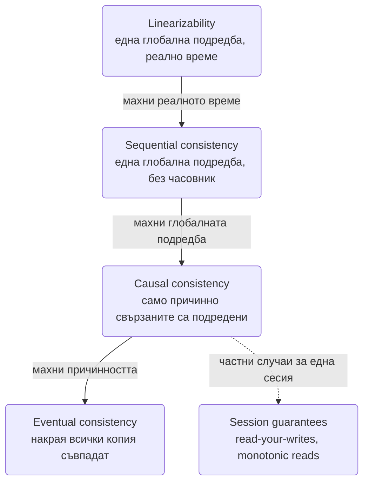
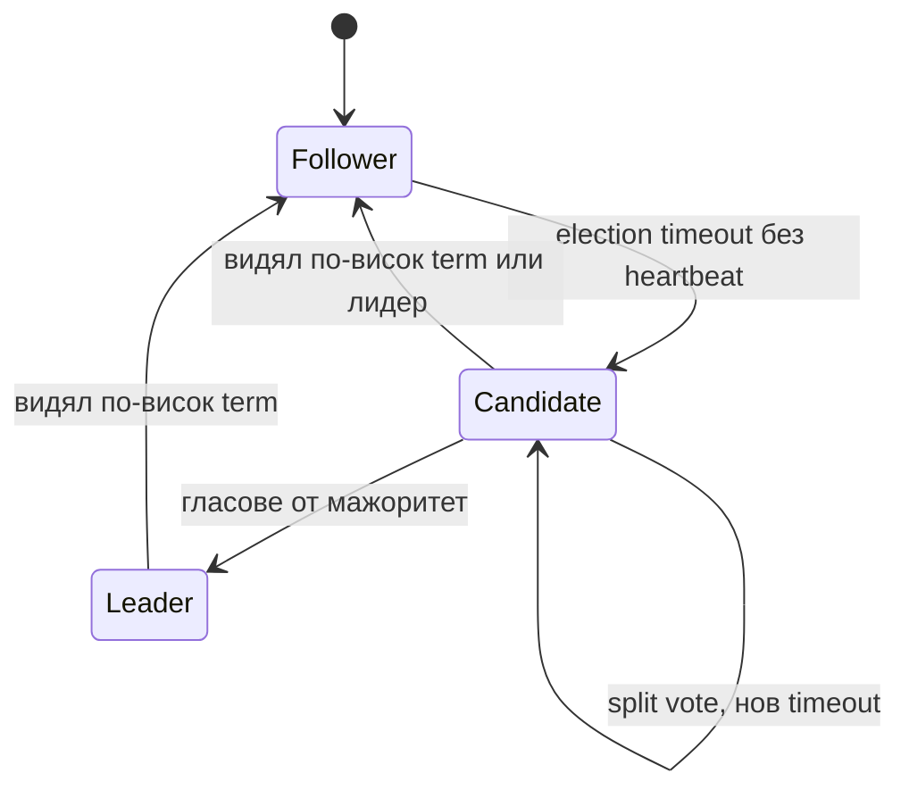
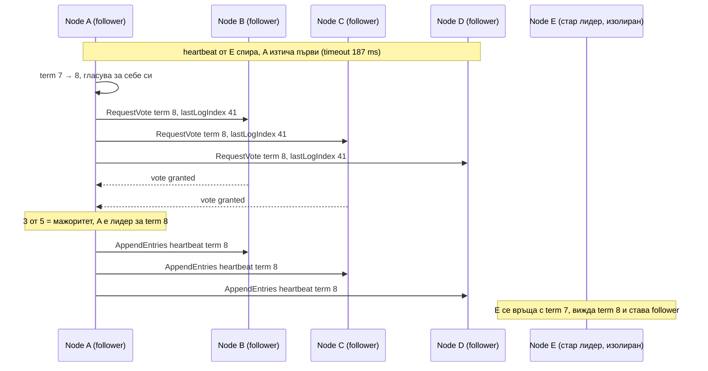
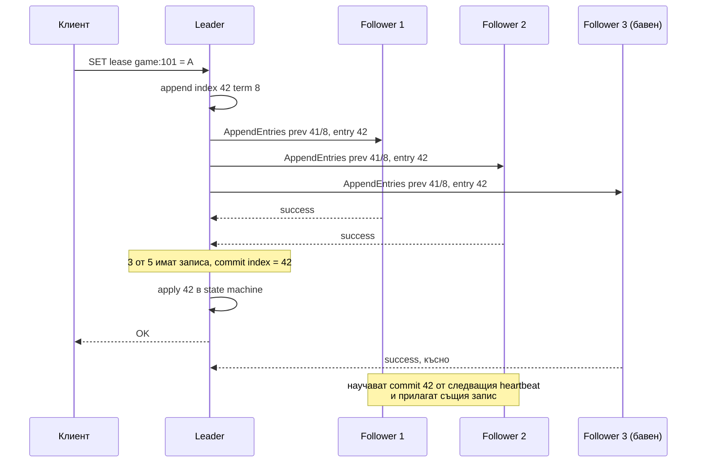

# Консенсус и модели на консистентност (Raft, Paxos, ZooKeeper/etcd, linearizability, часовници)

Речникът в [System_Design.md](System_Design.md) споменава Raft, CAP и кворум в по едно изречение. На
интервю тези изречения се разгръщат във въпроси, на които "знам термина" не е отговор: "какво точно
значи linearizable", "как избирате лидер и защо са нечетен брой възли", "какво става с клъстера, ако
паднат три от пет", "защо LWW губи данни". Този документ е отговорът на тези въпроси и е фонът зад
всяко място в папката, където има lease, лок, лидер или "строго консистентно" хранилище.

Интервюиращият слуша за две неща. Първо, че различаваш **консистентност на копията** (реплики, които
се съгласяват за стойност) от **консистентност на транзакциите** (ACID, isolation) и от
**консистентност като маркетинг** ("eventually consistent" без да се каже колко eventually). Второ,
че знаеш къде консенсусът **не** трябва да е: на горещия път на данните е бавен и е причината
Dynamo-стилът да го избягва, а на пътя на метаданните и координацията е задължителен.

## Модели на консистентност: стълбата

Модел на консистентност е договор между хранилището и клиента: кои подредби на четения и записи са
позволени. По-силният модел позволява по-малко изненади и струва повече латентност и достъпност.



| Модел | Обещанието | Какво може да се обърка без него | Кой го дава |
| --- | --- | --- | --- |
| **Linearizability** (atomic, strong) | Всяка операция изглежда изпълнена в един момент между старта и края си; щом четене види запис, всяко следващо четене го вижда. Съобразена с реалното време. | Клиент А записва, казва на Б по телефона, Б чете старата стойност. | Etcd, ZooKeeper (за писане; четенето по подразбиране не е), Spanner, Postgres single node за един ред, Redis single node |
| **Sequential** | Съществува една глобална подредба, съобразена с реда на всеки клиент, но не с реалното време. | Двама клиенти виждат записите в еднакъв ред, но този ред може да изостава от часовника. | Рядко се дава като изрична гаранция; Kafka партиция е близо |
| **Causal** | Ако A е причинило B (прочел си A, после си написал B), всички виждат A преди B. Несвързани записи може да се виждат в различен ред. | Отговорът на коментар се появява преди коментара. | MongoDB causal sessions, CockroachDB follower reads, COPS |
| **Session guarantees** | Read-your-writes (виждаш собствения запис), monotonic reads (не виждаш по-старо след по-ново), monotonic writes, writes-follow-reads. | Обновяваш профила си, презареждаш, виждаш старото име, защото репликата изостава. | Дава се от приложението: чети от primary след запис, или sticky към реплика, или версия в cookie |
| **Eventual** | Ако спрат записите, копията ще се изравнят. Нищо за това кога и в какъв ред. | Всичко изброено по-горе. | Cassandra с ONE, DynamoDB eventually consistent reads, DNS, Redis async реплики |

### Къде са системите от папката

| Система | Модел | Защо |
| --- | --- | --- |
| Postgres single node | Linearizable за един ред, serializable транзакции по избор | Един възел, един WAL |
| Postgres с async реплики | Primary: linearizable; реплики: eventual с lag от ms до секунди | Затова "прочети това, което току-що записах" отива към primary |
| [KV Store](Distributed_Key_Value_Store.md) (Dynamo стил) | Настройваем: `R + W > N` дава "последният запис е видим" при строг кворум, но не и linearizability при sloppy quorum | Няма лидер, конфликтите се решават след факта |
| [Message Queue (Kafka)](Distributed_Message_Queue_Kafka.md) | Linearizable в партиция за записи с `acks=all`; консуматорите виждат само committed offset | Лидер на партиция + ISR е консенсус на практика |
| [Distributed Cache](Distributed_Cache_Redis.md) | Primary: linearizable; реплики: eventual; failover може да загуби потвърдени записи | Async репликация, затова кешът не е източник на истина |
| Etcd / ZooKeeper | Linearizable записи; четенията са linearizable само с quorum read / `sync` | Raft / Zab |
| Spanner | External consistency (linearizable + serializable) | TrueTime и commit-wait |
| [Online Trading Game](Online_Trading_Game.md) ledger | Linearizable в рамките на игра | Един owner в един процес; консистентност чрез единичен писач, не чрез консенсус |

### Три различни "консистентности"

- **CAP консистентност** = linearizability. Само за това говори теоремата.
- **ACID консистентност** = инвариантите на базата (constraints, foreign keys) са спазени след
  транзакция. Няма нищо общо с копия. Isolation е това, което съответства на моделите по-горе.
- **"Eventually consistent" в документация на продукт** обикновено значи "не даваме гаранция за
  времето". Питай колко е lag-ът и какво става при failover. Ако отговорът е "обикновено под
  секунда", това не е гаранция, а наблюдение.

**Linearizable срещу serializable.** Serializable е за транзакции: резултатът е като при някакъв
сериен ред на транзакциите, без оглед на реалното време. Linearizable е за единични операции върху
един обект в реално време. Комбинацията се нарича strict serializability (Spanner го нарича external
consistency). Postgres SERIALIZABLE на един възел е strict serializable, защото възелът е един.

**Jepsen** е рамката, с която тези обещания се проверяват: пуска клиенти срещу клъстер, реже мрежата,
убива процеси, мести часовници и после проверява историята за нарушения на заявения модел. Почти
всяка база е "губила данни при разделяне" в Jepsen доклад преди да поправи документацията или кода.
На интервю: "проверимо е с Jepsen-style история, не с четене на документацията".

## Raft: консенсус, който може да се обясни на една дъска

Консенсус означава N възли да се съгласят за подредена поредица от стойности (лог), така че всеки,
който чете committed стойност, вижда същото, дори при падане на възли. Raft го прави с лидер: всички
записи минават през него, той ги реплицира и обявява committed, когато мажоритет ги е записал.



### Термини и избор на лидер

- **Term** е логически номер на епоха. Всеки избор започва нов term. Възел, който види съобщение с
  по-висок term, веднага става follower и приема този term. Това е fencing вграден в протокола:
  стар лидер не може да наложи запис, защото всички го отхвърлят по term.
- **Election timeout** е случаен интервал (например 150-300 ms). Follower, който не получи heartbeat
  от лидер за този интервал, увеличава term-а, гласува за себе си и праща `RequestVote` до всички.
  Случайността е причината обикновено само един да стане кандидат едновременно; **split vote**
  (никой без мажоритет) се решава с нов случаен timeout.
- Гласува се най-много веднъж на term, и само за кандидат, чийто лог е поне толкова актуален
  (последен term и индекс), колкото собствения. Това е **leader completeness**: новият лидер
  гарантирано има всички committed записи, така че нищо committed не се губи при избор.
- **Pre-vote** (разширение): възел пита "бихте ли гласували за мен", преди да увеличи term-а. Без него
  изолиран възел, който се връща в клъстера с раздут term, сваля работещия лидер безпричинно.



### Репликация на лога

Клиентът праща команда на лидера. Лидерът я добавя в своя лог с текущия term и праща `AppendEntries`
до всички. Всеки `AppendEntries` носи индекса и term-а на предишния запис; follower-ът приема само
ако има точно този предишен запис (**log matching**). Ако не съвпада, лидерът връща индекса назад,
докато намери общата точка, и презаписва разминаването. Когато мажоритет е потвърдил записа, лидерът
вдига **commit index**, прилага командата в state machine-а и отговаря на клиента. Follower-ите
научават commit index-а от следващия heartbeat и прилагат същите записи в същия ред.



Цената на един запис е **един мрежов RTT до мажоритета** плюс fsync на диск на всеки от тях. В един
DC това е 1-2 ms; между региони е 50-150 ms, което е причината глобалните Raft клъстери да са за
метаданни, не за трафика на потребителите.

### Защо мажоритет и защо нечетен брой

Две мажоритарни групи от N възли винаги имат общ възел. Затова два лидера в един term са
невъзможни (общият възел е гласувал само веднъж) и всеки нов лидер вижда всеки committed запис
(общият възел го има). Клъстер с N възли понася падане на `floor((N-1)/2)`:

| Възли | Мажоритет | Понася паднали | Защо не четен брой |
| --- | --- | --- | --- |
| 3 | 2 | 1 | 4 възли също понасят само 1 (мажоритет 3), но струват повече и имат повече шанс за split vote |
| 5 | 3 | 2 | 6 възли понасят пак 2 |
| 7 | 4 | 3 | Всеки запис чака 4 диска; рядко си струва |

Изречението за интервю: "Четен брой възли не добавя fault tolerance, а само латентност. Пет е
максимумът, който обикновено си струва; над него четенията се разпределят с learner-и или реплики
без глас."

### Мрежово разделяне

Страната с мажоритет продължава: избира лидер, ако старият е останал в малцинството, и приема
записи. Страната с малцинството **не може** да commit-не нищо: лидер там може да добавя в лога, но
никога не стига мажоритет, а при lease-based реализация сам се отказва след като не получи
heartbeat отговори. Това е точно смисълът на CP в CAP: малцинството става недостъпно за запис, за да
не се разклони историята. Клиент, който говори със стария лидер в малцинството, получава timeout, не
грешни данни, стига четенията да са quorum reads (виж долу).

### Четене от Raft клъстер

Наивното "четеш от лидера" **не** е linearizable: лидерът може да е свален, без да знае, и да върне
стара стойност. Три решения с различна цена:

| Път | Как | Цена | Гаранция |
| --- | --- | --- | --- |
| **Read index** | Лидерът записва текущия commit index, потвърждава лидерството с един heartbeat кръг до мажоритет, чака state machine да стигне до индекса, чете | Един RTT без диск | Linearizable |
| **Lease read** | Лидерът смята, че е лидер за `election timeout - clock drift` след последния успешен heartbeat и чете локално | Нула RTT | Linearizable, ако часовниците не дрейфят повече от допуснатото |
| **Follower read** | Клиентът чете от произволен follower | Нула RTT, разтоварва лидера | Само eventual или, с индекс от лидера, sequential; etcd го нарича serializable read |

Etcd по подразбиране прави linearizable четене (read index); `--consistency=s` дава бързото stale
четене. ZooKeeper по подразбиране чете локално от възела, към който си свързан, и е stale, докато не
извикаш `sync()`. Това е класически капан: "ZooKeeper е строго консистентен" е вярно за записите и
невярно за четенията без `sync`.

### Компакция и промяна на членството

Логът расте безкрайно, затова state machine-ът периодично прави **snapshot**, а логът до този
индекс се изхвърля. Изостанал follower получава snapshot вместо хиляди записи. Промяната на
членството е опасна, защото по време на прехода старата и новата конфигурация може да имат
различни мажоритети и да изберат два лидера. Raft го решава или с **joint consensus** (преходна
конфигурация, в която е нужен мажоритет и от старата, и от новата), или по-просто с промяна на
**по един възел** наведнъж, при която мажоритетите на съседни конфигурации винаги се пресичат.
Etcd прави второто и затова добавянето на два възела е две операции.

### Симулация на избор

Двадесет реда, които показват защо случайният timeout работи: при пет възела с различни timeout-и
първият, който изтече, събира гласовете, преди останалите да се събудят. Генераторът е с seed, за да
е повторимо.

```ts
type Node = { id: string; term: number; votedFor: string | null; timeoutMs: number };

function seeded(seed: number): () => number {
  let s = seed >>> 0;
  return () => { s = (s * 1664525 + 1013904223) >>> 0; return s / 2 ** 32; };
}

function electLeader(ids: string[], rand: () => number): { leader: string; term: number; rounds: number } {
  const nodes: Node[] = ids.map((id) => ({ id, term: 1, votedFor: null, timeoutMs: 0 }));
  const majority = Math.floor(nodes.length / 2) + 1;
  for (let round = 1; ; round++) {
    for (const n of nodes) n.timeoutMs = 150 + Math.floor(rand() * 150);
    const order = [...nodes].sort((a, b) => a.timeoutMs - b.timeoutMs);
    // Кандидатите се събуждат по реда на timeout-ите; всеки гласува веднъж на term.
    for (const candidate of order) {
      const term = Math.max(...nodes.map((n) => n.term)) + (candidate.votedFor === null ? 1 : 0);
      if (candidate.votedFor !== null) continue;
      candidate.term = term;
      candidate.votedFor = candidate.id;
      let votes = 1;
      for (const voter of nodes) {
        if (voter === candidate) continue;
        if (voter.term < term) { voter.term = term; voter.votedFor = null; }
        if (voter.votedFor === null && voter.timeoutMs > candidate.timeoutMs) { voter.votedFor = candidate.id; votes++; }
      }
      if (votes >= majority) return { leader: candidate.id, term, rounds: round };
    }
    for (const n of nodes) n.votedFor = null;
  }
}

const rand = seeded(42);
console.log(electLeader(['A', 'B', 'C', 'D', 'E'], rand));
console.log(electLeader(['A', 'B', 'C', 'D', 'E'], rand));
```

Условието `voter.timeoutMs > candidate.timeoutMs` моделира "гласувам, ако още не съм станал кандидат
сам". В редките рундове, в които двама се събуждат почти едновременно и си делят гласовете, никой
не стига мажоритет и цикълът започва нов рунд с нови случайни timeout-и, точно както в протокола.

## Paxos на една страница

Paxos решава същия проблем без лидер по дизайн. Роли: **proposer** предлага стойност, **acceptor**
приема, **learner** научава резултата. Две фази с номер на предложение `n`:

1. **Prepare(n):** proposer-ът пита мажоритет acceptor-и "обещайте да не приемате предложения под
   n и ми кажете последната стойност, която сте приели". Acceptor-ът обещава, ако `n` е по-голям от
   всичко, което е обещавал.
2. **Accept(n, v):** ако някой acceptor е върнал вече приета стойност, proposer-ът е длъжен да
   предложи **нея** (с най-високия номер), иначе предлага своя. Мажоритет приемания = избрана стойност.

Това избира **една** стойност. За лог от стойности се пуска инстанция за всеки индекс
(**Multi-Paxos**), а оптимизацията "един стабилен proposer пропуска фаза 1" дава на практика лидер.
В този момент Multi-Paxos и Raft са едно и също нещо, описано отгоре надолу срещу отдолу нагоре.
Raft е по-лесен за имплементиране, защото фиксира кой е лидер, как се избира и че логовете нямат
дупки; Paxos оставя тези решения на имплементатора и всяка продукционна версия (Chubby, Spanner) е
"Paxos плюс двадесет страници инженерни решения". **Zab** (ZooKeeper) и **Viewstamped Replication**
са трети и четвърти вариант на същата идея: лидер, епохи, мажоритет, подреден лог.

## Координационни услуги: ZooKeeper, etcd, Consul

Това са Raft/Zab клъстери, които пазят **малко** (мегабайти до няколко GB), **горещо** и **строго
консистентно** състояние: кой е лидер, кой държи лок, къде са инстанциите, каква е конфигурацията.
Не са бази за данни на потребители: пропускливостта им е десетки хиляди записи в секунда общо за
клъстера, защото всеки запис е кръг до мажоритет плюс fsync.

| Примитив | ZooKeeper | etcd | Consul |
| --- | --- | --- | --- |
| Данни | Znode дърво, версии | Плоски ключове с revision, range заявки | KV + service catalog |
| Ефемерност | Ephemeral znode изчезва със сесията | Lease с TTL, ключовете към него изчезват | Session + TTL |
| Нотификации | Watch, еднократен | Watch поток по revision | Blocking queries |
| Монотонен номер | zxid | revision | ModifyIndex |

### Рецепти

- **Leader election.** Всеки кандидат създава ephemeral sequential znode в `/election/`; най-малкият
  номер е лидер. Всеки следи **само предходния** (не лидера), за да няма herd effect: при падане на
  лидера се събужда един възел, не всички. В etcd: `campaign` върху ключ с lease.
- **Distributed lock.** Същото с `/lock/`: най-малкият номер държи лока. Ефемерността освобождава лока
  при срив на държателя (сесията изтича). Важно: локът е безопасен само със **fencing token**:
  zxid/revision на znode-а се предава на хранилището, което отхвърля операции с по-стар номер.
  Иначе процес с GC пауза продължава да пише след като локът е изтекъл, точно проблемът в
  [Ticketmaster](Ticketmaster.md).
- **Service registry.** Инстанциите създават ephemeral znode с адреса си; клиентите гледат директорията.
  Kubernetes прави същото с etcd под капака (Endpoints обекти).
- **Config.** Ключ с watch; промяната се вижда от всички за милисекунди, в ред и без polling.

### Chubby и урокът за грубите локове

Google Chubby (предшественикът на ZooKeeper) е проектиран за **coarse-grained** локове: държани с
часове (кой е master на GFS), взимани рядко. Fine-grained локове (по ред, по заявка) не са за
консенсусна услуга: латентността от 1-10 ms на операция и таванът от хиляди операции в секунда я
правят бутилково гърло. Затова [Online Trading Game](Online_Trading_Game.md) държи lease за игра
(груб, минути), а не лок за залог (фин, милисекунди), и затова парите са в един процес вместо зад
разпределен лок.

### Кога Redis SET NX е достатъчен и кога не

Redis с `SET NX PX` е лок върху един възел без консенсус: при failover на primary локът може да
изчезне (async репликация) и двама да го държат. Това е безопасно точно тогава, когато: (а) държиш
fencing epoch и хранилището го проверява, така че двойно държане не води до двоен запис; (б)
последствието от кратко двойно държане е поправимо. Играта е пример за (а). Ако липсва fencing и
последствието е пари, локът трябва да идва от Raft-backed услуга (etcd lease + revision), защото там
двама държатели в един момент са невъзможни. Redlock (лок върху 5 независими Redis) не решава
проблема с GC паузата и часовниците, което е критиката на Kleppmann, обобщена в речника.

## Часовници

Консенсусът съществува, защото възлите **нямат общ часовник**. Всичко, което разчита на wall clock за
подредба между машини, губи данни при drift.

- **NTP drift.** Типично десетки ms между машини в един DC, стотици ms при лош NTP, и скокове назад
  при корекция. `Date.now()` в Node може да върне по-малка стойност от предишното извикване. За
  измерване на интервали ползвай монотонния часовник: `process.hrtime.bigint()` или `performance.now()`.
- **LWW с wall clock.** Cassandra решава конфликта по timestamp. Възел с избързал часовник печели
  всеки конфликт и тихо изхвърля верните записи на останалите; при клиентски timestamp един клиент с
  грешен часовник презаписва бъдещето. Разписано в [KV Store](Distributed_Key_Value_Store.md).
- **Lamport timestamps** дават подредба, съвместима с причинността, с един брояч: при всяко
  съобщение `t = max(t_local, t_msg) + 1`. Не могат да кажат дали две събития са конкурентни.
  **Vector clocks** могат, с цената на вектор с размер броя възли. Кодът е в
  [Алгоритми от разпределените системи](Algorithms_Distributed_Systems.md).
- **Hybrid Logical Clocks** (CockroachDB, YugabyteDB): wall clock плюс логически брояч, така че
  timestamp-ите са и близки до реалното време, и съвместими с причинността. Позволява транзакции
  между възли без глобален часовник, с допускане за максимален drift.
- **TrueTime** (Spanner): GPS и атомни часовници дават интервал `[earliest, latest]` с несигурност
  под 7 ms. Транзакцията чака **commit-wait**, докато `latest` мине, преди да обяви резултата, така
  че никоя следваща транзакция не може да получи по-ранен timestamp. Това купува external consistency
  с латентност, вместо с консенсус за всяко четене. Извън Google се имитира с HLC и допускане за
  drift, което е по-слабо.

## Невъзможностите, които трябва да можеш да кажеш

**FLP (Fischer, Lynch, Paterson, 1985):** в асинхронна система (без граници за забавяне на съобщения)
с дори един възел, който може да падне, няма детерминистичен алгоритъм за консенсус, който винаги
приключва. Raft и Paxos го заобикалят със **timeout-и** (частична синхронност) и **случайност**:
гарантират безопасност винаги (никога два различни решения), а завършване само когато мрежата се
държи разумно. Затова Raft клъстер при непрекъснати разделения може да не избира лидер, но никога не
разклонява лога. **Two generals:** две страни не могат да се съгласят за общо действие през ненадежден
канал с краен брой съобщения. Практическото следствие е, че exactly-once доставка не съществува, само
идемпотентност (виж [Message brokers](Message_Brokers_Comparison.md)).

**CAP** формално: разпределено хранилище не може едновременно да е linearizable (C), да отговаря на
всяка заявка (A) и да работи при разделяне (P). Понеже разделянията не са избор, изборът е между C и
A **само по време на разделяне**. Грешните четения: "избирам две от три" (P не се избира), "Cassandra
е AP, значи няма консистентност" (има настройваема), "Postgres е CA" (един възел не е разпределена
система; с реплики е CP или AP според настройката). **PACELC** добавя нормалния режим: без разделяне
избираш между латентност и консистентност, което е по-полезната рамка за ежедневни решения и е в
речника.

## Къде консенсусът не принадлежи

| | Leader-based (Raft, Zab) | Leaderless (Dynamo, Cassandra) |
| --- | --- | --- |
| Достъпност при разделяне | Мажоритетът работи, малцинството спира записи | Всички страни приемат записи |
| Латентност на запис | RTT до мажоритет + fsync | RTT до W реплики, настройваемо |
| Конфликти | Няма, логът е един | Има, решават се с LWW, vector clocks или CRDT |
| Пропускливост | Ограничена от лидера и диска му | Хоризонтална |
| Употреба | Метаданни, конфигурация, локове, лидери, малки горещи ключове | Данни на потребители, кеш, събития, всичко с обем |

Правилото: консенсус за **кой** и **кое**, не за **какво**. Кой е лидер на партиция (Kafka
controller), кой държи шард, каква е схемата, къде са инстанциите. Самите данни минават по
по-бърз път: лидер на партиция с ISR, кворум без лидер, или единичен owner в процес. Система, която
праща всяка потребителска заявка през Raft, ще има латентност на консенсуса и пропускливостта на
един диск.

## Ключови въпроси за интервюто

### Linearizable или serializable: каква е разликата?

Linearizable е за единични операции върху един обект и е съобразено с реалното време: щом някой види
записа, всички след това го виждат. Serializable е за транзакции върху много обекти: резултатът е
като при някакъв сериен ред, но този ред може да не съвпада с реалното време. Заедно са strict
serializability. Postgres SERIALIZABLE на един възел е и двете; Spanner го дава на глобален клъстер
с TrueTime; повечето разпределени бази дават едното без другото.

### Защо нечетен брой възли?

Защото мажоритетът на 2k и 2k-1 възли понася еднакъв брой откази (k-1), а четният брой добавя възел,
диск и шанс за равен вот без полза. Пет е практическият таван за възли с глас; повече четене се
скалира с learner-и, които реплицират, но не гласуват.

### Raft клъстер с 5 възли: какво става при 2 паднали и при 3 паднали?

При 2: остават 3, мажоритетът е 3, клъстерът избира лидер и приема записи с пълна коректност, но без
резерв: следващият отказ го спира. При 3: остават 2, няма мажоритет, никакви записи не се commit-ват,
linearizable четенията също спират (не могат да потвърдят лидерство), stale четенията от живите
възли са възможни. Данните не се губят: когато трети възел се върне, клъстерът продължава от същия
лог.

### Лидерът остава в малцинствената страна на разделяне. Какво виждат клиентите?

Клиентите в мажоритета избират нов лидер след election timeout и продължават. Клиентите при стария
лидер получават timeout при запис (не може да събере мажоритет) и, при linearizable четене, също
timeout. При lease read старият лидер може да върне stale стойност за най-много един lease интервал,
затова lease интервалът е по-кратък от election timeout-а минус drift. Когато разделянето свърши,
старият лидер вижда по-висок term и става follower; незавършените му записи се презаписват.

### Как etcd се държи при бавен диск?

Всеки commit чака fsync на мажоритета. Бавен диск на един възел не пречи (мажоритетът е без него),
но бавен диск на лидера забавя всичко и вдига `wal_fsync_duration`. Ако heartbeat-ите закъснеят над
election timeout заради диск или GC, follower-ите започват избор и клъстерът "трепти" с чести смени
на лидер. Затова etcd препоръчва отделен SSD и алармира на fsync над 10 ms, а Kubernetes клъстери
падат от бавен etcd диск по-често, отколкото от мрежа.

### Как гарантираш read-your-writes при четене от реплики?

Три начина: (1) чети от primary за кратък прозорец след собствен запис (например 5 s по cookie);
(2) носи версия/LSN на последния запис в сесията и питай реплика само ако е стигнала до нея
(Postgres `pg_last_wal_replay_lsn`, etcd revision); (3) sticky routing на потребителя към една реплика
за monotonic reads. Гаранцията се дава от приложението, не от базата, и това трябва да се каже.

### Redis Sentinel консенсус ли е?

Sentinel използва кворум от sentinel процеси, за да се съгласи, че primary е паднал, и избира кой
sentinel да направи failover. Това е консенсус за **решението за failover**, не за **данните**:
репликацията остава асинхронна, така че потвърдени записи на стария primary може да липсват на
новия. Затова Redis не е linearizable хранилище при failover и `min-replicas-to-write` само
намалява, не премахва загубата. Redis Cluster е същото с вградени гласувания на master-ите.

### Може ли да се направи лок върху Kafka?

Технически да: топик с една партиция, всеки кандидат публикува "искам лока", първият запис в
партицията печели, защото партицията е linearizable подредба. Практически не: няма ефемерност
(паднал държател не освобождава), няма TTL, консуматорът трябва да чете целия лог, а латентността е
милисекунди до десетки. Лок иска lease с изтичане и fencing token, което е точно моделът на etcd и
ZooKeeper. Kafka дава подредба, не координация.
