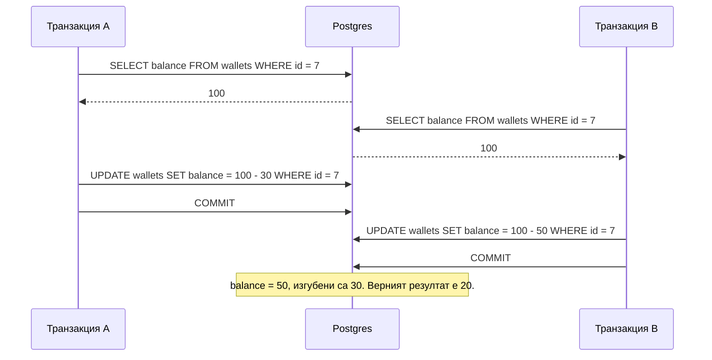
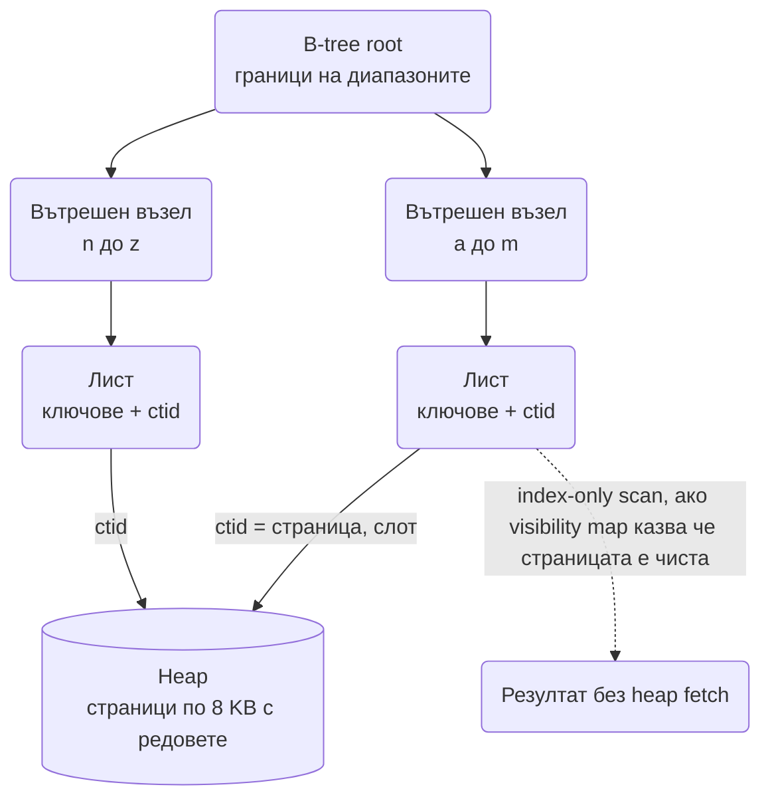
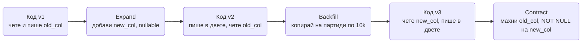

# Релационна база отвътре (Postgres): isolation levels, MVCC, индекси, локове, репликация, миграции, избор на база

Почти всяка система в тази папка има кутия "Postgres" някъде долу в диаграмата. Интервюиращият знае
това и затова две теми се появяват почти сигурно: "обясни isolation levels и кога Read Committed не
стига" и "как добавяш индекс на таблица с милиард реда, без да спреш продукцията". Двата въпроса
проверяват едно и също: дали разбираш какво прави базата, когато две транзакции се засекат, и какво
ѝ струва всяка структура, която ѝ добавяш. Този документ е за тези две неща и за всичко около тях,
което води до "ще шардирам" преди да се е наложило.

Правилото, което важи за целия документ: **Postgres, докато не се докаже обратното.** Доказателството
са числа (QPS, обем, латентност), не предпочитания.

## Транзакции и isolation levels

ACID в едно изречение: транзакцията е атомарна (всичко или нищо), консистентна (constraint-ите важат
в края), изолирана (конкурентните транзакции не си виждат междинните състояния до степен, зададена
от isolation level-а) и издръжлива (commit означава запис в WAL на диск). Първите две и последната
базата дава почти безплатно. Третата е компромис със скоростта и затова има нива.

### Аномалиите и кое ниво ги спира

| Аномалия | Какво се случва | Read Committed | Repeatable Read | Serializable |
| --- | --- | --- | --- | --- |
| Dirty read | Четеш незакомитнат запис на друга транзакция | Не се случва | Не се случва | Не се случва |
| Non-repeatable read | Два `SELECT`-а в една транзакция връщат различни стойности за същия ред | **Възможна** | Не се случва | Не се случва |
| Phantom read | Втори `SELECT` с същия `WHERE` връща нови редове | **Възможна** | Не се случва | Не се случва |
| Lost update | Две транзакции четат, смятат и пишат; едната презаписва другата | **Възможен** | Грешка при конфликт | Грешка при конфликт |
| Read skew | Виждаш ред A преди и ред B след чужд commit, в непоследователно състояние | **Възможен** | Не се случва | Не се случва |
| Write skew | Двете транзакции четат едно и също, всяка пише различен ред, заедно нарушават правило | **Възможен** | **Възможен** | Грешка при конфликт |

Три неща, специфични за Postgres, които печелят точки:

- **Read Uncommitted не съществува** на практика: заявката се приема, но се държи като Read
  Committed. MVCC прави dirty read невъзможен по конструкция.
- **Repeatable Read е snapshot isolation.** Транзакцията вижда снимка от момента на първия си
  `SELECT`. Това е по-силно от SQL стандарта: спира и phantom-ите.
- **Serializable е SSI (Serializable Snapshot Isolation)**, не локове. Транзакциите вървят
  оптимистично, а базата следи зависимостите между четения и записи и убива една от тях с грешка
  `40001 serialization_failure`, ако подредбата не може да е сериализуема. Затова Serializable без
  retry в кода е грешка.

### Lost update: балансът на портфейла

Класическият пример от [платежната система](Payment_System_Stripe_Wallet.md). Две транзакции
теглят от един баланс под Read Committed:



Три верни решения, от най-простото към най-общото:

```sql
-- 1. Атомарен UPDATE: базата чете и пише реда под лок, без прозорец между двете.
UPDATE wallets
   SET balance = balance - 50
 WHERE id = 7 AND balance >= 50
RETURNING balance;
-- 0 засегнати реда = недостатъчен баланс. Никакъв SELECT преди това.

-- 2. Песимистичен лок, когато логиката между четене и запис е в приложението.
BEGIN;
SELECT balance FROM wallets WHERE id = 7 FOR UPDATE;
-- приложението решава, после:
UPDATE wallets SET balance = 20 WHERE id = 7;
COMMIT;

-- 3. Оптимистична версия: никой не чака, губещият ретрайва.
UPDATE wallets
   SET balance = 20, version = version + 1
 WHERE id = 7 AND version = 41;
-- 0 реда = някой е писал междувременно, прочети пак и повтори.
```

Първото е правилният отговор за пари в 9 от 10 случая. Под Repeatable Read и Serializable вторият
`UPDATE` от диаграмата би получил грешка вместо да презапише, което е по-добре от тиха загуба, но
пак изисква retry.

### Write skew: последната стая и дежурните лекари

Write skew е аномалията, която Repeatable Read **не** спира и заради която хората се изненадват в
продукция. Пример от [резервационната система](Hotel_Reservation_Airbnb.md): двама клиенти проверяват
дали има свободна стая (`SELECT count(*) ... = 1`), и двамата виждат една, и всеки вмъква своя
резервация. Нито един ред не е бил променен от двамата, така че snapshot isolation няма конфликт,
но правилото "не повече от една резервация" е нарушено.

```sql
-- Решение A: направи проверката и записа един атомарен ред.
UPDATE room_inventory
   SET available = available - 1
 WHERE hotel_id = 12 AND room_type = 'double' AND night = '2026-10-03'
   AND available > 0;
-- rowCount = 0 означава разпродадено, без SELECT преди това.

-- Решение B: материализирай конфликта - заключи реда, който представлява правилото.
BEGIN;
SELECT * FROM room_inventory
 WHERE hotel_id = 12 AND room_type = 'double' AND night = '2026-10-03'
 FOR UPDATE;
-- сега втората транзакция чака тук и вижда актуалното състояние
INSERT INTO reservations (...) VALUES (...);
UPDATE room_inventory SET available = available - 1 WHERE ...;
COMMIT;

-- Решение C: Serializable + retry. Базата открива зависимостта четене-запис и убива една транзакция.
BEGIN ISOLATION LEVEL SERIALIZABLE;
SELECT count(*) FROM reservations WHERE room_type = 'double' AND night = '2026-10-03';
INSERT INTO reservations (...) VALUES (...);
COMMIT; -- едната от двете получава 40001
```

Изречението за интервю: **snapshot isolation пази редовете, не правилата.** Ако инвариантът обхваща
няколко реда, или го материализираш в един ред (брояч), или заключваш явно, или минаваш на
Serializable и ретрайваш.

### Retry при serialization failure

Кодът, който ползва Serializable или оптимистични версии, трябва да повтаря транзакцията при `40001`
(и при `40P01 deadlock_detected`). Без това грешките изтичат до потребителя като "опитай пак".

```ts
interface Tx {
  query(sql: string, params?: unknown[]): Promise<{ rows: unknown[]; rowCount: number }>;
}
interface Db {
  transaction<T>(isolation: 'READ COMMITTED' | 'SERIALIZABLE', fn: (tx: Tx) => Promise<T>): Promise<T>;
}

const RETRYABLE = new Set(['40001', '40P01']);

export async function withSerializableRetry<T>(db: Db, fn: (tx: Tx) => Promise<T>, attempts = 5): Promise<T> {
  for (let i = 1; ; i++) {
    try {
      return await db.transaction('SERIALIZABLE', fn);
    } catch (err) {
      const code = (err as { code?: string }).code;
      if (!RETRYABLE.has(code ?? '') || i >= attempts) throw err;
      // jitter, за да не се сблъскат същите две транзакции отново в същия ред
      await new Promise((r) => setTimeout(r, Math.random() * 20 * i));
    }
  }
}

let failures = 2;
const fakeDb: Db = {
  async transaction(_iso, fn) {
    if (failures-- > 0) throw Object.assign(new Error('could not serialize access'), { code: '40001' });
    return fn({ async query() { return { rows: [], rowCount: 1 }; } });
  },
};
console.log(await withSerializableRetry(fakeDb, async (tx) => (await tx.query('UPDATE ...')).rowCount));
```

Важно ограничение: retry е безопасен само ако функцията няма странични ефекти извън базата (HTTP
към PSP, изпращане на имейл). Такива ефекти отиват след commit или през outbox
([Notification System](Notification_system.md)).

## MVCC: защо четенето не блокира писането

Postgres не презаписва редове на място. Всяка версия на ред (tuple) носи `xmin` (транзакцията, която
го е създала) и `xmax` (транзакцията, която го е изтрила или заменила). Всяка транзакция работи със
snapshot: списък кои транзакции са били commit-нати в началото ѝ. Ред е видим, ако `xmin` е
commit-нат в snapshot-а и `xmax` не е. Оттук следват най-важните свойства:

- **Читателите не чакат писателите и обратно.** `UPDATE` създава нова версия, старата остава за
  транзакциите, чийто snapshot е по-стар. Единствените локове са писател срещу писател на същия ред.
- **Всеки `UPDATE` е `INSERT` + логическо `DELETE`.** Таблица с 1M реда, обновявана 10 пъти на ден,
  има 10M мъртви tuple-а, ако никой не чисти.
- **VACUUM** маркира мъртвите версии като свободно място за нови редове. **Autovacuum** го прави
  автоматично, но неговите прагове по подразбиране са настроени за малки таблици; за голяма, често
  обновявана таблица се настройват per-table (`autovacuum_vacuum_scale_factor` надолу).
- **Bloat** е таблица, в която половината страници са мъртви версии. Заявките четат два пъти
  повече страници за същите данни. Лекува се с VACUUM (не връща място на ОС), `pg_repack` (онлайн)
  или `VACUUM FULL` (пълен лок, само в maintenance прозорец).
- **Дългите транзакции са врагът.** Докато една транзакция държи стар snapshot, VACUUM не може да
  махне никоя версия, която тя би могла да види. Един забравен `BEGIN` в psql или repl може да
  подуе всички таблици за уикенда. Затова `idle_in_transaction_session_timeout` е задължителна
  настройка.
- **Transaction ID wraparound:** xid е 32-битов и се върти. VACUUM периодично "замразява" стари
  редове, за да не станат невидими след превъртане. Ако autovacuum е изключен на голяма таблица,
  Postgres в един момент спира да приема записи, за да се защити. Това е инцидент, който всеки
  Postgres оператор е чувал.
- **HOT updates (Heap Only Tuple):** ако `UPDATE` не пипа индексирана колона и има място в същата
  страница, новата версия не изисква нов запис в индексите. Затова се избягва индексирането на
  колони, които се обновяват често (`updated_at`, броячи).

## Локове

MVCC покрива четенията; локовете покриват писател срещу писател и DDL.

| Лок | Какво прави | Кога |
| --- | --- | --- |
| `FOR UPDATE` | Заключва реда за запис и за други `FOR UPDATE`/`FOR SHARE` | Прочети-реши-запиши върху един ред |
| `FOR NO KEY UPDATE` | Като `FOR UPDATE`, но не блокира foreign key проверки от други таблици | Стандартният `UPDATE` без промяна на ключ го ползва |
| `FOR SHARE` | Няколко могат да четат със share, никой не може да пише | "Да не изчезне докато го ползвам" |
| `SKIP LOCKED` | Пропуска заключените редове вместо да чака | Опашки в таблица: worker-и взимат различни редове ([Job Scheduler](Distributed_Job_Scheduler.md)) |
| `NOWAIT` | Грешка веднага, ако редът е заключен | Когато чакането е по-лошо от отказ |
| Advisory locks | Лок върху число, не върху ред: `pg_advisory_xact_lock(key)` | Лек разпределен лок в рамките на една база: "само един процес прави X" |

```sql
-- Опашка в Postgres без двойно взимане на един и същ job:
WITH next AS (
  SELECT id FROM jobs
   WHERE state = 'queued' AND run_at <= now()
   ORDER BY run_at
   FOR UPDATE SKIP LOCKED
   LIMIT 10
)
UPDATE jobs SET state = 'running', locked_by = $1, locked_at = now()
  FROM next WHERE jobs.id = next.id
RETURNING jobs.*;
```

**Deadlock:** транзакция A държи ред 1 и иска ред 2, B държи 2 и иска 1. Postgres го открива след
`deadlock_timeout` (1 s) и убива една от двете с `40P01`. Предпазването е подредба: винаги заключвай
редовете в един и същ ред (`ORDER BY id` във `FOR UPDATE`), както прави резервацията за няколко нощи
в [Hotel Reservation](Hotel_Reservation_Airbnb.md). Deadlock не е бъг в базата, а бъг в реда на
операциите.

**DDL локове и опашката зад тях:** `ALTER TABLE` иска `ACCESS EXCLUSIVE` лок. Ако някоя дълга
транзакция държи таблицата, `ALTER` чака, а всички нови заявки се редят **зад него**, защото искат
по-слаб лок, който е несъвместим с чакащия силен. Резултатът е, че една миграция замразява
продукцията за минути, без да е направила нищо. Лекарството е `SET lock_timeout = '3s'` преди всяко
DDL и retry.

## Индекси

Таблицата (heap) е неподреден набор от страници по 8 KB. Без индекс всяка заявка е sequential scan.
B-tree индексът е подредено дърво от ключове с указатели (`ctid`) към редовете в heap-а:



Дълбочината на дървото за милиард реда е 4-5 нива, така че точково търсене е 4-5 прочетени страници,
почти винаги от кеша. Цената е при запис: всеки индекс е още едно дърво за обновяване при `INSERT`
и при `UPDATE` на индексирана колона.

| Тип | За какво | Внимание |
| --- | --- | --- |
| B-tree (default) | `=`, `<`, `>`, `BETWEEN`, `ORDER BY`, `LIKE 'prefix%'` | Не помага за `LIKE '%suffix'` и за функции над колоната без expression index |
| Composite | `WHERE a = ? AND b = ?`, `WHERE a = ? ORDER BY b` | Работи по **leftmost prefix**: индекс `(a, b)` служи за `a` и за `a, b`, не за само `b` |
| Covering (`INCLUDE`) | Заявката се обслужва само от индекса | `CREATE INDEX ON orders (user_id) INCLUDE (status, total)` |
| Partial | Индекс само върху част от редовете | `WHERE status = 'pending'`: малък индекс за горещото подмножество |
| Expression | Индекс върху функция | `CREATE INDEX ON users (lower(email))` за case-insensitive търсене |
| Unique | Инструмент за коректност, не само за скорост | Гаранцията срещу двойна резервация в [Ticketmaster](Ticketmaster.md) е `UNIQUE (event_id, seat_id)` |
| Hash | Само `=` | Рядко по-добър от B-tree; ползва се за дълги ключове |
| GIN | Много стойности на ред: `jsonb`, масиви, full text | Бавен при запис, бърз при търсене "съдържа" |
| GiST / SP-GiST | Диапазони, геометрия, най-близък съсед | Exclusion constraint за непресичащи се интервали; PostGIS ([Geo](Geo_Proximity_Uber_Yelp.md)) |
| BRIN | Блокови диапазони върху естествено подредени данни | Мини индекс за append-only таблици по време (логове, метрики); 1000x по-малък от B-tree |

```sql
-- Exclusion constraint: базата не позволява две резервации на една стая с пресичащи се периоди.
ALTER TABLE reservations
  ADD CONSTRAINT no_overlap
  EXCLUDE USING gist (room_id WITH =, tstzrange(check_in, check_out) WITH &&);
```

### Как се индексира таблица с милиард реда, без да спреш продукцията

Обикновеният `CREATE INDEX` взима `SHARE` лок: четенията минават, записите чакат до края, което за
милиард реда са десетки минути. Правилният път:

1. `SET lock_timeout = '5s'; CREATE INDEX CONCURRENTLY idx ON big (col);` Строи се на два прохода,
   без да блокира записите. По-бавно е и не може да е в транзакция.
2. Ако се провали (deadlock, timeout), остава **невалиден** индекс, който тежи при запис и не се
   ползва при четене. Проверява се с `pg_index.indisvalid` и се `DROP INDEX CONCURRENTLY`.
3. Пуска се извън пиковите часове, защото проходите четат цялата таблица и изместват горещите данни
   от кеша.
4. При партиционирана таблица: индексът се създава на всяка партиция `CONCURRENTLY`, после се
   прикача към родителския.
5. Стар подут индекс се сменя с `REINDEX INDEX CONCURRENTLY`, което прави същото под капака.

Index-only scan е възможен само за страници, които **visibility map** маркира като напълно видими за
всички. Таблица с много скорошни `UPDATE`-и има много "нечисти" страници и index-only scan-ът все пак
ходи до heap-а. Още една причина VACUUM да върви навреме.

## Планиране на заявки

`EXPLAIN (ANALYZE, BUFFERS)` е инструментът, с който се доказва, че "бавно" има причина. Какво се
гледа, отгоре надолу:

- **Estimated rows срещу actual rows.** Разлика от порядъци означава остарели статистики
  (`ANALYZE`) или корелирани колони, за които планировчикът предполага независимост (`CREATE
  STATISTICS`). Грешна оценка води до грешен join и грешен ред на операциите.
- **Seq Scan срещу Index Scan срещу Bitmap Heap Scan.** Seq scan е верният избор, ако заявката
  връща над ~5-10% от таблицата. Bitmap е междинният: събира ctid-и от индекса, подрежда ги по
  страница и чете heap-а последователно.
- **Nested Loop / Hash Join / Merge Join.** Nested loop е добър за малка външна таблица с индекс
  върху вътрешната; hash join за две големи без подредба; merge join за две вече подредени. Nested
  loop върху две големи таблици с грешна оценка е най-честият виновник за заявка от 30 секунди.
- **`Buffers: shared hit / read`.** Hit е от паметта, read е от диска. Много `read` при често пускана
  заявка означава, че работният набор не се събира в `shared_buffers`.
- **`Sort Method: external merge Disk`.** Сортирането е излязло от `work_mem` и е отишло на диска.
  Или индекс за `ORDER BY`, или по-голям `work_mem` за тази сесия.

Три навика от приложната страна:

- **N+1**: ORM зарежда списък с 50 поръчки и после прави 50 заявки за клиентите им. Лекува се с
  `JOIN` или с една заявка `WHERE id = ANY($1)` за партията. [Repository патернът](Design_Patterns_Node_Architecture.md)
  е мястото, където това се вижда и спира.
- **Keyset пагинация** вместо `OFFSET`: `WHERE (created_at, id) < ($1, $2) ORDER BY created_at DESC, id
  DESC LIMIT 20` с индекс `(created_at, id)`. `OFFSET 100000` чете и изхвърля 100 000 реда всеки път
  (виж [News Feed](News_Feed_Timeline.md)).
- **`ORDER BY ... LIMIT` без индекс по същата колона** е пълно сортиране на таблицата, за да се
  вземат 20 реда. Индексът превръща това в четене на 20 листа.

## Връзки и connection pooling

Postgres стартира **процес** за всяка връзка, с няколко MB памет и собствени кешове. 500 отворени
връзки означават 500 процеса, които се борят за CPU и памет, и контекстни превключвания, които
правят всяка заявка по-бавна. Практическият таван на един сървър е стотици активни връзки, а
оптимумът за пропускливост често е под 100.

Правилото за оразмеряване: `max_connections` в базата не е лимитът на приложението. С 20 Node
инстанции по 10 връзки в pool-а вече са 200. Затова между приложението и базата стои **PgBouncer** в
transaction pooling режим: хиляди клиентски връзки, споделящи няколко десетки реални. Цената:

- Няма **session state** между транзакциите: `SET`, temp таблици, `LISTEN`, advisory session locks
  не работят предвидимо.
- **Prepared statements** на ниво протокол се чупят, защото следващата транзакция може да отиде на
  друга реална връзка. Drivers-ите или ги изключват, или PgBouncer 1.21+ ги поддържа в transaction
  режим.
- Дълга транзакция държи реална връзка и намалява pool-а за всички.

Ориентир за Node: pool от 5-10 връзки на инстанция е достатъчен за почти всичко, защото заявката
трае милисекунди и връзката се освобождава веднага. Голям pool не ускорява, а мести опашката от
приложението в базата.

## Репликация, failover и възстановяване

Всяка промяна първо се записва в **WAL** (write-ahead log), после в данните. Това е и durability
механизмът (commit = fsync на WAL), и източникът за репликация и CDC.

- **Streaming replication** праща WAL байтовете към реплики. **Асинхронна** (по подразбиране):
  primary потвърждава commit преди репликата да го е получила, така че при срив се губят последните
  милисекунди (RPO > 0). **Синхронна** (`synchronous_commit = on` с `synchronous_standby_names`):
  primary чака поне една реплика, латентността расте с една мрежова обиколка, RPO = 0. Изборът зависи
  от отговора на "може ли да загубим последната секунда" (виж [NFR чеклиста](NFR_Checklist.md)).
- **Replication lag и read-your-writes.** Репликата изостава с милисекунди до секунди. Потребител,
  който току-що е записал профила си и го чете от реплика, вижда старото. Решения: четене от primary
  за N секунди след запис на същия потребител (sticky по време), или клиентът носи LSN на записа и
  репликата чака да го достигне (`pg_wal_lsn_diff`), или просто маршрутизация "четенето след моя запис
  отива към primary".
- **Logical replication и CDC.** Логическото декодиране превръща WAL в поток от промени по редове.
  Debezium го чете и публикува в Kafka, което е реализацията на outbox без polling
  ([Notification System](Notification_system.md), [патерните](System_Design.md)). Ползва се и за
  миграции между версии без downtime.
- **Failover.** Patroni (или managed услуга) следи primary през консенсус хранилище (etcd) и
  промотира реплика при отказ. Опасността е **split brain**: старият primary се връща и приема
  записи. Предпазването е fencing: старият се спира преди новият да се промотира, а клиентите
  минават през виртуален адрес или прокси, който сочи само към текущия лидер. Същият проблем и
  същият отговор като lease + epoch в [Online Trading Game](Online_Trading_Game.md), обяснен общо в
  [Consensus и консистентност](Consensus_Consistency_Models.md).
- **Backups и PITR.** Базов backup плюс архивирани WAL сегменти позволяват възстановяване до
  произволна секунда (point-in-time recovery). Това спасява от `DELETE` без `WHERE`, от което
  репликацията не спасява, защото го реплицира вярно. RPO = интервал на архивиране на WAL, RTO =
  време за възстановяване на базов backup + replay, което за терабайти е часове и трябва да се
  измери, не да се предположи.

## Промяна на схемата без downtime

Правилото е **expand / migrate / contract**: първо добавяш новото до старото, после местиш кода и
данните, накрая махаш старото. Нито една стъпка не чупи работещия код от предишната.



Конкретните капани и как се минават:

- **`ADD COLUMN ... NOT NULL DEFAULT x`** е мигновено от PG11 (default-ът се пази в каталога, не се
  пренаписват редовете). `ADD COLUMN` с default, който е функция (`now()`), пренаписва таблицата.
- **Нов constraint върху голяма таблица:** `ADD CONSTRAINT ... NOT VALID` (мигновено, важи за нови
  редове), после `VALIDATE CONSTRAINT` (сканира, но с лек лок).
- **Foreign key към голяма таблица:** същото, `NOT VALID` + `VALIDATE`.
- **Backfill** на партиди: `UPDATE ... WHERE id BETWEEN $1 AND $2` по 5-10k реда с пауза между
  партиите, за да не подуеш WAL-а и репликите. Никога един `UPDATE` на милиард реда: една
  транзакция, един гигантски лок, милиард мъртви tuple-а.
- **Преименуване на колона** с нула downtime: добави новата, пиши в двете (или trigger), backfill,
  превключи четенето, спри писането в старата, махни я. Ако кодът и базата се деплойват отделно,
  краткият път `ALTER TABLE RENAME` чупи старите инстанции по време на rolling deploy.
- **Всяко DDL** с `SET lock_timeout = '3s'` и retry, заради опашката зад `ACCESS EXCLUSIVE`.
- **Индекси** винаги `CONCURRENTLY`, извън транзакция на миграционния инструмент.
- **Смяна на тип на колона** (`int` към `bigint`, когато id-тата наближат 2.1 млрд.) пренаписва
  таблицата: минава през нова колона и горната процедура, не през `ALTER TYPE`.

## Партициониране и излизане от един сървър

**Декларативното партициониране** дели логическа таблица на физически по range (дата), list
(регион) или hash (id). Планировчикът чете само нужните партиции (partition pruning), ако `WHERE`
съдържа ключа. Кога помага:

- **Retention:** `DROP TABLE events_2025_09` е мигновено; `DELETE ... WHERE created_at < ...` на
  100M реда е часове и bloat.
- **Горещи данни:** последната партиция и нейните индекси се събират в кеша.
- **VACUUM на части** вместо на цялата таблица.

Кога не помага: заявки без ключа на партицията сканират всички партиции; уникалност е възможна само
ако ключът е в `UNIQUE`; много партиции (хиляди) правят планирането бавно. Партиционирането не е
шардиране: всичко е на един сървър.

Стълбата на растежа, като всяка стъпка е доказана с числа:

1. **Индекси и заявки.** Повечето "базата не издържа" са липсващ индекс или N+1.
2. **Вертикално:** по-голяма машина. Скучно и вярно до десетки TB и десетки хиляди записи в секунда.
3. **Read replicas** за четенето, с грижа за lag.
4. **Кеш** пред четенията ([Distributed Cache](Distributed_Cache_Redis.md)).
5. **Партициониране** за обем и retention.
6. **Шардиране** по ключ (по `user_id`, `tenant_id`): в приложението с рутер по ключ, или с Citus.
   Цената е загубата на join-ове и транзакции между шардове, тоест точно нещата, заради които е
   избран Postgres.
7. **Друга база** за конкретния поток: append-only събития с 1M записа/сек отиват в
   [wide-column store](Distributed_Key_Value_Store.md), не в шардиран Postgres.

## JSONB и full text

`jsonb` е верният избор за данни без стабилна схема или с много рядко ползвани полета: настройки,
payload от външен доставчик, атрибути на продукт по категория. GIN индекс прави `@>` търсене бързо.
Знаците, че jsonb крие схема, която трябва да е колони: `WHERE data->>'status' = ?` в горещи заявки,
join-ове по поле в jsonb, миграции, които "обновяват ключ в json на всички редове". Full text
(`tsvector` + GIN) покрива търсене в описания и коментари до милиони редове; над това, или при нужда
от релевантност и фасети, е [търсачка](Search_Engine_Inverted_Index.md).

## Избор на база

| Тип | Модел на заявките | Консистентност | Как скалира | Примери | В тази папка |
| --- | --- | --- | --- | --- | --- |
| Релационна | SQL, join-ове, транзакции, constraint-и | Строга, ACID | Вертикално, реплики, партиции, шардиране накрая | Postgres, MySQL | Плащания, резервации, метаданни, scheduler |
| Document | Документ по ключ, вложени структури, вторични индекси | Настройваема, по документ | Автоматично шардиране | MongoDB, DynamoDB (частично) | Профили с гъвкава схема, каталози |
| Wide-column | Ред по partition key + clustering, без join-ове | Кворум, eventual | Линейно по възли | Cassandra, ScyllaDB, Bigtable | [Chat](Chat_system_WhatsApp_Slack%20_Messenger.md), [Geo история](Geo_Proximity_Uber_Yelp.md), постове |
| Key-value | `get`/`put`, понякога структури | От eventual до кворум | Consistent hashing | Redis, Valkey, DynamoDB | [Кеш](Distributed_Cache_Redis.md), сесии, [KV Store](Distributed_Key_Value_Store.md) |
| Graph | Обхождане на връзки, дълбочина | Обикновено строга | Трудно, по подграфи | Neo4j | Social graph при сложни заявки |
| Time-series | Append по време, агрегации, downsampling | Eventual е достатъчна | Партиции по време | TimescaleDB, Prometheus TSDB, ClickHouse | [Метрики](Metrics_Monitoring_Alerting.md), [кликове](Ad_Click_Aggregation.md) |
| Search | Full text, релевантност, фасети | Eventual, near-real-time | Шардове по документ | Elasticsearch, OpenSearch | [Търсачка](Search_Engine_Inverted_Index.md) |
| Object storage | Байтове по ключ, огромни обекти | Read-after-write | Практически безкрайно | S3 | [Видео](Video_platform_like_Udemy.md), [файлове](File_Sync_Dropbox_Google_Drive.md) |

Сигналите, които доказват, че Postgres не стига: устойчиви записи над ~20-50k реда/сек върху една
таблица, работен набор, който не се събира в паметта на една машина, нужда от активно-активна
репликация между региони, заявки "по ключ" в мащаб, при които join-ове и транзакции не се ползват
изобщо. Ако нито едно не е вярно, "ще взема Cassandra" е отговор, който ще трябва да защитаваш.

## Ключови въпроси за интервюто

### Кое е isolation level-ът по подразбиране и какъв е рискът?

Read Committed. Рискът е lost update и write skew при прочети-реши-запиши логика. Отговорът не е "ще
вдигна нивото", а "ще направя записа атомарен (`UPDATE ... WHERE`), ще заключа явно (`FOR UPDATE`)
или ще мина на Serializable с retry, според случая".

### Как предотвратяваш двойна резервация?

Три слоя, от най-силния: `UNIQUE` или exclusion constraint в базата, който прави двойния запис
физически невъзможен; условен `UPDATE` върху ред-брояч, който съдържа проверката; и опционален
Redis лок отпред само като оптимизация. Snapshot isolation сам по себе си не стига, защото това е
write skew.

### Защо дългите транзакции са вредни?

Държат стар snapshot, така че VACUUM не може да чисти мъртви версии във всички таблици, държат
локове, зад които се редят DDL и други записи, и държат реална връзка в pool-а. Настройка
`idle_in_transaction_session_timeout` и правило "без HTTP извиквания вътре в транзакция".

### Как добавяш индекс на таблица с милиард реда в продукция?

`CREATE INDEX CONCURRENTLY` с `lock_timeout`, извън пика, с проверка за `indisvalid` след това и
`DROP INDEX CONCURRENTLY` на провален опит. При партиционирана таблица по партиции. И преди всичко
`EXPLAIN`, който доказва, че този индекс ще се ползва.

### Какво чупи PgBouncer в transaction режим?

Всичко, което е състояние на сесията: `SET` без `LOCAL`, temp таблици, `LISTEN/NOTIFY`, session
advisory locks и протоколните prepared statements при по-стари версии. Печалбата е хиляди клиентски
връзки върху десетки реални и стабилна латентност под товар.

### Потребител записа и не вижда промяната. Защо и какво правиш?

Четенето е отишло на асинхронна реплика с lag. Или маршрутизираш четенията на потребител към primary
за няколко секунди след негов запис, или клиентът носи LSN и репликата изчаква, или за критичните
екрани четеш винаги от primary. Синхронната репликация решава durability, не lag на четенията от
други реплики.

### Колко връзки трябват на базата?

По-малко, отколкото изглежда: десетки активни, не стотици. Node pool от 5-10 на инстанция, PgBouncer
пред базата, `max_connections` под 200-300. Голям pool мести опашката в базата и я забавя.

### Кога напускаш Postgres?

Когато числата го изискват: записи над десетки хиляди в секунда в една таблица, работен набор над
паметта на най-голямата разумна машина, активно-активна репликация между региони, или достъп
изключително по ключ без join-ове. Тогава се изнася **конкретният поток**, не цялата система, и
Postgres остава system of record за всичко, което има нужда от транзакции.
