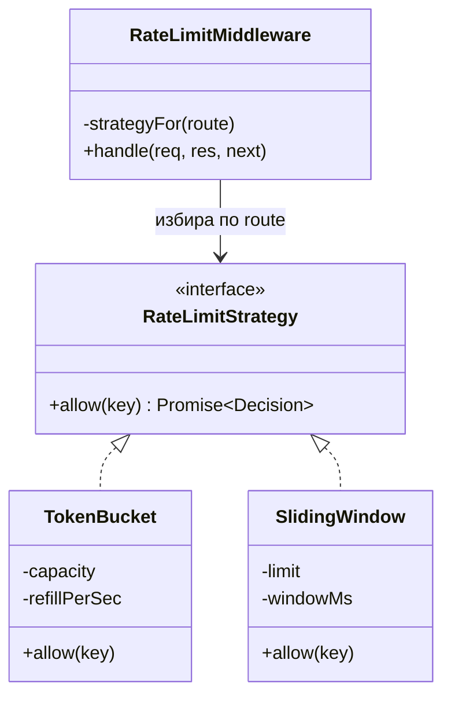
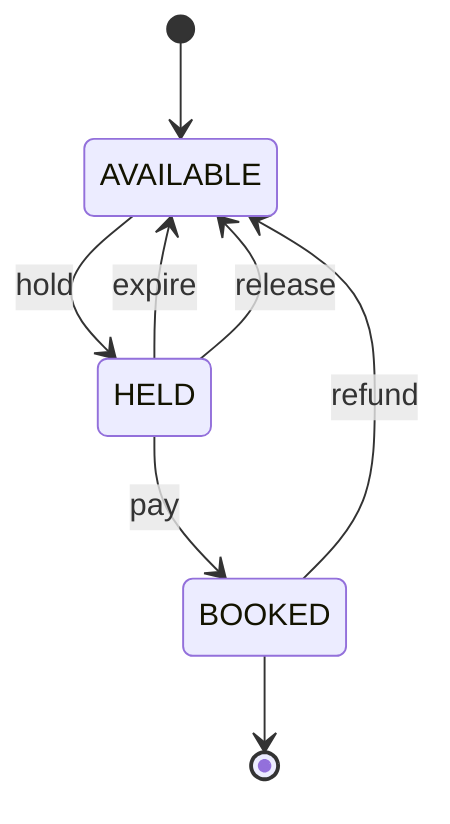

# Дизайн патерни: Behavioral (Strategy, Observer, Command, Chain of Responsibility, State, Template Method, Iterator, Mediator)

Behavioral патерните решават един и същ клас проблеми: **кой решава какво да се случи и кой знае за
кого.** Алгоритъм, който се сменя по време на изпълнение; модул, който трябва да реагира на промяна,
без авторът на промяната да знае за него; действие, което трябва да се отложи, повтори или отмени;
поток от заявки, минаващ през поредица от проверки.

В Node.js половината от класическите форми се свиват до нещо, което вече ползваш всеки ден: Strategy е
функция, подадена като аргумент; Observer е `EventEmitter`; Chain of Responsibility е middleware с
`next()`; Iterator е generator. Това не значи, че патерните са излишни, а че езикът ги е погълнал.
Пълната обектна форма си заслужава, когато стратегията носи **състояние и конфигурация** (кофа с
токени има брояч и последно попълване), когато трябва да е **регистрируема по име** (стратегия от
конфигурационен файл), или когато трябва да се **тества изолирано** с ясен интерфейс.

На интервю въпросът никога е "какво е Strategy", а "къде в твоята система би го ползвал и защо не
просто `if`". Затова всеки патерн долу завършва с връзка към конкретна система от тази папка.

| Патерн | Проблемът | Node.js идиом | Кога НЕ |
| --- | --- | --- | --- |
| **Strategy** | Един и същ вход, различен алгоритъм според контекста | Обект с метод или функция, избрана от `Map` по ключ | Два варианта, които никога няма да станат три: `if` е по-четимо |
| **Observer** | Много модули реагират на една промяна, без авторът да ги познава | `EventEmitter`, типизиран с generic | Когато реакцията трябва да преживее рестарт: тогава е брокер, не emitter |
| **Command** | Действие като обект: отлагане, опашка, retry, undo, одит | Обект `{ type, payload, idempotencyKey }` + handler по тип | Еднократно извикване без опашка и без история |
| **Chain of Responsibility** | Заявка минава през проверки, всяка може да спре потока | Middleware с `next()` (Express, Koa, Fastify hooks) | Когато редът е фиксиран и стъпките са две |
| **State** | Обект с различно поведение според етапа си; преходи с правила | Таблица на преходите или обект на състояние | Две състояния и един флаг |
| **Template Method** | Скелет на процес с променливи стъпки | Абстрактен клас с hooks или функция с подадени стъпки | Когато стъпките се променят независимо: композиция вместо наследяване |
| **Iterator** | Обхождане на голяма или безкрайна последователност без да се материализира | `function*`, `async function*`, `for await` | Малък масив, който вече е в паметта |
| **Mediator** | N модула си говорят през един посредник вместо N² връзки | In-process bus; NATS subject-и като разпределен медиатор | Когато посредникът започне да носи бизнес логика: това е God object |

## Strategy

### Проблемът

Rate limiter-ът трябва да прилага различен алгоритъм на различни ендпойнти: `/login` иска строг
sliding window без bursts, `/api/search` иска token bucket, който позволява кратък пик. Наивното
решение е `if (endpoint === '/login') ... else if ...` вътре в middleware-а. При третия алгоритъм и
петия ендпойнт функцията става непроверима, а конфигурацията е зашита в кода.

### Решението

Всеки алгоритъм е обект с един и същ интерфейс `allow(key)`. Middleware-ът не знае кой алгоритъм
държи, само че може да го пита. Изборът става веднъж, при конфигурация, по име от `Map`. Новият
алгоритъм е нов клас и един ред в регистъра, без пипане на middleware-а.



### Node.js пример

```ts
interface Decision { allowed: boolean; retryAfterMs: number }
interface RateLimitStrategy { allow(key: string): Promise<Decision> }

class TokenBucket implements RateLimitStrategy {
  private buckets = new Map<string, { tokens: number; at: number }>();
  private capacity: number;
  private refillPerSec: number;
  constructor(capacity: number, refillPerSec: number) { this.capacity = capacity; this.refillPerSec = refillPerSec; }
  async allow(key: string): Promise<Decision> {
    const now = Date.now();
    const b = this.buckets.get(key) ?? { tokens: this.capacity, at: now };
    b.tokens = Math.min(this.capacity, b.tokens + ((now - b.at) / 1000) * this.refillPerSec);
    b.at = now;
    if (b.tokens >= 1) { b.tokens -= 1; this.buckets.set(key, b); return { allowed: true, retryAfterMs: 0 }; }
    this.buckets.set(key, b);
    return { allowed: false, retryAfterMs: Math.ceil(((1 - b.tokens) / this.refillPerSec) * 1000) };
  }
}

class SlidingWindow implements RateLimitStrategy {
  private hits = new Map<string, number[]>();
  private limit: number;
  private windowMs: number;
  constructor(limit: number, windowMs: number) { this.limit = limit; this.windowMs = windowMs; }
  async allow(key: string): Promise<Decision> {
    const now = Date.now();
    const recent = (this.hits.get(key) ?? []).filter((t) => now - t < this.windowMs);
    if (recent.length >= this.limit) return { allowed: false, retryAfterMs: recent[0] + this.windowMs - now };
    recent.push(now);
    this.hits.set(key, recent);
    return { allowed: true, retryAfterMs: 0 };
  }
}

const strategies = new Map<string, RateLimitStrategy>([
  ['login', new SlidingWindow(5, 60_000)],
  ['search', new TokenBucket(20, 5)],
]);

export async function checkLimit(route: string, clientId: string): Promise<Decision> {
  const strategy = strategies.get(route) ?? strategies.get('search')!;
  return strategy.allow(`${route}:${clientId}`);
}
```

Примерът държи състоянието в паметта на процеса. В продукция същият интерфейс се имплементира върху
Redis с Lua скрипт, а middleware-ът не се променя - точно това е ползата.

### Как изглежда в реален Node код

- `passport.use(new GoogleStrategy(...))`: Passport е Strategy патерн по име и по същество. Всеки
  начин за автентикация е обект с `authenticate()`, регистриран по име.
- Ценообразуване и такси: `feeStrategies[merchant.tier].calculate(amount)`.
- Сериализация на отговор: JSON, CSV, Protobuf зад общ `serialize(data)`.
- Изборът на стратегия по конфигурация (`RATE_LIMIT_ALGO=sliding`) е причината да я има като обект, а
  не като `if`: конфигурацията не може да избира клон в кода, но може да избира ключ в `Map`.

### Кога да го ползваш и кога не

Ползвай го, когато вариантите са три или повече, носят собствено състояние или конфигурация, или
трябва да се сменят без деплой. Не го ползвай за два варианта без състояние: `const fee = tier ===
'pro' ? 0 : 2` е по-честно от два класа и интерфейс. Признак, че си прекалил: стратегии без полета,
чиито методи са един ред.

### Връзка със системите в тази папка

- [Rate Limiter](Distributed_Web_Crawler.md): таблицата с алгоритмите (token bucket, leaky bucket,
  sliding counter) е списък от стратегии зад един интерфейс.
- [URL Shortener](URL_Shortener.md): трите начина за генериране на ключ (Snowflake + Base62, случаен
  + retry, KGS) са стратегии за `generateKey()`.
- [News Feed](News_Feed_Timeline.md): push срещу pull fan-out, избран по броя последователи, е
  стратегия, избрана по свойство на входа.

## Observer

### Проблемът

При потвърждаване на резервация трябва да се изпрати имейл, да се обнови статистиката, да се
инвалидира кешът на seat map-а и да се запише одит. Ако `confirmBooking()` вика четирите неща
директно, всяка нова реакция е промяна в критичния код на резервацията, а модулът за плащания
започва да знае за модула за имейли.

### Решението

`confirmBooking()` излъчва събитие `booking.confirmed` и приключва. Всеки заинтересован модул се
абонира сам. Авторът на събитието не знае колко и кои са слушателите. В Node това е `EventEmitter`,
но суровият emitter е нетипизиран: името на събитието е низ, payload-ът е `any`. Тънка обвивка с
generic поправя това.

### Node.js пример

```ts
import { EventEmitter } from 'node:events';

type DomainEvents = {
  'booking.confirmed': { bookingId: string; userId: string; seatIds: string[]; eventId: string };
  'booking.cancelled': { bookingId: string; reason: string };
};

class TypedEmitter<E extends Record<string, unknown>> {
  private emitter = new EventEmitter();
  on<K extends keyof E & string>(event: K, handler: (payload: E[K]) => void | Promise<void>): () => void {
    const wrapped = (payload: E[K]) => {
      // Грешка в един слушател не бива да събори emit-а на останалите.
      Promise.resolve(handler(payload)).catch((err) => console.error(`listener ${event} failed`, err));
    };
    this.emitter.on(event, wrapped);
    return () => this.emitter.off(event, wrapped);
  }
  emit<K extends keyof E & string>(event: K, payload: E[K]): void {
    this.emitter.emit(event, payload);
  }
}

export const events = new TypedEmitter<DomainEvents>();

events.on('booking.confirmed', async ({ userId, bookingId }) => {
  await sendEmail(userId, `Билетът ${bookingId} е потвърден`);
});
events.on('booking.confirmed', ({ eventId }) => {
  seatMapCache.delete(eventId);
});

export async function confirmBooking(bookingId: string) {
  const booking = await bookings.markConfirmed(bookingId);
  events.emit('booking.confirmed', booking);
}

declare const bookings: { markConfirmed(id: string): Promise<DomainEvents['booking.confirmed']> };
declare const seatMapCache: Map<string, unknown>;
declare function sendEmail(userId: string, text: string): Promise<void>;
```

### Как изглежда в реален Node код

- Всеки stream, socket и HTTP сървър в Node е `EventEmitter`: `req.on('data')`, `server.on('connection')`.
- Mongoose и TypeORM hooks (`pre('save')`), Prisma middleware: Observer върху жизнения цикъл на записа.
- Реактивни системи (RxJS) са Observer с оператори отгоре.

Ключово за интервю: **in-process събитие не е message bus.** Ако процесът падне между `emit` и
изпращането на имейла, събитието е загубено. Слушателят живее в същия процес и умира с него. За
нещо, което трябва да се случи задължително, събитието отива в [Outbox](Notification_system.md) и в
брокер, а `EventEmitter` остава за реакции, чиято загуба е приемлива (инвалидация на кеш, метрики).

### Кога да го ползваш и кога не

Ползвай го за развързване на модули в един процес, когато реакциите са странични ефекти, които не
влияят на резултата на извикващия. Не го ползвай, когато извикващият зависи от резултата на
слушателя (тогава е обикновено извикване), нито когато реакцията трябва да е гарантирана след срив.
Внимание и с `emit` в `async` контекст: emitter-ът не чака promise-ите на слушателите, затова
грешките им трябва да се хващат в обвивката, иначе са unhandled rejection.

### Връзка със системите в тази папка

- [Notification System](Notification_system.md): разликата между in-process Observer и Outbox +
  Kafka е разликата между "хубаво е да стане" и "трябва да стане".
- [Video Platform](Video_platform_like_Udemy.md): S3 `ObjectCreated` е Observer на ниво
  инфраструктура: storage-ът излъчва, pipeline-ът слуша.

## Command

### Проблемът

Залог в игра или резервация на място трябва да може да се постави на опашка, да се повтори без
дублиране, да се отхвърли по правило, да се отмени и да се запише в одит лог. Ако действието е
директно извикване `placeBet(userId, amount)`, нито едно от тези не е възможно без да се разглоби
функцията.

### Решението

Действието става обект с данни (`type`, `payload`, `idempotencyKey`, `issuedAt`) и се подава на
handler, който знае как да го изпълни и как да го компенсира. Обектът може да се сериализира, да
чака в опашка, да се логва и да се сравнява по ключ.

### Node.js пример

```ts
import { randomUUID } from 'node:crypto';

interface Command<TPayload> {
  type: string;
  payload: TPayload;
  idempotencyKey: string;
  issuedAt: number;
}

interface CommandHandler<TPayload, TResult> {
  execute(cmd: Command<TPayload>): Promise<TResult>;
  undo(cmd: Command<TPayload>): Promise<void>;
}

type PlaceBet = { gameId: string; playerId: string; amount: number; side: 'HIGH' | 'LOW' };

class PlaceBetHandler implements CommandHandler<PlaceBet, { betId: string }> {
  private ledger: Map<string, number>;
  constructor(ledger: Map<string, number>) { this.ledger = ledger; }
  async execute(cmd: Command<PlaceBet>) {
    const balance = this.ledger.get(cmd.payload.playerId) ?? 0;
    if (balance < cmd.payload.amount) throw new Error('insufficient balance');
    this.ledger.set(cmd.payload.playerId, balance - cmd.payload.amount);
    return { betId: cmd.idempotencyKey };
  }
  async undo(cmd: Command<PlaceBet>) {
    this.ledger.set(cmd.payload.playerId, (this.ledger.get(cmd.payload.playerId) ?? 0) + cmd.payload.amount);
  }
}

class CommandBus {
  private handlers = new Map<string, CommandHandler<unknown, unknown>>();
  private seen = new Map<string, unknown>();
  register<P, R>(type: string, handler: CommandHandler<P, R>) {
    this.handlers.set(type, handler as CommandHandler<unknown, unknown>);
  }
  async dispatch<P, R>(cmd: Command<P>): Promise<R> {
    // Повторна доставка на същата команда връща стария резултат вместо да я изпълни втори път.
    if (this.seen.has(cmd.idempotencyKey)) return this.seen.get(cmd.idempotencyKey) as R;
    const handler = this.handlers.get(cmd.type);
    if (!handler) throw new Error(`no handler for ${cmd.type}`);
    const result = (await handler.execute(cmd)) as R;
    this.seen.set(cmd.idempotencyKey, result);
    return result;
  }
}

const bus = new CommandBus();
bus.register('bet.place', new PlaceBetHandler(new Map([['p1', 100]])));
const cmd: Command<PlaceBet> = {
  type: 'bet.place',
  payload: { gameId: 'g101', playerId: 'p1', amount: 10, side: 'HIGH' },
  idempotencyKey: randomUUID(),
  issuedAt: Date.now(),
};
await bus.dispatch(cmd);
await bus.dispatch(cmd);
```

Второто `dispatch` не тегли пари втори път. Това е същият механизъм като `Idempotency-Key` в
HTTP, само че вграден в самата команда.

### Как изглежда в реален Node код

- Job опашки (BullMQ, JetStream consumer-и): всяко job е сериализирана команда с `id`, `data`,
  `attempts`. Worker-ът е handler-ът.
- Redux actions и reducers са Command в UI: `{ type, payload }` и функция, която го прилага.
- Saga orchestrator-ът в [Ticketmaster](Ticketmaster.md) е списък от команди с компенсации:
  `execute` е стъпката, `undo` е компенсиращото действие.

### Кога да го ползваш и кога не

Ползвай го, когато действието трябва да се отложи, да чака в опашка, да се повтори безопасно, да се
отмени или да се одитира. Не го ползвай за директно извикване, което не се сериализира и не се
опашкова: `await service.doThing()` не се нуждае от обект-обвивка. Признак за прекаляване: клас
`DoThingCommand` с един метод и без опашка, която го консумира.

### Връзка със системите в тази папка

- [Online Trading Game](Online_Trading_Game.md): `game.cmd.<id>` в NATS е буквално команден канал;
  залогът носи idempotency key и се изпълнява от единствения owner.
- [Ticketmaster](Ticketmaster.md): Saga стъпките с компенсации са команди с `execute`/`undo`.
- [Notification System](Notification_system.md): replay от DLQ е повторно `dispatch` на запазени
  команди, което е безопасно само защото са идемпотентни.

## Chain of Responsibility

### Проблемът

Всяка HTTP заявка трябва да мине през парсване, автентикация, проверка на права, rate limit и
валидация, преди да стигне до бизнес логиката. Всяка стъпка може да спре потока с грешка. Ако
всичко е в handler-а, той става 200 реда и всяка проверка се копира във всеки handler.

### Решението

Поредица от обработчици, всеки от които решава: спирам тук с отговор, или подавам напред с
`next()`. Обработчикът не знае кой е след него. В Node това е middleware-ът на Express, Koa и
Fastify hooks, тоест патернът е в самата рамка.

### Node.js пример

```ts
type Ctx = { path: string; headers: Record<string, string>; user?: { id: string; role: string }; status?: number; body?: unknown };
type Middleware = (ctx: Ctx, next: () => Promise<void>) => Promise<void>;

function compose(chain: Middleware[]): (ctx: Ctx) => Promise<void> {
  return (ctx) => {
    let index = -1;
    const run = async (i: number): Promise<void> => {
      if (i <= index) throw new Error('next() called twice');
      index = i;
      const mw = chain[i];
      if (mw) await mw(ctx, () => run(i + 1));
    };
    return run(0);
  };
}

const authenticate: Middleware = async (ctx, next) => {
  const token = ctx.headers.authorization;
  if (!token) { ctx.status = 401; ctx.body = { error: 'no token' }; return; }
  ctx.user = { id: token.replace('Bearer ', ''), role: 'player' };
  await next();
};

const requireRole = (role: string): Middleware => async (ctx, next) => {
  if (ctx.user?.role !== role) { ctx.status = 403; ctx.body = { error: 'forbidden' }; return; }
  await next();
};

const timing: Middleware = async (ctx, next) => {
  const started = performance.now();
  await next();
  console.log(`${ctx.path} ${ctx.status} ${(performance.now() - started).toFixed(1)}ms`);
};

const handler: Middleware = async (ctx) => { ctx.status = 200; ctx.body = { ok: true, user: ctx.user }; };

export const app = compose([timing, authenticate, requireRole('player'), handler]);
await app({ path: '/bets', headers: { authorization: 'Bearer p1' } });
```

`timing` показва защо Koa-стилът с `await next()` е по-силен от Express-стила с callback: кодът
**след** `next()` се изпълнява, когато цялата останала верига е приключила, така че един middleware
може да измери, да логне или да обвие в транзакция всичко надолу.

### Как изглежда в реален Node код

- Express `app.use(cors(), helmet(), rateLimit(), authenticate)`: редът на редовете е редът на веригата.
- Fastify `onRequest`, `preValidation`, `preHandler` hooks: същата верига, но с именувани фази.
- Fraud проверки при плащане: `[velocityRule, geoRule, blacklistRule]`, всяко правило връща
  `ALLOW`, `DENY` или `NEXT`; първото `DENY` спира веригата.
- gRPC interceptors, GraphQL resolvers middleware.

### Кога да го ползваш и кога не

Ползвай го, когато стъпките са независими, редът им има значение и всяка може да прекъсне потока.
Най-честият бъг е именно редът: rate limit **след** автентикация означава, че неавтентикирани
заявки не се лимитират; body parser след validator означава празно тяло при валидация. Не го
ползвай, когато стъпките са две и фиксирани: обикновена функция, която вика двете, е по-ясна.

### Връзка със системите в тази папка

- [Rate Limiter](Distributed_Web_Crawler.md): лимитерът е middleware в API Gateway-а, звено във
  веригата преди handler-а.
- [Notification System](Notification_system.md): проверките preferences, quiet hours, дедупликация
  и throttling преди изпращане са верига, в която всяко звено може да потисне известието.

## State

### Проблемът

Мястото в залата е `AVAILABLE`, `HELD`, `BOOKED` или отново `AVAILABLE` след изтичане. Видеото е
`UPLOADED`, `TRANSCODING`, `READY`, `FAILED`. Всяка операция е валидна само в определени
състояния, а с `if (status === 'HELD' && ...)` разпръснато по десет функции никой не може да каже
кои преходи са възможни и кои не.

### Решението

Преходите стават данни: таблица `от състояние + събитие → ново състояние`. Функция `transition()`
проверява таблицата и отхвърля невалидния преход на едно място. Класическата обектна форма (клас
на състояние с методи) е полезна, когато всяко състояние има много различно поведение; за повечето
backend случаи таблицата е по-четима и се рисува директно като диаграма.



### Node.js пример

```ts
type SeatState = 'AVAILABLE' | 'HELD' | 'BOOKED';
type SeatEvent = 'hold' | 'pay' | 'expire' | 'release' | 'refund';

const transitions: Record<SeatState, Partial<Record<SeatEvent, SeatState>>> = {
  AVAILABLE: { hold: 'HELD' },
  HELD: { pay: 'BOOKED', expire: 'AVAILABLE', release: 'AVAILABLE' },
  BOOKED: { refund: 'AVAILABLE' },
};

interface Seat { id: string; state: SeatState; heldBy?: string; holdExpiresAt?: number }

export function transition(seat: Seat, event: SeatEvent, now = Date.now()): Seat {
  // Изтеклото HELD се третира като AVAILABLE, за да не остават места заключени завинаги.
  const effective: SeatState =
    seat.state === 'HELD' && seat.holdExpiresAt !== undefined && seat.holdExpiresAt < now ? 'AVAILABLE' : seat.state;
  const next = transitions[effective][event];
  if (!next) throw new Error(`invalid transition ${effective} --${event}-->`);
  return { ...seat, state: next, heldBy: next === 'HELD' ? seat.heldBy : undefined };
}

export function canHandle(state: SeatState, event: SeatEvent): boolean {
  return transitions[state][event] !== undefined;
}

let seat: Seat = { id: '42', state: 'AVAILABLE' };
seat = { ...transition(seat, 'hold'), heldBy: 'u1', holdExpiresAt: Date.now() + 600_000 };
seat = transition(seat, 'pay');
try { transition(seat, 'hold'); } catch (e) { console.log(String(e)); }
```

Таблицата е и документация: `Object.keys(transitions.HELD)` изброява всичко, което може да се
случи с задържано място. С `if/else` този списък не съществува никъде.

### Как изглежда в реален Node код

- Колона `status` в базата плюс условен `UPDATE ... WHERE status = 'HELD'` е State патерн,
  наложен от базата: преходът е атомарен и невалидният връща 0 реда.
- XState за сложни машини с вложени състояния, guards и таймери.
- WebSocket връзка: `CONNECTING`, `OPEN`, `DRAINING`, `CLOSED`, с различно поведение на `send()` в
  всяко.

### Кога да го ползваш и кога не

Ползвай го, когато има три или повече състояния и поне един невалиден преход, който трябва да е
невъзможен, а не просто "не се случва". Не го ползвай за булев флаг с две стойности. Ако
състоянието живее в базата и се променя от много процеси, таблицата в кода е половината решение;
другата половина е условният `UPDATE`, който налага прехода атомарно.

### Връзка със системите в тази папка

- [Ticketmaster](Ticketmaster.md): машината на мястото и `hold_expires_at` са точно този пример.
- [Video Platform](Video_platform_like_Udemy.md): `UPLOADING → TRANSCODING → READY / FAILED / DEAD`
  с retry и DLQ.
- [Notification System](Notification_system.md): жизненият цикъл на известието от `CREATED` до
  `DELIVERED` или `DEAD`.

## Template Method

### Проблемът

Десет нощни job-а правят едно и също: взимат данни, трансформират ги, записват ги, логват
продължителност и грешки, пращат метрика. Различни са само трите средни стъпки. Копирането на
скелета в десет файла означава десет места, в които да забравиш try/catch или метриката.

### Решението

Скелетът е на едно място и вика стъпки, които подкласът или подадените функции запълват. В
класическа форма това е абстрактен клас с `run()` и абстрактни `fetch()`, `transform()`, `load()`.
В Node по-често се подават функции: същият патерн, без наследяване.

### Node.js пример

```ts
abstract class EtlJob<TRaw, TRow> {
  protected readonly name: string;
  constructor(name: string) { this.name = name; }

  async run(): Promise<{ rows: number; ms: number }> {
    const started = performance.now();
    try {
      const raw = await this.fetch();
      const rows = raw.map((r) => this.transform(r)).filter((r): r is TRow => r !== null);
      await this.load(rows);
      await this.onSuccess(rows.length);
      return { rows: rows.length, ms: performance.now() - started };
    } catch (err) {
      await this.onFailure(err);
      throw err;
    }
  }

  protected abstract fetch(): Promise<TRaw[]>;
  protected abstract transform(raw: TRaw): TRow | null;
  protected abstract load(rows: TRow[]): Promise<void>;
  protected async onSuccess(count: number) { console.log(`${this.name}: ${count} rows`); }
  protected async onFailure(err: unknown) { console.error(`${this.name} failed`, err); }
}

type ClickEvent = { url: string; ts: number; country?: string };
type ClickRow = { shortKey: string; day: string; country: string };

class ClickAggregation extends EtlJob<ClickEvent, ClickRow> {
  private source: () => Promise<ClickEvent[]>;
  private sink: (rows: ClickRow[]) => Promise<void>;
  constructor(source: () => Promise<ClickEvent[]>, sink: (rows: ClickRow[]) => Promise<void>) {
    super('click-aggregation');
    this.source = source;
    this.sink = sink;
  }
  protected fetch() { return this.source(); }
  protected transform(e: ClickEvent): ClickRow | null {
    const key = e.url.split('/').pop();
    if (!key) return null;
    return { shortKey: key, day: new Date(e.ts).toISOString().slice(0, 10), country: e.country ?? 'unknown' };
  }
  protected load(rows: ClickRow[]) { return this.sink(rows); }
}

const job = new ClickAggregation(
  async () => [{ url: 'https://sho.rt/aX9kL2m', ts: Date.now(), country: 'BG' }],
  async (rows) => { console.log(rows); },
);
await job.run();
```

Функционалният еквивалент е `runEtl({ name, fetch, transform, load })`. Изборът между двете е
въпрос на вкус, докато hooks не станат повече от четири; тогава класът с overridable методи по
подразбиране е по-подреден от обект с десет опционални функции.

### Как изглежда в реален Node код

- Тестови рамки: `beforeEach`, `test`, `afterEach` са Template Method, в който ти пишеш стъпките.
- React lifecycle и Angular hooks, Mongoose plugin hooks.
- `http.Server` с overridable `request` handler: скелетът обработва връзката, ти пишеш отговора.

### Кога да го ползваш и кога не

Ползвай го, когато редът на стъпките е фиксиран и общ, а съдържанието им се сменя. Не го ползвай,
когато стъпките се променят независимо една от друга в различни комбинации: тогава наследяването
дава експлозия от подкласове и композицията (Strategy за всяка стъпка) е по-добра. Правило: един
слой наследяване е Template Method, два слоя са дълг.

### Връзка със системите в тази папка

- [Video Platform](Video_platform_like_Udemy.md): transcoding worker-ът е скелет `download →
  encode → package → upload → mark READY` със сменяеми кодек и стълба.
- [Web Crawler](Distributed_Web_Crawler.md): `fetch → parse → dedupe → store → extract links` за
  всяка страница, с различен parser по `Content-Type`.

## Iterator

### Проблемът

Трябва да експортираш 50 милиона реда от базата в CSV или да обходиш всички съобщения от Kafka
топик. `SELECT *` в масив умира с out-of-memory, а `await` в цикъл върху масив, който вече е
материализиран, не решава нищо: паметта вече е изядена при материализацията.

### Решението

Последователността се обхожда лениво, елемент по елемент или страница по страница, без да
съществува цялата в паметта. В Node това са generator-ите: `function*` за синхронни и `async
function*` за асинхронни източници, консумирани с `for await`. Консуматорът диктува темпото, което
е и backpressure по конструкция: следващата страница се тегли чак когато предишната е обработена.

### Node.js пример

```ts
interface Page<T> { items: T[]; nextCursor: string | null }
interface Db { fetchPage(table: string, cursor: string | null, limit: number): Promise<Page<Record<string, unknown>>> }

export async function* rows(db: Db, table: string, pageSize = 1000): AsyncGenerator<Record<string, unknown>> {
  let cursor: string | null = null;
  do {
    const page: Page<Record<string, unknown>> = await db.fetchPage(table, cursor, pageSize);
    for (const item of page.items) yield item;
    cursor = page.nextCursor;
  } while (cursor !== null);
}

export async function* batched<T>(source: AsyncIterable<T>, size: number): AsyncGenerator<T[]> {
  let batch: T[] = [];
  for await (const item of source) {
    batch.push(item);
    if (batch.length === size) { yield batch; batch = []; }
  }
  if (batch.length) yield batch;
}

const fakeDb: Db = {
  async fetchPage(_table, cursor, limit) {
    const start = cursor ? Number(cursor) : 0;
    if (start >= 2500) return { items: [], nextCursor: null };
    const items = Array.from({ length: Math.min(limit, 2500 - start) }, (_, i) => ({ id: start + i }));
    const next = start + items.length;
    return { items, nextCursor: next < 2500 ? String(next) : null };
  },
};

let written = 0;
for await (const batch of batched(rows(fakeDb, 'clicks'), 500)) {
  written += batch.length;
}
console.log(`written ${written}`);
```

По всяко време в паметта има най-много една страница от базата и един batch за запис, независимо
дали таблицата има хиляда или милиард реда.

### Как изглежда в реален Node код

- `Readable.from(asyncGenerator)` превръща generator в stream и го включва в `pipeline()`.
- KafkaJS `consumer.run({ eachBatch })`, `pg-query-stream`, MongoDB cursor `for await (const doc
  of collection.find())`.
- `fs.opendir()` връща async iterator за директория; `readline` за редове от файл.

### Кога да го ползваш и кога не

Ползвай го за всичко, което е голямо, безкрайно или идва по мрежа на порции. Не го ползвай за
масив от 200 елемента, който вече е в паметта: `.map()` е по-четим. Внимание: generator без
консуматор не прави нищо (ленив е), а прекъснат `for await` с `break` вика `return()` на
generator-а, което е мястото да затвориш cursor-а или връзката с `try/finally` вътре в него.

### Връзка със системите в тази папка

- [Notification System](Notification_system.md): Outbox Worker-ът чете таблицата на порции, а не
  с един `SELECT`, точно заради backpressure.
- [Chat](Chat_system_WhatsApp_Slack%20_Messenger.md): keyset пагинацията на историята е iterator
  по `seq_id`, консумиран от клиента страница по страница.

## Mediator

### Проблемът

Модулите за игра, класация, поща, аналитика и ботове трябва да си взаимодействат. Ако всеки вика
всеки, връзките са N², всеки модул импортира всички останали, а тестването на един изисква
инстанциране на всички.

### Решението

Един посредник, през който всички говорят: модулът праща съобщение на медиатора по адрес (subject),
медиаторът го доставя на този, който е заявил, че слуша този адрес. Никой не импортира никого.
Разликата от Observer: Observer е "аз излъчвам, който иска слуша"; Mediator е "аз пращам на адрес,
медиаторът знае кой е там", включително заявка с отговор.

### Node.js пример

```ts
type Handler = (payload: unknown) => Promise<unknown>;

class Mediator {
  private handlers = new Map<string, Handler>();
  private subscribers = new Map<string, Set<(payload: unknown) => void>>();

  respondTo(subject: string, handler: Handler) {
    if (this.handlers.has(subject)) throw new Error(`${subject} already has a responder`);
    this.handlers.set(subject, handler);
    return () => this.handlers.delete(subject);
  }

  async request<T>(subject: string, payload: unknown, timeoutMs = 300): Promise<T> {
    const handler = this.handlers.get(subject);
    // Веднага "няма кой да отговори" вместо да се чака таймаут, както прави NATS.
    if (!handler) throw new Error(`no responders on ${subject}`);
    const timer = new Promise<never>((_, reject) => setTimeout(() => reject(new Error('timeout')), timeoutMs));
    return Promise.race([handler(payload) as Promise<T>, timer]);
  }

  subscribe(subject: string, fn: (payload: unknown) => void) {
    const set = this.subscribers.get(subject) ?? new Set();
    set.add(fn);
    this.subscribers.set(subject, set);
    return () => set.delete(fn);
  }

  publish(subject: string, payload: unknown) {
    for (const [pattern, fns] of this.subscribers) {
      if (pattern === subject || (pattern.endsWith('.*') && subject.startsWith(pattern.slice(0, -1)))) {
        fns.forEach((fn) => fn(payload));
      }
    }
  }
}

const bus = new Mediator();
bus.respondTo('game.cmd.101', async (cmd) => ({ accepted: true, cmd }));
bus.subscribe('frames.*', (frame) => console.log('edge got', frame));

const reply = await bus.request('game.cmd.101', { type: 'bet.place', amount: 10 });
bus.publish('frames.101', { balance: 90 });
console.log(reply);
```

`respondTo` позволява точно един отговарящ на адрес, `subscribe` позволява много слушатели. Това е
разликата между request/reply и publish/subscribe в един и същи посредник.

### Как изглежда в реален Node код

- NATS е разпределеният медиатор от [Online Trading Game](Online_Trading_Game.md): `game.cmd.101` има
  един абонат (owner-а), `frames.*` имат много. Gateway-ът не знае кой сървър държи играта.
- Redux store и Vuex са медиатор в UI: компонентите не се викат взаимно, а през store-а.
- Chat room сървър: клиентите не си пращат съобщения директно, а през сървъра, който знае кой е
  свързан.

### Кога да го ползваш и кога не

Ползвай го, когато модулите са много и връзките между тях са гъсти, или когато адресатът може да
се мести (играта сменя сървър). Не го ползвай за два модула: директното извикване е по-ясно и
проследимо. Опасността е медиаторът да започне да съдържа бизнес логика ("ако е VIP, прати и на
X"): тогава е God object и връзките просто са се скрили в него.

### Връзка със системите в тази папка

- [Online Trading Game](Online_Trading_Game.md): цялата вътрешна комуникация минава през NATS subject-и;
  "no responders" е бързият сигнал, който локалният медиатор горе имитира.
- [Chat](Chat_system_WhatsApp_Slack%20_Messenger.md): session registry + Pub/Sub към WS
  сървърите е медиатор за доставка: изпращачът не знае на кой сървър е получателят.

## Въпроси за интервюто

### Strategy срещу if/else: къде е границата?

Три или повече варианта, състояние във варианта, или избор от конфигурация вместо от код. `if` с
два клона без състояние остава `if`. Аргумент, който печели точки: Strategy прави варианта
тестваем в изолация и добавяем без промяна на извикващия (Open/Closed), но всяка абстракция се
плаща с индиректност, така че се въвежда при третия вариант, не при първия.

### Observer с EventEmitter срещу pub/sub брокер: защо не винаги брокер?

Emitter-ът е синхронен, безплатен и в същия процес; брокерът преживява рестарт, разпределя между
процеси и дава at-least-once. Правилото: реакции, чиято загуба е приемлива (кеш, метрики, логове),
остават в emitter; всичко, което е бизнес задължение, минава през [Outbox](Notification_system.md)
и брокер. Смесването им е класическата грешка: имейлът за потвърждение "понякога не пристига",
защото е на `EventEmitter`.

### Command срещу обикновена функция: не е ли това overengineering?

Е, ако командата не се опашкова, не се повтаря и не се одитира. Не е, ако някое от трите важи:
обектът се сериализира в опашка, носи idempotency key, който прави retry безопасен, и е запис в одит
лога сам по себе си. Job-овете в BullMQ и събитията в JetStream са команди, независимо дали ги
наричаш така.

### Какви бъгове идват от реда на middleware-ите?

Rate limit след auth (неавтентикираните не се лимитират), body parser след validator (празно тяло),
error handler преди routes (не хваща нищо), CORS след auth (preflight OPTIONS получава 401),
logging преди request id (логът няма корелация). Отговорът е фиксирана, документирана верига и тест,
който проверява реда.

### State патерн в код срещу XState или машина в базата?

Таблица на преходите в кода е достатъчна за 3-6 състояния без вложеност и таймери. XState се
оправдава при вложени и паралелни състояния, guards и визуализация. Когато състоянието се променя от
много процеси, кодът не стига: преходът трябва да се наложи атомарно в базата с условен `UPDATE`,
иначе два процеса правят валиден преход от едно и също старо състояние.

### Generator срещу масив: кога има реална разлика?

Когато източникът е по-голям от паметта, безкраен, или бавен и на порции (мрежа, диск). Generator-ът
държи една страница и дава backpressure по конструкция. За данни, които вече са в паметта, `.map()`
и `.filter()` са по-четими и по-бързи. Уточнение, което впечатлява: `break` от `for await` вика
`return()` на generator-а, така че cursor-ът към базата се затваря в `finally`.

### Mediator срещу Observer: не е ли едно и също?

Observer е "излъчвам, който иска слуша", без отговор и без адресат. Mediator е "пращам на адрес",
медиаторът знае кой е там, може да има точно един отговарящ и да върне отговор. NATS покрива и
двете: `publish` на `frames.*` е Observer, `request` на `game.cmd.101` е Mediator с request/reply.

### Template Method срещу Strategy за стъпките?

Template Method фиксира скелета и позволява да се сменят стъпките чрез наследяване; Strategy подава
всяка стъпка като обект. Ако стъпките варират независимо (пет източника × три трансформации), Strategy
за всяка стъпка избягва 15 подкласа. Ако варира само една-две стъпки и скелетът е сложен (транзакции,
метрики, retry), Template Method е по-подреден. В Node границата често е "клас с abstract методи"
срещу "функция с обект от callbacks".
