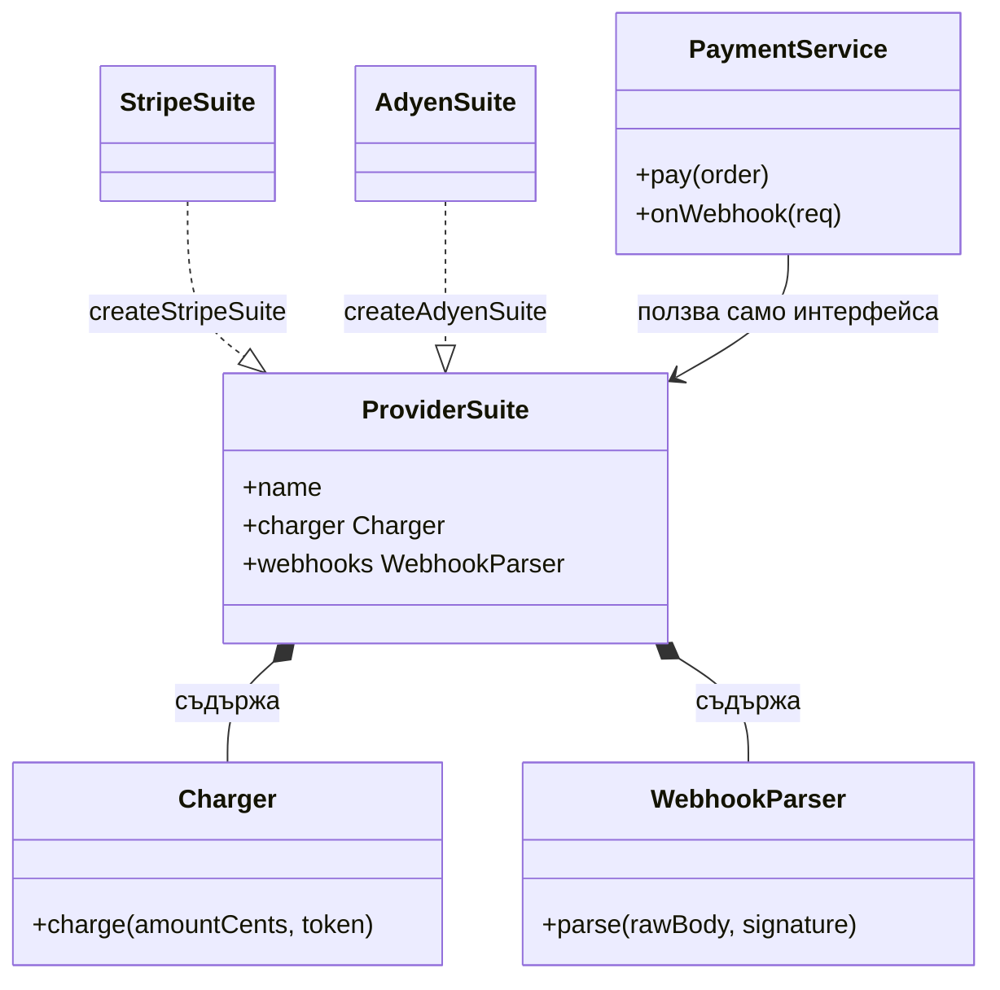
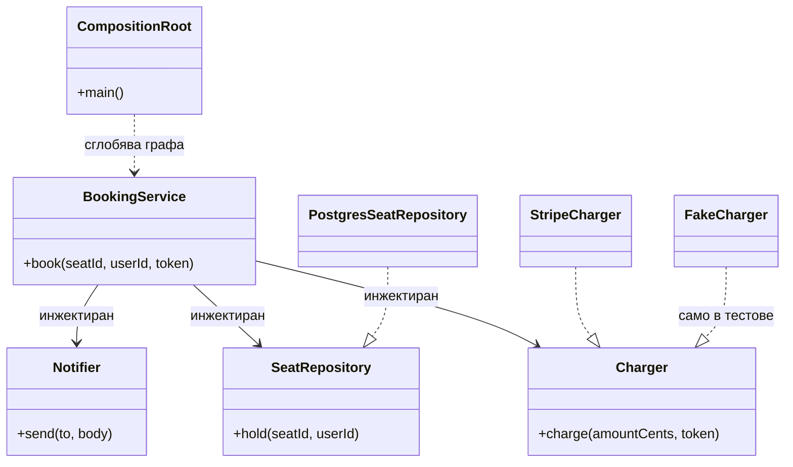

# Дизайн патерни: Creational (Singleton, Factory, Abstract Factory, Builder, Prototype, Dependency Injection)

Creational патерните отговарят на един въпрос: **кой създава обектите и кой знае конкретния им
клас.** Всеки път, когато в кода има `new PaymentProvider(...)` на десет места, смяната на доставчика
е десет редакции и нула тестове без реален доставчик. Патерните долу изнасят създаването на едно
място, така че останалият код да работи с интерфейс, а не с конструктор.

В Node.js тези патерни изглеждат различно от книгата на GoF, защото езикът има три неща, които Java
от 1994 г. нямаше:

- **ES модулите са кеширани singleton-и.** Едно `export const pool = createPool()` дава един инстанс
  за целия процес без клас, без `getInstance()` и без лок.
- **Функциите са първокласни.** Factory е просто функция, която връща обект. Не трябва
  `AbstractFactory` с `createProduct()`; трябва `createNotifier(kind)`.
- **Обектите са литерали и closure-и.** Builder често се свежда до обект с опционални полета и
  `{ ...defaults, ...overrides }`, а "клас с частни полета" е closure.

Пълната класова форма все пак печели на три места: когато патернът се излага като публично API на
библиотека (потребителите очакват `new Client()`), когато инстансът носи много състояние и методи, и
когато трябва да се подменя в тестове през DI контейнер. Останалото време по-простият идиом е
по-добрият код, и точно това интервюиращият проверява: разбираш ли патерна достатъчно, за да го
опростиш.

| Патерн | Проблемът | Node.js идиом | Кога НЕ |
| --- | --- | --- | --- |
| **Singleton** | Един скъп ресурс (DB pool, config, logger) трябва да е един за процеса | Module-level инстанс, кеширан от ESM loader-а | За бизнес състояние; когато има много процеси или worker threads и "един" вече не значи един |
| **Factory Method** | Викащият не трябва да знае конкретния клас | Функция `createX(kind)` или registry `Map<kind, ctor>` | Когато има само една имплементация и няма изгледи за втора |
| **Abstract Factory** | Семейство от свързани обекти трябва да е консистентно (всички за Stripe или всички за Adyen) | Обект с няколко factory функции, върнат от една `createProviderSuite()` | Когато семействата не се сменят заедно; тогава са отделни factory-та |
| **Builder** | Обект с много опционални части, някои валидни само в комбинация | Fluent chain или литерал с defaults; query builders като Knex/Drizzle | За обекти с 3 полета; литералът е builder |
| **Prototype** | Нов обект, който е копие на съществуващ с малка промяна | `structuredClone`, spread, `Object.create` | Когато обектът държи ресурси (сокети, handle-и), които не се клонират |
| **Dependency Injection** | Тестове и смяна на имплементация без редакция на потребителя | Constructor injection + малък контейнер или ръчна композиция в `main.ts` | В скриптове и малки услуги; контейнерът е повече код от приложението |

## Singleton

### Проблемът

Всеки Postgres pool отваря N връзки. Ако три модула правят `new Pool()` всеки за себе си, процесът
държи 3N връзки, PgBouncer-ът се пълни, а базата отхвърля клиенти. Същото важи за конфигурацията
(четена от env веднъж, не при всяка заявка) и за logger-а (един транспорт, една буферизация).

### Решението

Инстансът се създава веднъж и всички получават същата референция. В GoF това е клас с частен
конструктор и статичен `getInstance()`. В Node достатъчно е модулът да създаде инстанса при първо
зареждане: ESM loader-ът кешира модула по URL и всяко `import` връща същия обект.

### Node.js пример

```ts
import { hostname } from 'node:os';

interface Pool {
  query(sql: string): Promise<{ rows: unknown[] }>;
  end(): Promise<void>;
}

function createPool(connectionString: string): Pool {
  let open = true;
  console.log(`pool opened on ${hostname()} -> ${connectionString}`);
  return {
    async query(sql) {
      if (!open) throw new Error('pool is closed');
      return { rows: [{ sql }] };
    },
    async end() { open = false; },
  };
}

// Lazy: the pool is created at first use, not at import time, so importing this
// module in a unit test does not open real connections.
let instance: Pool | null = null;

export function getPool(): Pool {
  instance ??= createPool(process.env.DATABASE_URL ?? 'postgres://localhost/app');
  return instance;
}

export async function closePool(): Promise<void> {
  await instance?.end();
  instance = null;
}

const a = getPool();
const b = getPool();
console.log(a === b);
await a.query('select 1');
await closePool();
```

### Как изглежда в реален Node код

- Най-честата форма е просто `export const pool = new Pool(config)` в `db.ts`. Работи, но
  създава пула при `import`, тоест всеки тест, който импортира какъвто и да е модул от веригата,
  отваря реални връзки. Затова lazy `getPool()` е по-добрият вариант.
- **Модулният кеш не е глобален lock.** Той е един за реалм и за URL. Гаранцията се чупи при:
  два копия на пакета в `node_modules` (два URL-а, два инстанса); `jest` с `resetModules` или
  изолирани модулни регистри на тест; `worker_threads`, където всеки worker има собствен модулен кеш;
  и cluster mode, където "singleton" е по един на процес. Ако наистина трябва **един за машината**,
  това вече е lock файл или lease в Redis, не езиков патерн.
- `globalThis` понякога се използва като по-твърд singleton (Prisma го препоръчва в dev, за да
  оцелее hot reload-а). Това е признание, че модулният кеш се рестартира, не по-добър дизайн.

### Кога да го ползваш и кога не

- Да: инфраструктурни ресурси с реална цена на създаване (pool, HTTP agent с keep-alive, метрики
  registry, компилирани схеми).
- Не: за бизнес състояние ("текущият потребител", "текущата игра"). Това е глобална променлива с
  друго име, невъзможна за тестване паралелно и грешна в момента, в който има втори процес.
- Не: като заместител на DI. Кодът, който вика `getPool()` отвътре, не може да получи тестов пул без
  мокване на модула. По-добре пулът да се подава на конструктора, а singleton-ът да живее само в
  `main.ts`, където се композира приложението.

### Връзка със системите в тази папка

- [Online Trading Game](Online_Trading_Game.md): NATS връзката и Valkey клиентът са по един на процес; но
  "един owner на игра" е lease във Valkey, защото процесите са много. Разликата между двете е точно
  границата на Singleton.
- [Rate Limiter](Distributed_Web_Crawler.md): локалният брояч е process-level singleton, а точният
  лимит е в Redis, защото singleton-ът не е споделен между инстанциите.

## Factory Method

### Проблемът

Notification worker-ът праща през FCM, APNs, SES и Twilio. Ако кодът на worker-а има
`switch (channel)` с `new FcmClient()`, `new TwilioClient()`, добавянето на нов канал редактира
worker-а, а тестването му изисква реални клиенти.

### Решението

Създаването се изнася във функция, която приема дискриминатор (тип канал) и връща обект зад общ
интерфейс. Викащият знае само интерфейса. Регистър `Map<kind, factory>` позволява каналите да се
добавят без редакция на функцията.

### Node.js пример

```ts
interface Notifier {
  send(to: string, body: string): Promise<{ providerId: string }>;
}

type NotifierFactory = (config: Record<string, string>) => Notifier;

const registry = new Map<string, NotifierFactory>();

export function registerNotifier(kind: string, factory: NotifierFactory): void {
  if (registry.has(kind)) throw new Error(`notifier ${kind} already registered`);
  registry.set(kind, factory);
}

export function createNotifier(kind: string, config: Record<string, string>): Notifier {
  const factory = registry.get(kind);
  if (!factory) throw new Error(`unknown notifier kind: ${kind}`);
  return factory(config);
}

registerNotifier('sms', (cfg) => ({
  async send(to, body) {
    return { providerId: `twilio:${cfg.accountSid}:${to}:${body.length}` };
  },
}));

registerNotifier('push', (cfg) => ({
  async send(to, body) {
    return { providerId: `fcm:${cfg.projectId}:${to}:${body.length}` };
  },
}));

const sms = createNotifier('sms', { accountSid: 'AC123' });
console.log(await sms.send('+359888000000', 'OTP 4821'));
```

### Как изглежда в реален Node код

- Почти никога не е клас с абстрактен `createProduct()`. Е функция `createX()` или обект-регистър.
- Registry с `register()` е формата, която позволява плъгини: всеки канал е отделен файл, който при
  import се регистрира сам. Цената е, че редът на import-ите става важен, и че "кой е регистриран"
  не се вижда статично. Затова в по-строги проекти регистърът е един изричен литерал в `main.ts`.
- Factory-то е и мястото за валидиране на конфигурацията с Zod, преди обектът да съществува.
  Невалиден `accountSid` се хваща при старт, не при първия SMS.

### Кога да го ползваш и кога не

- Да: повече от една имплементация на интерфейс, избирана по конфигурация или по данни (канал,
  регион, тип файл).
- Да: когато създаването има стъпки (валидация, свързване, кеш), които не бива да се копират.
- Не: една имплементация "за всеки случай". `createUserService()` с един-единствен клон е шум.
- Внимание: factory, което връща различни интерфейси според `kind`, не е factory, а `any` с
  повече редове. Общият интерфейс е смисълът на патерна.

### Връзка със системите в тази папка

- [Notification System](Notification_system.md): provider adapters за всеки канал се създават през
  factory, а Circuit Breaker-ът около всеки е Decorator върху резултата (виж
  [Structural](Design_Patterns_Structural.md)).
- [Video Platform](Video_platform_like_Udemy.md): encoder-ът (CPU/GPU, H.264/AV1) се избира от factory по
  профил на задачата.

## Abstract Factory

### Проблемът

Платежният доставчик не е един обект. За Stripe трябват клиент за плащания, парсер на webhook-и с
проверка на подпис и mapper на грешките към вътрешни кодове. Ако Payment Service взима "Stripe клиент"
от едно factory и "Adyen webhook парсер" от друго, получаваш плащане през единия и потвърждение,
което никога не идва, защото го чете парсер за другия.

### Решението

Едно factory връща **цялото семейство** от свързани обекти, така че да е невъзможно да се смесят.
Викащият избира доставчик веднъж и получава suite, чиито части са гарантирано консистентни.

### Node.js пример

```ts
interface Charger {
  charge(amountCents: number, token: string): Promise<{ chargeId: string }>;
}

interface WebhookParser {
  parse(rawBody: string, signature: string): { type: string; chargeId: string };
}

interface ProviderSuite {
  readonly name: string;
  charger: Charger;
  webhooks: WebhookParser;
}

function createStripeSuite(secret: string): ProviderSuite {
  return {
    name: 'stripe',
    charger: { async charge(amount, token) { return { chargeId: `ch_${token}_${amount}` }; } },
    webhooks: {
      parse(raw, sig) {
        if (sig !== `sha256=${secret}`) throw new Error('bad stripe signature');
        return JSON.parse(raw);
      },
    },
  };
}

function createAdyenSuite(hmacKey: string): ProviderSuite {
  return {
    name: 'adyen',
    charger: { async charge(amount, token) { return { chargeId: `psp_${token}_${amount}` }; } },
    webhooks: {
      parse(raw, sig) {
        if (sig !== `hmac=${hmacKey}`) throw new Error('bad adyen hmac');
        return JSON.parse(raw);
      },
    },
  };
}

export function createProviderSuite(env: NodeJS.ProcessEnv): ProviderSuite {
  return env.PAYMENT_PROVIDER === 'adyen'
    ? createAdyenSuite(env.ADYEN_HMAC ?? 'dev')
    : createStripeSuite(env.STRIPE_SECRET ?? 'dev');
}

const suite = createProviderSuite({ PAYMENT_PROVIDER: 'stripe', STRIPE_SECRET: 'dev' });
const { chargeId } = await suite.charger.charge(1999, 'tok_visa');
console.log(suite.name, chargeId, suite.webhooks.parse('{"type":"charge.succeeded","chargeId":"ch_1"}', 'sha256=dev'));
```



### Как изглежда в реален Node код

- Обект с няколко полета, върнат от една функция. Няма нужда от `AbstractProviderFactory` клас.
- Suite-ът обикновено е и границата на пакета: `@app/payments-stripe` експортира
  `createStripeSuite`, а core пакетът знае само `ProviderSuite`. Така компилаторът пази
  консистентността, а не дисциплината на екипа.
- Multi-tenant вариант: suite на tenant (всеки клиент на SaaS-а със свой Stripe акаунт), кеширан в
  `Map<tenantId, ProviderSuite>`. Factory-то е и мястото за този кеш.

### Кога да го ползваш и кога не

- Да: два и повече обекта, които **трябва** да са от един и същ доставчик или версия (клиент + парсер,
  serializer + deserializer, encoder + manifest writer).
- Не: обекти, които се сменят независимо. Ако SMS доставчикът и email доставчикът се избират
  поотделно, това са две Factory Method-и, не един Abstract Factory.
- Цената: всяка нова част от семейството е промяна във всички suite-ове. Затова интерфейсът на
  suite-а трябва да е малък.

### Връзка със системите в тази папка

- [Payment System](Payment_System_Stripe_Wallet.md): charge, refund и webhook парсерът са едно
  семейство; смесването им е реалният бъг "платено без потвърждение".
- [Ticketmaster](Ticketmaster.md): Saga-та вика Payment Service, който зад себе си държи suite; при
  failover към втори доставчик се сменя целият suite, не отделен клиент.

## Builder

### Проблемът

Заявка за търсене има 12 опционални части: филтри, сортиране, пагинация, полета за връщане,
timeout, флаг за consistent read. Конструктор с 12 параметъра, половината `undefined`, е нечетим и
позволява невалидни комбинации (`cursor` заедно с `offset`). Същото е при HTTP заявки, Kafka
producer конфигурации, PDF документи.

### Решението

Обектът се сглобява стъпка по стъпка през малки методи, всеки връща builder-а (fluent), а `build()`
валидира комбинацията и връща неизменяем резултат. Builder-ът може да пази defaults и да отказва
невалидни състояния още при извикване на метода.

### Node.js пример

```ts
interface Query {
  readonly table: string;
  readonly where: ReadonlyArray<{ column: string; op: '=' | '<' | '>'; value: unknown }>;
  readonly orderBy?: { column: string; dir: 'asc' | 'desc' };
  readonly limit: number;
  readonly cursor?: string;
}

class QueryBuilder {
  #q: { table: string; where: Query['where'][number][]; orderBy?: Query['orderBy']; limit: number; cursor?: string };

  constructor(table: string) {
    this.#q = { table, where: [], limit: 50 };
  }

  where(column: string, op: '=' | '<' | '>', value: unknown): this {
    this.#q.where.push({ column, op, value });
    return this;
  }

  orderBy(column: string, dir: 'asc' | 'desc' = 'asc'): this {
    this.#q.orderBy = { column, dir };
    return this;
  }

  limit(n: number): this {
    if (n < 1 || n > 500) throw new RangeError('limit must be 1..500');
    this.#q.limit = n;
    return this;
  }

  after(cursor: string): this {
    this.#q.cursor = cursor;
    return this;
  }

  build(): Query {
    // Cursor pagination is only deterministic with an explicit order; enforcing it
    // here keeps every consumer of Query from re-checking the invariant.
    if (this.#q.cursor && !this.#q.orderBy) throw new Error('cursor requires orderBy');
    return Object.freeze({ ...this.#q, where: [...this.#q.where] });
  }
}

const q = new QueryBuilder('messages')
  .where('chat_id', '=', 42)
  .where('seq_id', '<', 9000)
  .orderBy('seq_id', 'desc')
  .limit(50)
  .after('opaque-cursor')
  .build();

console.log(JSON.stringify(q));
```

### Как изглежда в реален Node код

- Knex, Drizzle, Prisma query API, `new URL()` + `searchParams`, `fetch` `Request` конфигурации:
  всичките са builder-и. Интервюиращият търси да кажеш, че **типизираният builder прави
  невалидната комбинация compile-time грешка**, което Drizzle постига с генерични типове, а
  обикновен литерал не може.
- За обекти без инварианти между полетата литералът с defaults е достатъчен и по-четим:
  `const cfg = { ...DEFAULTS, ...overrides }`. Builder-ът се оправдава от `build()` с проверки.
- Директор (GoF "Director"), който подрежда стъпките, в Node е просто функция
  `buildRecentMessagesQuery(chatId)`, която ползва builder-а. Не заслужава клас.

### Кога да го ползваш и кога не

- Да: много опционални части; инварианти между тях; резултатът трябва да е immutable; същият
  обект се сглобява от няколко места със споделени defaults.
- Не: три полета без връзки помежду им. Builder за `{ host, port }` е cargo cult.
- Внимание: mutable builder, споделен между заявки, е race condition в async код. Builder-ът е
  per-use обект или immutable (всеки метод връща нов builder).

### Връзка със системите в тази папка

- [Chat System](Chat_system_WhatsApp_Slack%20_Messenger.md): keyset пагинацията
  (`WHERE chat_id = ? AND seq_id < ? LIMIT 50`) е точно инвариантът "cursor изисква ред", който
  builder-ът пази.
- [Search Autocomplete](Search_Autocomplete_Typeahead.md): Trie Builder-ът сглобява индекса стъпка по
  стъпка (агрегация, филтри, top-K) и връща immutable snapshot; оригиналният смисъл на патерна.

## Prototype

### Проблемът

Online Trading Game създава бот за всяко празно място. Профилът на бота (име, аватар, параметри на стратегията,
seed) е един и същ шаблон с малки разлики. Ако всеки бот се конструира от нулата с 15 параметъра,
кодът е дълъг, а грешка в един параметър се повтаря на 15 места. Същото при "дублирай кампания",
"копирай конфигурацията на staging в production с два различни ключа".

### Решението

Нов обект се прави като копие на съществуващ (прототип) и после се променя само разликата.
JavaScript има това вградено: `structuredClone` за дълбоко копие на данни, spread за плитко,
`Object.create(proto)` за прототипно наследяване на поведение.

### Node.js пример

```ts
interface BotProfile {
  name: string;
  avatar: string;
  strategy: { aggression: number; maxBetCents: number; cooldownMs: number };
  seed: number;
}

const conservativeTemplate: BotProfile = Object.freeze({
  name: 'template',
  avatar: 'default.png',
  strategy: { aggression: 0.2, maxBetCents: 500, cooldownMs: 4000 },
  seed: 0,
});

export function spawnBot(template: BotProfile, overrides: Partial<BotProfile>, seed: number): BotProfile {
  // structuredClone prevents two bots from sharing the nested strategy object,
  // which a spread copy would silently do.
  const bot = structuredClone(template);
  Object.assign(bot, overrides, { seed });
  return bot;
}

const names = ['Ivo', 'Maria', 'Stan'];
const bots = names.map((name, i) => spawnBot(conservativeTemplate, { name, avatar: `${name.toLowerCase()}.png` }, 1000 + i));

bots[0].strategy.aggression = 0.9;
console.log(bots[0].strategy.aggression, bots[1].strategy.aggression, conservativeTemplate.strategy.aggression);
```

### Как изглежда в реален Node код

- `structuredClone` (Node 17+) е правилният дълбок клон за данни: справя се с Map, Set, Date,
  циклични референции. Не клонира функции, class instances губят прототипа си, не клонира сокети и
  handle-и. Затова Prototype е за **данни**, не за ресурси.
- `{ ...obj }` е плитко копие и е най-честият източник на бъга "промених един бот, промениха се
  всички". В примера по-горе spread би споделил `strategy`.
- `Object.create(proto)` е буквалният prototype pattern на езика: обект, който делегира към друг.
  В модерния backend код се среща рядко и обикновено е сигнал за класа.
- Снимката (snapshot) в Online Trading Game и Event Sourcing snapshot-ите са Prototype в разпределен вид: ново
  състояние = копие на старото + прилагане на разликата.

### Кога да го ползваш и кога не

- Да: обекти-шаблони с много общи полета (бот профили, шаблони на кампании, default конфигурации по
  среда).
- Да: immutable update стил (`{ ...state, balance: state.balance - bet }`), който е основата на
  редуктори и на детерминистичните симулации.
- Не: обекти с ресурси или identity (DB връзка, WebSocket, "потребител с id"). Клонираният
  потребител с същото id е бъг, не патерн.

### Връзка със системите в тази папка

- [Online Trading Game](Online_Trading_Game.md): ботовете се създават от шаблон в паметта на game
  node-а; snapshot-ът на играта е копие, от което takeover продължава.
- [Notification System](Notification_system.md): шаблоните за известия се клонират и попълват с данни на
  потребителя, а не се сглобяват в кода на worker-а.

## Dependency Injection

### Проблемът

`BookingService` вътрешно прави `getPool()`, `new StripeClient(process.env.KEY)` и
`createNotifier('sms')`. За да го тестваш, трябва да мокнеш три модула, а за да го пуснеш срещу
Adyen, да редактираш класа. Зависимостите са скрити в тялото и никой не може да ги види, без да
прочете целия код.

### Решението

Зависимостите се подават отвън, обикновено през конструктора, като интерфейси. Един-единствен
"composition root" (`main.ts`) знае конкретните класове и сглобява графа. Тестът подава фалшиви
имплементации. Контейнер (Awilix, tsyringe, NestJS) автоматизира сглобяването, когато графът стане
голям.

### Node.js пример

```ts
interface SeatRepository {
  hold(seatId: string, userId: string): Promise<boolean>;
}
interface Charger {
  charge(amountCents: number, token: string): Promise<{ chargeId: string }>;
}
interface Notifier {
  send(to: string, body: string): Promise<unknown>;
}
interface Clock {
  now(): Date;
}

class BookingService {
  #seats: SeatRepository;
  #charger: Charger;
  #notifier: Notifier;
  #clock: Clock;

  constructor(deps: { seats: SeatRepository; charger: Charger; notifier: Notifier; clock: Clock }) {
    this.#seats = deps.seats;
    this.#charger = deps.charger;
    this.#notifier = deps.notifier;
    this.#clock = deps.clock;
  }

  async book(seatId: string, userId: string, token: string): Promise<string> {
    const held = await this.#seats.hold(seatId, userId);
    if (!held) throw new Error('seat taken');
    const { chargeId } = await this.#charger.charge(4500, token);
    await this.#notifier.send(userId, `Ticket ${seatId} confirmed at ${this.#clock.now().toISOString()}`);
    return chargeId;
  }
}

// Composition root: the only place that knows concrete implementations.
const sent: string[] = [];
const service = new BookingService({
  seats: { async hold() { return true; } },
  charger: { async charge(amount, token) { return { chargeId: `ch_${token}_${amount}` }; } },
  notifier: { async send(_to, body) { sent.push(body); } },
  clock: { now: () => new Date('2026-09-30T10:00:00Z') },
});

console.log(await service.book('A42', 'user-7', 'tok_visa'), sent);
```



### Как изглежда в реален Node код

- **Ръчна композиция** в `main.ts` е достатъчна до около 20-30 сървиса. Явна е, типизирана е,
  дебъгва се с "go to definition".
- **Awilix** дава контейнер с `asClass(...).singleton()` и lifetime на заявка (scoped), полезен за
  "един транзакционен контекст на HTTP заявка". **tsyringe** и **NestJS** ползват декоратори и
  `reflect-metadata`, което изисква TypeScript компилация с `emitDecoratorMetadata`; не работи с
  чистото type stripping на Node 24. Това е реален аргумент срещу тях в проекти без build стъпка.
- Обектът `deps` в конструктора (вместо позиционни параметри) е конвенцията, защото добавянето на
  зависимост не чупи извикванията и защото се чете като именувани аргументи.
- Функционалният вариант: `createBookingService(deps)` връща обект с методи; closure-ът държи
  зависимостите. Еквивалентен е на класа и по-кратък, но губи `instanceof` и по-трудно се профилира
  (всички методи са анонимни функции в heap snapshot-а).

### Кога да го ползваш и кога не

- Да: всяка бизнес логика, която пипа I/O. Правилото: I/O се подава отвън, чистата логика е
  вътре. Така unit тестовете са бързи и без мокване на модули.
- Да: `Clock`, `Random`, `IdGenerator` като зависимости. Детерминистичните тестове на Online Trading Game
  ботовете са възможни само защото seed-ът и часовникът се инжектират.
- Не: контейнер за скрипт от 200 реда или за lambda функция. Композицията на ръка е контейнерът.
- Внимание: "service locator" (`container.resolve('charger')` вътре в класа) изглежда като DI, но
  връща скритите зависимости. Класът пак не казва от какво зависи.

### Връзка със системите в тази папка

- [Ticketmaster](Ticketmaster.md): Booking Service зависи от seats repository, payment и
  notification; Saga orchestrator-ът е composition root за стъпките.
- [Online Trading Game](Online_Trading_Game.md): "money логиката е TypeScript, тестван като чисти
  функции" е възможно, защото ledger-ът не знае за NATS и Valkey; те се инжектират в game node-а.
- [Payment System](Payment_System_Stripe_Wallet.md): provider suite-ът се инжектира, така че
  тестовете на ledger-а минават без реален Stripe.

## Въпроси за интервюто

### Singleton в Node: нужен ли е клас?

Не. ESM модулът е кеширан веднъж за реалм и `export const x = create()` дава един инстанс. Класът с
`getInstance()` добавя само церемония. Заслужава да се каже обаче къде модулният кеш **не** е един:
worker threads, cluster процеси, дублирани копия на пакет в `node_modules`, jest с изолирани модули.
За "един за машината или клъстера" отговорът е lock или lease, не езиков патерн.

### Как тестваш код, който ползва Singleton?

Като не го ползва вътрешно. Singleton-ът живее в composition root-а и се подава на класа през
конструктора. Ако кодът вече вика `getPool()` отвътре, вариантите са `vi.mock`/`jest.mock` на модула
(крехко) или `setPoolForTests()` (пробива инкапсулацията). Двете са симптом, а лечението е DI.

### Factory Method или Abstract Factory?

Factory Method връща **един** обект зад интерфейс, избран по параметър. Abstract Factory връща
**семейство** обекти, които трябва да са консистентни помежду си. Тестът: ако смяната на едно
factory без другото е бъг (Stripe charger + Adyen webhook parser), трябва ти Abstract Factory.

### Factory или DI контейнер?

Различни нива. Factory решава "как се създава обект X" и е част от домейна. Контейнерът решава
"как се сглобява целият граф и с какъв lifetime" и е инфраструктура. Контейнерът често **вика**
factory-та за обекти, чието създаване зависи от runtime данни (tenant, request). Малък проект: ръчна
композиция. Голям, с per-request scope: контейнер.

### Кога Builder е излишен?

Когато обектът няма инварианти между полетата и има под 5-6 полета. Тогава литерал с defaults и
`Partial<T>` overrides е builder без класа. Builder-ът се оправдава от `build()` с проверки и от
типове, които правят невалидните комбинации невъзможни.

### Каква е разликата между spread и structuredClone и защо е важна за Prototype?

Spread копира едно ниво; вложените обекти остават споделени. `structuredClone` копира дълбоко и
пази Map/Set/Date/цикли, но губи прототипите на класове и не клонира функции и handle-и. Бъгът
"промених един бот, промениха се всички" е spread върху вложен обект.

### Какво е composition root и защо трябва да е един?

Единственото място, което импортира конкретни имплементации и ги сглобява. Един, защото иначе
конкретните класове "изтичат" в бизнес кода и графът на зависимостите става невидим. В Node това е
`main.ts` или `app.ts`; тестовете имат свой composition root с фалшиви имплементации.

### Защо декораторните DI библиотеки са проблем при Node 24 type stripping?

`reflect-metadata` и `emitDecoratorMetadata` изискват TypeScript компилатор, който емитира типова
информация в runtime. Node 24 само сваля типовете и не изпълнява декоратори по подразбиране, така че
tsyringe/NestJS стилът изисква build стъпка. Awilix или ръчна композиция работят директно.
