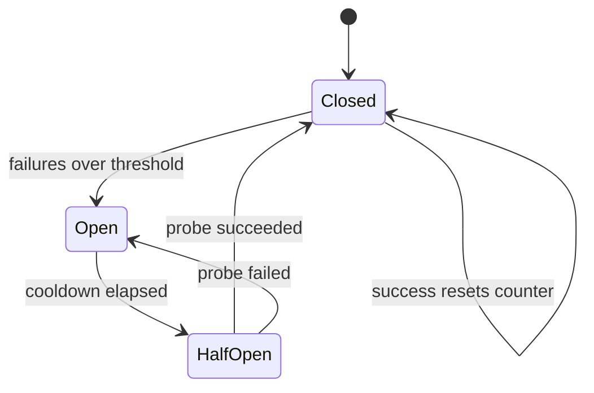

# Архитектурни и резилиънс патерни в Node.js код (Middleware, Repository, Unit of Work, DI, Event-driven, Streams, Circuit Breaker, Retry, Idempotency, Outbox)

[System_Design.md](System_Design.md) описва патерните като кутийки и стрелки. Този документ показва
как същите патерни изглеждат в един Node.js сървис на ниво код: какво е транзакционната граница, къде
живее request id-то, как се пише outbox relayer, какво точно прави circuit breaker-ът в 40 реда.

Причината да има отделен документ: на интервю за senior Node позиция след system design въпроса почти
винаги идва "а как би го написал". Кандидат, който казва "ползвам Outbox", но не може да обясни какво
прави `FOR UPDATE SKIP LOCKED` в relayer-а, е запомнил термин, не патерн.

Всички примери са TypeScript, който работи на Node 24 без build стъпка (`node file.ts`). Външните
зависимости (Redis, Postgres, Kafka) са зад минимални интерфейси, за да е ясно кой метод се ползва и
защо, без да зависим от конкретна библиотека.

| Патерн | Проблемът в едно изречение | Ключовият механизъм в Node |
| --- | --- | --- |
| Middleware + request context | Корелация на логове без да подаваш `requestId` през 20 функции | `AsyncLocalStorage` |
| Repository + Unit of Work | Транзакцията да обхваща няколко записа, без SQL в бизнес логиката | `withTransaction(async (tx) => ...)` |
| Dependency Injection | Тестваемост и смяна на имплементация без глобални импорти | Composition root, constructor injection |
| Transactional Outbox | Запис в базата и събитие в брокера да са една транзакция | Таблица `outbox` + relayer със `SKIP LOCKED` |
| Idempotency middleware | Retry на клиента да не създаде втори запис | `SET NX EX` + запазен отговор |
| Retry + timeout budget | Преходните грешки да се преживяват без thundering herd | Exponential backoff с jitter, `AbortSignal` |
| Circuit Breaker | Паднала зависимост да не изяде всички връзки с таймаути | Closed / Open / Half-open брояч |
| Bulkhead | Една бавна зависимост да не блокира останалите | Семафор за паралелизъм на зависимост |
| Token bucket в Redis | Лимит, споделен между инстанции, атомарен | Lua скрипт през `EVAL` |
| Streams + backpressure | Експорт на милиони редове без OOM | `pipeline`, `Transform`, `highWaterMark` |
| Graceful shutdown | Деплой без прекъснати заявки и загубени съобщения | `SIGTERM`, drain, затваряне на pools |
| Single writer per entity | Операции по един акаунт да се сериализират без разпределен лок | Опашка от promise-и по ключ |

## 1. Middleware pipeline и request context

### Проблемът

Всеки лог ред трябва да носи `requestId` и `traceId`, за да може инцидентът да се проследи през
десетте функции, които заявката минава. Наивното решение е да се подава `ctx` като първи аргумент на
всяка функция, включително в repository слоя, който няма нужда от него. Резултатът е сигнатури,
замърсени с параметър, който само се предава нататък.

### Решението

`AsyncLocalStorage` от `node:async_hooks` държи стойност, видима за всичко, което се изпълнява
асинхронно "под" даден `run()`. Middleware-ът поставя контекста в началото на заявката, а логерът го
чете отвсякъде, без параметър. Това е Thread Local Storage за event loop.

### Node.js пример

```ts
import { AsyncLocalStorage } from 'node:async_hooks';
import { randomUUID } from 'node:crypto';

type RequestContext = { requestId: string; traceId: string; userId?: string; startedAt: number };
const storage = new AsyncLocalStorage<RequestContext>();

export const context = {
  get(): RequestContext | undefined { return storage.getStore(); },
  set(patch: Partial<RequestContext>) {
    const store = storage.getStore();
    if (store) Object.assign(store, patch);
  },
};

export const log = {
  info(msg: string, extra: Record<string, unknown> = {}) {
    const ctx = storage.getStore();
    console.log(JSON.stringify({ level: 'info', msg, requestId: ctx?.requestId, traceId: ctx?.traceId, userId: ctx?.userId, ...extra }));
  },
};

type Req = { headers: Record<string, string | undefined> };
type Next = () => Promise<void>;

export function requestContext(req: Req, next: Next): Promise<void> {
  const ctx: RequestContext = {
    requestId: randomUUID(),
    // Ако upstream вече е пуснал trace, продължаваме него, за да не се къса веригата.
    traceId: req.headers['traceparent']?.split('-')[1] ?? randomUUID().replace(/-/g, ''),
    startedAt: Date.now(),
  };
  return storage.run(ctx, next);
}

async function authenticate(req: Req, next: Next) {
  context.set({ userId: req.headers.authorization?.replace('Bearer ', '') });
  await next();
}

async function repositoryCall() {
  await new Promise((r) => setTimeout(r, 5));
  log.info('SELECT ... FROM bets');
}

const req: Req = { headers: { authorization: 'Bearer u42' } };
await requestContext(req, () => authenticate(req, async () => {
  await repositoryCall();
  log.info('done', { ms: Date.now() - (context.get()?.startedAt ?? 0) });
}));
```

Двата лог реда носят един и същ `requestId`, а `repositoryCall` не знае нищо за заявки.

### Кога да го ползваш и кога не

Ползвай го за наблюдаемост (request id, trace, tenant, локал), за неща, които всички слоеве могат да
искат и никой не бива да променя бизнес логиката според тях. Не го ползвай за подаване на бизнес
данни (`userId` за проверка на права трябва да е явен аргумент, иначе функцията има скрита зависимост
и тестът ѝ трябва да настройва storage). Цената: малък overhead на всеки async hop и контекст, който се
губи при ръчно създадени `EventEmitter` слушатели извън `run()`. OpenTelemetry SDK за Node ползва
точно този механизъм.

### Връзка със системите

- Всяка система в папката, чиито "Observability" секции говорят за разпределен tracing: trace id-то
  минава през `traceparent` заглавие между сървисите и през `AsyncLocalStorage` вътре в процеса.
- [Chat](Chat_system_WhatsApp_Slack%20_Messenger.md): при WebSocket контекстът се създава на
  съобщение, не на връзка, иначе всички съобщения от една връзка имат едно request id.

## 2. Repository + Unit of Work

### Проблемът

Резервация на място означава: условен `UPDATE` на `seats`, `INSERT` в `bookings`, `INSERT` в
`outbox`. Трите трябва да са в една транзакция. Ако всеки repository отваря собствена връзка и
транзакция, атомарността е невъзможна; ако бизнес логиката пише SQL, за да ги събере, repository-тата
са безсмислени.

### Решението

Repository-то не притежава връзка. Получава транзакционен handle (`tx`) като аргумент и изпълнява
заявките си върху него. Unit of Work е функцията `withTransaction`, която отваря транзакцията, подава
`tx` на бизнес логиката и прави `COMMIT` или `ROLLBACK`. Бизнес логиката вика repository-та, не SQL.

### Node.js пример

```ts
interface Queryable { query<T = unknown>(sql: string, params?: unknown[]): Promise<{ rows: T[]; rowCount: number }> }
interface Pool extends Queryable { connect(): Promise<Queryable & { release(): void }> }

export async function withTransaction<T>(pool: Pool, work: (tx: Queryable) => Promise<T>): Promise<T> {
  const client = await pool.connect();
  try {
    await client.query('BEGIN');
    const result = await work(client);
    await client.query('COMMIT');
    return result;
  } catch (err) {
    await client.query('ROLLBACK').catch(() => undefined);
    throw err;
  } finally {
    client.release();
  }
}

class SeatRepository {
  async hold(tx: Queryable, seatId: string, userId: string, ttlMinutes: number): Promise<boolean> {
    const res = await tx.query(
      `UPDATE seats SET status = 'HELD', held_by = $2, hold_expires_at = NOW() + ($3 || ' minutes')::interval
       WHERE seat_id = $1 AND (status = 'AVAILABLE' OR (status = 'HELD' AND hold_expires_at < NOW()))`,
      [seatId, userId, String(ttlMinutes)],
    );
    return res.rowCount === 1;
  }
}

class BookingRepository {
  async createPending(tx: Queryable, seatId: string, userId: string): Promise<string> {
    const res = await tx.query<{ id: string }>(
      `INSERT INTO bookings (seat_id, user_id, status) VALUES ($1, $2, 'PENDING') RETURNING id`,
      [seatId, userId],
    );
    return res.rows[0].id;
  }
}

class OutboxRepository {
  async add(tx: Queryable, type: string, payload: unknown): Promise<void> {
    await tx.query(`INSERT INTO outbox (type, payload) VALUES ($1, $2)`, [type, JSON.stringify(payload)]);
  }
}

export class BookingService {
  private pool: Pool;
  private seats: SeatRepository;
  private bookings: BookingRepository;
  private outbox: OutboxRepository;
  constructor(pool: Pool, seats: SeatRepository, bookings: BookingRepository, outbox: OutboxRepository) {
    this.pool = pool; this.seats = seats; this.bookings = bookings; this.outbox = outbox;
  }

  async hold(seatId: string, userId: string): Promise<{ bookingId: string } | { error: 'taken' }> {
    return withTransaction(this.pool, async (tx) => {
      const ok = await this.seats.hold(tx, seatId, userId, 10);
      if (!ok) return { error: 'taken' as const };
      const bookingId = await this.bookings.createPending(tx, seatId, userId);
      await this.outbox.add(tx, 'booking.created', { bookingId, seatId, userId });
      return { bookingId };
    });
  }
}
```

Ако `outbox.add` хвърли, `UPDATE seats` се връща назад. Мястото не остава задържано без резервация.

### Кога да го ползваш и кога не

Ползвай Unit of Work винаги, когато операция пипа повече от една таблица. Repository е полезен,
когато заявката е достатъчно сложна, за да заслужава име (`hold`, `findExpiredHolds`), и когато
искаш да го замениш с in-memory версия в тестове. Става церемония, когато е `findById`/`save` върху
ORM, който вече прави точно това: тогава repository-то е обвивка без стойност. ORM-и като Prisma
дават `prisma.$transaction(async (tx) => ...)` със същата форма.

### Връзка със системите

- [Ticketmaster](Ticketmaster.md): условният `UPDATE` като гаранция за коректност и outbox записът в
  същата транзакция са точно този код.
- [Notification System](Notification_system.md): "алертът и outbox редът в една транзакция".

## 3. Dependency Injection без рамка

### Проблемът

`BookingService` импортира `pool` от `./db`, който при импорт се свързва с базата. Тестът на бизнес
логиката изисква жив Postgres. Смяната на Redis с in-memory кеш за локална разработка изисква
промяна на кода. Модулите зависят от конкретни инстанции, не от интерфейси.

### Решението

Зависимостите се подават през конструктора или фабрична функция, а свързването им става на едно
място: composition root (`main.ts`). Никой модул не импортира готова инстанция на инфраструктура. Тестът
подава double, продукцията подава реалния клиент. Рамка (NestJS, Awilix, tsyringe) автоматизира
свързването с decorators или контейнер, но принципът е същият и за малък сървис ръчният composition root
е по-прозрачен.

### Node.js пример

```ts
interface Cache { get(key: string): Promise<string | null>; set(key: string, value: string, ttlSec: number): Promise<void> }
interface LinkStore { findByKey(key: string): Promise<string | null> }
interface Clock { now(): number }

export class RedirectService {
  private cache: Cache;
  private store: LinkStore;
  private clock: Clock;
  constructor(cache: Cache, store: LinkStore, clock: Clock) { this.cache = cache; this.store = store; this.clock = clock; }

  async resolve(shortKey: string): Promise<{ url: string; source: 'cache' | 'db' } | null> {
    const cached = await this.cache.get(`url:${shortKey}`);
    if (cached === '__missing__') return null;
    if (cached) return { url: cached, source: 'cache' };
    const url = await this.store.findByKey(shortKey);
    // Negative caching: липсващият ключ също се кешира, иначе бот минава кеша при всяка заявка.
    await this.cache.set(`url:${shortKey}`, url ?? '__missing__', url ? 3600 : 60);
    return url ? { url, source: 'db' } : null;
  }
}

class MemoryCache implements Cache {
  private map = new Map<string, { value: string; expiresAt: number }>();
  private clock: Clock;
  constructor(clock: Clock) { this.clock = clock; }
  async get(key: string) {
    const hit = this.map.get(key);
    if (!hit || hit.expiresAt < this.clock.now()) return null;
    return hit.value;
  }
  async set(key: string, value: string, ttlSec: number) {
    this.map.set(key, { value, expiresAt: this.clock.now() + ttlSec * 1000 });
  }
}

export function buildApp(deps: { cache: Cache; store: LinkStore; clock: Clock }) {
  return { redirects: new RedirectService(deps.cache, deps.store, deps.clock) };
}

const clock: Clock = { now: () => Date.now() };
const app = buildApp({
  cache: new MemoryCache(clock),
  store: { findByKey: async (k) => (k === 'aX9kL2m' ? 'https://example.com' : null) },
  clock,
});
console.log(await app.redirects.resolve('aX9kL2m'));
console.log(await app.redirects.resolve('aX9kL2m'));
console.log(await app.redirects.resolve('nope'));
```

В продукция `buildApp` получава `RedisCache` и `PostgresLinkStore`; в тест получава `MemoryCache` и
фалшив `Clock`, с който изтичането на TTL се проверява без `setTimeout`.

### Кога да го ползваш и кога не

Ползвай constructor injection за всичко, което говори с външния свят (база, кеш, HTTP клиент,
часовник, случайност). Не инжектирай чисти функции и помощници без състояние: `import { slugify }` е
достатъчен. Рамка с контейнер се оправдава над 30-40 сървиса, когато ръчното свързване става
стотици редове; под това NestJS добавя магия, която на интервю трябва да можеш да обясниш (кога се
създава инстанцията, singleton или per-request scope).

### Връзка със системите

- [URL Shortener](URL_Shortener.md): примерът е read path-ът с cache-aside и negative caching.
- Всяка система с "какво става, ако Redis падне": инжектирана зависимост позволява да се подаде
  `NullCache`, който винаги връща miss, и системата да работи деградирано.

## 4. Event-driven граници и Transactional Outbox

### Проблемът

След `COMMIT` на резервацията трябва да се публикува `booking.created` в Kafka. Ако се публикува преди
commit, консуматорът вижда събитие за запис, който може да се rollback-не. Ако се публикува след и
процесът падне между двете, събитието е загубено. "Запиши в базата и прати в брокера" не е атомарно и
никога няма да бъде.

### Решението

Събитието се записва в таблица `outbox` в същата транзакция (виж секция 2). Отделен relayer чете
непубликуваните редове, публикува ги и ги маркира. При много инстанции на relayer-а редовете се
заключват със `FOR UPDATE SKIP LOCKED`, така че две инстанции никога не взимат един и същи ред, а
заключен ред не блокира другите. Доставката е at-least-once (падане между publish и маркиране повтаря
събитието), затова консуматорът е идемпотентен по `event_id`.

### Node.js пример

```ts
import { setTimeout as sleep } from 'node:timers/promises';

interface Queryable { query<T = unknown>(sql: string, params?: unknown[]): Promise<{ rows: T[]; rowCount: number }> }
interface Pool extends Queryable { connect(): Promise<Queryable & { release(): void }> }
interface Producer { send(topic: string, key: string, value: string): Promise<void> }

type OutboxRow = { id: string; type: string; payload: string; aggregate_id: string };

export class OutboxRelayer {
  private stopped = false;
  private pool: Pool;
  private producer: Producer;
  private batchSize: number;
  constructor(pool: Pool, producer: Producer, batchSize = 100) { this.pool = pool; this.producer = producer; this.batchSize = batchSize; }

  async runForever() {
    while (!this.stopped) {
      const published = await this.relayBatch();
      // Празна партида означава, че няма работа: спим, вместо да въртим базата на празни обороти.
      if (published === 0) await sleep(200);
    }
  }

  stop() { this.stopped = true; }

  async relayBatch(): Promise<number> {
    const client = await this.pool.connect();
    try {
      await client.query('BEGIN');
      const { rows } = await client.query<OutboxRow>(
        `SELECT id, type, payload, aggregate_id FROM outbox
         WHERE published_at IS NULL
         ORDER BY id
         LIMIT $1
         FOR UPDATE SKIP LOCKED`,
        [this.batchSize],
      );
      for (const row of rows) {
        // Ключ = aggregate id, за да са събитията за една резервация в една партиция и в ред.
        await this.producer.send(`events.${row.type.split('.')[0]}`, row.aggregate_id, JSON.stringify({ id: row.id, type: row.type, payload: JSON.parse(row.payload) }));
      }
      if (rows.length) {
        await client.query(`UPDATE outbox SET published_at = NOW() WHERE id = ANY($1)`, [rows.map((r) => r.id)]);
      }
      await client.query('COMMIT');
      return rows.length;
    } catch (err) {
      await client.query('ROLLBACK').catch(() => undefined);
      throw err;
    } finally {
      client.release();
    }
  }
}

export class IdempotentConsumer {
  private seen = new Set<string>();
  async handle(raw: string, work: (event: { type: string; payload: unknown }) => Promise<void>) {
    const event = JSON.parse(raw) as { id: string; type: string; payload: unknown };
    if (this.seen.has(event.id)) return;
    await work(event);
    this.seen.add(event.id);
  }
}
```

В продукция `seen` е таблица `processed_events (event_id PRIMARY KEY)`, в която се вмъква в същата
транзакция като ефекта на събитието: ако вмъкването удари уникалния индекс, събитието вече е обработено.

### Кога да го ползваш и кога не

Ползвай Outbox винаги, когато запис в базата трябва да породи събитие, което не може да се загуби.
Алтернатива без код за relayer: CDC (Debezium) чете WAL-а на базата и публикува редовете на `outbox`
в Kafka; същата таблица, без polling. Не го ползвай за събития, чиято загуба е приемлива (метрики,
инвалидация на кеш): там `EventEmitter` след commit е достатъчен. Оперативни детайли, които печелят
точки: партиция на `outbox` по дата и чистене на публикуваните редове, метрика за възраст на най-стария
непубликуван ред, и че `ORDER BY id` + `SKIP LOCKED` дава подредба само приблизително.

### Връзка със системите

- [Notification System](Notification_system.md) и [Ticketmaster](Ticketmaster.md): Outbox Relayer
  и CDC алтернативата.
- [Online Trading Game](Online_Trading_Game.md): worker-ите са идемпотентни консуматори по `event_id`
  върху at-least-once JetStream.

## 5. Idempotency middleware

### Проблемът

Мобилното приложение прави `POST /bets` при слаба мрежа, отговорът се губи, приложението повтаря.
Без защита има два залога и два пъти теглени пари. Същото важи за webhook-ове от Stripe, които се
преизпращат по дизайн.

### Решението

Клиентът праща `Idempotency-Key` (UUID, генериран от него, защото само той знае, че двете заявки са
едно намерение). Middleware-ът прави `SET key "in-progress" NX EX` в Redis. Ако ключът е нов,
заявката минава и отговорът се записва под същия ключ. Ако ключът съществува с отговор, същият отговор
се връща без изпълнение. Ако е `in-progress`, втората заявка получава 409, защото първата още работи.

### Node.js пример

```ts
import { createHash } from 'node:crypto';

interface Redis {
  set(key: string, value: string, mode: 'NX', ttl: 'EX', seconds: number): Promise<'OK' | null>;
  get(key: string): Promise<string | null>;
  setex(key: string, seconds: number, value: string): Promise<void>;
}

type Req = { method: string; path: string; headers: Record<string, string | undefined>; body: unknown; userId: string };
type Res = { status: number; body: unknown };
type Handler = (req: Req) => Promise<Res>;

export function idempotent(redis: Redis, handler: Handler, ttlSec = 86_400): Handler {
  return async (req) => {
    const key = req.headers['idempotency-key'];
    if (!key || req.method === 'GET') return handler(req);

    // Ключът е обвързан с потребителя и с хеш на тялото: същият ключ с различно тяло е грешка на клиента.
    const bodyHash = createHash('sha256').update(JSON.stringify(req.body)).digest('hex').slice(0, 16);
    const redisKey = `idem:${req.userId}:${key}`;
    const claimed = await redis.set(redisKey, JSON.stringify({ state: 'in-progress', bodyHash }), 'NX', 'EX', ttlSec);

    if (claimed === null) {
      const existing = JSON.parse((await redis.get(redisKey)) ?? '{}') as { state: string; bodyHash: string; response?: Res };
      if (existing.bodyHash !== bodyHash) return { status: 422, body: { error: 'idempotency key reused with different payload' } };
      if (existing.state === 'in-progress') return { status: 409, body: { error: 'request in progress, retry shortly' } };
      return existing.response!;
    }

    try {
      const response = await handler(req);
      await redis.setex(redisKey, ttlSec, JSON.stringify({ state: 'done', bodyHash, response }));
      return response;
    } catch (err) {
      // Провалът освобождава ключа веднага, за да може клиентът да опита пак със същия ключ.
      await redis.setex(redisKey, 1, JSON.stringify({ state: 'failed', bodyHash }));
      throw err;
    }
  };
}

const store = new Map<string, string>();
const fakeRedis: Redis = {
  async set(k, v, _nx, _ex) { if (store.has(k)) return null; store.set(k, v); return 'OK'; },
  async get(k) { return store.get(k) ?? null; },
  async setex(k, _s, v) { store.set(k, v); },
};

let executions = 0;
const placeBet = idempotent(fakeRedis, async () => ({ status: 201, body: { betId: `bet-${++executions}` } }));
const req: Req = { method: 'POST', path: '/bets', headers: { 'idempotency-key': 'k1' }, body: { amount: 10 }, userId: 'u1' };
console.log(await placeBet(req), await placeBet(req), executions);
```

Изходът е два еднакви отговора с `bet-1` и `executions === 1`.

### Кога да го ползваш и кога не

Ползвай го за всеки `POST`, който създава пари, резервации или съобщения. Не го прилагай на `GET` и
на естествено идемпотентни `PUT` по ID. Тънкости за интервю: ключът е per потребител (иначе клиент А
може да "заеме" ключа на клиент Б); отговорът се пази, не само фактът на изпълнение; `in-progress`
състоянието пази от две едновременни заявки, което `SET NX` сам по себе си не решава напълно, ако
първата падне без да освободи (затова TTL); при Redis, който не е достъпен, изборът е fail open за
некритични и fail closed за плащания.

### Връзка със системите

- [Chat](Chat_system_WhatsApp_Slack%20_Messenger.md): `client_msg_id` е същият ключ, ползван и за
  дедупликация при доставка.
- [Ticketmaster](Ticketmaster.md): `Idempotency-Key` на `POST /bookings` и дедупликация на Stripe
  webhook-ове по `event_id`.
- [Online Trading Game](Online_Trading_Game.md): залогът носи idempotency key до owner-а на играта.

## 6. Retry с exponential backoff + jitter и timeout budget

### Проблемът

Външното API връща 503 за две секунди. Хиляда worker-а ретрайват едновременно след точно 1 секунда и
го събарят отново (thundering herd). Отделно: клиентът чака 1 секунда, gateway-ът чака 3 секунди
към downstream, downstream чака 5 секунди към базата; когато базата забави, клиентът вече е получил
таймаут, а трите слоя продължават да работят за никого.

### Решението

Паузите растат експоненциално и получават случайно отклонение (jitter), така че вълната се разстила.
Retry само за преходни грешки. Бюджетът за време се подава надолу по веригата с `AbortSignal`: всяко
ниво получава по-малко от извикващия го и спира работа, когато бюджетът свърши.

### Node.js пример

```ts
import { setTimeout as sleep } from 'node:timers/promises';

export class TransientError extends Error { transient = true as const }

type RetryOptions = { attempts: number; baseMs: number; maxMs: number; signal?: AbortSignal };

export async function retry<T>(fn: (signal: AbortSignal) => Promise<T>, opts: RetryOptions): Promise<T> {
  let lastErr: unknown;
  for (let attempt = 0; attempt < opts.attempts; attempt++) {
    opts.signal?.throwIfAborted();
    try {
      return await fn(opts.signal ?? new AbortController().signal);
    } catch (err) {
      lastErr = err;
      const isTransient = err instanceof TransientError || (err as { name?: string })?.name === 'TimeoutError';
      if (!isTransient || attempt === opts.attempts - 1) throw err;
      // Full jitter: случайна пауза между 0 и експоненциалния таван, за да не ретрайват всички в един и същи момент.
      const cap = Math.min(opts.maxMs, opts.baseMs * 2 ** attempt);
      await sleep(Math.random() * cap, undefined, { signal: opts.signal });
    }
  }
  throw lastErr;
}

export function budget(parent: AbortSignal | undefined, ms: number): AbortSignal {
  const own = AbortSignal.timeout(ms);
  return parent ? AbortSignal.any([parent, own]) : own;
}

async function callProvider(signal: AbortSignal, failuresLeft: { n: number }): Promise<string> {
  await sleep(20, undefined, { signal });
  if (failuresLeft.n-- > 0) throw new TransientError('503 from provider');
  return 'sent';
}

// Заявката има 1 000 ms общо; към доставчика отиват най-много 700 ms, останалото е за запис и отговор.
const requestSignal = AbortSignal.timeout(1_000);
const providerSignal = budget(requestSignal, 700);
const failures = { n: 2 };
const result = await retry((signal) => callProvider(signal, failures), { attempts: 4, baseMs: 50, maxMs: 400, signal: providerSignal });
console.log(result);
```

### Кога да го ползваш и кога не

Retry само за преходни грешки: таймаут, 5xx, 429 (с уважение към `Retry-After`), connection reset.
Никога за 4xx, за невалидни данни или за операции, които не са идемпотентни без idempotency key
(повторен `POST` без ключ е дублиран запис, не retry). Бюджетът трябва да е явен: `AbortSignal` се
подава на `fetch`, на драйвера на базата и на `sleep`, иначе retry-ят продължава след като клиентът
си е тръгнал. Броят опити е малък (3-4): при 5 опита с backoff общото време надхвърля всеки разумен
бюджет за заявка, а за фонова работа опашката с retry topic е по-подходяща от цикъл в процеса.

### Връзка със системите

- [Notification System](Notification_system.md): retry с backoff и jitter към доставчиците, DLQ след
  N опита, разделение преходни/постоянни грешки.
- [Online Trading Game](Online_Trading_Game.md): Gateway чака game node до 300 ms и ретрайва само при
  "no responders", тоест бюджетът и условието за retry са явни.

## 7. Circuit Breaker

### Проблемът

SMS доставчикът пада. Всяка заявка към него чака до таймаута (3 s), worker-ите държат връзки и памет
за заявки, които няма как да успеят, опашката расте, а когато доставчикът се върне, го удря лавина от
натрупани заявки и го събаря пак.

### Решението

Брояч на провалите за плъзгащ се прозорец. Над прага прекъсвачът се "отваря": заявките се отхвърлят
веднага, без да се опитват. След пауза минава в "half-open": пуска една пробна заявка; при успех се
затваря, при провал се отваря отново. Така падналата зависимост струва микросекунди вместо таймаути,
а възстановяването е постепенно.



### Node.js пример

```ts
type BreakerState = 'closed' | 'open' | 'half-open';

export class CircuitOpenError extends Error {
  readonly retryAfterMs: number;
  constructor(retryAfterMs: number) { super('circuit open'); this.retryAfterMs = retryAfterMs; }
}

export class CircuitBreaker {
  private state: BreakerState = 'closed';
  private failures: number[] = [];
  private openedAt = 0;
  private probeInFlight = false;
  private readonly opts: { failureThreshold: number; windowMs: number; cooldownMs: number };
  private readonly onStateChange: (from: BreakerState, to: BreakerState) => void;

  constructor(
    opts: { failureThreshold: number; windowMs: number; cooldownMs: number },
    onStateChange: (from: BreakerState, to: BreakerState) => void = () => undefined,
  ) {
    this.opts = opts;
    this.onStateChange = onStateChange;
  }

  async exec<T>(fn: () => Promise<T>): Promise<T> {
    if (this.state === 'open') {
      const elapsed = Date.now() - this.openedAt;
      if (elapsed < this.opts.cooldownMs) throw new CircuitOpenError(this.opts.cooldownMs - elapsed);
      this.transition('half-open');
    }
    if (this.state === 'half-open') {
      // Само една пробна заявка минава; останалите чакат резултата ѝ, за да не се превърне пробата в лавина.
      if (this.probeInFlight) throw new CircuitOpenError(this.opts.cooldownMs);
      this.probeInFlight = true;
    }
    try {
      const result = await fn();
      this.onSuccess();
      return result;
    } catch (err) {
      this.onFailure();
      throw err;
    } finally {
      this.probeInFlight = false;
    }
  }

  private onSuccess() {
    this.failures = [];
    if (this.state !== 'closed') this.transition('closed');
  }

  private onFailure() {
    const now = Date.now();
    this.failures = this.failures.filter((t) => now - t < this.opts.windowMs);
    this.failures.push(now);
    if (this.state === 'half-open' || this.failures.length >= this.opts.failureThreshold) {
      this.openedAt = now;
      this.transition('open');
    }
  }

  private transition(to: BreakerState) {
    const from = this.state;
    this.state = to;
    this.onStateChange(from, to);
  }

  snapshot() { return { state: this.state, recentFailures: this.failures.length }; }
}

const breaker = new CircuitBreaker({ failureThreshold: 3, windowMs: 10_000, cooldownMs: 50 }, (f, t) => console.log(`${f} -> ${t}`));
let providerUp = false;
const send = () => breaker.exec(async () => { if (!providerUp) throw new Error('503'); return 'ok'; });
for (let i = 0; i < 4; i++) await send().catch((e) => console.log(e.constructor.name));
providerUp = true;
await new Promise((r) => setTimeout(r, 60));
console.log(await send(), breaker.snapshot());
```

### Кога да го ползваш и кога не

Ползвай го около всяка външна зависимост, чийто отказ трае секунди до минути и чиито таймаути са
скъпи: платежни доставчици, SMS/email API, чужди микросървиси. Не го ползвай около базата на самия
сървис (ако тя е долу, няма деградиран режим, който да пази) и не го смесвай с retry без мисъл:
retry вътре в breaker-а брои като няколко провала, retry отвън прескача отворения breaker и ретрайва
`CircuitOpenError`. Библиотеката `opossum` дава това с метрики и `fallback()`. Прагът се измерва в
процент грешки върху минимален обем (напр. 50% от поне 20 заявки), не в абсолютен брой, иначе три
случайни грешки в ниския трафик нощем отварят прекъсвача.

### Връзка със системите

- [Notification System](Notification_system.md): Circuit Breaker около всеки доставчик и failover към
  втори доставчик, когато първият е отворен.
- [Ticketmaster](Ticketmaster.md): Payment Service към Stripe; отвореният прекъсвач е сигнал за
  Saga-та да не започва нови плащания.

## 8. Bulkhead и ограничаване на паралелизма

### Проблемът

Един сървис вика и Stripe, и SMS доставчик, и вътрешно API. SMS доставчикът забавя до 10 s. Всичките
200 връзки от pool-а на HTTP клиента се запълват с висящи SMS заявки и плащанията, които са здрави,
спират да минават, защото няма свободна връзка.

### Решението

Отделен лимит на паралелните заявки за всяка зависимост: семафор с N слота. Когато слотовете за SMS
са изчерпани, следващата SMS заявка чака или се отхвърля, но плащанията ползват своя семафор и не
забелязват. Идеята идва от преградите в корпуса на кораб: пробив в едно отделение не потапя целия
кораб.

### Node.js пример

```ts
export class Semaphore {
  private active = 0;
  private queue: Array<() => void> = [];
  private readonly limit: number;
  private readonly maxQueue: number;

  constructor(limit: number, maxQueue = Infinity) { this.limit = limit; this.maxQueue = maxQueue; }

  async acquire(): Promise<() => void> {
    if (this.active < this.limit) {
      this.active++;
      return () => this.release();
    }
    if (this.queue.length >= this.maxQueue) throw new Error('bulkhead full');
    await new Promise<void>((resolve) => this.queue.push(resolve));
    this.active++;
    return () => this.release();
  }

  private release() {
    this.active--;
    const next = this.queue.shift();
    if (next) next();
  }

  async run<T>(fn: () => Promise<T>): Promise<T> {
    const release = await this.acquire();
    try { return await fn(); } finally { release(); }
  }

  stats() { return { active: this.active, waiting: this.queue.length }; }
}

const bulkheads = {
  payments: new Semaphore(50, 100),
  sms: new Semaphore(10, 20),
};

async function slowSms(i: number) {
  await new Promise((r) => setTimeout(r, 30));
  return `sms ${i}`;
}

const started = Date.now();
const results = await Promise.allSettled(Array.from({ length: 25 }, (_, i) => bulkheads.sms.run(() => slowSms(i))));
const rejected = results.filter((r) => r.status === 'rejected').length;
console.log({ ok: results.length - rejected, rejected, ms: Date.now() - started, payments: bulkheads.payments.stats() });
```

25 заявки при лимит 10 и опашка 20: всички минават на три вълни, а `payments` семафорът стои
недокоснат. При 40 заявки последните 10 биха получили `bulkhead full` веднага, което е load shedding
по зависимост.

### Кога да го ползваш и кога не

Ползвай го за всяка зависимост с различен профил на латентност, и за всеки CPU-тежък участък (image
processing, PDF генериране), за да не блокираш event loop-а с 200 паралелни задачи. Не поставяй общ
семафор пред всичко: това е просто по-малък pool. `maxQueue` е важен: без него опашката расте
безкрайно и паметта е новият проблем. Библиотеки: `p-limit`, `bottleneck`. На ниво инфраструктура
същият патерн са отделни connection pools и отделни worker deployments за критични и bulk задачи.

### Връзка със системите

- [Notification System](Notification_system.md): отделни worker-и и квоти за critical и bulk, за да не
  забави кампания OTP кода.
- [System_Design.md](System_Design.md): Bulkhead Pattern в таблицата с патерни за устойчивост.

## 9. Token bucket в Redis с Lua

### Проблемът

Лимитът "100 заявки в минута на потребител" трябва да е общ за всичките 20 инстанции на API-то.
Локален брояч в паметта дава 20 × 100. `GET` + `INCR` в Redis има race: две инстанции четат 99,
двете разрешават, реалният брой е 101. При token bucket с попълване по време състоянието е две
стойности (токени и последно попълване), които трябва да се четат и пишат атомарно.

### Решението

Цялата логика (прочети, попълни според изтеклото време, реши, запиши) е Lua скрипт, който Redis
изпълнява атомарно в единствената си нишка. Скриптът връща решението и колко да чака клиентът.
Приложението вика `EVALSHA` с ключа и параметрите.

### Node.js пример

```ts
interface RedisEval {
  eval(script: string, numKeys: number, ...args: (string | number)[]): Promise<unknown>;
}

const TOKEN_BUCKET_LUA = `
local key = KEYS[1]
local capacity = tonumber(ARGV[1])
local refill_per_ms = tonumber(ARGV[2])
local now = tonumber(ARGV[3])
local cost = tonumber(ARGV[4])
local state = redis.call('HMGET', key, 'tokens', 'ts')
local tokens = tonumber(state[1]) or capacity
local ts = tonumber(state[2]) or now
tokens = math.min(capacity, tokens + (now - ts) * refill_per_ms)
local allowed = 0
local retry_after = 0
if tokens >= cost then
  tokens = tokens - cost
  allowed = 1
else
  retry_after = math.ceil((cost - tokens) / refill_per_ms)
end
redis.call('HSET', key, 'tokens', tokens, 'ts', now)
redis.call('PEXPIRE', key, math.ceil(capacity / refill_per_ms) * 2)
return { allowed, math.floor(tokens), retry_after }
`;

export type LimitResult = { allowed: boolean; remaining: number; retryAfterMs: number };

export class RedisTokenBucket {
  private redis: RedisEval;
  private capacity: number;
  private refillPerSec: number;
  constructor(redis: RedisEval, capacity: number, refillPerSec: number) { this.redis = redis; this.capacity = capacity; this.refillPerSec = refillPerSec; }

  async take(key: string, cost = 1): Promise<LimitResult> {
    const [allowed, remaining, retryAfterMs] = (await this.redis.eval(
      TOKEN_BUCKET_LUA, 1, `rl:{${key}}`, this.capacity, this.refillPerSec / 1000, Date.now(), cost,
    )) as [number, number, number];
    return { allowed: allowed === 1, remaining, retryAfterMs };
  }
}

export function rateLimitHeaders(r: LimitResult, capacity: number): Record<string, string> {
  const headers: Record<string, string> = { 'X-RateLimit-Limit': String(capacity), 'X-RateLimit-Remaining': String(r.remaining) };
  if (!r.allowed) headers['Retry-After'] = String(Math.ceil(r.retryAfterMs / 1000));
  return headers;
}
```

Ключът е обвит в `{}` (`rl:{user:42}`), за да е hash tag: в Redis Cluster всички ключове с еднакъв
tag са в един слот, което е нужно, ако скриптът някога пипа два ключа. `PEXPIRE` чисти кофите на
неактивни потребители сами.

### Кога да го ползваш и кога не

Ползвай Redis скрипт, когато лимитът е споделен и точен. Ползвай локален брояч, когато приблизителен
лимит стига и всяка микросекунда латентност е важна, или като груб пред-филтър пред Redis. За
sliding window counter скриптът е друг, интерфейсът `take(key)` е същият (Strategy). Когато Redis е
недостъпен: fail open с локален авариен лимит за обикновени ендпойнти, fail closed за login, OTP и
плащания.

### Връзка със системите

- [Rate Limiter](Distributed_Web_Crawler.md): алгоритмите, многослойните лимити и заглавията при 429.
- [Notification System](Notification_system.md): throttling на известия на потребител на час е
  същият скрипт с друг ключ и capacity.

## 10. Streams и backpressure

### Проблемът

Нощен експорт трябва да превърне 20 милиона реда от Postgres в CSV и да го качи в S3. `SELECT *` в
масив изяжда паметта преди първия ред да е записан. `for (const row of rows) await upload(row)` не
помага: масивът вече е в паметта, а `await` в цикъл само го прави бавен. Обратният проблем: бърз
източник и бавен приемник (диск, мрежа) пълнят буфера, докато процесът умре.

### Решението

`stream.pipeline` свързва източник, трансформации и приемник така, че бавният приемник **спира**
четенето от източника, когато буферът му (`highWaterMark`) е пълен. Това е backpressure по
конструкция: паметта е ограничена от размера на буферите, не от размера на данните. Източникът е
cursor към базата (`pg-query-stream`), трансформацията е `Transform` stream, приемникът е multipart
upload или файл.

### Node.js пример

```ts
import { Readable, Transform, Writable } from 'node:stream';
import { pipeline } from 'node:stream/promises';

type Row = { id: number; short_key: string; clicks: number };

async function* rowsFromCursor(total: number, pageSize: number): AsyncGenerator<Row> {
  for (let start = 0; start < total; start += pageSize) {
    await new Promise((r) => setImmediate(r));
    const n = Math.min(pageSize, total - start);
    for (let i = 0; i < n; i++) yield { id: start + i, short_key: `k${start + i}`, clicks: (start + i) % 97 };
  }
}

function toCsv(): Transform {
  let buffer = 'id,short_key,clicks\n';
  return new Transform({
    objectMode: true,
    transform(row: Row, _enc, callback) {
      buffer += `${row.id},${row.short_key},${row.clicks}\n`;
      // Подава надолу на порции от ~16 KB, за да не е всеки ред отделен chunk към приемника.
      if (buffer.length >= 16 * 1024) { const out = buffer; buffer = ''; callback(null, out); } else callback();
    },
    flush(callback) {
      if (buffer) this.push(buffer);
      callback();
    },
  });
}

function slowSink(stats: { bytes: number; maxBuffered: number }): Writable {
  return new Writable({
    highWaterMark: 64 * 1024,
    write(chunk: Buffer, _enc, callback) {
      stats.bytes += chunk.length;
      stats.maxBuffered = Math.max(stats.maxBuffered, this.writableLength);
      // Бавен приемник: pipeline ще спре да чете от cursor-а, докато този буфер не се изпразни.
      setTimeout(callback, 1);
    },
  });
}

const stats = { bytes: 0, maxBuffered: 0 };
await pipeline(
  Readable.from(rowsFromCursor(50_000, 1_000)),
  toCsv(),
  slowSink(stats),
);
console.log({ mb: (stats.bytes / 1e6).toFixed(1), maxBufferedKb: Math.round(stats.maxBuffered / 1024), heapMb: Math.round(process.memoryUsage().heapUsed / 1e6) });
```

`maxBufferedKb` остава под 64 (highWaterMark на приемника) независимо от броя редове; това е
доказателството, че backpressure работи. Без `pipeline`, с `source.on('data', chunk => sink.write(chunk))` и игнориран резултат от
`write()`, буферът расте с размера на данните.

### Кога да го ползваш и кога не

Ползвай streams за всичко над няколко мегабайта или с неизвестен размер: експорти, качване на файлове,
проксиране на HTTP тела, обработка на логове. Не ги ползвай за малки JSON отговори: `await res.json()`
е по-ясно. Тънкости: `pipeline` затваря всички streams при грешка (ръчното `pipe()` не); `objectMode`
буферите се броят в обекти, не в байтове, така че `highWaterMark: 16` означава 16 реда;
`Readable.from(asyncGenerator)` е най-лесният начин да направиш cursor от каквото и да е.

### Връзка със системите

- [Notification System](Notification_system.md): Outbox Worker с `pg-query-stream`, "Backpressure
  точка 1".
- [Video Platform](Video_platform_like_Udemy.md): защо файловете не минават през Node процесите, а
  когато минават (проксиране), защо е само през streams.
- [Chat](Chat_system_WhatsApp_Slack%20_Messenger.md): `socket.bufferedAmount` е ръчният backpressure
  за WebSocket, който не е Node stream.

## 11. Graceful shutdown и drain

### Проблемът

Kubernetes праща `SIGTERM` при деплой. Ако процесът излезе веднага, заявките в полет получават
connection reset, Kafka съобщенията, взети но не потвърдени, се доставят пак (добре, at-least-once),
но частично изпълнената работа може да е оставила следи, а WebSocket клиентите падат едновременно и се
връщат в една и съща милисекунда на следващия сървър.

### Решението

При `SIGTERM`: спри да приемаш нови връзки (readiness probe връща 503, `server.close()`), довърши
заявките в полет с таван по време, спри консуматорите (без нови съобщения, довърши текущите),
източи WebSocket клиентите на порции с инструкция "reconnect", затвори pools и излез. Всичко това в
рамките на `terminationGracePeriodSeconds`, иначе идва `SIGKILL`.

### Node.js пример

```ts
import { setTimeout as sleep } from 'node:timers/promises';

type Closable = { name: string; close(): Promise<void> };

export class Lifecycle {
  private shuttingDown = false;
  private inFlight = 0;
  private readonly resources: Closable[] = [];

  register(resource: Closable) { this.resources.push(resource); }

  get ready() { return !this.shuttingDown; }

  track<T>(work: () => Promise<T>): Promise<T> {
    if (this.shuttingDown) return Promise.reject(new Error('shutting down'));
    this.inFlight++;
    return work().finally(() => { this.inFlight--; });
  }

  listen(graceMs = 25_000) {
    const handler = (signal: string) => { void this.shutdown(signal, graceMs); };
    process.once('SIGTERM', handler);
    process.once('SIGINT', handler);
  }

  async shutdown(reason: string, graceMs: number) {
    if (this.shuttingDown) return;
    this.shuttingDown = true;
    console.log(`shutdown: ${reason}`);
    const deadline = Date.now() + graceMs;

    // Първо readiness става false и балансьорът спира да праща нови заявки; чакаме, докато забележи.
    await sleep(Math.min(2_000, graceMs / 10));

    while (this.inFlight > 0 && Date.now() < deadline) await sleep(50);
    if (this.inFlight > 0) console.warn(`${this.inFlight} requests abandoned at deadline`);

    // Ресурсите се затварят в обратен ред на регистрацията: първо консуматори и сокети, накрая pools.
    for (const r of [...this.resources].reverse()) {
      await Promise.race([r.close(), sleep(Math.max(0, deadline - Date.now()))]).catch((e) => console.error(`close ${r.name}`, e));
    }
    process.exit(0);
  }
}

export async function drainWebSockets(sockets: Array<{ send(msg: string): void; close(code: number): void }>, batch = 200, gapMs = 100) {
  for (let i = 0; i < sockets.length; i += batch) {
    for (const s of sockets.slice(i, i + batch)) {
      s.send(JSON.stringify({ type: 'reconnect', afterMs: Math.floor(Math.random() * 2_000) }));
      s.close(1012);
    }
    await sleep(gapMs);
  }
}

const lifecycle = new Lifecycle();
lifecycle.register({ name: 'db-pool', close: async () => console.log('pool closed') });
lifecycle.register({ name: 'kafka-consumer', close: async () => console.log('consumer stopped') });
lifecycle.listen();
console.log({ ready: lifecycle.ready });
```

Кодът 1012 (Service Restart) и случайното `afterMs` казват на клиента да се върне след разстлана пауза,
което е jitter на ниво протокол.

### Кога да го ползваш и кога не

Винаги, при всеки процес, който получава трафик или консумира опашка. Специфики: readiness и liveness
са различни probe-ове (readiness false = не ми пращай; liveness false = убий ме); `server.close()` не
затваря keep-alive връзки без заявка, затова Node 19+ има `server.closeIdleConnections()`; Kafka
консуматорът трябва да commit-не offset-ите на довършените съобщения преди `disconnect()`. Stateful
процесите ([Online Trading Game](Online_Trading_Game.md) game node) имат по-дълъг drain: първо излизат
от queue group-а за нови игри, довършват малките, предават големите.

### Връзка със системите

- [Chat](Chat_system_WhatsApp_Slack%20_Messenger.md): graceful drain на WS сървър при деплой и
  reconnect с backoff + jitter.
- [Online Trading Game](Online_Trading_Game.md): "добавянето на сървъри е лесно, махането не е".

## 12. Single writer per entity в процеса

### Проблемът

Два залога от един играч пристигат в една и съща милисекунда на един и същи процес. Двете операции
четат баланс 100, двете проверяват `100 >= 60`, двете записват. Балансът е 40 вместо -20 или отказ.
Node е еднонишков, но `await` между четенето и записа е точката, в която втората операция се вмъква.
Разпределен лок е прекалено скъп за нещо, което се случва в един процес.

### Решението

Операциите по един и същи ключ (акаунт, игра, документ) се нареждат в опашка за този ключ и се
изпълняват една след друга. Операции по различни ключове вървят паралелно. Опашката е верига от
promise-и: всяка нова операция се закача за края на предишната. Това е Single Writer Principle на
ниво процес; на ниво система същият принцип е owner-ът на игра в Online Trading Game или партицията в Kafka.

### Node.js пример

```ts
export class KeyedSerializer {
  private tails = new Map<string, Promise<unknown>>();

  run<T>(key: string, op: () => Promise<T>): Promise<T> {
    const previous = this.tails.get(key) ?? Promise.resolve();
    // Провалът на предишната операция не бива да блокира опашката, затова се поглъща тук.
    const next = previous.catch(() => undefined).then(op);
    this.tails.set(key, next);
    next.finally(() => {
      if (this.tails.get(key) === next) this.tails.delete(key);
    }).catch(() => undefined);
    return next;
  }

  pending() { return this.tails.size; }
}

class Ledger {
  private balances = new Map<string, number>([['p1', 100], ['p2', 100]]);
  private serializer = new KeyedSerializer();

  placeBet(playerId: string, amount: number): Promise<{ ok: boolean; balance: number }> {
    return this.serializer.run(playerId, async () => {
      const balance = this.balances.get(playerId) ?? 0;
      await new Promise((r) => setTimeout(r, 5));
      if (balance < amount) return { ok: false, balance };
      this.balances.set(playerId, balance - amount);
      return { ok: true, balance: balance - amount };
    });
  }
}

const ledger = new Ledger();
const results = await Promise.all([
  ledger.placeBet('p1', 60),
  ledger.placeBet('p1', 60),
  ledger.placeBet('p2', 30),
]);
console.log(results);
```

Резултатът е `ok: true, balance: 40`, `ok: false, balance: 40`, `ok: true, balance: 70`. Без
сериализатора вторият залог за `p1` също би минал и балансът би бил -20.

### Кога да го ползваш и кога не

Ползвай го, когато всички операции по ключа минават през този процес: in-memory ledger, owner на игра,
буфер за запис. Не го ползвай, когато други процеси също пишат същия ключ: тогава сериализацията в
процеса е фалшива сигурност и гаранцията трябва да е в базата (условен `UPDATE`, `SELECT ... FOR
UPDATE`, оптимистична версия). Внимание с паметта: `Map` от опашки се чисти, когато опашката се
изпразни, иначе расте с броя уникални ключове. Комбинация, която печели точки: сериализация в процеса
за скорост плюс fencing epoch при записа навън, за да не презапише zombie процес.

### Връзка със системите

- [Online Trading Game](Online_Trading_Game.md): един owner на игра, ledger в паметта, сетълмент без
  distributed locks.
- [Distributed Key-Value Store](Distributed_Key_Value_Store.md): координаторът на ключ и защо
  leaderless система се нуждае от version vectors вместо от сериализация.
- [Ticketmaster](Ticketmaster.md): обратният случай, когато инвентарът е споделен между процеси и
  гаранцията е в базата.

## Въпроси за интервюто

### Защо не подаваш `requestId` като аргумент навсякъде вместо `AsyncLocalStorage`?

Може, и за малък сървис е по-явно. Проблемът е, че всеки слой получава параметър, който не ползва,
включително repository-та и помощници, и че при пропуск логът остава без корелация тихо.
`AsyncLocalStorage` решава корелацията отделно от бизнес аргументите. Правилото: наблюдаемостта е
имплицитна, бизнес данните са явни.

### Repository-то не е ли просто обвивка над ORM-а?

Става такава, когато методите му са `findById` и `save`. Оправдава се, когато заявката е сложна и
заслужава име (`holdSeatIfAvailable`), когато няколко repository-та споделят една транзакция през
подаден `tx`, и когато тестът иска in-memory версия. Ако нито едно от трите не важи, ORM-ът е
repository-то.

### Как гарантираш, че събитието се публикува точно когато записът е commit-нат?

Не гарантирам "точно тогава", а "гарантирано след". Събитието е ред в `outbox` в същата транзакция;
relayer го публикува после с at-least-once. Консуматорът е идемпотентен по `event_id`. Ако някой каже
"публикувам след `await commit()`", въпросът е "какво става, ако процесът падне между двете".

### Каква е разликата между retry в клиента и retry в опашката?

Retry в клиента е за милисекунди до секунда, с бюджет, който клиентът чака. Retry в опашка (retry
topic, delayed redelivery) е за секунди до часове, когато никой не чака отговор. Смесването им дава
или заявки, които висят 30 секунди, или фонова работа, която се отказва след 3 бързи опита.

### Circuit breaker с retry: в какъв ред?

Retry **вътре** в breaker-а означава, че един неуспех се брои като N провала и breaker-ът се отваря
по-рано от очакваното. Retry **отвън** означава, че при отворен breaker ретрайваш `CircuitOpenError`,
което е безсмислено. Практично: breaker-ът е най-вътре около самата мрежова заявка, retry-ят е отвън и
не ретрайва `CircuitOpenError`, а веднага дава fallback.

### Idempotency-Key: защо се генерира от клиента, а не от сървъра?

Защото само клиентът знае, че двете заявки са едно и същo намерение. Сървърът вижда две HTTP заявки
с еднакво тяло и не може да различи "retry на същото" от "потребителят иска два залога по 10". Ключът
се обвързва с потребителя и с хеш на тялото, за да не може да се заеме чужд ключ или да се преизползва
с различен payload.

### Как се сериализират операции по един акаунт без разпределен лок?

Ако всички операции минават през един процес (owner), с опашка от promise-и по ключ. Ако не минават,
в базата с условен `UPDATE ... WHERE version = $n` или `SELECT ... FOR UPDATE`. Разпределен лок е
третият избор и само като оптимизация; гаранцията остава в базата. Online Trading Game избира първото и плаща с
lease и fencing, за да остане owner-ът единствен.

### Какво прави `pipeline`, което `pipe()` не прави?

Разпространява грешките и затваря всички streams във веригата при грешка в който и да е от тях.
`a.pipe(b).pipe(c)` при грешка в `c` оставя `a` и `b` отворени и течащи. Освен това `pipeline` от
`node:stream/promises` връща promise, така че `await pipeline(...)` е естественото място за
try/catch и за метрики за продължителност.
