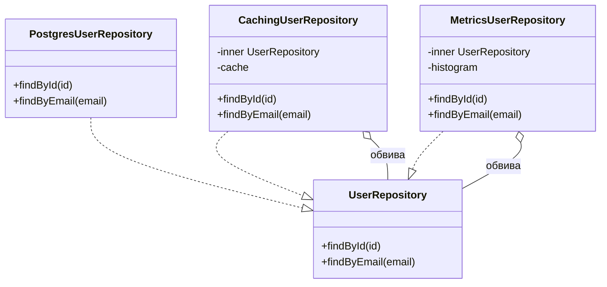
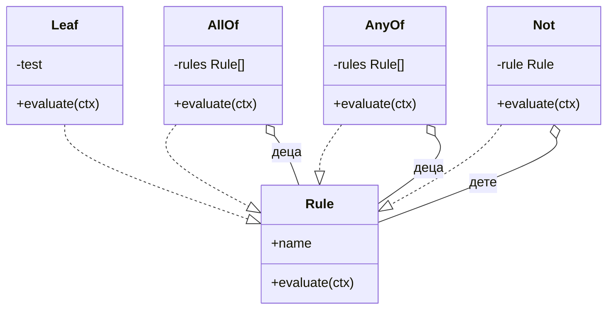

# Дизайн патерни: Structural (Adapter, Decorator, Facade, Proxy, Composite, Bridge, Flyweight)

Structural патерните решават как обектите се **сглобяват в по-големи структури, без да зависят
директно един от друг.** Общото между всичките е "обект, който стои пред друг обект": превежда му
интерфейса (Adapter), добавя му поведение (Decorator), контролира достъпа до него (Proxy), опростява
група от обекти (Facade), третира дървото като един елемент (Composite), отделя абстракцията от
имплементацията (Bridge) или споделя тежките части между много леки обекти (Flyweight).

В Node.js половината от тях са функции, които приемат функция и връщат функция. Express middleware е
Decorator, `withRetry(fn)` е Decorator, RPC клиентът е Proxy, `fs.promises` върху callback API-то е
Adapter. Класовата форма остава полезна, когато обвитият обект има много методи (repository с 15
метода) и когато обвивката трябва да е взаимозаменяема с оригинала за `instanceof` проверки или за DI
контейнер. Разликата между четирите "обвивки" (Adapter, Decorator, Proxy, Facade) е първият въпрос
на интервю по тази тема и е в таблицата след прегледа.

| Патерн | Проблемът | Node.js идиом | Кога НЕ |
| --- | --- | --- | --- |
| **Adapter** | Външен API с чужд интерфейс трябва да се ползва зад наш | Клас или обект, който имплементира нашия интерфейс и вика чуждия SDK | Когато има един доставчик и няма изгледи за втори: обвивката е шум |
| **Decorator** | Добавяне на поведение (retry, cache, лог) без промяна на обекта | Higher-order функция `withX(fn)` или клас със същия интерфейс | Когато поведението е бизнес логика, а не cross-cutting |
| **Facade** | Няколко подсистеми, които клиентът трябва да вика в правилен ред | Един сървис с 2-3 метода, който оркестрира | Когато фасадата започне да държи състояние: тогава е сървис, не фасада |
| **Proxy** | Контрол на достъпа: lazy, кеш, права, remote | Обект със същия интерфейс; `new Proxy()` за meta случаи; RPC клиент | За логика, която променя резултата: това е Decorator |
| **Composite** | Дърво от правила, при което възел и лист се третират еднакво | Рекурсивен интерфейс `evaluate()` с листа и групи | За плоски списъци; `Array.every` е достатъчно |
| **Bridge** | Абстракция и имплементация се развиват независимо | Интерфейс "driver", инжектиран в клас с богато API | Когато има само една имплементация; тогава е Adapter без причина |
| **Flyweight** | Хиляди обекти споделят тежка неизменяема част | Кеш `Map<key, shared>` и интерниране; компилирани regex/схеми | Когато споделеното е mutable: споделеното състояние е бъг |

| | Adapter | Decorator | Proxy | Facade |
| --- | --- | --- | --- | --- |
| Намерение | Превежда интерфейс | Добавя поведение | Контролира достъп | Опростява група |
| Интерфейсът на обвивката | **Различен** от обвития (наш вместо чужд) | **Същият** като обвития | **Същият** като обвития | **Нов, по-малък** от сумата на обвитите |
| Колко обекта обвива | Един | Един, но се стекват | Един | Много |
| Кога избираш | Чужд SDK, стар код, втори доставчик | Retry, cache, metrics, logging | Lazy init, права, remote, кеш без промяна на резултата | Клиентът вика 4 сървиса в ред, който не бива да знае |

## Adapter

### Проблемът

Notification System праща SMS през Twilio. Twilio SDK-то иска `client.messages.create({ to, from,
body })` и връща `sid`. Vonage иска `vonage.sms.send({ to, from, text })` и връща `message-id` в
масив. Ако worker-ът вика директно Twilio, добавянето на Vonage за failover означава `if` навсякъде,
където се праща SMS, и два различни формата на грешки.

### Решението

Дефинираме **нашия** интерфейс (`SmsGateway`) с точно това, което системата ползва. За всеки
доставчик има адаптер, който имплементира интерфейса и превежда извикването и грешките. Worker-ът
знае само `SmsGateway`; смяната на доставчик е смяна на адаптера в composition root-а.

### Node.js пример

```ts
interface SmsGateway {
  send(to: string, body: string): Promise<{ providerRef: string }>;
}

// The two provider SDK shapes, modelled as interfaces instead of importing the real packages.
interface TwilioSdk {
  messages: { create(input: { to: string; from: string; body: string }): Promise<{ sid: string; status: string }> };
}
interface VonageSdk {
  sms: { send(input: { to: string; from: string; text: string }): Promise<{ messages: Array<{ 'message-id': string; status: string }> }> };
}

class TwilioAdapter implements SmsGateway {
  #sdk: TwilioSdk;
  #from: string;
  constructor(sdk: TwilioSdk, from: string) { this.#sdk = sdk; this.#from = from; }
  async send(to: string, body: string) {
    const res = await this.#sdk.messages.create({ to, from: this.#from, body });
    if (res.status === 'failed') throw new Error(`twilio failed: ${res.sid}`);
    return { providerRef: `twilio:${res.sid}` };
  }
}

class VonageAdapter implements SmsGateway {
  #sdk: VonageSdk;
  #from: string;
  constructor(sdk: VonageSdk, from: string) { this.#sdk = sdk; this.#from = from; }
  async send(to: string, body: string) {
    const res = await this.#sdk.sms.send({ to, from: this.#from, text: body });
    const first = res.messages[0];
    // Vonage reports success as status "0"; anything else is a provider-side rejection.
    if (first.status !== '0') throw new Error(`vonage failed: ${first.status}`);
    return { providerRef: `vonage:${first['message-id']}` };
  }
}

const twilio: TwilioSdk = { messages: { async create(i) { return { sid: `SM${i.to.slice(-4)}`, status: 'queued' }; } } };
const vonage: VonageSdk = { sms: { async send(i) { return { messages: [{ 'message-id': `0A${i.to.slice(-4)}`, status: '0' }] }; } } };

const gateways: SmsGateway[] = [new TwilioAdapter(twilio, '+15550001'), new VonageAdapter(vonage, 'TradingGame')];
for (const g of gateways) console.log(await g.send('+359888123456', 'OTP 4821'));
```

### Как изглежда в реален Node код

- Адаптерът е и мястото, където чуждите грешки стават наши: `TwilioRestException` с код 21211 става
  `InvalidRecipientError` (постоянна грешка, не се retry-ва). Без това превеждане retry логиката
  трябва да знае кодовете на всеки доставчик.
- `util.promisify` е Adapter на ниво функция: callback API към Promise API. `fs.promises` е адаптер
  върху `fs`. Стриймовите `Readable.from()` и `Readable.toWeb()` са адаптери между Node стриймове и
  Web Streams.
- Интерфейсът се дефинира от **потребителя**, не от доставчика. Ако `SmsGateway` копира формата на
  Twilio, вторият адаптер ще се мъчи да имитира Twilio вместо да имплементира нуждите на системата.

### Кога да го ползваш и кога не

- Да: всеки външен SDK, който има шанс да бъде сменен или дублиран (failover). Цената е една малка
  класа на доставчик.
- Да: стар вътрешен модул с неудобен интерфейс, който не искаш да пренаписваш сега.
- Не: обвиване на всичко "за да сме абстрактни". Адаптер върху `node:crypto` без втора имплементация
  е слой без стойност.
- Внимание: адаптер, който започне да добавя retry и кеш, вече е Decorator. Дръж го само за
  превеждане.

### Връзка със системите в тази папка

- [Notification System](Notification_system.md): provider adapters за FCM/APNs, SES/SendGrid,
  Twilio/Vonage, с failover между два адаптера на канал.
- [Payment System](Payment_System_Stripe_Wallet.md): Stripe и Adyen зад общ `Charger` интерфейс, като
  част от Abstract Factory suite (виж [Creational](Design_Patterns_Creational.md)).

## Decorator

### Проблемът

`UserRepository.findById()` трябва да се кешира в Redis, да се мери в Prometheus и да се retry-ва
при преходна грешка. Ако сложиш всичко в метода, той става 60 реда, от които 5 са SQL. Същото
трябва и за `findByEmail()`, и за 12 други метода, и за HTTP клиента към друг сървис.

### Решението

Обвивка със **същия интерфейс** като обвития обект, която прави допълнителната работа и делегира.
Обвивките се стекват: `metrics(cache(retry(repo)))`. В Node най-краткият вариант е higher-order
функция върху една async функция; класовият вариант е за обекти с много методи.

### Node.js пример

```ts
type AsyncFn<A extends unknown[], R> = (...args: A) => Promise<R>;

export function withTimeout<A extends unknown[], R>(fn: AsyncFn<A, R>, ms: number): AsyncFn<A, R> {
  return (...args) =>
    Promise.race([
      fn(...args),
      new Promise<never>((_, reject) => setTimeout(() => reject(new Error(`timeout after ${ms} ms`)), ms).unref()),
    ]);
}

export function withRetry<A extends unknown[], R>(fn: AsyncFn<A, R>, attempts: number, isTransient: (e: unknown) => boolean): AsyncFn<A, R> {
  return async (...args) => {
    for (let i = 1; ; i++) {
      try {
        return await fn(...args);
      } catch (err) {
        if (i >= attempts || !isTransient(err)) throw err;
        // Full jitter keeps retrying clients from synchronising into a thundering herd.
        await new Promise((r) => setTimeout(r, Math.random() * 2 ** i * 50));
      }
    }
  };
}

export function withCache<A extends unknown[], R>(fn: AsyncFn<A, R>, ttlMs: number, key: (...args: A) => string): AsyncFn<A, R> {
  const store = new Map<string, { value: R; expires: number }>();
  return async (...args) => {
    const k = key(...args);
    const hit = store.get(k);
    if (hit && hit.expires > Date.now()) return hit.value;
    const value = await fn(...args);
    store.set(k, { value, expires: Date.now() + ttlMs });
    return value;
  };
}

let calls = 0;
const findUser = async (id: string) => {
  calls++;
  if (calls === 1) throw Object.assign(new Error('ECONNRESET'), { transient: true });
  return { id, name: `user-${id}` };
};

const robustFindUser = withCache(
  withRetry(withTimeout(findUser, 500), 3, (e) => Boolean((e as { transient?: boolean }).transient)),
  30_000,
  (id) => `user:${id}`,
);

console.log(await robustFindUser('7'), await robustFindUser('7'), `calls=${calls}`);
```



### Как изглежда в реален Node код

- **Middleware е Decorator.** Express/Koa/Fastify middleware обвива handler-а със същия интерфейс
  `(req, res, next)` и се стекват в ред. Разликата от класическия Decorator е само, че веригата е
  вградена във framework-а.
- `opossum` (circuit breaker), `p-retry`, `p-timeout`, `async-cache-dedupe` са готови decorator-и
  върху async функции. Стилът `withX(fn)` е стандарт, включително в React (`withRouter`).
- **TypeScript декораторите (`@Cacheable()`) са друго нещо.** Те са синтаксис за трансформация на
  клас или метод при дефиниция и изискват компилатор или Node флаг. GoF Decorator е runtime
  композиция на обекти. Съвпадението на името е историческа случайност и интервюиращите го питат.
- Редът има значение: `retry(timeout(fn))` retry-ва след изтекъл timeout; `timeout(retry(fn))`
  слага един общ бюджет върху всички опити. Второто е обикновено правилното за критичния път
  (timeout budget), първото за фонова работа.

### Кога да го ползваш и кога не

- Да: cross-cutting поведение (retry, timeout, cache, metrics, tracing, auth check), еднакво за
  много методи.
- Да: когато обвитият код не е твой (SDK) и не можеш да го редактираш.
- Не: бизнес логика. "Decorator, който добавя ДДС" е скрит бизнес правило на неочаквано място.
- Внимание: стек от 6 decorator-а прави stack trace-а нечетим и скрива кой е върнал кешираната
  стойност. Логвай името на слоя в грешките и дръж стека до 3-4.

### Връзка със системите в тази папка

- [Notification System](Notification_system.md): Circuit Breaker около всеки provider adapter е
  Decorator върху Adapter: `breaker(twilioAdapter)`, същият интерфейс `SmsGateway`.
- [URL Shortener](URL_Shortener.md): cache-aside с negative caching и single-flight е decorator около
  `findLink(shortKey)`.
- [Rate Limiter](Distributed_Web_Crawler.md): лимитерът като middleware в API Gateway е Decorator върху
  handler-а.

## Facade

### Проблемът

`POST /checkout` трябва да задържи мястото, да вземе плащане, да издаде билет и да прати имейл. Ако
HTTP handler-ът вика четирите сървиса директно, редът и компенсациите живеят в контролера, тестват се
трудно и вторият клиент (мобилното API, admin инструментът) ги копира.

### Решението

Един обект с малък интерфейс (`checkout(order)`) скрива подсистемите и реда на извикванията им.
Клиентите виждат само фасадата. Подсистемите остават достъпни директно за случаите, когато
фасадата не стига (admin refund без имейл).

### Node.js пример

```ts
interface Inventory { hold(seatId: string, userId: string): Promise<{ holdId: string }>; release(holdId: string): Promise<void>; }
interface Payments { charge(userId: string, amountCents: number): Promise<{ chargeId: string }>; refund(chargeId: string): Promise<void>; }
interface Tickets { issue(holdId: string, chargeId: string): Promise<{ ticketId: string }>; }
interface Mailer { send(userId: string, subject: string): Promise<void>; }

export class CheckoutFacade {
  #inv: Inventory; #pay: Payments; #tix: Tickets; #mail: Mailer;
  constructor(deps: { inv: Inventory; pay: Payments; tix: Tickets; mail: Mailer }) {
    this.#inv = deps.inv; this.#pay = deps.pay; this.#tix = deps.tix; this.#mail = deps.mail;
  }

  async checkout(userId: string, seatId: string, priceCents: number): Promise<{ ticketId: string }> {
    const { holdId } = await this.#inv.hold(seatId, userId);
    let chargeId: string | undefined;
    try {
      ({ chargeId } = await this.#pay.charge(userId, priceCents));
      const ticket = await this.#tix.issue(holdId, chargeId);
      // Email is best-effort: a mail outage must not undo a paid ticket.
      this.#mail.send(userId, `Ticket ${ticket.ticketId}`).catch(() => {});
      return ticket;
    } catch (err) {
      if (chargeId) await this.#pay.refund(chargeId);
      await this.#inv.release(holdId);
      throw err;
    }
  }
}

const log: string[] = [];
const facade = new CheckoutFacade({
  inv: { async hold(s, u) { log.push(`hold ${s} ${u}`); return { holdId: 'h1' }; }, async release(h) { log.push(`release ${h}`); } },
  pay: { async charge(u, a) { log.push(`charge ${u} ${a}`); return { chargeId: 'c1' }; }, async refund(c) { log.push(`refund ${c}`); } },
  tix: { async issue(h, c) { if (h === 'h1' && c === 'c1') throw new Error('qr generator down'); return { ticketId: 't1' }; } },
  mail: { async send() {} },
});

try { await facade.checkout('u7', 'A42', 4500); } catch (e) { log.push(`failed: ${(e as Error).message}`); }
console.log(log);
```

### Как изглежда в реален Node код

- Това е "application service" или "use case" в чистата архитектура: тънък слой, който оркестрира
  домейн сървиси и не съдържа правила сам по себе си.
- Фасадата в примера прави компенсации inline. В реална система със отделни бази това е Saga с
  orchestrator (Temporal, или собствена state machine, персистирана в базата), защото процесът може
  да падне между `charge` и `issue`. Фасадата е първата стъпка; Saga-та е фасада, която оцелява
  рестарт.
- SDK клиенти като `@aws-sdk/lib-storage` `Upload` са фасади: един `done()` върху multipart create,
  upload part, complete.

### Кога да го ползваш и кога не

- Да: повече от един клиент вика същата последователност; последователността има ред и компенсации;
  искаш подсистемите да се сменят без клиентите да разберат.
- Не: фасада с един метод, който вика един сървис. Това е преименуване.
- Внимание: фасада, която натрупа състояние, кеш и правила, се превръща в god object. Ако
  `CheckoutFacade` знае цените и данъците, правилата трябва да са в отделен сървис под нея.

### Връзка със системите в тази папка

- [Ticketmaster](Ticketmaster.md): Booking Service е фасадата; Saga orchestrator-ът е нейната
  издръжлива на рестарт форма с компенсации.
- [Video Platform](Video_platform_like_Udemy.md): "качи видео" за клиента е един presigned URL, а зад
  него са Upload Service, storage събитие, транскодиране и метаданни.

## Proxy

### Проблемът

Три различни ситуации с едно решение. Първо: DB pool-ът се отваря при import и всеки тест плаща
връзки, които не ползва. Второ: Gateway-ът чете snapshot на игра от Valkey и не бива да удря game
node-а за всяко презареждане. Трето: клиентът в Gateway трябва да извика game node през NATS, но
кодът иска да изглежда като локално извикване `game.placeBet()`.

### Решението

Обект със **същия интерфейс** като реалния, който контролира достъпа до него: създава го при първо
ползване (virtual proxy), връща кеширан резултат без да променя семантиката (caching proxy), проверява
права (protection proxy) или пренася извикването по мрежата (remote proxy). Клиентът не различава
прокси от оригинал.

### Node.js пример

```ts
interface GameCommands {
  placeBet(gameId: string, userId: string, side: 'HIGH' | 'LOW', amountCents: number): Promise<{ betId: string }>;
  getState(gameId: string): Promise<{ gameId: string; round: number }>;
}

interface Bus {
  request(subject: string, payload: unknown, timeoutMs: number): Promise<unknown>;
}

// Remote proxy: every method becomes a NATS request on the game's subject. The
// caller writes game.placeBet(...) as if the owner node were local.
export function createGameProxy(bus: Bus, timeoutMs = 300): GameCommands {
  return new Proxy({} as GameCommands, {
    get(_target, method: string) {
      return async (gameId: string, ...args: unknown[]) =>
        bus.request(`game.cmd.${gameId}`, { method, args }, timeoutMs);
    },
  });
}

// Protection + caching proxy over the same interface, composed in front of the remote one.
export function withReadCache(inner: GameCommands, ttlMs: number): GameCommands {
  const cache = new Map<string, { value: { gameId: string; round: number }; at: number }>();
  return {
    placeBet: (...a) => inner.placeBet(...a),
    async getState(gameId) {
      const hit = cache.get(gameId);
      if (hit && Date.now() - hit.at < ttlMs) return hit.value;
      const value = await inner.getState(gameId);
      cache.set(gameId, { value, at: Date.now() });
      return value;
    },
  };
}

const calls: string[] = [];
const bus: Bus = {
  async request(subject, payload) {
    calls.push(subject);
    const { method } = payload as { method: string };
    return method === 'placeBet' ? { betId: 'b1' } : { gameId: subject.split('.')[2], round: 7 };
  },
};

const game = withReadCache(createGameProxy(bus), 1000);
console.log(await game.placeBet('101', 'u7', 'HIGH', 200));
console.log(await game.getState('101'), await game.getState('101'), calls);
```

### Как изглежда в реален Node код

- **Remote proxy** е всеки RPC клиент: gRPC stub, tRPC клиент, NATS request обвивка. Прокситo скрива
  мрежата, което е и опасността му: извикване, което изглежда локално, може да отнеме 300 ms или да
  хвърли "no responders". Затова интерфейсът трябва да е async и с явен timeout.
- **`new Proxy()`** в JavaScript е meta-обект за прихващане на достъп до свойства. Полезен е за
  remote proxy-та, за лог на достъпа, за immutability guards в dev. Не е нужен за обикновен caching
  или lazy proxy; там обект със същите методи е по-четим и по-бърз.
- **Lazy (virtual) proxy** е `getPool()` от Singleton секцията: обектът се създава при първо
  извикване.
- Connection pool-ът сам е proxy: `pool.query()` изглежда като връзка, а зад него е избор на свободна
  връзка, чакане и връщане в пула.

### Кога да го ползваш и кога не

- Да: lazy инициализация на скъп ресурс; кеш, който **не променя** резултата; проверка на права
  преди делегиране; мрежов клиент зад локален интерфейс.
- Не: когато обвивката променя резултата или добавя стъпки. Тогава е Decorator и трябва да се казва
  така, защото читателят очаква от proxy "същото, но контролирано".
- Внимание: `new Proxy()` върху горещ обект е измеримо по-бавен (всяко свойство минава през trap) и
  чупи инструментите за автодовършване и рефакторинг. Ползвай го на границите, не в горещия път.

### Връзка със системите в тази папка

- [Online Trading Game](Online_Trading_Game.md): Gateway вика game node през NATS request/reply по
  subject `game.cmd.<id>` (remote proxy) и чете snapshot от Valkey за презареждания (caching proxy).
- [Distributed Cache](Distributed_Cache_Redis.md) и [URL Shortener](URL_Shortener.md): кешът пред базата
  е caching proxy, стига да не променя отговора; negative caching е решение на ниво proxy.

## Composite

### Проблемът

Правилата за достъп в Backoffice са дърво: "admin ИЛИ (support И собственик на тикета И работно
време)". Правилата за валидация на залог са дърво: "балансът стига И играта е отворена И (не е бот
ИЛИ ботът е разрешен)". Ако това е вложени `if`-ове, всяко ново правило е редакция в дълбочина, а
обяснението "защо отказано" е невъзможно.

### Решението

Един интерфейс `Rule.evaluate(ctx)` за листа (конкретно правило) и за групи (`allOf`, `anyOf`,
`not`), които съдържат други правила. Дървото се обхожда рекурсивно, а клиентът вика `evaluate` на
корена, без да знае дали е лист или група. Групите могат да събират и причините за отказ.

### Node.js пример

```ts
interface BetContext { balanceCents: number; amountCents: number; gameOpen: boolean; isBot: boolean; botsAllowed: boolean; }

interface Rule {
  readonly name: string;
  evaluate(ctx: BetContext): { ok: boolean; reasons: string[] };
}

const leaf = (name: string, test: (ctx: BetContext) => boolean): Rule => ({
  name,
  evaluate: (ctx) => (test(ctx) ? { ok: true, reasons: [] } : { ok: false, reasons: [name] }),
});

const allOf = (name: string, ...rules: Rule[]): Rule => ({
  name,
  evaluate(ctx) {
    const results = rules.map((r) => r.evaluate(ctx));
    return { ok: results.every((r) => r.ok), reasons: results.flatMap((r) => r.reasons) };
  },
});

const anyOf = (name: string, ...rules: Rule[]): Rule => ({
  name,
  evaluate(ctx) {
    const results = rules.map((r) => r.evaluate(ctx));
    // A passing branch clears the group's reasons, so callers only see why every branch failed.
    return results.some((r) => r.ok) ? { ok: true, reasons: [] } : { ok: false, reasons: [`${name}: ${results.flatMap((r) => r.reasons).join(' | ')}`] };
  },
});

const not = (rule: Rule): Rule => ({
  name: `not ${rule.name}`,
  evaluate: (ctx) => (rule.evaluate(ctx).ok ? { ok: false, reasons: [`not ${rule.name}`] } : { ok: true, reasons: [] }),
});

export const canPlaceBet: Rule = allOf(
  'canPlaceBet',
  leaf('sufficient balance', (c) => c.balanceCents >= c.amountCents),
  leaf('game open', (c) => c.gameOpen),
  anyOf('actor allowed', not(leaf('is bot', (c) => c.isBot)), leaf('bots allowed', (c) => c.botsAllowed)),
);

console.log(canPlaceBet.evaluate({ balanceCents: 500, amountCents: 200, gameOpen: true, isBot: false, botsAllowed: false }));
console.log(canPlaceBet.evaluate({ balanceCents: 100, amountCents: 200, gameOpen: false, isBot: true, botsAllowed: false }));
```



### Как изглежда в реален Node код

- Zod схемите са Composite: `z.object({ a: z.string(), b: z.array(z.number()) })` е дърво, в което
  всеки възел има `parse()`. Грешките се събират по път в дървото.
- Ценови правила (базова цена + процентна отстъпка + фиксирана такса, групирани по условия),
  feature flag условия, ACL политики (AWS IAM policy документите са Composite от Statement-и).
- Дървото на правила може да се **сериализира** (JSON) и да се редактира от не-инженери. Това е
  реалната печалба: правилата излизат от кода в конфигурация, без да губят типове при зареждане.

### Кога да го ползваш и кога не

- Да: йерархия с произволна дълбочина, при която операцията върху групата е функция от операцията
  върху децата (валидация, права, ценообразуване, файлово дърво, UI компоненти).
- Не: плосък списък. `rules.every(r => r(ctx))` е достатъчно и по-четимо.
- Внимание: рекурсивните структури от потребителски вход трябва да имат лимит на дълбочината, иначе
  вложена JSON политика с 10 000 нива е stack overflow по заявка.

### Връзка със системите в тази папка

- [Online Trading Game](Online_Trading_Game.md): проверките преди залог (баланс, отворена игра, cooldown)
  са дърво от правила, което owner-ът изчислява локално.
- [Auth & Sessions](Auth_Session_OAuth_SSO.md): политиките за права са Composite от allow/deny правила
  с явен ред на оценка.

## Bridge

### Проблемът

Файловото хранилище трябва да работи върху S3 в production, GCS при един клиент и локален диск в
тестове. Абстракцията "storage" има богато API: `putObject`, `presign`, `list`, `copy`, `delete`,
retry и метрики. Ако всяко от трите е отделен клас с пълното API, retry логиката е копирана три пъти;
ако е един клас с `if (driver === 's3')`, всеки нов driver редактира всички методи.

### Решението

Разделяне на две йерархии: **абстракция** (богатото API, което клиентите ползват) и
**имплементация** (малък driver интерфейс с примитивите). Абстракцията държи референция към driver и
изгражда високите операции върху примитивите. Двете се развиват независимо: нов driver не пипа
абстракцията, нова операция в абстракцията не пипа driver-ите.

### Node.js пример

```ts
interface StorageDriver {
  put(key: string, body: Uint8Array): Promise<void>;
  get(key: string): Promise<Uint8Array | null>;
  del(key: string): Promise<void>;
  signUrl(key: string, ttlSec: number): Promise<string>;
}

class ObjectStorage {
  #driver: StorageDriver;
  #prefix: string;
  constructor(driver: StorageDriver, prefix: string) { this.#driver = driver; this.#prefix = prefix; }

  async putJson(key: string, value: unknown): Promise<void> {
    await this.#driver.put(`${this.#prefix}/${key}`, new TextEncoder().encode(JSON.stringify(value)));
  }

  async getJson<T>(key: string): Promise<T | null> {
    const bytes = await this.#driver.get(`${this.#prefix}/${key}`);
    return bytes ? (JSON.parse(new TextDecoder().decode(bytes)) as T) : null;
  }

  async move(from: string, to: string): Promise<void> {
    const bytes = await this.#driver.get(`${this.#prefix}/${from}`);
    if (!bytes) throw new Error(`missing ${from}`);
    await this.#driver.put(`${this.#prefix}/${to}`, bytes);
    await this.#driver.del(`${this.#prefix}/${from}`);
  }

  uploadUrl(key: string): Promise<string> { return this.#driver.signUrl(`${this.#prefix}/${key}`, 900); }
}

function memoryDriver(): StorageDriver {
  const files = new Map<string, Uint8Array>();
  return {
    async put(k, b) { files.set(k, b); },
    async get(k) { return files.get(k) ?? null; },
    async del(k) { files.delete(k); },
    async signUrl(k, ttl) { return `memory://${k}?ttl=${ttl}`; },
  };
}

const storage = new ObjectStorage(memoryDriver(), 'videos/raw');
await storage.putJson('v1.json', { title: 'Lesson 1' });
await storage.move('v1.json', 'v1.done.json');
console.log(await storage.getJson('v1.done.json'), await storage.getJson('v1.json'), await storage.uploadUrl('v2.mp4'));
```

### Как изглежда в реален Node код

- Knex е Bridge: query builder (абстракция) върху dialect drivers (pg, mysql2, sqlite3). Winston и
  Pino са Bridge: logger API върху transports. Keyv е Bridge върху storage adapters.
- Разликата от Adapter: Adapter обвива **съществуващ** чужд интерфейс към нашия, един към един.
  Bridge проектира **нов малък** driver интерфейс, специално за да има много имплементации, и строи
  богато API отгоре. Adapter се появява после; Bridge се планира отначало.
- Driver интерфейсът трябва да е минимален. Ако `StorageDriver` има 20 метода, всеки driver е скъп и
  разликата с "три пълни класа" изчезва.

### Кога да го ползваш и кога не

- Да: няколко имплементации на ниско ниво (доставчици, бази, транспорти) под едно богато API;
  тестове с in-memory driver.
- Не: една имплементация. Driver интерфейс с един driver е предварителна абстракция, която ще се
  оказва грешно нарязана, когато дойде вторият.
- Внимание: операции, които един driver може да направи атомарно (S3 `CopyObject`), а абстракцията
  прави като get + put + del, губят атомарност и производителност. Дай на driver-а опционален
  `copy?()` и fallback в абстракцията.

### Връзка със системите в тази папка

- [Object Storage](Object_Storage_S3.md) и [Video Platform](Video_platform_like_Udemy.md): storage
  API върху S3/GCS/MinIO драйвери, с presigned URL като операция от абстракцията.
- [Distributed Message Queue](Distributed_Message_Queue_Kafka.md): publish/consume абстракция върху
  Kafka, NATS JetStream или SQS driver, за да се сменя брокерът без пренаписване на worker-ите.

## Flyweight

### Проблемът

Game node в Online Trading Game държи 2 000 бота. Всеки има стратегия с ценова стълба (масив от 500 прагове),
компилиран regex за валидация на никнейм и Zod схема за командите. Ако всеки бот носи собствено копие,
това са 2 000 × (стълба + regex + схема) в heap-а и 2 000 компилации при старт. Същото при 100 000
WebSocket сесии, всяка с "своя" таблица за rate limit.

### Решението

Тежката **неизменяема** част (intrinsic state) се споделя между всички обекти през кеш по ключ;
леката променлива част (extrinsic state: баланс, текущ залог) остава в всеки обект. Обектът държи
референция към споделената част, не копие. В JavaScript интернирането на низове и споделянето на
frozen обекти е естественият механизъм.

### Node.js пример

```ts
interface Strategy {
  readonly aggression: number;
  readonly ladder: ReadonlyArray<number>;
  readonly nickPattern: RegExp;
}

const strategies = new Map<string, Strategy>();

export function getStrategy(aggression: number): Strategy {
  const key = aggression.toFixed(2);
  let s = strategies.get(key);
  if (!s) {
    // Built once per distinct aggression level; every bot at that level shares the frozen object.
    const ladder = Object.freeze(Array.from({ length: 500 }, (_, i) => Math.round(100 * (1 + aggression) ** (i / 50))));
    s = Object.freeze({ aggression, ladder, nickPattern: /^[a-z0-9_]{3,16}$/i });
    strategies.set(key, s);
  }
  return s;
}

interface Bot {
  readonly name: string;
  balanceCents: number;
  readonly strategy: Strategy;
}

export function createBot(name: string, aggression: number): Bot {
  return { name, balanceCents: 10_000, strategy: getStrategy(aggression) };
}

const bots = Array.from({ length: 2000 }, (_, i) => createBot(`bot_${i}`, [0.1, 0.25, 0.5, 0.9][i % 4]));
bots[0].balanceCents -= 250;

console.log(strategies.size, bots[0].strategy === bots[4].strategy, bots[0].balanceCents, bots[4].balanceCents);
console.log(bots[1].strategy.nickPattern.test(bots[1].name), bots[1].strategy.ladder[499]);
```

### Как изглежда в реален Node код

- Компилирани Zod/Ajv схеми, `new RegExp()` и `Intl.NumberFormat` инстанси се създават на модулно
  ниво и се споделят. Създаването им в тялото на handler-а е класическата грешка, която профилерът
  показва като горещ `RegExp` конструктор.
- Интерниране на низове през `Map<string, string>` или Symbol-и за ключове на събития, за да се
  сравняват по референция.
- `Object.freeze` е това, което прави споделянето безопасно. Без него един бот, който направи
  `strategy.ladder.push()`, променя стратегията на 500 бота.
- Buffer pool-ове (`Buffer.allocUnsafe` ползва вътрешен pool за малки буфери) и string interning във
  V8 са Flyweight на ниво runtime.

### Кога да го ползваш и кога не

- Да: много обекти (хиляди+), които споделят голяма неизменяема част; профилерът показва памет или
  време за инициализация в тази част.
- Не: под сто обекта или малка споделена част. Кешът е повече код, отколкото спестява.
- Внимание: споделеното трябва да е наистина immutable. Mutable flyweight е най-трудният за
  намиране бъг, защото промяната се проявява в друг обект, в друга заявка, по-късно.
- Кешът расте с броя уникални ключове. Ако ключът е непрекъсната стойност (`aggression` с 6 знака
  след запетаята), кешът е memory leak; затова примерът квантува до 2 знака.

### Връзка със системите в тази папка

- [Online Trading Game](Online_Trading_Game.md): ботовете споделят алгоритъм и профили; всеки носи само
  баланс и отворени залози.
- [Search Autocomplete](Search_Autocomplete_Typeahead.md): Trie снапшотът е един споделен immutable
  обект за всички заявки в процеса, което позволява atomic swap при нова версия.

## Въпроси за интервюто

### Decorator срещу Proxy срещу Adapter срещу Facade: как ги различаваш за 20 секунди?

По интерфейса. Adapter има **различен** интерфейс от обвития (превежда чужд към наш). Decorator и
Proxy имат **същия** интерфейс: Decorator добавя поведение и се стекова, Proxy контролира достъпа
(lazy, cache, права, remote) без да променя резултата. Facade има **нов, по-малък** интерфейс над
много обекти. Ако не можеш да кажеш кой от четирите е класът ти, най-вероятно е два наведнъж.

### Decorator срещу middleware: едно и същo ли са?

Да по механизъм: обвивка със същия интерфейс, която делегира и се стекова. Разликата е, че
middleware веригата е вградена във framework-а с фиксиран сигнатура `(req, res, next)`, докато
Decorator е общ и се композира ръчно. Express е Decorator с DSL.

### GoF Decorator и TypeScript `@decorator`: каква е връзката?

Само името. TS декораторът е синтаксис за трансформация на клас или метод в момента на дефиниция и
изисква компилация или Node флаг. GoF Decorator е runtime композиция на обекти през интерфейс. С TS
декоратор можеш да имплементираш GoF Decorator (`@Retry(3)` обвива метода), но не е задължително и
често е по-неясно от `withRetry(fn)`.

### Кога Adapter се превръща в Facade?

Когато започне да обвива повече от един обект или да скрива последователност от извиквания. Адаптер
за Twilio е Adapter; "адаптер", който вика Twilio, после записва в базата и после праща метрика, е
Facade (или Decorator стек, ако интерфейсът е същият). Признак: адаптерът има зависимости освен
чуждия SDK.

### Bridge срещу Adapter?

Adapter е ретроактивен: обвива съществуващ интерфейс към нашия, един към един. Bridge е планиран:
проектираме малък driver интерфейс, за да има много имплементации, и строим богато API отгоре.
Knex (builder над dialect drivers) е Bridge; `promisify(fs.readFile)` е Adapter.

### Кога `new Proxy()` е правилният инструмент?

За meta случаи: remote proxy, при който методите не са известни статично; лог на достъп до свойства
в dev; immutability guards. За обикновен lazy или caching proxy обект с изрични методи е по-бърз, по-
четим и работи с автодовършване. `Proxy` в горещ път е измерим разход.

### Как Composite помага за "защо отказано"?

Всеки възел връща резултат плюс причини, а групите ги събират: `allOf` слива всички провалени
листа, `anyOf` връща причините само ако всички клонове са паднали. Клиентът получава списък с
имената на правилата, които са спрели действието, без да знае структурата на дървото.

### Кое е най-опасното при Flyweight?

Споделено mutable състояние. Ако споделеният обект не е `Object.freeze` и някой го промени, бъгът се
появява в друг обект, в друга заявка, по-късно. Второ: неограничен кеш по непрекъснат ключ е memory
leak; ключът трябва да е квантуван или кешът да е ограничен (LRU).
