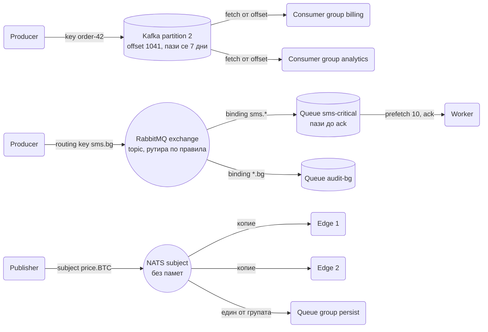
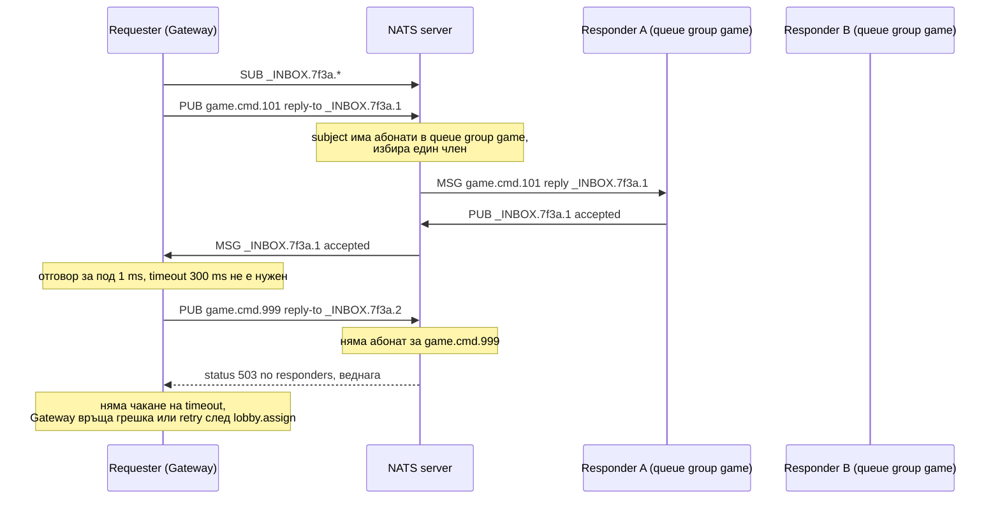
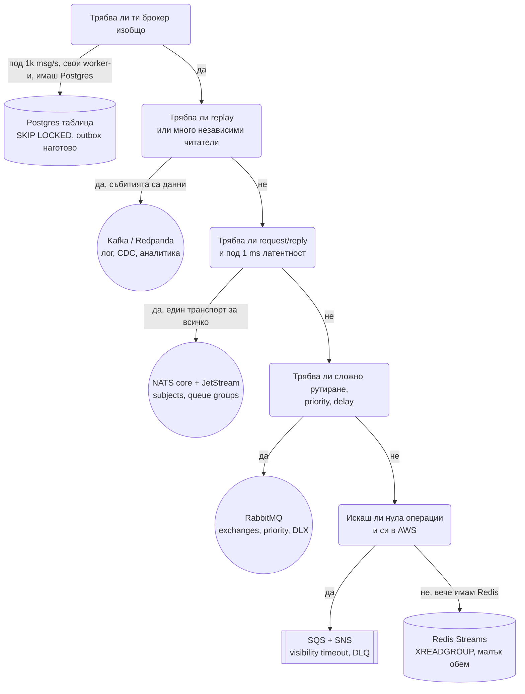

# Message brokers: какво могат и кога кой (Kafka, NATS, RabbitMQ, SQS/SNS, Redis Streams, Postgres като опашка)

Почти всяка система в тази папка има кутия с кръгла форма в средата: Kafka в
[Chat](Chat_system_WhatsApp_Slack%20_Messenger.md), [Notification System](Notification_system.md) и
[Ad Click](Ad_Click_Aggregation.md), NATS в [Online Trading Game](Online_Trading_Game.md), SQS във
[Video Platform](Video_platform_like_Udemy.md). На интервю обаче рядко питат "нарисувай Kafka". Питат
"защо точно този брокер", "какво губиш, ако го смениш" и "какво изобщо може да прави един брокер".
Този документ е отговорът на третия въпрос, от който следват другите два.

Най-честото недоразумение, което интервюиращият слуша: **брокерът не е един вид нещо.** Kafka е
разпределен append-only лог, който случайно може да се използва като опашка. RabbitMQ е рутер на
съобщения с опашки. NATS core е телефонна централа без памет, а JetStream ѝ добавя памет. SQS е
опашка като услуга. Postgres таблица с `SKIP LOCKED` е опашка, която вече имаш. Четирите модела дават
различни гаранции и всеки от тях е грешният избор за половината от задачите.

## Речник, преди таблиците

| Термин | Какво значи | Къде се казва различно |
| --- | --- | --- |
| **Message queue** | Съобщението се взима от точно един консуматор и изчезва. Работа за раздаване. | SQS queue, RabbitMQ queue, NATS queue group, Kafka consumer group върху топик |
| **Pub/sub** | Всеки абонат получава копие. Събитие за разгласяване. | SNS topic, RabbitMQ fanout exchange, NATS subject, Kafka топик с няколко consumer групи |
| **Log** | Съобщенията се пазят подредени и всеки чете от своя позиция, колкото пъти иска. | Kafka partition, JetStream stream, Redis Stream, RabbitMQ Streams |
| **Topic / subject / exchange / queue** | Адресът, на който се публикува. В Kafka топикът е разделен на партиции; в NATS subject-ът е йерархичен низ; в RabbitMQ публикуваш в exchange, който рутира към опашки. | |
| **Ack / nack / redelivery** | Консуматорът потвърждава обработка; при липса или отказ брокерът доставя пак. | Kafka няма ack на съобщение, а commit на offset |
| **Offset срещу per-message ack** | Позиция в лог (Kafka, JetStream ordered, Redis Streams) срещу потвърждение на всяко съобщение поотделно (RabbitMQ, SQS, JetStream explicit ack). | Offset дава replay; per-message ack дава лесно пропускане на едно отровно съобщение |
| **Durable срещу ephemeral абонамент** | Брокерът помни къде е стигнал консуматорът и след рестарт; или не помни и консуматорът получава само новото. | Kafka consumer group винаги е durable; NATS core винаги е ephemeral; JetStream и двете |
| **Partition / shard** | Единицата на паралелизъм и подредба: един консуматор на партиция, подредба само вътре в нея. | Kafka partition, SQS FIFO message group, JetStream няма партиции, а subject филтри |

Трите модела изглеждат така от гледна точка на едно съобщение:



Kafka пази и подрежда; RabbitMQ рутира и брои потвърждения; NATS доставя на момента и забравя.
Останалите инструменти са варианти на тези три.

## Матрица на способностите

Колоните са седемте инструмента, които реално се появяват в дизайн дискусии. Postgres е тук нарочно:
половината проекти нямат нужда от брокер и интервюиращият цени кандидат, който го казва.

| Способност | Kafka | NATS core | NATS JetStream | RabbitMQ | SQS / SNS | Redis Streams | Postgres таблица |
| --- | --- | --- | --- | --- | --- | --- | --- |
| **Request/reply** | Не. Емулира се с reply топик и correlation id, латентност десетки ms, никой не го прави | **Да, нативно.** Reply-to inbox, timeout, "no responders" грешка веднага | Да, същото като core | Да, чрез reply-to опашка + correlation id (Direct Reply-To) | Не | Не | Не (polling) |
| **Pub/sub fan-out** | Да, всяка consumer група получава всичко | Да, всеки абонат на subject | Да, много consumer-и на един stream | Да, fanout / topic exchange | Да, SNS към много SQS | Да, много consumer групи | Само с LISTEN/NOTIFY, без durability |
| **Competing consumers** | Consumer group, един консуматор на партиция | Queue group, случаен член | Pull consumer с много клиенти или queue group | Много консуматори на една опашка, prefetch | Много консуматори на една опашка | Consumer group с XREADGROUP | `FOR UPDATE SKIP LOCKED` |
| **Подредба** | Строга в партиция, никаква между партиции | По subject от един publisher, без гаранция при повторна доставка | В stream, по subject | В опашка при един консуматор | Standard: никаква; FIFO: по message group id | В stream | По `ORDER BY` в заявката |
| **Durability и replay** | Retention по време/размер, seek на offset, replay на дни назад | **Нищо не се пази.** Няма абонат, няма съобщение | Stream с лимити, replay от sequence или време | Classic queue: пази до ack, без replay. Streams: replay | Пази до 14 дни, **без replay** след изтриване | Пази до MAXLEN, XRANGE за replay | Пази колкото искаш, replay = SELECT |
| **Delivery семантика** | At-least-once; exactly-once само вътре в Kafka чрез idempotent producer + transactions | At-most-once | At-least-once; дедупе по `Nats-Msg-Id` в прозорец | At-least-once; at-most-once с auto-ack | At-least-once; FIFO дедупе 5 мин | At-least-once | Точно веднъж в транзакцията |
| **Ack модел** | Commit offset (батч, не съобщение) | Няма | Explicit / all / none, nak с delay, in-progress | Ack / nack / reject, requeue | Delete по receipt handle, visibility timeout | XACK | UPDATE status / DELETE |
| **DLQ** | Няма вградено, пишеш в друг топик | Няма | Max deliver → advisory subject, ти пишеш DLQ | Dead letter exchange, вградено | Вградено, redrive policy | Няма, ръчно с XPENDING | Колона attempts + status |
| **Delayed съобщения** | Няма | Няма | Няма нативно (nak с delay е за retry) | Плъгин delayed exchange или TTL + DLX | Delay до 15 мин на съобщение | Не в Streams; Redis ZSET по време | `run_at` колона, тривиално |
| **Приоритет** | Няма (отделни топици) | Няма | Няма | Да, priority queues | Няма (отделни опашки) | Няма | `ORDER BY priority` |
| **Лимит на съобщение** | 1 MB по подразбиране, конфигурируем | 1 MB по подразбиране, до 64 MB | Същото | 128 MB теоретично, практично под 1 MB | 256 KB (Extended Client Library до 2 GB през S3) | Ограничено от паметта | Колкото колоната |
| **Backpressure и flow control** | Pull: консуматорът чете с темпото си, lag расте | Push: **бавен консуматор се изключва** (slow consumer), няма буфер за него | Pull consumer с batch и max ack pending | Prefetch/QoS ограничава недоставените | Pull, visibility timeout | Pull | Pull |
| **Скалиране на консуматорите** | Ограничено от броя партиции | Неограничено, без подредба | Много pull клиенти на consumer | Много консуматори, подредбата се губи | Практически неограничено | Много консуматори в група | Ограничено от локовете в базата |
| **Retention и compaction** | Време, размер, log compaction по ключ | Няма | Лимити, discard policy, KV на базата на compaction | До ack или TTL | 14 дни | MAXLEN | VACUUM и партиции по дата |
| **Schema registry** | Confluent Schema Registry, Avro/Protobuf | Няма, схемите са в кода | Няма | Няма | AWS Glue Schema Registry | Няма | Схемата на таблицата |
| **Транзакции / outbox** | Транзакции между топици, outbox през Debezium | Няма | Няма | Publisher confirms, без транзакции | Няма | MULTI/EXEC локално | **Outbox е същата транзакция** |
| **Multi-tenancy** | ACL по топик, quotas | **Accounts**: изолирани пространства от subject-и, imports/exports | Същото | Vhosts | IAM по опашка | ACL | Схеми / row-level security |
| **Типична латентност** | 2-10 ms при малки батчове, повече при големи | Под 1 ms | 1-3 ms | 1-5 ms | 10-100 ms | Под 1 ms | 1-5 ms + polling интервал |
| **Операции** | Тежки; managed: MSK, Confluent, Redpanda | Един бинарник, клъстер от 3 | Същото плюс диск | Средни; managed: Amazon MQ, CloudAMQP | Нулеви | Ако вече имаш Redis | Ако вече имаш Postgres |

Три реда от таблицата решават повечето спорове:

- **Request/reply.** Само NATS го има като първокласна операция. Ако системата ти има синхронни
  извиквания между сървиси и искаш един транспорт за всичко, това е аргументът за NATS.
- **Replay.** Само логовете го могат (Kafka, JetStream, Redis Streams, RabbitMQ Streams). Ако
  "искам да преизчисля вчерашния ден" е изискване, RabbitMQ classic и SQS отпадат.
- **Delayed и priority.** RabbitMQ и SQS ги имат, Kafka не. Ако дизайнът има "прати след 10
  минути", върху Kafka ще строиш планировчик (виж [Job Scheduler](Distributed_Job_Scheduler.md)).

## Как мисли всеки от тях

### Kafka: логът е базата

Топикът е разделен на партиции, всяка е append-only файл с offset-и. Producer-ът избира партиция по
ключ, consumer-ът чете от offset и commit-ва позицията си. Нищо не се трие при прочитане, а по
retention. Оттук идват силните страни: replay, много независими консуматори на едни данни, пропускливост
в GB/s заради последователен I/O. Оттук и слабостите: няма per-message ack, така че едно отровно
съобщение блокира партицията, докато не го прескочиш; няма delay, няма priority, няма request/reply;
паралелизмът е закован в броя партиции. Пълният дизайн е в [Message Queue (Kafka)](Distributed_Message_Queue_Kafka.md).

Избери го, когато събитията са данни, а не команди: click stream, CDC, event sourcing, всичко, което
повече от един екип ще чете. Тук: [Chat](Chat_system_WhatsApp_Slack%20_Messenger.md) като durable лог
преди Cassandra, [Ad Click](Ad_Click_Aggregation.md), [News Feed](News_Feed_Timeline.md) fan-out.

### NATS core: телефонна централа без памет

Subject е йерархичен низ (`game.cmd.101`, `price.BTC`), с wildcards `*` за един токен и `>` за
опашката. Абонатите казват "искам всичко на този subject", publisher-ът праща и NATS доставя на
всички абонати в момента. Ако няма абонат, съобщението изчезва. Това звучи като недостатък, но е
източникът на скоростта (под 1 ms) и на простотата: сървърът е един бинарник без диск.

Трите механизма, които го правят различен:

- **Queue group.** Абонати с едно и също име на група получават съобщението само един от тях. Това е
  competing consumers без партиции: добавяш инстанция и тя веднага участва, махаш я и тя веднага
  изчезва от разпределението.
- **Request/reply.** Клиентът си създава уникален inbox subject, абонира се за него, публикува
  заявката с `reply-to = inbox` и чака с timeout. Отговарящият публикува отговора на reply-to.
  Ако **никой** не е абониран за subject-а на заявката, сървърът връща "no responders" веднага, без
  да се чака timeout. Това е гаранцията, която gRPC няма: разбираш за липсващ сървис за
  микросекунди, не за 300 ms.
- **Slow consumer.** Ако клиент не смогва да чете, сървърът не буферира безкрайно за него, а го
  изключва. Това е backpressure чрез отказ: бавният не може да навреди на останалите. Клиентът трябва
  да го очаква и да прави resync, точно както в [Online Trading Game](Online_Trading_Game.md).



Ето същата механика като код върху малък in-memory bus. Интерфейсът е това, което един NATS клиент
дава: subject, wildcards, queue group, reply-to и timeout.

```ts
type Msg = { subject: string; data: string; replyTo?: string };
type Handler = (msg: Msg) => void;
type Sub = { pattern: RegExp; queue?: string; handler: Handler };

class NoRespondersError extends Error {}

class Bus {
  private subs: Sub[] = [];
  private inboxSeq = 0;

  subscribe(subject: string, handler: Handler, opts: { queue?: string } = {}): () => void {
    // '*' е един токен, '>' е всичко до края, точките са разделители
    const pattern = new RegExp('^' + subject.split('.').map((t) => (t === '*' ? '[^.]+' : t === '>' ? '.+' : t)).join('\\.') + '$');
    const sub: Sub = { pattern, queue: opts.queue, handler };
    this.subs.push(sub);
    return () => { this.subs = this.subs.filter((s) => s !== sub); };
  }

  publish(msg: Msg): number {
    const matching = this.subs.filter((s) => s.pattern.test(msg.subject));
    const byQueue = new Map<string, Sub[]>();
    let delivered = 0;
    for (const s of matching) {
      if (!s.queue) { queueMicrotask(() => s.handler(msg)); delivered++; continue; }
      const group = byQueue.get(s.queue) ?? [];
      group.push(s);
      byQueue.set(s.queue, group);
    }
    for (const group of byQueue.values()) {
      const chosen = group[Math.floor(Math.random() * group.length)];
      queueMicrotask(() => chosen.handler(msg));
      delivered++;
    }
    return delivered;
  }

  request(subject: string, data: string, timeoutMs: number): Promise<string> {
    const inbox = `_INBOX.${++this.inboxSeq}`;
    return new Promise((resolve, reject) => {
      const unsub = this.subscribe(inbox, (reply) => { clearTimeout(timer); unsub(); resolve(reply.data); });
      const timer = setTimeout(() => { unsub(); reject(new Error(`timeout after ${timeoutMs} ms on ${subject}`)); }, timeoutMs);
      const delivered = this.publish({ subject, data, replyTo: inbox });
      if (delivered === 0) { clearTimeout(timer); unsub(); reject(new NoRespondersError(`no responders on ${subject}`)); }
    });
  }
}

const bus = new Bus();
for (const node of ['A', 'B']) {
  bus.subscribe('game.cmd.*', (m) => bus.publish({ subject: m.replyTo!, data: `${node}: accepted ${m.data}` }), { queue: 'game' });
}
console.log(await bus.request('game.cmd.101', 'bet HIGH 10', 300));
await bus.request('tournament.cmd.R7', 'start', 300).catch((e) => console.log(e.constructor.name, e.message));
```

Резултатът от `request` за игра 101 идва от точно един от двата node-а, а за `tournament.cmd.R7`,
на който никой не е абониран, грешката е `NoRespondersError` без да се чака 300 ms. Това е разликата между "сървисът е бавен" и "сървисът
липсва", която HTTP клиентите не могат да направят.

### NATS JetStream: същата централа с памет

JetStream е слой върху core: **stream** пази съобщенията от избрани subject-и на диск (с лимити по
брой, размер, време и discard policy), а **consumer** е позиция в stream-а с политика за
потвърждение. Consumer-ите са push (сървърът бута към subject) или pull (клиентът иска batch, което е
правилният избор за worker-и, защото дава естествен backpressure). Ack политики: `explicit` (всяко
съобщение), `all` (потвърждението на N потвърждава всичко преди него, като Kafka offset), `none`.
`nak` с delay е retry, `in-progress` удължава срока, `max deliver` праща advisory събитие, от което
строиш DLQ. Дедупликация: publisher слага `Nats-Msg-Id`, сървърът отхвърля повторения в прозорец
(2 минути по подразбиране). Върху stream-овете са построени **KV store** (последната стойност по
ключ, watch на промени) и **Object store** (чънкове), които покриват случаите "малък конфиг с
нотификации" без отделен etcd.

**Accounts** дават multi-tenancy: всеки account е отделно пространство от subject-и, а споделянето е
изрично чрез export/import. **Leaf nodes** свързват локален NATS (в офис, в edge устройство) към
централния клъстер с един изход навън. Това е причината NATS да се среща в IoT и в игри.

Избери го, когато искаш един транспорт за request/reply, pub/sub и durable опашки и си готов да
нямаш schema registry и екосистемата от конектори на Kafka. Тук: [Online Trading Game](Online_Trading_Game.md),
където сравнението с gRPC и Kafka е разписано.

### RabbitMQ: рутер с опашки

Публикуваш в **exchange**, той рутира по правила към **опашки**, консуматорите четат от опашките.
Типовете exchange (direct, topic, fanout, headers) са езикът за рутиране: едно съобщение може да
стигне до три опашки по три различни причини без publisher-ът да знае за тях. Опашката пази
съобщението до ack. Prefetch (QoS) казва колко недоставени може да има един консуматор, което е
backpressure по дизайн. Има priority опашки, TTL, dead letter exchange, delayed доставка чрез плъгин
или TTL + DLX трик. Няма replay в classic опашки (съобщението изчезва при ack), но от версия 3.9
има RabbitMQ Streams, които са лог с offset-и.

Избери го, когато имаш команди към worker-и със сложно рутиране, приоритети и отложено изпълнение,
а обемът е под стотици хиляди съобщения в секунда. Класическият случай: [Notification System](Notification_system.md)
с критична и bulk опашка би бил по-прост върху RabbitMQ, отколкото върху Kafka, ако не ти трябваше
replay за одит.

### SQS и SNS: опашката като услуга

SQS standard: at-least-once, без подредба, практически безкраен паралелизъм, visibility timeout вместо
lock, DLQ с redrive, delay до 15 минути, 256 KB на съобщение, 14 дни retention без replay. SQS FIFO:
подредба и дедупе по message group id, 300 съобщения/сек на група (3 000 с batching). SNS е pub/sub
пред SQS: един topic, много опашки. Няма какво да оперираш и плащаш на заявка.

Избери го, когато си в AWS, нямаш нужда от replay и не искаш да поддържаш брокер. Тук:
[Video Platform](Video_platform_like_Udemy.md), където S3 събитието тръгва към SQS, защото
транскодирането е точно "работа за раздаване с retry и DLQ".

### Redis Streams: логът, който вече имаш

`XADD` добавя в stream с автоматично id по време, `XREADGROUP` чете като consumer група с pending
списък, `XACK` потвърждава, `XPENDING` и `XCLAIM` дават redelivery на увиснали съобщения. Replay е
`XRANGE`. Няма partition-и, един stream е един Redis ключ на един shard, така че пропускливостта е
тази на един възел. Няма delay (ползваш ZSET по време), няма priority.

Избери го, когато вече имаш Redis, обемът е скромен и не искаш трети инфраструктурен компонент.
Опасността: Redis е кеш с persistence по избор, а stream-ът е данни. Ако загубата на последните
секунди при срив е неприемлива, това не е мястото.

### Postgres таблица: опашката, която не трябва да оперираш

```sql
UPDATE jobs SET status = 'running', locked_by = $1, locked_at = now()
 WHERE id = (SELECT id FROM jobs WHERE status = 'queued' AND run_at <= now()
             ORDER BY priority DESC, run_at LIMIT 1 FOR UPDATE SKIP LOCKED)
RETURNING *;
```

Един ред SQL дава competing consumers без двойно взимане, приоритет, отлагане (`run_at`), retry
(`attempts` колона), DLQ (`status = 'dead'`) и replay (`SELECT`). И най-важното: **enqueue е в
същата транзакция като бизнес записа**, тоест outbox проблемът изчезва. Цената: polling латентност
(смекчава се с `LISTEN/NOTIFY`), таван от порядъка на хиляди съобщения в секунда заради локове и
VACUUM, и това, че опашката състезава базата за I/O. Разписано е в [Job Scheduler](Distributed_Job_Scheduler.md).

Избери го, когато обемът е под ~1 000 съобщения/сек, консуматорите са твои worker-и и вече имаш
Postgres. Изречението за интервю: "Започвам с таблица и SKIP LOCKED; мигрирам към брокер, когато
lag-ът или броят консуматори го наложат, а не предварително."

## Патерни върху всеки брокер

Брокерът дава транспорт. Гаранциите за приложението се строят отгоре и са едни и същи, независимо
от инструмента.

| Патерн | Проблемът | Как | Къде в папката |
| --- | --- | --- | --- |
| **Competing consumers** | Много работа, много worker-и, всяка единица точно веднъж на консуматор | Consumer group / queue group / SKIP LOCKED; worker-ите са идемпотентни | [Notification](Notification_system.md), [Video](Video_platform_like_Udemy.md) |
| **Publish-subscribe** | Едно събитие, много заинтересовани | Всеки консуматор има своя група/опашка; publisher-ът не знае за тях | [News Feed](News_Feed_Timeline.md) fan-out |
| **Request-reply over messaging** | Синхронен отговор през асинхронен транспорт | Correlation id + reply-to + timeout budget; в NATS е вградено | [Online Trading Game](Online_Trading_Game.md) |
| **Claim check** | Payload над лимита на брокера | Записваш в object storage, пращаш ключа; консуматорът тегли | [Object Storage](Object_Storage_S3.md) |
| **Dead letter + parking lot** | Съобщение, което се проваля N пъти | След max deliver отива в DLQ; parking lot е втора опашка за ръчен преглед, за да не се смесват преходни и постоянни грешки | [Notification](Notification_system.md) |
| **Poison message** | Едно счупено съобщение блокира партиция (Kafka) | Try/catch около десериализацията, пиши в DLQ и commit-вай offset-а; никога не retry-вай десериализационна грешка | [Message Queue](Distributed_Message_Queue_Kafka.md) |
| **Transactional outbox + idempotent consumer** | Dual write между база и брокер | Събитието се записва в същата транзакция, relayer публикува; консуматорът дедупира по event id | [Node.js архитектурни патерни](Design_Patterns_Node_Architecture.md), [Ticketmaster](Ticketmaster.md) |
| **Saga: choreography срещу orchestration** | Разпределена транзакция от събития | Choreography: всеки сървис реагира на събития (просто, трудно за проследяване). Orchestration: координатор праща команди (видим поток, единична точка) | [Ticketmaster](Ticketmaster.md), [Payment](Payment_System_Stripe_Wallet.md) |
| **CQRS проекции** | Четенето иска друг модел от записа | Консуматор строи денормализиран изглед от събитията; проекцията се преизгражда с replay | [System_Design](System_Design.md) |
| **CDC в брокер** | Събития без да пипаш приложението | Debezium чете WAL и публикува промени; най-често като outbox relayer | [Notification](Notification_system.md) |

### Трите вида събития (Fowler)

- **Event notification:** "поръчка 42 се промени", без данни. Консуматорът пита обратно. Малки
  съобщения, слабо свързване, но повече заявки към източника.
- **Event-carried state transfer:** събитието носи цялото състояние. Консуматорът не пита никого,
  но схемата е тежка и данните се дублират.
- **Event sourcing:** събитията са единственият източник на истина, състоянието е производно. Дава
  одит и replay, цената е сложност на схемите и на миграциите.

Изречението за интервю: "Пращам notification, когато консуматорът рядко се интересува от детайлите;
пращам state transfer, когато консуматорът не бива да зависи от достъпността на източника."

### Envelope на съобщението

Всяко съобщение носи един и същ плик, независимо от бизнес тялото. Без него няма дедупе, няма
tracing и няма replay по време.

```ts
import { randomUUID } from 'node:crypto';

interface Envelope<T> {
  id: string;             // дедупе при at-least-once
  type: string;           // "bet.settled", рутиране без да се парсва тялото
  version: number;        // схема на тялото, не на плика
  occurredAt: string;     // ISO 8601 UTC, време на събитието, не на публикуването
  producer: string;       // кой сървис, за диагностика
  correlationId: string;  // една заявка на потребител през всички сървиси
  causationId?: string;   // id на съобщението, което директно предизвика това
  traceparent?: string;   // W3C trace context за tracing
  partitionKey: string;   // това, по което искаме подредба
  payload: T;
}

function envelope<T>(type: string, version: number, partitionKey: string, payload: T, cause?: Envelope<unknown>): Envelope<T> {
  return {
    id: randomUUID(),
    type,
    version,
    occurredAt: new Date().toISOString(),
    producer: process.env.SERVICE_NAME ?? 'game-node',
    correlationId: cause?.correlationId ?? randomUUID(),
    causationId: cause?.id,
    traceparent: cause?.traceparent,
    partitionKey,
    payload,
  };
}

const placed = envelope('bet.placed', 1, 'game-101', { betId: 'b1', amount: 1000 });
const settled = envelope('bet.settled', 1, 'game-101', { betId: 'b1', won: true }, placed);
console.log(settled.correlationId === placed.correlationId, settled.causationId === placed.id);
```

`correlationId` свързва всичко, което една потребителска заявка е предизвикала. `causationId`
строи дървото на причините: кое събитие е родило кое. Двете заедно правят инцидента с "защо този
потребител получи два имейла" въпрос на една заявка към логовете.

### Еволюция на схемите

Producer-ът и консуматорите се деплойват в различни моменти, така че всяка схема живее в две версии
едновременно. Правилата, които важат за Avro, Protobuf и JSON Schema еднакво:

- **Backward compatible** (нов консуматор чете стари съобщения): добавяй само optional полета с
  default. Не махай, не преименувай, не сменяй тип.
- **Forward compatible** (стар консуматор чете нови съобщения): консуматорът игнорира непознати
  полета. В Protobuf това е по подразбиране, в строг JSON валидатор трябва да го разрешиш.
- **Никога не преизползвай номер на поле** в Protobuf или име в Avro, дори след като полето е махнато.
  Стар консуматор ще прочете новите данни като старото поле.
- **Версия на payload срещу версия на топик.** Малка промяна: `version` в плика и консуматор, който
  разбира двете. Несъвместима промяна: нов топик `orders.v2`, двоен publish за периода на миграция,
  после изключване на стария. Schema registry автоматизира проверката при publish, което е
  основната причина да го имаш при десетки екипи.

### Операции, които се питат

- **Consumer lag** е метриката на брокера. Алармата е на растящ lag, не на абсолютна стойност:
  "lag-ът расте 10 минути" значи консуматорите не смогват; "lag 50 000 и пада" значи наваксват след
  деплой.
- **Replay процедура:** нова consumer група от offset по време, идемпотентни консуматори, изключени
  странични ефекти (имейли), проверка на проекцията, превключване. Replay без идемпотентност е
  инцидент.
- **PII в съобщения:** retention от 7 дни означава, че лични данни живеят 7 дни в брокера и в
  бекъпите му. Или не ги пращаш (претърсваш по id), или криптираш полетата с ключ на потребител, така
  че "изтриване" да е изтриване на ключа (crypto shredding).

## Кой брокер за коя задача



| Ако ти трябва | Вземи | Защото |
| --- | --- | --- |
| Replay на дни назад, много екипи четат едни данни | Kafka | Логът е моделът, retention е конфигурация |
| Синхронни извиквания между сървиси без service discovery | NATS core | Request/reply по subject, no responders |
| Durable опашка и pub/sub в същия клъстер като request/reply | NATS JetStream | Един транспорт, KV и Object store безплатно |
| Отложени и приоритетни команди към worker-и | RabbitMQ (или SQS delay) | Kafka няма нито едното |
| Нула операции, AWS, retry и DLQ | SQS | Managed, плащаш на заявка |
| Fan-out на едно събитие към много AWS опашки | SNS към SQS | Един publish, N durable опашки |
| Малка опашка без нов компонент | Redis Streams или Postgres | Вече ги имаш |
| Enqueue атомарно с бизнес записа | Postgres таблица | Outbox е самата опашка |
| Строга подредба на всички съобщения глобално | Нищо в мащаб | Подредбата е по ключ; глобална подредба означава един консуматор |

## Ключови въпроси за интервюто

### Защо NATS request/reply, а не gRPC?

gRPC вика адрес: трябва service discovery и балансиране, а при преместване на инстанция регистърът
трябва да се обнови. NATS вика subject: доставя на който е абониран в момента, queue group балансира
сам, а при липсващ абонат връща "no responders" веднага вместо timeout. Цената: няма генерирани
договори (компенсираш със споделени схеми, напр. Zod или Protobuf в общ пакет), един hop повече
през NATS сървъра (под 1 ms), и streaming, който в gRPC е първокласен, а в NATS е поредица от
съобщения. Ако вече имаш NATS за pub/sub, gRPC е втора технология за същата работа.

### Защо не Kafka за request/reply?

Защото Kafka няма адресиране на отговор. Трябва reply топик, correlation id, консуматор, който чака
точно своя отговор сред чуждите, и партиции, които добавят десетки милисекунди. Работи, но е
най-бавният и най-сложният начин да направиш синхронно извикване. Kafka е за събития, които не чакат
никого.

### Съществува ли exactly-once?

Между брокер и външния свят - не. Вътре в Kafka - да, за верига "чети от топик, пиши в топик" с
idempotent producer и транзакции. JetStream дедупира по `Nats-Msg-Id` в прозорец, SQS FIFO по
дедупе id за 5 минути. Във всички случаи страничният ефект (имейл, плащане, запис в чужда база)
е at-least-once и консуматорът трябва да е идемпотентен по id на съобщението. Изречението:
"Exactly-once delivery не съществува; exactly-once processing е идемпотентен консуматор."

### Как подреждаш съобщения през партиции?

Не подреждаш. Подредбата е свойство на ключа: всичко за `order_id = 42` минава през една партиция
и е подредено; между поръчки няма подредба и не трябва да има. Ако задачата изисква глобална
подредба, тя изисква един консуматор, тоест няма мащаб. Затова първият въпрос при дизайн на топик
е "кой е ключът, вътре в който подредбата има значение".

### Как пращаш 50 MB съобщение?

Не го пращаш. Claim check: записваш файла в object storage, пращаш съобщение с ключа, размера и
чексумата. Консуматорът тегли. Брокерът пази малки съобщения, а големите обекти живеят там, където
са проектирани да живеят. SQS Extended Client прави точно това автоматично през S3.

### Как мигрираш от RabbitMQ към Kafka без downtime?

Двоен publish за периода на миграция (или CDC от базата, ако събитията идват от outbox), новите
консуматори четат Kafka, старите остават на RabbitMQ, сравняваш броячи и проекции, превключваш
консуматор по консуматор, изключваш стария publish. Идемпотентните консуматори са предпоставката:
по време на миграцията някои събития ще пристигнат по двата пътя.

### RabbitMQ или Kafka?

RabbitMQ: команди към worker-и, рутиране, приоритети, delay, до стотици хиляди съобщения в секунда,
съобщението изчезва след обработка. Kafka: събития като данни, replay, много читатели, милиони
съобщения в секунда, съобщението остава. Ако не можеш да кажеш кой ще чете събитието след шест
месеца, Kafka. Ако знаеш, че е точно този worker и после никой, RabbitMQ или SQS.

### Кога Postgres таблица е достатъчна?

Когато обемът е под около хиляда съобщения в секунда, консуматорите са твои worker-и, ти трябват
retry, delay и приоритет, и вече имаш Postgres. `FOR UPDATE SKIP LOCKED` дава competing consumers,
транзакцията дава outbox безплатно, `SELECT` дава replay. Мигрираш към брокер, когато измерен lag или
брой консуматори го наложат. Пълният дизайн с планировчик е в [Job Scheduler](Distributed_Job_Scheduler.md).
