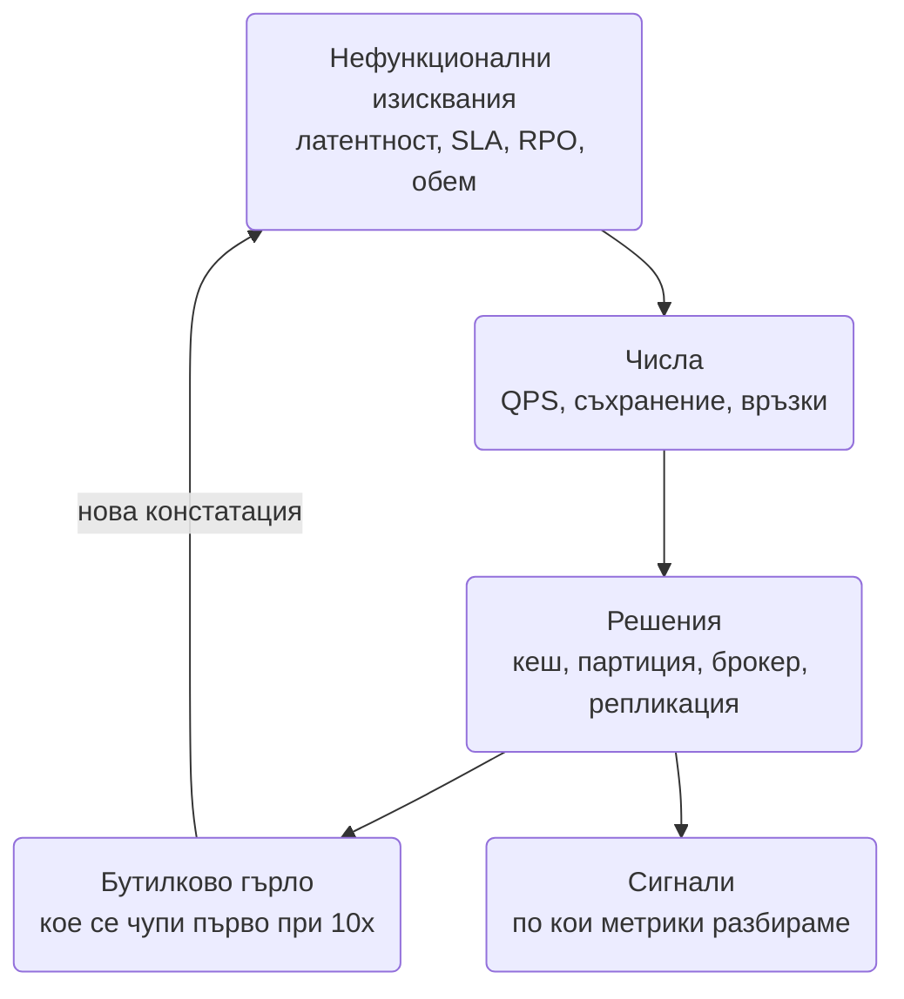

# Чеклист за нефункционални изисквания: какво да изясниш, преди да нарисуваш първата кутия

Повечето провалени system design интервюта не се провалят на диаграмата. Провалят се в първите
пет минути, когато кандидатът чува "проектирай X" и започва да рисува. Интервюиращият не оценява
дали знаеш какво е Kafka; оценява дали можеш да извлечеш **числата и ограниченията**, които правят
Kafka правилен или грешен избор. Пет минути въпроси дават обосновка на всяко следващо решение:
"116k RPS четене, затова кеш", "не можем да загубим пари, затова ledger и reconciliation", "99.99,
затова нищо stateful не е единично".

Този документ е чеклистът за тези пет минути, плюс инструментите да превърнеш отговорите в дизайн.

## Чеклистът на една страница

| Измерение | Въпросите, които задаваш | Типичен отговор или число | Какво следва за дизайна |
| --- | --- | --- | --- |
| **Потребители и трафик** | Колко DAU? Колко заявки на потребител на ден? Съотношение четене/писане? Пик спрямо средно? Растеж за 2 години? | 10M DAU, 100:1 четене/писане, пик 3-5x, растеж 2x годишно | Пикът, не средното, оразмерява. Съотношението решава кеш срещу запис-оптимизирана база |
| **Латентност** | Какво е p99 за критичните пътища? Кое трябва да е синхронно и кое може да е асинхронно? Колко от бюджета остава за нас след мрежата до клиента? | p99 < 200 ms за четене, < 500 ms за запис, "готово до минута" за фонови неща | Всичко над бюджета излиза от критичния път в събитие. Timeout budget по веригата |
| **Достъпност** | Каква е целта: 99.9 или 99.99? Кои части могат да са долу, без потребителят да забележи? Има ли планирани прозорци? | 99.9 за вътрешни системи, 99.99 за пари и вход | 99.99 означава multi-AZ, без единична stateful точка, деплой без downtime, drain процедури |
| **Издръжливост (durability)** | Може ли да загубим последната секунда данни при срив? Какъв е RPO? Колко бързо трябва да се възстановим (RTO)? | Пари: RPO 0. Метрики и прогрес на гледане: секунди са ОК | Синхронна репликация и `acks=all` където RPO е 0; write-behind където не е |
| **Консистентност** | Къде потребителят трябва да види записа си веднага? Къде е приемливо изоставане? Има ли инварианти между редове (баланс, инвентар)? | Строга за баланс и резервации, eventual за feed, брояч, търсене | Строгата част е малка и в една база с транзакции; останалото е eventual с асинхронни потоци (виж [моделите на консистентност](Consensus_Consistency_Models.md)) |
| **Мащабируемост** | Кое ще расте: потребители, данни или трафик на потребител? Кои компоненти са stateful? | "Ще отворим нов пазар за 3 месеца" | Stateless слоеве скалират с добавяне; за stateful трябват регистър, шардиране, drain |
| **Обем и retention** | Колко данни на ден? Колко се пазят и колко от тях са горещи? Трябва ли изтриване по заявка (GDPR)? | 50 GB/ден, 10% горещи, 7 години за финансови, 30 дни за логове | Горещо в кеш и SSD, студено в обектно хранилище; партиции по време за евтино триене |
| **Сигурност и съответствие** | Кой е потребителят и как се удостоверява? Има ли PII, карти (PCI), здравни данни? Нужен ли е audit trail? Ограничения за региони? | "Има карти" означава PCI scope; "ЕС потребители" означава данни в ЕС | Токенизация през PSP, шифроване, audit лог като append-only, data residency в дизайна от първия ден |
| **Цена** | Има ли бюджет? Кое е скъпото: egress, съхранение, изчисление, лицензи? Managed или собствена операция? | Видео: egress е 80% от сметката. Аналитика: съхранение | CDN и компресия където egress доминира; tiering където съхранението доминира; managed услуги при малък екип |
| **Наблюдаемост** | Как ще разберем, че се е счупило, преди потребителите? Кои са трите метрики, по които ще алармираме? | p99 латентност, error rate, consumer lag | SLO с error budget, RED/USE метрики, tracing с correlation id (виж [Metrics & Alerting](Metrics_Monitoring_Alerting.md)) |
| **Оперативност** | Как деплойваме без downtime? Как се маха сървър с живи връзки? Кой е on-call? | Rolling deploy, canary, feature flags | Graceful drain за stateful слоеве, миграции expand/contract, runbook-ове |
| **Екип и поддръжка** | Колко хора ще го строят и поддържат? Какви технологии знаят? Колко системи могат да оперират? | 4 инженера, знаят Node и Postgres | Малък екип означава малко технологии: една база, един брокер, managed услуги |
| **Региони** | Един регион или няколко? Активно-активно или активно-пасивно? Къде трябва да живеят данните? | Един регион + DR реплика в друг | Активно-активно само при изрично изискване; иначе домашен регион на потребител |
| **Пикове и злоупотреба** | Има ли събития с 100x трафик (пускане на билети, кампания)? Ботове? Лимити на потребител? | 500k RPS за 30 секунди при старт на продажба | Waiting room, rate limits по слоеве, load shedding с приоритети |
| **Разширяемост и отворени въпроси** | Какво не влиза в обхвата днес, но се очаква? Какво можем съзнателно да отложим? | "Без препоръки в v1, без multi-region" | Записваш го на дъската като "извън обхват", за да не те върнат към него |

## Как да минат първите пет минути

Редът има значение, защото всеки отговор стеснява следващия въпрос:

1. **Функционален обхват в едно изречение.** "Потребител качва видео, други го гледат; без live,
   без коментари за v1." Изясняваш какво **не** правиш. Записваш го горе на дъската.
2. **Кой и колко.** DAU, действия на потребител, съотношение четене/писане. Ако интервюиращият каже
   "приеми каквото искаш", избираш реалистично голямо число и го казваш на глас: "приемам 10M DAU,
   защото при 10k DAU системата е един сървър и няма какво да проектираме".
3. **Кое е критично.** Латентност на кой път, консистентност за кои данни, RPO за кои. Тук е
   въпросът, който отличава кандидатите: "може ли потребителят да види стар баланс за секунда?"
4. **Достъпност и региони.** Едно число и един отговор за multi-region. Не предлагай active-active,
   ако не са го поискали.
5. **Ограничения на екипа и цената.** Едно изречение: "приемам малък екип, затова managed услуги и
   минимум различни технологии".

Изречения, които работят:

- "Преди да рисувам, искам да изясня три неща: обем, консистентност и какво се случва при отказ."
- "Ще запиша тези числа горе, защото ще ги ползвам за всяко решение."
- "Това е извън обхвата за днес, но дизайнът не трябва да го прави невъзможно."
- "Ако цифрите покажат, че системата е малка, ще го кажа и ще проектирам за 10x, не за 1000x."

На дъската, горе вляво, стоят: DAU, QPS четене/запис (средно и пик), p99 цели, SLA, RPO, обем на
ден, "извън обхват". Всяко следващо решение сочи към едно от тях.

## Оразмеряване: формулите

Числата за наизуст са в [патерните](System_Design.md). Формулите, които ги превръщат в дизайн:

| Величина | Формула | Пример |
| --- | --- | --- |
| Средно QPS | DAU × действия на ден / 86 400 (≈ 10^5) | 10M × 10 / 10^5 = 1 000 QPS |
| Пиково QPS | Средно × 3 до 5 (или измерен фактор) | 1 000 × 3 = 3 000 QPS |
| QPS четене | QPS запис × съотношение | 1 000 записа × 100 = 100k четения/сек |
| Съхранение на ден | Записи на ден × размер на запис | 10^7 × 1 KB = 10 GB/ден |
| Съхранение за N години | На ден × 365 × N (× репликация) | 10 GB × 365 × 5 × 3 = 55 TB |
| Кеш | 20% от дневния горещ набор (Парето) | 20% × 10^7 × 1 KB = 2 GB |
| Пропускливост | QPS × размер на отговора | 100k × 5 KB = 500 MB/s = 4 Gbps |
| Едновременни връзки | DAU × дял онлайн едновременно × устройства | 10M × 10% × 1.2 = 1.2M връзки |
| Сървъри за stateful слой | Връзки / капацитет на процес | 1.2M / 50k = 24 инстанции + резерв |
| Брой шардове | Общ обем / удобен размер на шард (1-2 TB) или QPS / капацитет на възел | 55 TB / 2 TB ≈ 28 шарда |

Две правила за представяне: закръгляй агресивно (10^5 секунди в ден, не 86 400) и произнасяй
извода, не само числото. "100k четения в секунда" е факт; "100k четения в секунда не отиват в
базата, затова кеш" е дизайн.

## От изискване към решение

| Изискването казва | Решението следва |
| --- | --- |
| p99 < 100 ms за четене при 100k QPS | Кеш пред базата, предварително изчислени резултати, CDN за неперсонализираното ([Autocomplete](Search_Autocomplete_Typeahead.md), [News Feed](News_Feed_Timeline.md)) |
| Съотношение четене/писане 100:1 | Cache-aside, read replicas, negative caching ([URL Shortener](URL_Shortener.md)) |
| Съотношение 1:100 или append-only с милион записа/сек | Write-optimized хранилище (LSM), партиция по ключ, батчване ([KV Store](Distributed_Key_Value_Store.md), [Geo](Geo_Proximity_Uber_Yelp.md)) |
| "Не можем да загубим пари" | Ledger с двойно счетоводство, idempotency ключове, синхронна репликация, reconciliation ([Payment System](Payment_System_Stripe_Wallet.md)) |
| Инвариант между редове (последната стая, едно място) | Условен `UPDATE`, `UNIQUE` constraint, лок само като оптимизация ([Ticketmaster](Ticketmaster.md), [Postgres отвътре](Database_Internals_Postgres.md)) |
| 99.99 достъпност | Multi-AZ, без единичен stateful компонент, lease + fencing за owner-и, деплой с drain, chaos тестове |
| RPO 0 | Синхронна репликация, `acks=all`, потвърждение след запис на диск на две места |
| RPO секунди е приемливо | Write-behind, асинхронна репликация, snapshot във фонов режим ([Online Trading Game](Online_Trading_Game.md)) |
| Милиони отворени връзки | Отделен stateful WebSocket слой, session registry или subject routing, heartbeat, L4 балансиране ([Chat](Chat_system_WhatsApp_Slack%20_Messenger.md)) |
| 100x пик за минути | Waiting room с подписан токен, опашка пред скъпия ресурс, load shedding по приоритет |
| Дълга обработка (транскодиране, отчет) | Асинхронно през durable опашка, state machine с изтичане, DLQ и replay ([Video](Video_platform_like_Udemy.md), [Notification](Notification_system.md)) |
| Данни за 7 години, 1% горещи | Tiering: SSD, обектно хранилище, архив; партиции по време за евтино триене |
| Изтриване по заявка (GDPR) при event sourcing | Криптографско изтриване (ключ на потребител, който се унищожава) или PII извън събитията в отделно хранилище |
| Потребители в ЕС и САЩ с data residency | Домашен регион на потребител, глобален само маршрутизиращият слой; без активно-активна репликация на PII |
| Екип от 3 души | Postgres + един брокер + managed услуги; всяка допълнителна технология е защитавана с число |

## Математика на достъпността

Достъпността се умножава по веригата на **серийните** зависимости и се подобрява при **паралелни**
(излишни) компоненти:

- Серийно: `A = A1 × A2 × ... × An`. Заявка, която минава през 5 компонента по 99.9%, има
  `0.999^5 ≈ 0.995`, тоест 99.5%: пет пъти повече downtime от всеки компонент поотделно. Затова
  всяка нова синхронна зависимост по критичния път е скъпа и трябва да има fallback.
- Паралелно (две реплики, поне една работи): `A = 1 - (1 - A1)(1 - A2)`. Два компонента по 99% дават
  `1 - 0.01 × 0.01 = 99.99%`, но само ако отказите им са независими. Две реплики в една стойка не са.

| SLA | Downtime на година | Downtime на месец | Какво означава оперативно |
| --- | --- | --- | --- |
| 99% | 3.65 дни | 7.3 часа | Ръчно възстановяване е приемливо |
| 99.9% | 8.8 часа | 44 минути | Автоматичен failover, но човек може да реагира |
| 99.95% | 4.4 часа | 22 минути | Деплой без downtime е задължителен |
| 99.99% | 52 минути | 4.4 минути | Никакъв ръчен failover; всичко е автоматично и тествано |
| 99.999% | 5.3 минути | 26 секунди | Multi-region, active-active, години инженерна работа |

Двете следствия за интервю: (1) SLA на системата не може да е по-високо от най-слабата синхронна
зависимост, включително външния PSP или картовия доставчик; (2) "99.99" не е число, което казваш, а
списък от неща, които трябва да са автоматични.

## Речник на компромисите

Изречения, които показват, че мислиш в размени, а не в абсолюти:

- "Избирам eventual consistency тук, защото потребителят не може да различи 200 ms изоставане, а
  печеля независимо скалиране на четенето."
- "Този компонент е синхронен по критичния път, затова получава timeout budget и fallback; всичко
  останало е събитие."
- "Локът е оптимизация, гаранцията е в базата."
- "Приемам RPO от няколко секунди за прогреса на гледане, но RPO нула за плащанията. Това са две
  различни хранилища и две различни репликации."
- "Няма да предлагам multi-region, защото не е поискано, а удвоява сложността; дизайнът обаче държи
  данните на потребител в един регион, за да е възможно после."
- "При 10x този компонент се чупи първи; ето как ще го разбера и какъв е планът."
- "Сложността на този компонент е оправдана от това число; без него бих сложил Postgres таблица."

## Червени знамена

Неща, които интервюиращите отчитат като липса на опит:

- **Нула въпроси** преди диаграмата, или въпроси, чиито отговори после не се ползват.
- **Gold plating:** Kafka, Cassandra и Kubernetes за система с 50 QPS. Числата трябва да оправдават
  всяка кутия.
- **Multi-region и active-active без да е поискано.** Показва, че не знаеш цената им.
- **Игнориране на цената:** видео платформа без дума за egress, аналитика без дума за retention.
- **Консистентност като глобален превключвател:** "всичко е eventual" или "всичко е строго" вместо
  разделяне по данни.
- **Без отговор на "как ще разберете, че се е счупило".** Логове не са отговор; метрики и SLO са.
- **Без слаби места.** Дизайн без известно бутилково гърло е дизайн, който не е обмислен.
- **Технология вместо механизъм:** "ще сложа Redis" без да казваш какво пази, колко е и какво става,
  когато го няма.

## Компактен чеклист за отпечатване

1. Какво точно прави системата и какво изрично не прави в v1?
2. Колко дневно активни потребители и колко действия прави всеки?
3. Какво е съотношението четене към писане?
4. Колко е пикът спрямо средното и има ли планирани събития със 100x?
5. Какви са p99 целите за всеки критичен път?
6. Кое трябва да е синхронно и кое може да закъснее с секунди или минути?
7. Каква е целта за достъпност и кои части могат да са долу?
8. Може ли да загубим последната секунда данни? Какъв е RPO и RTO?
9. Кои данни изискват строга консистентност и кои инварианти обхващат няколко реда?
10. Къде е приемливо потребителят да види изостанали данни?
11. Колко данни на ден, колко се пазят, колко са горещи?
12. Трябва ли изтриване по заявка на потребител?
13. Има ли PII, карти или регулаторни изисквания? Нужен ли е audit trail?
14. В кои региони са потребителите и къде трябва да живеят данните?
15. Един регион или няколко? Активно-пасивно е ли достатъчно?
16. Кое е скъпото перо: egress, съхранение, изчисление или лицензи?
17. Колко хора ще го поддържат и какво знаят?
18. Как деплойваме без downtime и как махаме сървър с живи връзки?
19. По кои три метрики ще разберем, че се е счупило?
20. Какво отлагаме съзнателно и какво не трябва да правим невъзможно?

## Ключови въпроси за интервюто

### Интервюиращият казва "приеми каквото искаш". Какво правиш?

Приемаш и произнасяш числата на глас, с обосновка защо са интересни: "10M DAU, защото при 100k
системата е един сървър". После ги записваш и ги ползваш. Целта на въпроса е да види дали можеш да
избереш реалистичен мащаб, не да чака точен отговор.

### Колко дълбоко да оразмерявам?

До извода, не до третата цифра. Три-четири числа са достатъчни: QPS пик, обем на ден, памет за кеш,
брой връзки или шардове. Всяко от тях трябва да води до решение. Пет минути с калкулатор наум са
твърде много; едно число без извод е пропуснато.

### Числата показват, че системата е малка. Какво тогава?

Казваш го. "При тези числа това е Postgres и два сървъра зад балансер. Ще проектирам за 10x, за да
покажа къде би се чупило, но няма да слагам брокер без причина." Това е по-силен отговор от
изкуствено раздуване, защото показва преценка.

### Как избирам между строга и eventual консистентност, ако не са ми казали?

Питаш за инвариантите: има ли нещо, което не може да е грешно дори за секунда (пари, инвентар,
уникално име)? Това е строгата част и е малка. Всичко, което е производно или показва състояние на
другите (feed, броячи, презенс), е eventual. Казваш разделянето изрично.

### Какво правя, ако интервюиращият добави изискване по средата?

Връщаш се към дъската с числата и питаш какво променя. Ново изискване за 99.99 или за multi-region
трябва да промени конкретни кутии; показваш кои и защо. Това е точно тестът: дали дизайнът ти е
изведен от изискванията или е шаблон.

### Как показвам, че мисля за цената, без да знам цените?

Чрез пропорции: кое перо доминира и кой лост го намалява. "Egress е най-голямата сметка при видео,
затова per-title encoding и CDN pre-warming са икономически решения, не само технически." Точните
долари не се очакват; посоката се очаква.
