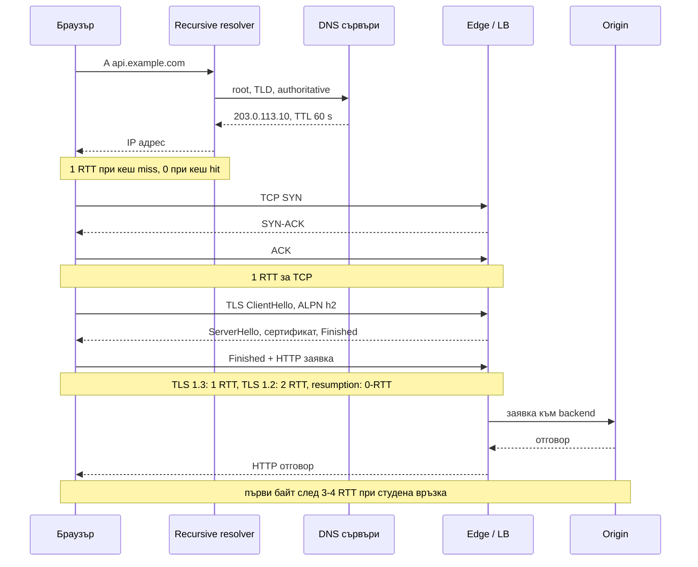
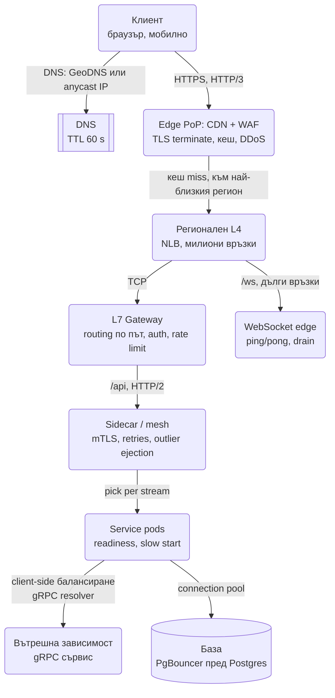

# Мрежа и балансиране (L4/L7, алгоритми, health checks, TLS, HTTP/1.1 срещу 2 срещу 3, DNS, CDN, service mesh)

Във всяка диаграма в тази папка има кутия "Load balancer" и стрелка "HTTPS". Интервюиращият рано или
късно посочва точно тази кутия и пита какво има вътре: на кое ниво балансира, как разбира, че сървър е
мъртъв, защо WebSocket връзките се събират на един pod, колко обиколки минават преди първия байт.
Това не са въпроси за мрежови инженери. Те проверяват дали разбираш, че латентността, отказите и
скалирането на stateful слоя се решават **преди** заявката да стигне до твоя код.

Слушат за три неща: знаеш ли какво вижда всяко ниво (IP и порт срещу заглавия и пътища), можеш ли да
преброиш обиколките (RTT) до първия байт, и знаеш ли къде се крият състоянията (сесии, WebSocket,
gRPC потоци), които правят балансирането трудно.

## Какво се случва, когато заявката излезе от браузъра



### DNS

- **Рекурсивна резолюция:** браузърът пита resolver-а на операционната система или на провайдера,
  той обхожда root, TLD и authoritative сървърите и кешира отговора за колкото казва **TTL**.
- **TTL е компромис:** кратък TTL (30-60 s) дава бърз failover, но повече заявки към authoritative
  сървърите. Дълъг TTL (часове) е евтин, но при смяна на IP клиентите продължават да удрят стария
  адрес с часове. Част от resolver-ите изобщо не уважават TTL под определена стойност.
- **GeoDNS:** authoritative сървърът връща различен IP според къде е resolver-ът на клиента. Проста
  форма на географско насочване, но неточна: resolver-ът на клиента може да е в друга държава
  (публични resolver-и като 8.8.8.8 частично решават това с EDNS Client Subnet).
- **Anycast:** един и същ IP се обявява през BGP от много места по света и мрежата насочва пакета
  към най-близкото. Така работят CDN-ите и публичните DNS. Дава близост и DDoS абсорбция без
  GeoDNS логика, но TCP връзка може да се пренасочи към друг PoP при промяна на маршрута, което за
  дълги връзки (WebSocket) е проблем.
- **DNS failover** е най-бавният failover: health check маха мъртвия IP от отговора, но клиентите с
  кеширан запис продължават да го ползват до изтичане на TTL. Затова DNS е за failover между региони
  (минути са приемливи), а не между инстанции (там е балансьорът).

### TCP и TLS

- TCP ръкостискане е 1 RTT преди първия байт данни.
- TLS 1.2 добавя 2 RTT, TLS 1.3 само 1 RTT. С **session resumption** (PSK) TLS 1.3 позволява 0-RTT
  данни, с уговорката, че 0-RTT заявки могат да бъдат повторени от атакуващ, затова са само за
  идемпотентни операции.
- **ALPN** договаря протокола в самото TLS ръкостискане (h2, http/1.1, h3), без допълнителна
  обиколка.
- Сметката: между континенти един RTT е 100-150 ms (виж числата в [патерните](System_Design.md)).
  Студена HTTPS връзка е 3 RTT (DNS кеширан, TCP, TLS 1.3), тоест 300-450 ms преди първия байт.
  Затова се държат постоянни връзки (keep-alive), затова TLS се терминира на edge близо до
  потребителя, затова има CDN. Всяко от тези решения маха обиколки, не байтове.

## L4 срещу L7 балансиране

| | L4 (transport) | L7 (application) |
| --- | --- | --- |
| Какво вижда | IP адреси, портове, TCP/UDP | HTTP метод, път, заглавия, cookies, gRPC service/method |
| Как решава | По връзка: първият пакет избира backend, останалите следват | По заявка: всяка HTTP заявка може да отиде на друг backend |
| TLS | Пропуска криптирания поток (или терминира без да гледа HTTP) | Терминира TLS, чете и пренаписва заглавия |
| Пропускливост | Милиони връзки, минимална латентност, малко CPU | По-скъп на заявка, но прави routing, retries, rate limiting |
| Стандартни примери | AWS NLB, HAProxy в tcp режим, IPVS, Envoy tcp_proxy | AWS ALB, nginx, Envoy, HAProxy в http режим, Traefik |
| WebSocket | Идеален: една дълга TCP връзка, един backend | Работи през Upgrade, но балансьорът държи и двете страни на връзката |
| gRPC (HTTP/2) | Всички потоци по една връзка отиват на един backend | Балансира по поток (per-stream), ако разбира HTTP/2 |

Правилата, които интервюиращият очаква да чуе:

- **API трафикът иска L7:** маршрутизиране по път (`/api` към Gateway, `/ws` към Realtime edge, както
  в [Online Trading Game](Online_Trading_Game.md)), retries на идемпотентни заявки, rate limiting,
  заглавия за трасиране.
- **WebSocket слоят е добре и на L4:** връзката е дълга, балансиране по заявка няма смисъл, а L4
  издържа милиони връзки евтино (виж 22 млн. връзки в [Chat](Chat_system_WhatsApp_Slack%20_Messenger.md)).
  L7 пред WebSocket работи, но тогава балансьорът също държи 22 млн. връзки и има idle timeout.
- **DSR (Direct Server Return):** при L4 отговорът може да мине покрай балансьора директно към
  клиента, което удвоява капацитета му. При L7 е невъзможно, защото балансьорът е края на TCP
  връзката.

## Алгоритми за разпределяне

| Алгоритъм | Как | Кога | Слабост |
| --- | --- | --- | --- |
| Round robin | Поред | Еднородни заявки и сървъри | Не знае, че един сървър е бавен |
| Weighted round robin | Поред с тежести | Хетерогенен хардуер, canary с 5% трафик | Статични тежести |
| Least connections | Към сървъра с най-малко отворени връзки | Дълги и различни по цена заявки | При много балансьори всеки вижда само своите връзки |
| Least response time | Най-малко връзки и най-ниска латентност | Latency-sensitive API | Шумна метрика, осцилации |
| Random two choices | Избира два случайни, праща към по-малко натоварения | Големи пулове, много балансьори | Практически няма, затова е стандартът в Envoy |
| IP hash / consistent hashing | Хеш от клиент или ключ определя backend | Кеш affinity, локални кешове по потребител | Един голям клиент зад NAT е hot spot |
| Sticky sessions (cookie) | Балансьорът слага cookie с backend id | Наследени stateful приложения | Неравномерност, лош deploy, губи се при падане |

**Защо power of two choices печели.** Least connections с N балансьори има класически проблем: всеки
балансьор вижда само своите връзки и всички едновременно избират "най-свободния" сървър, който в
следващия миг е най-натовареният (herd effect). Изборът между два случайни сървъра дава почти същото
качество на разпределението като глобален least connections, но без синхронизирано стадо, с O(1)
разход и без споделено състояние. Резултатът от Mitzenmacher: максималният товар пада от
O(log n / log log n) при чист random до O(log log n) само с втори избор.

**Защо sticky sessions са анти-патерн.** Сесията трябва да е в Redis или в подписан токен (виж
[Auth & Sessions](Auth_Session_OAuth_SSO.md)), а не в паметта на инстанция. При sticky sessions падане
на един сървър изхвърля всичките му потребители, deploy изисква drain на всеки сървър поотделно, а
разпределението се изкривява с времето. Правилният отговор за stateful слой е stateless edge плюс
resync, както в [Online Trading Game](Online_Trading_Game.md), или регистър кой е къде, както в Chat.

```ts
interface Backend { id: string; inflight: number; weight: number; served: number }

const backends: Backend[] = [
  { id: 'a', inflight: 0, weight: 1, served: 0 },
  { id: 'b', inflight: 0, weight: 1, served: 0 },
  { id: 'c', inflight: 0, weight: 1, served: 0 },
  { id: 'slow', inflight: 0, weight: 1, served: 0 },
];

let rr = 0;
const roundRobin = (pool: Backend[]) => pool[rr++ % pool.length];

const leastConnections = (pool: Backend[]) =>
  pool.reduce((best, b) => (b.inflight < best.inflight ? b : best));

const powerOfTwo = (pool: Backend[]) => {
  const i = Math.floor(Math.random() * pool.length);
  let j = Math.floor(Math.random() * (pool.length - 1));
  if (j >= i) j++;
  return pool[i].inflight <= pool[j].inflight ? pool[i] : pool[j];
};

// Симулация: "slow" обслужва заявка 5 пъти по-бавно, тоест държи връзката 5 такта.
function simulate(pick: (pool: Backend[]) => Backend, ticks: number): Record<string, number> {
  const pool = backends.map((b) => ({ ...b }));
  const finishing: { at: number; b: Backend }[] = [];
  for (let t = 0; t < ticks; t++) {
    for (let k = finishing.length - 1; k >= 0; k--) {
      if (finishing[k].at <= t) { finishing[k].b.inflight--; finishing.splice(k, 1); }
    }
    for (let n = 0; n < 4; n++) {
      const b = pick(pool);
      b.inflight++;
      b.served++;
      finishing.push({ at: t + (b.id === 'slow' ? 5 : 1), b });
    }
  }
  return Object.fromEntries(pool.map((b) => [b.id, b.served]));
}

console.log('round robin     ', simulate(roundRobin, 1000));
console.log('least connections', simulate(leastConnections, 1000));
console.log('power of two     ', simulate(powerOfTwo, 1000));
```

Round robin дава на бавния сървър същия брой заявки като на бързите, тоест опашката му расте.
Least connections и power of two му пращат няколко пъти по-малко, защото виждат, че държи връзки
по-дълго. Разликата между последните две е, че втората не изисква глобален изглед. Забележи и
страничния ефект на least connections в симулацията: при равен брой връзки `reduce` винаги избира
първия сървър, така че `a` получава почти двойно повече от `b` и `c`. Детерминистичното разрешаване
на равенства е реален бъг в прости балансьори и още една причина продукционните да рандомизират
избора.

## Health checks и живот на backend-а

- **Активни проверки:** балансьорът вика `/healthz` на всеки N секунди и маха сървъра след K
  последователни провала. Реагира за десетки секунди.
- **Пасивни проверки (outlier ejection):** балансьорът брои реалните грешки и таймаути от трафика и
  временно изхвърля сървър, който връща 5xx над праг. Реагира за секунди, без допълнителен трафик.
  Envoy прави и двете едновременно.
- **Readiness срещу liveness:** readiness казва "мога да поемам трафик" (свързал съм се с базата,
  затоплил съм кеша), liveness казва "процесът не е забил". Провал на readiness маха инстанцията от
  балансьора; провал на liveness рестартира процеса. Смесването им води до рестарт на здрав процес,
  защото базата е бавна.
- **Health endpoint-ът не бива да проверява всички зависимости наивно.** Ако `/healthz` пита базата
  и базата се забави, всички инстанции стават "unhealthy" едновременно, балансьорът ги маха и
  системата пада изцяло вместо частично. Правилото: liveness проверява само процеса; readiness
  проверява критичните зависимости с кратък таймаут и кеширан резултат; деградацията заради
  незадължителна зависимост е метрика, не health провал.
- **Connection draining / deregistration delay:** при спиране балансьорът първо спира да праща нови
  връзки, чака in-flight заявките да завършат (например 30 s) и чак тогава маха сървъра. Приложението
  трябва да сътрудничи: при SIGTERM започва да връща readiness провал, спира да приема нови връзки,
  довършва текущите и затваря пуловете. Редът е описан в
  [Node.js архитектурни патерни](Design_Patterns_Node_Architecture.md).
- **Slow start:** нов сървър получава постепенно нарастващ дял от трафика през първата минута, за да
  затопли JIT и кешовете си. Без това нова инстанция получава пълен товар със студен кеш и веднага
  изглежда болна.

## Слоевете на балансиране в реална система



Всеки слой решава различен проблем: DNS избира регион, edge маха обиколки и абсорбира атаки, L4 носи
обема, L7 знае за приложението, mesh-ът дава сигурност и устойчивост между сървисите, client-side
балансирането маха един hop за вътрешни gRPC извиквания. На интервю не е нужно да рисуваш всичките,
но е нужно да кажеш кой слой отговаря за въпроса, който ти задават.

## HTTP/1.1 срещу HTTP/2 срещу HTTP/3

| | HTTP/1.1 | HTTP/2 | HTTP/3 |
| --- | --- | --- | --- |
| Транспорт | TCP, текстов | TCP, бинарни frames | QUIC върху UDP |
| Паралелност | Една заявка на връзка; браузърите отварят до 6 връзки на origin | Мултиплексиране на много потоци по една връзка | Мултиплексиране без TCP head-of-line blocking |
| Head-of-line blocking | На ниво HTTP: бавна заявка блокира връзката | Решен на HTTP ниво, но остава на TCP ниво: загубен пакет спира всички потоци | Решен: загуба в един поток не спира другите |
| Заглавия | Некомпресирани, повтарят се | HPACK компресия | QPACK |
| Ръкостискане | TCP + TLS: 2-3 RTT | Същото | 1 RTT, 0-RTT при resumption |
| Смяна на мрежа | Нова връзка | Нова връзка | Connection migration: връзката оцелява при смяна Wi-Fi към LTE |
| Server push | Няма | Deprecated, браузърите го махнаха | Няма |
| Къде се среща | Наследени клиенти, вътрешни системи | gRPC, всеки модерен браузър към edge | Браузър към CDN, мобилни приложения |

**gRPC и балансирането** е любимият follow-up. gRPC върви върху HTTP/2 и клиентът отваря **една**
дълга връзка, по която мултиплексира всички извиквания. L4 балансьорът вижда една TCP връзка и я
праща на един backend, тоест всичкият трафик от този клиент отива на един pod, независимо колко
подове има. Решенията: L7 балансьор, който разбира HTTP/2 и разпределя **по поток** (Envoy, ALB с
gRPC режим); или client-side балансиране, при което клиентът получава списък с адреси от resolver
(headless Service в Kubernetes, xDS) и сам прави round robin по връзки; или `MAX_CONNECTION_AGE` на
сървъра, който периодично затваря връзки и принуждава клиента да се свърже отново, вече към друг pod.

## Връзки, пулове и таймаути

- **Keep-alive пулове:** в Node `http.Agent({ keepAlive: true, maxSockets })` държи връзките отворени
  и спестява TCP и TLS обиколките за всяка заявка. Без него сървис, който прави 1 000 заявки/сек към
  друг, отваря 1 000 TCP връзки в секунда.
- **Ephemeral port exhaustion и TIME_WAIT:** затворена връзка стои в TIME_WAIT около 60 s. При хиляди
  краткотрайни връзки в секунда към един адрес клиентът изчерпва ~28 000 ephemeral порта. Симптомът е
  `EADDRNOTAVAIL`. Лекът е keep-alive, не по-голям порт диапазон.
- **Лимит на връзки на host:** `maxSockets` е bulkhead: пази зависимостта от нас и нас от нея. Когато е
  изчерпан, заявките чакат в опашка на клиента, а тази опашка трябва да има таймаут.
- **Трите таймаута:** connect (TCP ръкостискане), read/response (до първия байт или между байтове),
  idle (колко държим неизползвана връзка). Всеки трябва да е по-малък от бюджета на извикващия ни
  (timeout budget в [патерните](System_Design.md)). Балансьорът има свои idle таймаути (ALB: 60 s по
  подразбиране), и ако сървърът затвори връзката преди балансьора, клиентите виждат случайни 502.
  Правилото: keep-alive timeout на сървъра да е по-дълъг от idle timeout на балансьора.

## WebSocket през балансьори

- Upgrade минава през L7 само ако балансьорът го поддържа (всички модерни го правят); през L4 е
  просто TCP.
- **Idle timeout на балансьора** убива тихи връзки след 60 s (ALB, много nginx конфигурации). Затова
  ping/pong на 20-30 s е задължителен, не оптимизация. Той открива и мъртвите TCP връзки, които иначе
  изглеждат живи с часове.
- Скалира се по **брой връзки и памет**, не по RPS. Един Node процес държи 50-100k връзки, затова
  слоят е отделен и stateless, а deploy е drain на порции, както е описано в
  [Chat](Chat_system_WhatsApp_Slack%20_Messenger.md).
- Anycast IP пред WebSocket е рисков: промяна на BGP маршрут пренасочва пакетите към друг PoP и
  връзката умира. Затова WebSocket edge обикновено е зад регионален unicast адрес, а anycast остава за
  HTTP.

## CDN отвътре


- **PoP и cache key:** edge сървърът кешира по ключ (host, път, query, избрани заглавия). Всеки
  различен query параметър е нов ключ, затова tracking параметрите се махат от ключа, иначе cache hit
  rate пада до нула.
- **`Cache-Control`:** `max-age` за браузъра, `s-maxage` за CDN-а, `stale-while-revalidate` (сервирай
  старото, докато опресняваш във фон), `stale-if-error` (сервирай старото, ако origin е паднал),
  `private` за персонализирано, `no-store` за чувствително. `Vary` разделя кеша по заглавие и лесно
  го унищожава (`Vary: Cookie`).
- **Origin shield:** междинен слой между стотиците PoP-ове и origin, така че cache miss от 200 PoP-а
  става една заявка към origin. Заедно с **request collapsing** (единна заявка към origin за
  едновременни miss-ове на един ключ) това е защитата от cache miss storm при нов популярен сегмент
  (виж pre-warming в [Video Platform](Video_platform_like_Udemy.md)).
- **Инвалидация срещу версионирани URL:** purge по ключ е бавен и скъп в мащаб (секунди до минути по
  целия свят). Версионирането в пътя (`/app.3f9a.js`) с дълъг TTL е безплатно и моментално.
  Инвалидация остава за случаите, когато пътят не може да се смени (изтриване на съдържание).
- **Signed URL / cookie** проверява подписа на edge-а, преди да отдаде байт, така че платеното видео не
  се раздава от кеша на всеки с линка.
- **Не се кешира:** отговори с `Set-Cookie`, POST по подразбиране, персонализирани отговори без
  `Vary`, и всичко, което трябва да е консистентно до секундата. Затова seat map-ът в
  [Ticketmaster](Ticketmaster.md) е с 1-2 s TTL, а самата резервация никога не минава през кеш.

## Service mesh

Sidecar proxy (Envoy) до всеки процес поема мрежата между сървисите: **mTLS** с автоматични
сертификати, retries и таймаути, outlier ejection и circuit breaking, метрики и трасиране за всяка
връзка, без ред код в приложението (виж Sidecar в [патерните](System_Design.md)).

| | В mesh-а | В кода |
| --- | --- | --- |
| Retries, таймаути | Еднакви за всички езици, без деплой на приложението | Знаят бизнес контекста: кое е идемпотентно, какъв е бюджетът |
| Circuit breaker | По host, груб | По операция, фин |
| Наблюдаемост | Безплатна за всяка връзка | Изисква инструментиране |
| Цена | 1-2 ms латентност на hop, паметта на sidecar-а, оперативна сложност на control plane-а | Библиотека във всеки сървис |

Правилото: mesh-ът е оправдан при десетки сървиси, няколко езика и изискване за mTLS навсякъде. При
пет Node сървиса зад един gateway е излишна тежест; същото се постига с библиотека и API gateway.
Опасност: retries и в mesh-а, и в кода дават retry storm (3 × 3 = 9 опита).

## Кой стои къде: reverse proxy, API gateway, BFF, service mesh

| | Reverse proxy | API Gateway | BFF | Service mesh |
| --- | --- | --- | --- | --- |
| Позиция | Пред сървъра | На входа на системата | Между конкретен клиент и сървисите | Между сървисите |
| Знае за | HTTP | API: auth, rate limit, versioning, routing | Продукта: оформя отговори за конкретен UI | Мрежата между сървисите |
| Пример | nginx, HAProxy | Kong, AWS API Gateway, Envoy Gateway | Node сървис за мобилното приложение | Istio, Linkerd, Consul Connect |
| Бизнес логика | Никога | Никога | Агрегация и оформяне, без правила за пари | Никога |

## Къде се терминира TLS

| Вариант | Плюс | Минус |
| --- | --- | --- |
| На edge / CDN | Най-малко обиколки за потребителя, offload на ръкостискането | Трафикът от edge към origin трябва да е отново криптиран |
| На балансьора | Централно управление на сертификати, L7 вижда трафика | Вътрешната мрежа е plaintext, ако не се шифрира отново |
| End-to-end до процеса | Нулево доверие в мрежата | L7 балансьорът не вижда HTTP, всеки сървис управлява сертификати |

Практиката: TLS на edge, re-encrypt към origin, mTLS между сървисите през mesh или библиотека,
автоматични сертификати през ACME (Let's Encrypt) или вътрешен CA с кратък живот (часове) и
автоматична ротация.

## Ключови въпроси за интервюто

### Защо всичкият ми gRPC трафик отива на един pod?

Защото gRPC мултиплексира всички извиквания по една HTTP/2 връзка, а L4 балансьорът разпределя
връзки, не потоци. Решения: L7 балансьор с HTTP/2 разбиране, client-side балансиране по списък от
адреси, или `MAX_CONNECTION_AGE` на сървъра, за да се преразпределят връзките периодично.

### L4 или L7 за WebSocket?

L4, ако слоят е само WebSocket и искаш милиони евтини връзки; L7, ако трябва маршрутизиране по път или
auth на входа. И при двата: ping/pong под idle timeout на балансьора и drain при deploy.

### Колко обиколки минават преди първия байт?

При студена връзка и кеширан DNS: 1 за TCP, 1 за TLS 1.3 (2 за 1.2), 1 за заявката, тоест 3-4 RTT.
При 120 ms между континенти това е около половин секунда. Затова TLS се терминира близо до клиента,
затова keep-alive, затова HTTP/3 с 0-RTT.

### Какво дава anycast?

Един IP, обявен от много места, и мрежата води клиента към най-близкото. Близост без GeoDNS, DDoS
абсорбция, мигновен failover на ниво маршрут. Цената: дълги връзки могат да бъдат пренасочени при
промяна на маршрута.

### Как се проваля DNS failover?

Клиенти и resolver-и кешират стария IP до края на TTL, а някои игнорират кратки TTL. Затова DNS
failover е за минути и за региони; failover за секунди се прави от балансьора с health checks.

### Sticky sessions или не?

Не. Сесията отива в Redis или в подписан токен, stateful слоят получава регистър или resync. Sticky
sessions чупят deploy, failover и равномерността на разпределението.

### Защо power of two choices?

Защото least connections с много балансьори синхронизира избора им и създава стадо към един сървър,
а random two choices дава почти същото разпределение без споделено състояние и без стадо.

### Как балансьорът разбира, че backend е мъртъв?

Активни проверки на health endpoint (бавно, десетки секунди) и пасивно наблюдение на реалните грешки
(бързо, секунди). Readiness маха от трафика, liveness рестартира. Health endpoint, който пита базата
без таймаут, събаря всички инстанции едновременно.
