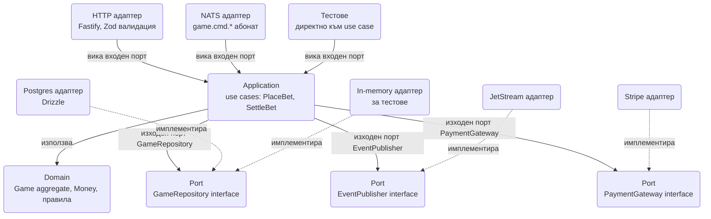
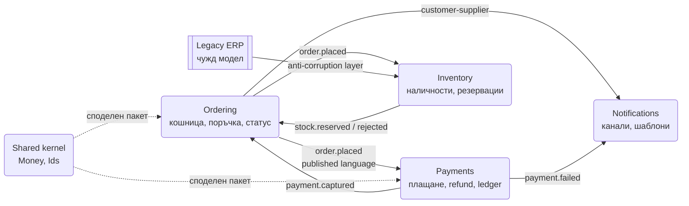
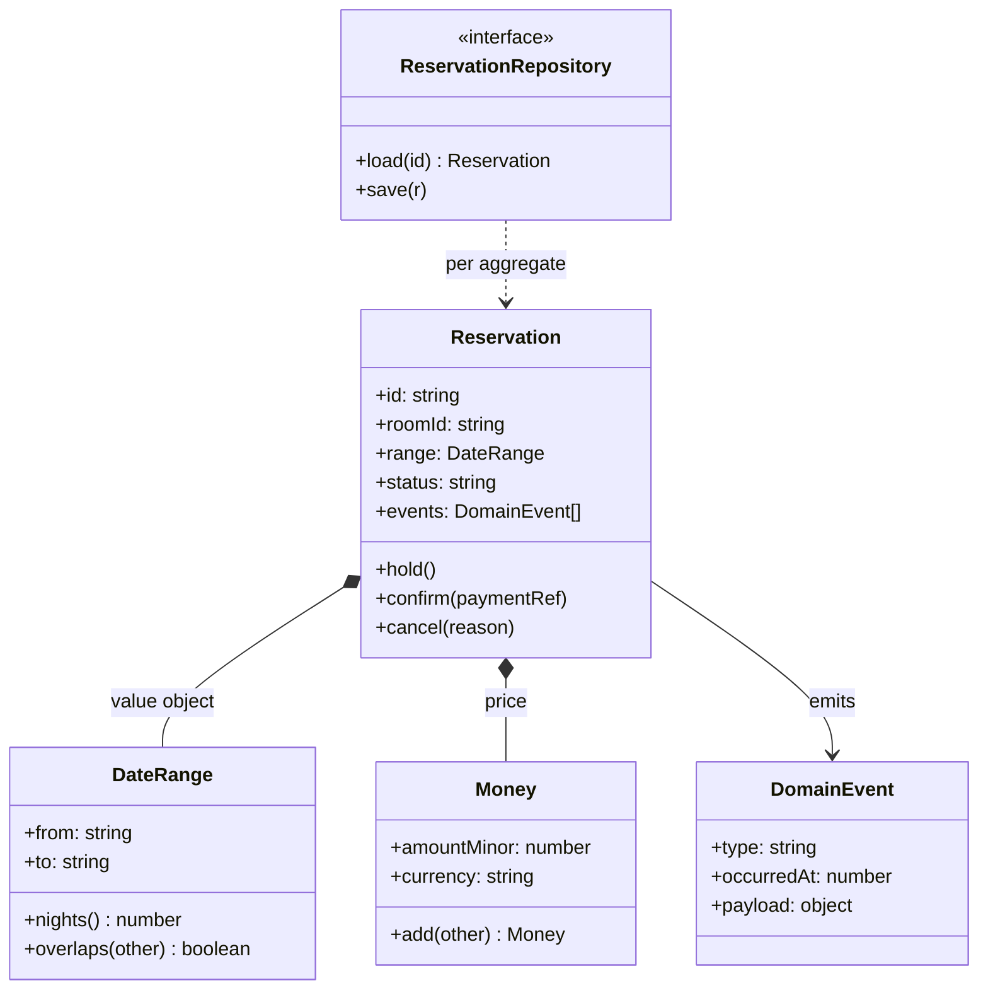
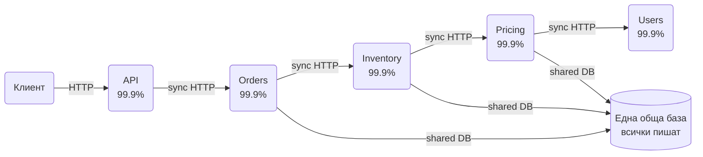
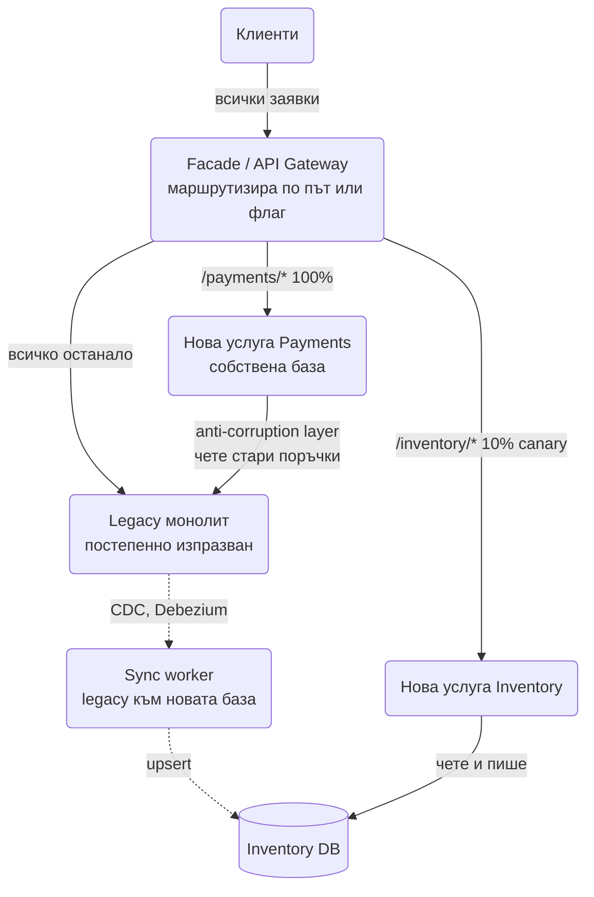

# SOLID, DDD и архитектурни стилове (hexagonal, clean architecture, modular monolith срещу microservices, миграция)

Кутийките и стрелките отговарят на въпроса "какви компоненти има". Този документ отговаря на другия
въпрос, който идва веднага след тях: **къде минават границите и защо точно там.** Интервюиращият за
архитектурна роля иска да чуе кой модул притежава кои данни, какво може да се промени, без да се
пипа друго, и къде свършва една транзакция. SOLID е речникът за границите вътре в процеса, DDD е
речникът за границите между модули и екипи, а стиловете (hexagonal, clean, modular monolith,
microservices) са различни начини да се начертаят същите граници на различна скала.

Един принцип минава през всичко долу: **зависимостите сочат към стабилното.** Бизнес правилата са
стабилни, базата и транспортът се сменят. Всеки термин тук е начин да се приложи това правило на
ниво функция, модул, процес или екип.

## SOLID в Node/TypeScript

| Принцип | Мирише на | Лекарство | Кога да не го прилагаш |
| --- | --- | --- | --- |
| **S**ingle Responsibility | Handler, който валидира, пише в базата, праща имейл и логва; тестът му вдига SMTP | Раздели по причина за промяна, не по глагол | Малък скрипт или CRUD endpoint, който никога не расте |
| **O**pen/Closed | `switch` по тип, който расте с всяко ново правило и всеки път се пипа един и същ файл | Регистър от правила, стратегии, plugin точки | Три варианта, които не са се сменяли година: `switch`-ът е по-четим |
| **L**iskov Substitution | Драйвер, който хвърля там, където базовият връща `false`; `if (driver instanceof X)` в клиента | Договорът е част от интерфейса; contract тест, който всички имплементации минават | Няма второ имплементиране и не се очаква |
| **I**nterface Segregation | `Repository` с 25 метода; отчетът зависи от `delete` | Тесни интерфейси по консуматор: reader, writer | Един консуматор, който ползва всичко |
| **D**ependency Inversion | `import pg from 'pg'` в бизнес логиката; тестът иска Docker | Портове в домейна, адаптери отвън, composition root | Прототип за седмица; инфраструктурата е самата задача |

Двете думи, които стоят зад всичките пет: **свързаност (coupling)** и **сцепление (cohesion)**.
Модул с високо сцепление има части, които се променят заедно; ниската свързаност значи, че промяна
в един модул не изисква промяна в друг. Мерките: afferent coupling (колко модула зависят от този) и
efferent coupling (от колко зависи той). Модул с висок afferent трябва да е стабилен, защото всяка
промяна в него се разпространява. Понятието **connascence** е по-фината скала: два компонента са
свързани по име (най-слабо), по тип, по значение (магически числа), по позиция (ред на аргументи),
по алгоритъм (двете страни трябва да хешират еднакво), по време. Стремежът е свързаността да е
слаба и локална. GRASP (Information Expert, Creator, Low Coupling, High Cohesion, Controller) казва
същото от страната на "кой обект да носи тази отговорност": този, който има данните за нея.

В Node по подразбиране е **композиция вместо наследяване**: функции, които приемат функции, обекти,
сглобени от по-малки обекти, `interface` вместо `abstract class`. Наследяването се пази за
истинска йерархия с общ инвариант (виж Template Method в [Behavioral](Design_Patterns_Behavioral.md)).

### S: Single Responsibility

**Проблемът.** `POST /bookings` handler-ът парсва заявката, проверява наличност, пише резервацията,
праща имейл за потвърждение, инкрементира метрика и логва. Тестът му изисква SMTP сървър, а смяната
на имейл доставчика е промяна в booking кода. Има четири различни причини този файл да се отвори:
продукт, база, маркетинг, операции.

**Принципът.** Модулът има една причина да се променя, тоест един "собственик" на промяната.

```ts
interface ReservationRepo { save(r: { id: string; roomId: string; nights: number }): Promise<void>; }
interface EventPublisher { publish(type: string, payload: unknown): Promise<void>; }

export class ReserveRoom {
  private repo: ReservationRepo;
  private events: EventPublisher;
  constructor(repo: ReservationRepo, events: EventPublisher) { this.repo = repo; this.events = events; }

  async execute(cmd: { id: string; roomId: string; nights: number }): Promise<void> {
    if (cmd.nights < 1 || cmd.nights > 30) throw new Error('nights must be 1..30');
    await this.repo.save(cmd);
    await this.events.publish('reservation.created', cmd);
  }
}

// HTTP handler-ът само превежда транспорта; имейлът е отделен консуматор на събитието.
export const handler = (useCase: ReserveRoom) => async (body: unknown) => {
  const cmd = body as { id: string; roomId: string; nights: number };
  await useCase.execute(cmd);
  return { status: 201, body: { id: cmd.id } };
};

const saved: string[] = [];
const useCase = new ReserveRoom(
  { save: async (r) => { saved.push(r.id); } },
  { publish: async (type) => { console.log('event', type); } },
);
console.log(await handler(useCase)({ id: 'r1', roomId: '42', nights: 3 }), saved);
```

Имейлът, метриката и логът стават консуматори на `reservation.created`. Booking кодът не знае за
тях, тестът му е чиста функция с два фалшиви обекта. Същото разделяне на скала система е
[Notification System](Notification_system.md): никой не праща имейл от бизнес транзакцията.

**Кога вреди.** Когато "една отговорност" се тълкува като "един метод на клас". Резултатът е 40
класа по 8 реда и никой не вижда потока. Причината за промяна е критерият, не броят редове.

### O: Open/Closed

**Проблемът.** Такси за плащане: базова такса, процент по метод, отстъпка за VIP, надбавка за
уикенд. Всяко ново правило е нов `case` в една функция от 300 реда, която всички редактират и всеки
merge конфликтира.

**Принципът.** Ново поведение се добавя с нов код, не с промяна на съществуващ.

```ts
interface Order { amountMinor: number; method: 'card' | 'wallet'; vip: boolean; weekend: boolean; }
interface FeeRule { name: string; applies(o: Order): boolean; feeMinor(o: Order): number; }

const rules: FeeRule[] = [
  { name: 'base', applies: () => true, feeMinor: () => 30 },
  { name: 'card-pct', applies: (o) => o.method === 'card', feeMinor: (o) => Math.round(o.amountMinor * 0.029) },
  { name: 'weekend', applies: (o) => o.weekend, feeMinor: () => 50 },
  { name: 'vip-discount', applies: (o) => o.vip, feeMinor: (o) => -Math.round(o.amountMinor * 0.01) },
];

export function computeFees(order: Order, active: FeeRule[] = rules): { total: number; breakdown: Record<string, number> } {
  const breakdown: Record<string, number> = {};
  for (const r of active) if (r.applies(order)) breakdown[r.name] = r.feeMinor(order);
  const total = Math.max(0, Object.values(breakdown).reduce((a, b) => a + b, 0));
  return { total, breakdown };
}

console.log(computeFees({ amountMinor: 10_000, method: 'card', vip: true, weekend: true }));
```

Ново правило е нов обект в масива, при нужда зареден от конфигурация. Функцията `computeFees` не се
отваря. Това е Strategy плюс регистър, същият механизъм като rate limit алгоритмите по endpoint в
[Behavioral](Design_Patterns_Behavioral.md).

**Кога вреди.** Три правила, които не са се променяли година, не заслужават регистър. Абстракцията
се въвежда при втората или третата реална промяна, не при първата фантазия за нея.

### L: Liskov Substitution

**Проблемът.** `KeyValueStore.delete(key)` връща `false`, ако ключът липсва. Новият Redis драйвер
хвърля грешка в същия случай. Кодът, който работеше с in-memory драйвера, започва да пада в
продукция, а някой добавя `if (store instanceof RedisStore)`. От този момент интерфейсът е лъжа.

**Принципът.** Имплементацията може да замести интерфейса навсякъде, без клиентът да разбере:
същите предусловия или по-слаби, същите постусловия или по-силни, същото поведение при грешка.

```ts
interface KeyValueStore {
  set(key: string, value: string): Promise<void>;
  get(key: string): Promise<string | null>;
  delete(key: string): Promise<boolean>;
}

class MemoryStore implements KeyValueStore {
  private m = new Map<string, string>();
  async set(k: string, v: string) { this.m.set(k, v); }
  async get(k: string) { return this.m.get(k) ?? null; }
  async delete(k: string) { return this.m.delete(k); }
}

class StrictStore implements KeyValueStore {
  private m = new Map<string, string>();
  async set(k: string, v: string) { this.m.set(k, v); }
  async get(k: string) { return this.m.get(k) ?? null; }
  async delete(k: string) { if (!this.m.has(k)) throw new Error('missing'); return this.m.delete(k); }
}

// Договорът се тества веднъж и се пуска срещу всяка имплементация.
async function contractTest(name: string, store: KeyValueStore): Promise<void> {
  await store.set('a', '1');
  const checks = [
    (await store.get('a')) === '1',
    (await store.delete('a')) === true,
    (await store.get('a')) === null,
    (await store.delete('a').catch(() => 'threw')) === false,
  ];
  console.log(name, checks.every(Boolean) ? 'OK' : `FAIL ${checks.map(Number).join('')}`);
}

await contractTest('MemoryStore', new MemoryStore());
await contractTest('StrictStore', new StrictStore());
```

Изходът е `MemoryStore OK` и `StrictStore FAIL 1110`: четвъртата проверка пада, защото драйверът хвърля
там, където договорът обещава `false`. Contract тестът е единственият практичен начин LSP да се спазва в екип: интерфейсът в TypeScript
описва само сигнатурите, договорът за поведение живее в теста.

**Кога вреди.** Когато има една имплементация и никой не планира втора: договорът е кодът и
тестът му е обикновеният unit тест.

### I: Interface Segregation

**Проблемът.** `ReservationRepository` има 25 метода. Отчетът за заетост зависи от него, значи
зависи и от `delete` и `save`, които никога не вика. Фалшивият обект за теста на отчета трябва да
имплементира 25 метода. Смяна на сигнатурата на `save` компилира наново и отчета.

**Принципът.** Никой клиент не бива да зависи от методи, които не използва. Интерфейсът се реже по
консуматор, не по имплементация.

```ts
interface Reservation { id: string; roomId: string; from: string; to: string; }
interface ReservationReader {
  byRoom(roomId: string): Promise<Reservation[]>;
  overlapping(roomId: string, from: string, to: string): Promise<Reservation[]>;
}
interface ReservationWriter { save(r: Reservation): Promise<void>; cancel(id: string): Promise<void>; }

// Една имплементация може да изпълнява и двата интерфейса; клиентите виждат само своя.
class PgReservations implements ReservationReader, ReservationWriter {
  private rows: Reservation[] = [];
  async byRoom(roomId: string) { return this.rows.filter((r) => r.roomId === roomId); }
  async overlapping(roomId: string, from: string, to: string) {
    return this.rows.filter((r) => r.roomId === roomId && r.from < to && from < r.to);
  }
  async save(r: Reservation) { this.rows.push(r); }
  async cancel(id: string) { this.rows = this.rows.filter((r) => r.id !== id); }
}

class OccupancyReport {
  private reader: ReservationReader;
  constructor(reader: ReservationReader) { this.reader = reader; }
  async nightsBooked(roomId: string): Promise<number> {
    const rs = await this.reader.byRoom(roomId);
    return rs.reduce((n, r) => n + (Date.parse(r.to) - Date.parse(r.from)) / 86_400_000, 0);
  }
}

const repo = new PgReservations();
await repo.save({ id: 'r1', roomId: '42', from: '2026-10-01', to: '2026-10-04' });
console.log('nights', await new OccupancyReport(repo).nightsBooked('42'));
```

Разделянето reader/writer е и първата стъпка към CQRS: когато четенето натежи, `ReservationReader`
получава имплементация върху реплика или върху денормализиран изглед, без writer-ът да разбере.

**Кога вреди.** Интерфейс с един метод за всеки метод е шум. Режи по реални консуматори, които
съществуват, не по хипотетични.

### D: Dependency Inversion

**Проблемът.** `PaymentService` прави `import Stripe from 'stripe'` и вика `stripe.paymentIntents`.
Тестът иска ключ и мрежа, смяната на PSP е пренаписване, а бизнес логиката знае формата на Stripe
грешките.

**Принципът.** Високото ниво (домейнът) не зависи от ниското (инфраструктурата). И двете зависят
от абстракция, която домейнът притежава.

```ts
// domain: портът се дефинира от този, който го ползва, не от този, който го имплементира.
interface PaymentGateway {
  authorize(input: { orderId: string; amountMinor: number; idempotencyKey: string }): Promise<{ ok: true; ref: string } | { ok: false; reason: string }>;
}

class Checkout {
  private gateway: PaymentGateway;
  constructor(gateway: PaymentGateway) { this.gateway = gateway; }
  async pay(orderId: string, amountMinor: number): Promise<string> {
    const r = await this.gateway.authorize({ orderId, amountMinor, idempotencyKey: `auth:${orderId}` });
    if (!r.ok) throw new Error(`payment declined: ${r.reason}`);
    return r.ref;
  }
}

// infrastructure: адаптер към конкретния доставчик, превежда неговите грешки към договора на порта.
interface StripeLikeClient { createIntent(a: { amount: number; key: string }): Promise<{ id: string; status: string }>; }
class StripeGateway implements PaymentGateway {
  private client: StripeLikeClient;
  constructor(client: StripeLikeClient) { this.client = client; }
  async authorize(i: { orderId: string; amountMinor: number; idempotencyKey: string }) {
    const intent = await this.client.createIntent({ amount: i.amountMinor, key: i.idempotencyKey });
    return intent.status === 'requires_capture' ? { ok: true as const, ref: intent.id } : { ok: false as const, reason: intent.status };
  }
}

// composition root: единственото място, което познава и двете страни.
const fakeStripe: StripeLikeClient = { createIntent: async (a) => ({ id: `pi_${a.key}`, status: a.amount > 0 ? 'requires_capture' : 'canceled' }) };
const checkout = new Checkout(new StripeGateway(fakeStripe));
console.log(await checkout.pay('o1', 4_990));
```

Ключовият детайл: `PaymentGateway` живее в домейна и е написан на езика на домейна (authorize,
declined), не на езика на Stripe (paymentIntent, requires_capture). Адаптерът превежда. Това е
разликата между DIP и "просто интерфейс": посоката на собственост. Пълната версия на composition
root без framework е в [Node.js архитектурни патерни](Design_Patterns_Node_Architecture.md).

**Кога вреди.** Интерфейс за всеки клас, включително за такива с една имплементация и нулева
вероятност за втора, е ceremony. Портове се слагат на границата с външния свят (база, PSP, брокер,
часовник, random), не между два вътрешни класа.

## Слоеве, hexagonal, clean и onion: една идея с четири имена

| Стил | Какво казва | Какво добавя |
| --- | --- | --- |
| Layered (n-tier) | Presentation над Business над Data; всеки слой вика само този под него | Прост, но Business зависи от Data и трудно се тества без база |
| Hexagonal (Ports and Adapters, Cockburn) | Приложението е в центъра с портове; адаптерите отвън го свързват с UI, база, брокер | Симетрия: HTTP и тестът са еднакво "външни"; базата е plugin |
| Onion (Palermo) | Концентрични кръгове: домейн модел, домейн услуги, приложни услуги, инфраструктура отвън | Изрично именува кръговете и правилото "навътре" |
| Clean (Martin) | Entities, Use Cases, Interface Adapters, Frameworks; Dependency Rule | Добавя use case като първокласна единица и правилото за пресичане на граници през DTO |

Разликите са в имената и в броя кръгове. Общото е едно правило: **зависимостите сочат навътре, към
бизнес правилата.** Домейнът не знае за HTTP, Postgres, NATS или Stripe. Те са детайли, които се
включват отвън.



**Как да чете диаграмата:** отгоре са входните адаптери, които превеждат транспорт към извикване на
use case. Отдолу са изходните портове, дефинирани от приложението, и адаптерите, които ги
имплементират. Тестът е просто още един входен адаптер с in-memory изходни адаптери. Нищо от
външния пръстен не се импортира във вътрешния.

### Как изглежда в Node проект

```text
src/
  domain/            # чисти правила: Game, Bet, Money, DomainEvent. Нула импорти извън src/domain.
  application/       # use cases и портове: PlaceBet.ts, ports/GameRepository.ts. Импортира само domain.
  infrastructure/    # адаптери: PgGameRepository.ts, JetStreamPublisher.ts, StripeGateway.ts.
  interfaces/        # входни адаптери: http/routes.ts, nats/handlers.ts, cli/.
  main.ts            # composition root: сглобява адаптери в use cases и стартира сървъра.
```

Забраненото се налага с lint правило (например `no-restricted-imports`: `src/domain/**` не може да
импортира от `infrastructure`, `pg`, `ioredis`, `nats`) или с отделни пакети в monorepo с
`exports` карта. Без принуда правилото умира при първия бърз fix.

```ts
// application/PlaceBet.ts: зависи само от портове и домейн.
interface Game { id: string; open: boolean; balances: Map<string, number>; bets: Array<{ id: string; playerId: string; stake: number }>; }
interface GameRepository { load(id: string): Promise<Game | null>; save(g: Game): Promise<void>; }
interface EventPublisher { publish(type: string, payload: unknown): Promise<void>; }
interface Clock { now(): number; }

type Result = { ok: true; betId: string } | { ok: false; reason: string };

class PlaceBet {
  private games: GameRepository;
  private events: EventPublisher;
  private clock: Clock;
  constructor(games: GameRepository, events: EventPublisher, clock: Clock) { this.games = games; this.events = events; this.clock = clock; }

  async execute(cmd: { gameId: string; playerId: string; stake: number; betId: string }): Promise<Result> {
    const game = await this.games.load(cmd.gameId);
    if (!game) return { ok: false, reason: 'no such game' };
    if (!game.open) return { ok: false, reason: 'game closed' };
    if (game.bets.some((b) => b.id === cmd.betId)) return { ok: true, betId: cmd.betId };
    const balance = game.balances.get(cmd.playerId) ?? 0;
    if (balance < cmd.stake) return { ok: false, reason: 'insufficient balance' };
    game.balances.set(cmd.playerId, balance - cmd.stake);
    game.bets.push({ id: cmd.betId, playerId: cmd.playerId, stake: cmd.stake });
    await this.games.save(game);
    await this.events.publish('bet.placed', { ...cmd, at: this.clock.now() });
    return { ok: true, betId: cmd.betId };
  }
}

// infrastructure/InMemoryGameRepository.ts: адаптерът за тестове е пълноправен адаптер.
class InMemoryGameRepository implements GameRepository {
  private store = new Map<string, Game>();
  constructor(seed: Game[]) { for (const g of seed) this.store.set(g.id, g); }
  async load(id: string) { return this.store.get(id) ?? null; }
  async save(g: Game) { this.store.set(g.id, g); }
}

const repo = new InMemoryGameRepository([{ id: 'g1', open: true, balances: new Map([['p1', 100]]), bets: [] }]);
const published: string[] = [];
const useCase = new PlaceBet(repo, { publish: async (t) => { published.push(t); } }, { now: () => 1_700_000_000_000 });
console.log(await useCase.execute({ gameId: 'g1', playerId: 'p1', stake: 40, betId: 'b1' }));
console.log(await useCase.execute({ gameId: 'g1', playerId: 'p1', stake: 40, betId: 'b1' }), 'idempotent replay');
console.log(await useCase.execute({ gameId: 'g1', playerId: 'p1', stake: 80, betId: 'b2' }), published);
```

Тестът горе не вдига нищо: няма база, няма брокер, часовникът е фиксиран. Това е печалбата от
стила и причината да се плаща цената му.

**Цената.** За CRUD приложение, в което 90% от use case-овете са "прочети ред, върни JSON",
хексагоналната структура е три файла за всяко поле. Там **transaction script** (handler, който
директно вика базата) е правилният отговор, докато не се появи истинска бизнес логика. Признакът за
преминаване: втори транспорт (NATS до HTTP), втора имплементация на порт (тест до продукция), или
правила, които се тестват през HTTP, защото няма къде другаде.

## DDD: границите между модули и екипи

Domain-Driven Design има две половини. **Стратегическата** е за интервюто по архитектура: как се
дели голяма система на контексти и как те си говорят. **Тактическата** е за кода: aggregate, entity,
value object, repository, domain event. Много екипи ползват само първата и са прави.

### Ubiquitous language и bounded context

Една дума значи едно нещо в един контекст. "Резервация" в контекста Booking е държано място с
изтичане; в контекста Billing е ред за фактуриране; в контекста Housekeeping е стая за подготовка.
Опитът да се направи един клас `Reservation` за трите е източникът на моделите с 80 полета, половината
`nullable`. **Bounded context** е границата, в която моделът и езикът са консистентни. На практика
контекстът е модул, услуга или екип, и почти винаги притежава свои данни.

**Context map** описва отношенията между контекстите:

| Отношение | Значение | Пример |
| --- | --- | --- |
| Shared kernel | Два контекста споделят малък общ модел, който променят заедно | Общ пакет `Money` и `UserId` |
| Customer-Supplier | Downstream контекстът е клиент, upstream се съобразява с нуждите му | Notifications иска събития от Ordering |
| Conformist | Downstream приема модела на upstream без превод | Малък отчет, който чете директно Stripe събития |
| Anti-Corruption Layer | Downstream превежда чужд модел към своя, за да не го "замърси" | Адаптер между legacy ERP и новия Inventory |
| Open Host Service + Published Language | Upstream предлага стабилен API и публикувана схема за всички | Ordering публикува `order.placed` v2 в Avro/JSON Schema |



**Как да четеш диаграмата:** всяка кутия е контекст със собствен език и данни. Стрелките са
събития или заявки с посока на зависимост. Ordering е upstream за повечето и затова публикува
стабилна схема. ERP е чужда система, чийто модел не влиза директно в Inventory. Shared kernel е
нарочно малък.

### Entity, value object, aggregate

- **Entity** има идентичност, която живее през времето: `Reservation r1` е същата, ако смениш
  датите ѝ.
- **Value object** е дефиниран от стойността си, неизменяем и сравним по съдържание: `Money(4990,
  'EUR')`, `DateRange`, `Email`. Money е value object в минорни единици с валута, никога float (виж
  [Payment System](Payment_System_Stripe_Wallet.md)). Value обектите носят валидацията си: невалиден
  `Email` просто не може да се конструира.
- **Aggregate** е клъстер от entities и value objects с един корен (aggregate root), през който минават
  всички промени. **Aggregate-ът е границата на консистентност и на транзакцията:** инвариантите вътре
  в него са винаги верни в края на всяка операция, а една транзакция променя точно един aggregate.
  Между aggregates има само референции по id и eventual consistency чрез domain events.

Това правило е същото, което другите документи наричат с други думи. Single writer per entity в
[Online Trading Game](Online_Trading_Game.md): играта е aggregate, owner-ът ѝ е единственият, който
я променя, парите между игри се движат със събития. Unit of Work в
[Node.js архитектурни патерни](Design_Patterns_Node_Architecture.md): транзакцията обхваща един
aggregate плюс outbox реда му. Saga в [Ticketmaster](Ticketmaster.md): резервация, плащане и билет са
три aggregates в три контекста, затова няма една транзакция и има компенсации.



```ts
type Status = 'HELD' | 'CONFIRMED' | 'CANCELLED' | 'EXPIRED';
interface DomainEvent { type: string; occurredAt: number; payload: Record<string, unknown>; }

class DateRange {
  readonly from: string; readonly to: string;
  constructor(from: string, to: string) {
    if (!(from < to)) throw new Error('from must be before to');
    this.from = from; this.to = to;
  }
  nights(): number { return Math.round((Date.parse(this.to) - Date.parse(this.from)) / 86_400_000); }
}

class Reservation {
  readonly id: string; readonly roomId: string; readonly range: DateRange;
  private status: Status = 'HELD';
  private holdExpiresAt: number;
  readonly events: DomainEvent[] = [];

  private constructor(id: string, roomId: string, range: DateRange, holdExpiresAt: number) {
    this.id = id; this.roomId = roomId; this.range = range; this.holdExpiresAt = holdExpiresAt;
  }

  static hold(id: string, roomId: string, range: DateRange, now: number): Reservation {
    if (range.nights() > 30) throw new Error('max 30 nights');
    const r = new Reservation(id, roomId, range, now + 10 * 60_000);
    r.emit('reservation.held', now, { roomId, nights: range.nights() });
    return r;
  }

  confirm(paymentRef: string, now: number): void {
    if (this.status !== 'HELD') throw new Error(`cannot confirm from ${this.status}`);
    if (now > this.holdExpiresAt) { this.status = 'EXPIRED'; this.emit('reservation.expired', now, {}); throw new Error('hold expired'); }
    this.status = 'CONFIRMED';
    this.emit('reservation.confirmed', now, { paymentRef });
  }

  cancel(reason: string, now: number): void {
    if (this.status === 'CANCELLED' || this.status === 'EXPIRED') return;
    const refundable = this.status !== 'CONFIRMED';
    this.status = 'CANCELLED';
    this.emit('reservation.cancelled', now, { reason, refundable });
  }

  get currentStatus(): Status { return this.status; }
  private emit(type: string, occurredAt: number, payload: Record<string, unknown>) { this.events.push({ type, occurredAt, payload }); }
}

const t0 = Date.parse('2026-10-01T10:00:00Z');
const r = Reservation.hold('r1', '42', new DateRange('2026-10-10', '2026-10-13'), t0);
r.confirm('pay_1', t0 + 5 * 60_000);
try { r.confirm('pay_2', t0 + 6 * 60_000); } catch (e) { console.log('rejected:', (e as Error).message); }
console.log(r.currentStatus, r.events.map((e) => e.type));
```

Инвариантите (дати, максимум нощувки, преходите на статуса, изтичането на hold-а) живеят в
aggregate-а и не могат да се заобиколят. Приложната услуга само зарежда, вика метод, записва и
публикува `events`. Repository има един на aggregate, не един на таблица.

**Domain events срещу integration events.** Domain event е факт вътре в контекста, на неговия език,
може да носи вътрешни детайли. Integration event е публикуваният договор към други контексти:
версиониран, стабилен, минимален. Един domain event често се превежда в integration event в
outbox-а, а не се публикува директно.

**Anemic domain model** е анти-патернът: класове с полета и getters, а логиката е в "услуги", които
ги пипат. Инвариантите тогава се проверяват на 12 места или на нула. Признакът: `if (reservation.status
=== 'HELD' && ...)` из целия код.

**Кога тактическото DDD е overkill.** Когато домейнът е CRUD с малко правила, aggregate-ите са
церемония. Стратегическото (контексти, език, собственост на данни) почти винаги си струва, защото то
решава кой екип какво притежава.

## Modular monolith срещу microservices

**Modular monolith:** един deploy, един процес (или няколко еднакви), но кодът е разделен на модули с
изрични граници, всеки със собствена схема и публичен интерфейс. **Microservices:** всеки модул е
отделен процес със собствена база, deploy и екип, а границите се пресичат по мрежата.

| Измерение | Modular monolith | Microservices |
| --- | --- | --- |
| Deploy | Един артефакт, lockstep | Независим на услуга, но версиите на договорите трябва да се управляват |
| Собственост на данни | Отделни схеми в една база; join между модули е забранен по правило | Отделни бази; join е физически невъзможен |
| Транзакции | Локални ACID, включително между модули (с дисциплина да не се злоупотребява) | Само вътре в услуга; между услуги Saga и компенсации |
| Латентност | Извикване на функция, наносекунди | Мрежа, милисекунди, таймаути, retries |
| Операции | Един процес за мониторинг, един pipeline | Service discovery, mesh, tracing, N pipeline-а |
| Автономия на екипа | Общ repo и общ release влак | Пълна, срещу цената на договори и координация |
| Дебъгване | Един stack trace | Разпределен trace през 6 услуги |
| Скалиране | Целият процес, дори ако само един модул е горещ | Само горещата услуга |
| Отказоустойчивост | Бъг в модул може да свали процеса | Изолация на blast radius, ако няма синхронни вериги |

**Conway:** структурата на системата копира комуникационната структура на организацията. Ако три
екипа строят compiler, ще получиш три-фазов compiler. Обратната стратегия (inverse Conway) е да се
подредят екипите според желаната архитектура: stream-aligned екипи по bounded context, platform екип
за общата инфраструктура. Границите на услугите, които не съвпадат с границите на екипите, се ерозират
за месеци.

### Разпределеният монолит

Най-лошият резултат: услуги, които имат всички разходи на microservices и нито едно от предимствата.
Признаци: споделена база между услуги, синхронни вериги от извиквания за една потребителска заявка,
deploy, който трябва да се координира между 5 екипа, споделена библиотека с домейн модели, която всички
трябва да обновят едновременно.



**Математиката на веригата:** пет услуги с 99.9% наличност, извикани последователно, дават 0.999^5 ≈
99.5%, тоест от 43 минути downtime на месец се стига до 3.6 часа. Латентността е сума от p99-ките, а
всеки retry надолу по веригата умножава натоварването нагоре (виж timeout budget в
[патерните](System_Design.md)). Лекарството не е "по-малко услуги", а асинхронни граници: Orders
публикува събитие, Inventory и Pricing реагират, клиентът получава 202 и после резултата.

### Кога да делиш и кога не

Сигнали за делене: модул с различен профил на скалиране (fan-out слоят на играта срещу game
node-овете), различна честота на промяна (плащанията се променят рядко и се одитират, feed-ът се
променя всеки ден), ясен bounded context със стабилен договор, екип, който може да го притежава
самостоятелно, различни изисквания за данни (Postgres срещу Cassandra).

Сигнали да не делиш: екип под 8-10 души, домейн, който още не е разбран (границите ще са грешни и
преместването им между услуги е 10 пъти по-скъпо от преместване между модули), заявки, които винаги
пипат няколко бъдещи услуги в една транзакция.

### Как се строи modular monolith в Node

- Един repo, workspace пакети по модул (`packages/ordering`, `packages/payments`), всеки с `exports`
  карта, която показва само публичния API (`index.ts`). Вътрешностите не могат да се импортират,
  защото не са експортирани.
- Lint правило за забранени импорти между модули извън публичния вход; CI пада при нарушение.
- Всеки модул има собствена схема в базата (`ordering.*`, `payments.*`) и **един писач на таблица**.
  Cross-module join е забранен: модулът пита другия през интерфейса му или чете собствен read model,
  захранван от събития.
- Комуникация между модули през in-process събития (типизиран emitter или mediator, виж
  [Behavioral](Design_Patterns_Behavioral.md)) със същия envelope като бъдещите integration events.
  Когато модулът стане услуга, emitter-ът се заменя с брокер и нищо друго не се пипа.
- Един deploy, един процес, но модулите могат да се стартират и поотделно (`ROLE=payments`) за
  проверка, че границите са реални.

Разделянето по-късно е механично: схемата се мести в отделна база (има само един писач, значи няма
кой да се счупи), in-process събитията стават Kafka/NATS, публичният интерфейс става HTTP/gRPC клиент.

**Споделени библиотеки.** Общ `utils` пакет е безвреден. Общ пакет с домейн модели (`shared-models` с
`Order`, `User`) е свързаност през задната врата: всяка промяна в него е промяна във всички услуги
едновременно. Споделяй само published language (схемите на събитията) и техническа инфраструктура.

**Размер на услуга.** Не по редове код, а по два теста: може ли един екип да я деплойва без да пита
никого, и има ли смисъл на езика на бизнеса ("Payments", а не "OrderValidationService").

## Миграция: strangler fig и приятели



**Как да четеш диаграмата:** facade-ът е единственият адрес на клиентите и решава кой обслужва
кой път. Платежната способност вече е изнесена изцяло. Inventory е по средата: 10% от трафика отива
към новата услуга, а данните се синхронизират от legacy базата чрез CDC, докато новата база стане
източник на истината. Монолитът остава жив, но с всяка стъпка обслужва по-малко.

Техниките:

- **Strangler fig.** Не се пренаписва всичко наведнъж. Facade поема входа, една способност се
  реализира наново и трафикът към нея се пренасочва. Монолитът се "удушава" постепенно, като
  смокинята обвива дървото. Винаги има работеща система, а всяка стъпка е обратима с една промяна в
  маршрутизирането.
- **Branch by abstraction.** Вътре в монолита: слагаш интерфейс пред старата имплементация, пишеш
  новата зад същия интерфейс, превключваш с флаг, махаш старата. Няма дълголетен git branch, всичко е
  в main.
- **Parallel run / shadow traffic.** Новата услуга получава копие на трафика, резултатът ѝ се сравнява
  със стария, но не се връща на клиента. Разликите се логват. Когато са нула за седмица, се
  превключва.
- **CDC за синхронизация на данни.** Докато двете системи живеят паралелно, Debezium чете WAL-а на
  старата база и пълни новата. Обратната посока се избягва: двупосочна синхронизация е генератор на
  конфликти.
- **Feature flags за cutover** по процент, по tenant, по регион, с моментално връщане назад.
- **Делене на база: expand/contract.** Expand: добавяш новите таблици/колони, пишеш и на двете места
  през **outbox или CDC, не с dual write от приложението** (dual write губи консистентност при всеки
  частичен отказ, виж [Notification System](Notification_system.md) за проблема). Migrate: backfill.
  Contract: спираш писането в старото, махаш го. Всяка стъпка е отделен deploy и е обратима.
- **Anti-corruption layer** е преводачът между модела на монолита и модела на новата услуга. Без него
  старият модел с 80 полета изтича в новия код и миграцията пренася техническия дълг.
- **Мерене на успех:** процент трафик извън монолита, брой таблици само с един писач, време за deploy
  на новата услуга, честота на инциденти по компонент. Без числа миграцията е "почти готова" две години.

## Напречни архитектурни концепции

**Event-driven срещу request-driven.** Заявка е за неща, които потребителят чака сега и които
трябва да са консистентни в отговора. Събитие е за всичко останало: факт, който други контексти
консумират в свое темпо. Смесването е грешка в двете посоки: чакане на консуматор през брокер за
синхронен отговор дава латентност без консистентност, а синхронна верига за фонова работа дава
крехкост без нужда. Кой брокер какво може е в [Message Queue (Kafka)](Distributed_Message_Queue_Kafka.md).

**CQRS като решение за граница.** Не е framework и не изисква две бази. Решението е: моделът за запис
(aggregate с инварианти) и моделът за четене (денормализиран изглед за екрана) са различни неща с
различен собственик и различна форма. Понякога двата са в една таблица. Когато четенето натежи или
формата му се отдалечи, read model-ът се строи от събития в свое хранилище.

**12-factor** в една таблица, защото се пита за "cloud native":

| Фактор | Какво значи на практика |
| --- | --- |
| Codebase, dependencies | Един repo на deploy единица, изрични зависимости в lock файл |
| Config | В environment, никога в кода; secrets през secret manager |
| Backing services | Базата, брокерът, кешът са прикачени ресурси, сменяеми с URL |
| Build, release, run | Артефактът е неизменяем, конфигурацията се добавя при release |
| Processes | Stateless, споделеното състояние е в backing service (защо WS слоят е stateless в играта) |
| Port binding, concurrency | Процесът е самостоятелен HTTP сървър, скалира с копия, не с нишки |
| Disposability | Бърз старт, graceful shutdown при SIGTERM (виж drain в Node документа) |
| Dev/prod parity, logs, admin | Еднакви backing services, логове като поток към stdout, миграции като еднократни процеси |

**Evolutionary architecture и fitness functions.** Архитектурата не се решава веднъж. Fitness
function е автоматизиран тест за архитектурно свойство: lint правилото, че domain не импортира pg;
тест, че p99 на endpoint не надвишава бюджета; проверка, че никоя услуга не чете чужда схема. Така
границите се пазят с CI, не с code review дисциплина.

**ADR (Architecture Decision Record).** Кратък документ на решение, живее в repo-то, никога не се
редактира, а се заменя с нов, който го отменя.

```text
# ADR-014: Единствен owner на игра в паметта вместо ledger във Valkey

Статус: Приет, 2026-09-30. Заменя ADR-009.
Контекст: Сетълментът на залог изисква атомарност между баланс и залог при 2 000 залога/сек.
          Lua скриптове във Valkey са трудни за тест, а distributed lock по парите е бавен и чуплив.
Решение:  Всяка игра има точно един game node owner с lease + fencing epoch. Ledger-ът е в RAM,
          Valkey пази snapshot за takeover и четения.
Последствия: + локален сетълмент, тестван като чисти функции; + няма locks по парите
             - crash window от милисекунди при загуба на node; - drain при deploy; - Valkey е критичен
Алтернативи: ledger във Valkey с Lua (отхвърлено: тестваемост); Postgres row lock (отхвърлено: латентност).
```

**C4 модел.** Четири нива на диаграма, всяко за различна публика:

| Ниво | Какво показва | За кого |
| --- | --- | --- |
| Context | Системата като една кутия, потребителите и външните системи | Бизнес, PM, нов колега в първия ден |
| Container | Deploy единиците: услуги, бази, брокери, SPA, и протоколите между тях | Архитектурно интервю: **това е whiteboard-ът** |
| Component | Модулите вътре в един container: use cases, портове, адаптери | Екипът, който го строи |
| Code | Класове и функции | Почти никога; IDE-то го генерира |

Всички архитектурни диаграми в тази папка са на ниво Container. Хексагоналната диаграма по-горе е
Component. Да кажеш на интервю "това е container диаграма, за компонентите на Payments мога да сляза
едно ниво" показва, че знаеш какво рисуваш.

## Ключови въпроси за интервюто

### Има ли смисъл SOLID в JavaScript, където няма интерфейси по време на изпълнение?

Да, защото принципите са за посока на зависимости и причини за промяна, не за ключова дума
`interface`. В JS интерфейсът е duck typing: обект с нужните методи. TypeScript добавя проверка при
компилация, а contract тестовете добавят проверка на поведението, което дори Java интерфейсите не
дават. DIP се реализира с параметри на функция или конструктор и composition root, без framework.

### Dependency Injection е част от SOLID?

Не. DIP е принципът (домейнът притежава абстракцията), DI е една техника за прилагането му
(зависимостите се подават отвън). Може да имаш DI контейнер и да нарушаваш DIP, ако интерфейсът е
написан на езика на Stripe. Може да спазваш DIP с ръчно сглобяване в `main.ts`, което за Node услуга
е предпочитаният вариант до няколко десетки зависимости.

### Колко голям трябва да е един aggregate?

Колкото е нужно инвариантът да се пази в една транзакция, и нито едно поле повече. Малък aggregate
означава по-малко конфликти при конкурентни писачи и по-малко заключени редове. Ако две правила
трябва да са верни едновременно и включват различни обекти, те са в един aggregate. Ако правило важи
"в крайна сметка" (общата класация на турнира), то минава през събития между aggregates. Класическата
грешка е `User` aggregate с всички поръчки на потребителя вътре.

### Къде свършва транзакцията в microservices?

На границата на услугата, тоест на един aggregate в една база. Между услуги няма ACID транзакция;
има Saga: поредица от локални транзакции с компенсации, оркестрирана или хореографирана през събития
(виж [Ticketmaster](Ticketmaster.md)). Затова първият въпрос при делене е "кои операции днес са в
една транзакция и ще останат ли в една услуга". Ако не, дизайнът им трябва да се преработи за
eventual consistency преди делене, не след.

### Екип от 6 души започва нов продукт: monolith или microservices?

Modular monolith, без колебание. Шест души не могат да оперират 12 услуги с pipeline-и, tracing,
договори и on-call за всяка. Границите на домейна още не са известни и ще се местят; преместване на
код между модули е refactor, между услуги е проект. Строи се с изрични модули, отделни схеми, един
писач на таблица и in-process събития със същия envelope като бъдещите. Първата услуга се отделя,
когато има измерим сигнал: различен профил на скалиране или отделен екип.

### Как се дели споделена база между две услуги?

Първо се определя един писач за всяка таблица; докато две услуги пишат в една таблица, деленето е
невъзможно. После expand: новата услуга получава своя схема или база, данните се копират с backfill и
се държат синхронни с CDC от старата база (не с dual write от кода). Четенията на другата услуга се
пренасочват към API-то или към собствен read model от събития. Когато всички читатели и писачи са
пренасочени, старата таблица се маха (contract). Всяка стъпка е отделен deploy с път назад.

### Какво е anti-corruption layer и кога е задължителен?

Слой, който превежда чужд модел (legacy система, външен доставчик, друг контекст с друг език) към
собствения модел, така че чуждите понятия и ограничения да не проникнат в домейна. Задължителен е при
интеграция с legacy система по време на миграция и при доставчици, които може да се сменят (PSP, SMS).
Не е нужен, когато upstream е под твой контрол и публикува стабилен език, който можеш да приемеш
директно (conformist).

### Каква е разликата между hexagonal, clean и onion?

Практически никаква в правилото: зависимостите сочат навътре към домейна, инфраструктурата е
plugin. Hexagonal набляга на портове и адаптери и на симетрията вход/изход. Onion именува кръговете.
Clean добавя use case като първокласна единица и дисциплина за DTO при пресичане на граници. На
интервю кажи, че са една идея, покажи една диаграма и обясни какво е забранено да импортира домейнът.

### Кога DDD е overkill?

Тактическото DDD (aggregates, repositories, domain events) е overkill за CRUD домейн с малко
инварианти: административни панели, каталози, настройки. Там transaction script и ORM модели са
по-евтини и по-четими. Стратегическото DDD (контексти, език, собственост на данни) не е overkill почти
никога, защото решава кой екип какво притежава, а това е най-скъпият въпрос в растяща организация.

### Как обясняваш bounded context на продуктов мениджър?

"Една дума значи едно нещо в един отдел. За продажбите 'клиент' е този, който плаща; за поддръжката е
този, който се обажда; те не са винаги едни и същи хора и имат различни данни. Bounded context е
границата, в която дефиницията е една, и екипът, който я притежава. Когато две определения се сблъскат
в един екран, това е знак, че екранът пресича два контекста и трябва да ги преведе, а не да ги слее."
